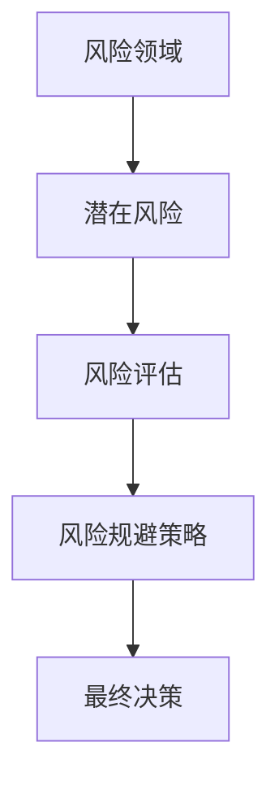
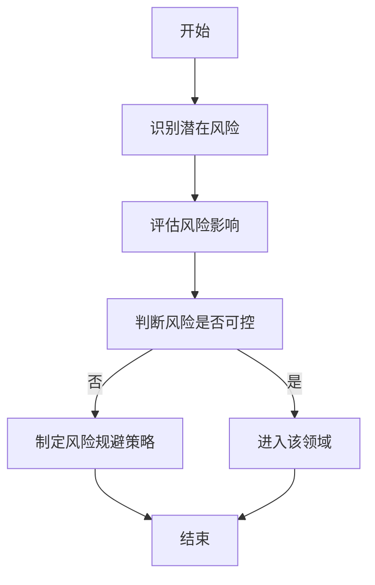
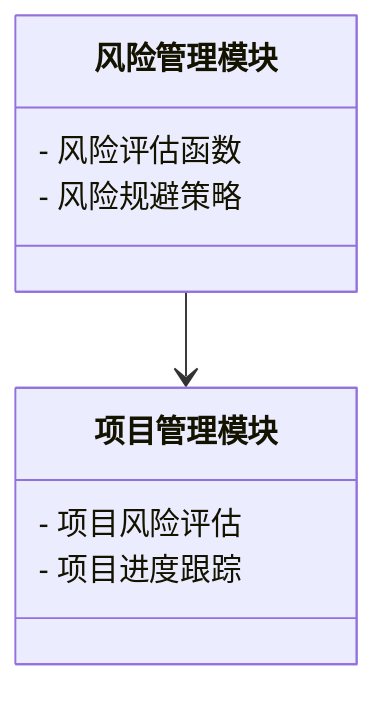
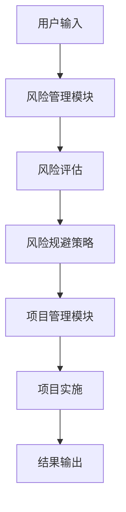
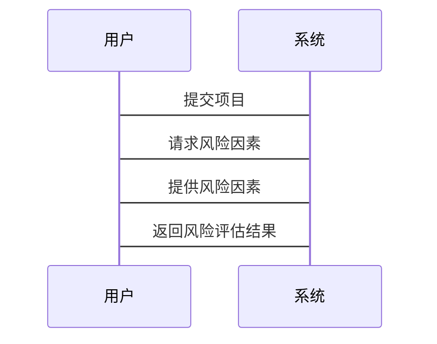

                 


# 《芒格的"远离"策略在前沿科技风险管理中的应用》

> 关键词：芒格，远离策略，风险管理，前沿科技，技术策略，系统架构，案例分析，最佳实践

> 摘要：芒格的“远离”策略是一种在投资和决策中广泛应用的哲学，其核心思想是避免潜在的风险和不确定性。本文将深入探讨该策略在前沿科技风险管理中的应用，结合具体的案例分析和系统架构设计，详细阐述其在技术选择、项目管理、投资决策等领域的实际应用。通过对比分析和数学模型的建立，本文将为读者提供一个全新的视角，理解如何在快速变化的科技环境中，通过“远离”策略来降低风险，确保项目的稳健发展。

---

## 第一部分：引言

### 第1章：引言

#### 1.1 前言

随着科技的飞速发展，前沿科技领域如人工智能、区块链、量子计算等，正以指数级速度改变着我们的生活和工作方式。然而，这种快速变化也带来了前所未有的风险和不确定性。在这样的背景下，如何有效管理风险，确保技术选择和项目推进的稳健性，成为企业和个人面临的重要挑战。

芒格的“远离”策略，作为一种以避免潜在风险为核心的投资和决策方法，为我们提供了一个全新的视角。本文将从理论到实践，详细探讨这一策略在前沿科技风险管理中的应用，结合实际案例，为读者提供系统的解决方案。

---

## 第二部分：背景介绍

### 第2章：芒格的“远离”策略概述

#### 2.1 芒格的“远离”策略

##### 2.1.1 策略的定义与核心原则

芒格的“远离”策略的核心思想是：通过识别和避免潜在的风险因素，降低决策的不确定性。其核心原则包括：

1. **避免高风险领域**：识别那些具有高风险但回报不确定的领域，选择性地“远离”这些领域。
2. **保持安全边际**：在决策时，确保有足够的安全边际，避免过度冒险。
3. **分散风险**：通过分散投资或项目选择，降低单一领域风险对整体的影响。

##### 2.1.2 策略在风险管理中的应用

芒格的“远离”策略在风险管理中的应用，主要体现在以下几个方面：

- **风险识别**：通过分析潜在风险，识别出可能对项目或投资造成重大影响的因素。
- **风险规避**：通过调整决策，避免进入高风险领域。
- **风险分散**：通过多元化投资或项目选择，降低单一风险的影响。

##### 2.1.3 策略与传统风险管理的对比

表2-1：芒格策略与传统风险管理的对比

| 对比维度             | 芒格策略                          | 传统风险管理                     |
|----------------------|-----------------------------------|----------------------------------|
| 核心思想             | 避免潜在风险                      | 降低风险影响                     |
| 适用场景             | 高风险领域                       | 全面风险管理                     |
| 决策方式             | 策略性规避                       | 技术性降低                       |

---

## 第三部分：核心概念与联系

### 第3章：核心概念与联系

#### 3.1 核心概念原理

##### 3.1.1 风险识别与评估的原理

芒格的“远离”策略强调在决策前进行充分的风险识别和评估。通过分析潜在风险，评估其对项目或投资的影响，从而决定是否进入该领域。

##### 3.1.2 风险规避的实现机制

通过避免进入高风险领域，降低潜在风险对整体决策的影响。具体实现机制包括：

1. **风险规避矩阵**：通过矩阵分析，评估风险的严重性和可能性，决定是否进入该领域。
2. **风险规避策略**：制定具体的规避措施，如选择性投资或合作。

##### 3.1.3 风险分散的策略分析

通过分散投资或项目选择，降低单一风险对整体的影响。具体策略包括：

1. **多元化投资**：将资源分配到多个领域，降低单一领域风险的影响。
2. **风险分担**：通过合作或外包，将风险分担给多个主体。

#### 3.2 对比表格

表3-1：风险规避矩阵

| 风险类型             | 高风险可能性 | 高风险影响 |
|----------------------|---------------|-------------|
| 技术风险             | 高            | 高           |
| 市场风险             | 中            | 中           |
| 运营风险             | 低            | 低           |

#### 3.3 ER实体关系图



---

## 第四部分：算法原理讲解

### 第4章：算法原理讲解

#### 4.1 算法流程图



#### 4.2 Python源代码实现

##### 示例代码：风险评估函数

```python
def risk_assessment(risk_factors):
    # 风险因素评估
    total_risk = 0
    for factor in risk_factors:
        # 评估每个风险因素的影响
        impact = factor['impact']
        probability = factor['probability']
        total_risk += impact * probability
    return total_risk

# 示例使用
risk_factors = [
    {'impact': 0.8, 'probability': 0.6},
    {'impact': 0.5, 'probability': 0.7},
    {'impact': 0.7, 'probability': 0.5}
]
total_risk = risk_assessment(risk_factors)
print(f"总风险值为：{total_risk}")
```

---

## 第五部分：系统分析与架构设计方案

### 第5章：系统分析与架构设计方案

#### 5.1 问题场景介绍

在前沿科技领域，如人工智能项目中，风险管理尤为重要。通过芒格的“远离”策略，可以在项目初期识别潜在风险，避免进入高风险领域。

#### 5.2 系统功能设计

##### 5.2.1 领域模型



#### 5.3 系统架构设计



#### 5.4 系统接口设计

##### 示例接口：风险评估接口

```python
class RiskAssessment:
    def __init__(self):
        self.risk_factors = {}

    def assess_risk(self, project):
        # 评估项目风险
        total_risk = 0
        for factor in self.risk_factors:
            total_risk += self.risk_factors[factor] * project.risk_impact[factor]
        return total_risk

# 示例使用
ra = RiskAssessment()
ra.risk_factors = {'技术风险': 0.8, '市场风险': 0.6}
project = {'risk_impact': {'技术风险': 0.7, '市场风险': 0.5}}
print(ra.assess_risk(project))
```

#### 5.5 系统交互流程图



---

## 第六部分：项目实战

### 第6章：项目实战

#### 6.1 环境安装

为了实现风险评估系统，需要安装以下依赖：

```bash
pip install mermaid
pip install matplotlib
```

#### 6.2 系统核心实现源代码

##### 示例代码：区块链项目风险管理

```python
import matplotlib.pyplot as plt

def plot_risk_distribution(risk_data):
    plt.bar(risk_data.keys(), risk_data.values())
    plt.title('风险分布')
    plt.xlabel('风险类型')
    plt.ylabel('风险值')
    plt.show()

# 示例使用
risk_data = {
    '技术风险': 0.8,
    '市场风险': 0.6,
    '运营风险': 0.4
}
plot_risk_distribution(risk_data)
```

#### 6.3 代码应用解读与分析

上述代码实现了区块链项目的风险分布可视化。通过分析风险分布，可以识别高风险领域，进而制定风险规避策略。

#### 6.4 实际案例分析

以区块链项目为例，通过芒格的“远离”策略，识别出技术风险较高的领域，选择性地“远离”这些领域，降低整体风险。

#### 6.5 项目小结

通过本案例，我们可以看到，芒格的“远离”策略在实际项目管理中的有效性。通过风险识别、评估和规避，确保项目的稳健发展。

---

## 第七部分：最佳实践

### 第7章：最佳实践

#### 7.1 关键点总结

- **风险识别**：在项目初期，识别潜在风险。
- **风险评估**：通过数学模型评估风险影响。
- **风险规避**：制定具体的规避策略。
- **风险分散**：通过多元化投资降低风险。

#### 7.2 小结

芒格的“远离”策略在前沿科技风险管理中的应用，不仅提高了决策的稳健性，还为企业的可持续发展提供了有力保障。

#### 7.3 注意事项

- 风险管理需要结合具体场景，灵活调整策略。
- 风险评估模型需要根据实际情况进行优化。

#### 7.4 建议的延伸阅读

- 《芒格的投资思想》
- 《风险管理的理论与实践》
- 《前沿科技的发展与挑战》

---

## 第八部分：结论

### 第8章：结论

芒格的“远离”策略作为一种以避免风险为核心的投资和决策方法，在前沿科技风险管理中具有重要的应用价值。通过系统的风险识别、评估和规避，我们可以有效降低潜在风险，确保项目的稳健发展。

未来，随着科技的进一步发展，芒格的“远离”策略将会有更多的应用场景。我们期待更多的研究和实践，为科技风险管理提供更加完善的解决方案。

---

## 作者信息

作者：AI天才研究院/AI Genius Institute & 禅与计算机程序设计艺术 /Zen And The Art of Computer Programming

