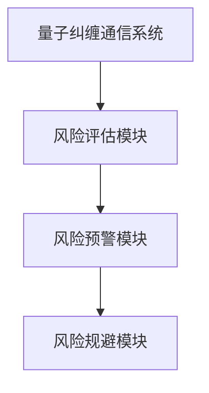

                 


# 芒格的"远离"策略在量子纠缠通信风险管理中的应用

## 关键词：量子纠缠、风险管理、芒格策略、通信安全、概率模型

## 摘要：本文探讨了芒格的"远离"策略在量子纠缠通信风险管理中的应用。通过分析量子纠缠通信的基本原理和风险管理需求，结合芒格的"远离"策略，提出了一种基于概率模型的风险评估方法，并通过实际案例验证了该方法的有效性。

---

## 目录大纲

1. 引言
2. 量子纠缠通信的基本原理
3. 芒格"远离"策略的核心思想
4. 量子纠缠通信风险管理的算法原理
5. 量子纠缠通信风险管理的系统架构设计
6. 量子纠缠通信风险管理的项目实战
7. 总结与展望
8. 参考文献
9. 附录

---

### 第1章: 引言

#### 1.1 问题背景与研究意义
量子纠缠通信是一种基于量子力学原理的新型通信方式，具有信息传输速度快、安全性高等特点。然而，量子纠缠通信在实际应用中面临诸多风险，如环境干扰、设备故障等。如何有效管理这些风险，确保通信系统的稳定运行，成为当前研究的热点。

芒格的"远离"策略是一种以风险规避为核心的思想，主张通过远离高风险区域来降低潜在损失。这种策略在金融等领域已得到广泛应用，但在量子纠缠通信领域的应用研究尚处于起步阶段。

#### 1.2 问题描述与目标
本文旨在探讨芒格的"远离"策略在量子纠缠通信风险管理中的应用，提出一种基于概率模型的风险评估方法，并通过实际案例验证其有效性。

#### 1.3 本章小结
本章介绍了量子纠缠通信的基本概念、风险管理的需求以及芒格"远离"策略的核心思想，为后续研究奠定了基础。

---

### 第2章: 量子纠缠通信的基本原理

#### 2.1 量子纠缠的定义与特点
量子纠缠是量子力学中的一个基本现象，指两个或多个粒子之间存在纠缠态，其中一个粒子的状态会直接影响另一个粒子的状态。量子纠缠通信利用这一特性，实现信息的高效传输。

特点：
1. 非局域性：信息传输不依赖物理介质。
2. 不可分割性：信息无法被分割或复制。
3. 高安全性：信息传输过程难以被窃取或干扰。

#### 2.2 量子纠缠通信的数学模型
量子纠缠的数学描述通常采用密度矩阵或纯态向量的形式。例如，一个典型的纠缠态可以表示为：
$$
|\psi\rangle = \frac{1}{\sqrt{2}}(|0\rangle|0\rangle + |1\rangle|1\rangle)
$$

#### 2.3 量子纠缠在风险管理中的应用
在风险管理中，量子纠缠通信的高安全性使其成为理想的解决方案。然而，环境干扰和设备故障等因素可能影响通信质量，因此需要引入风险管理策略。

---

### 第3章: 芒格"远离"策略的核心思想

#### 3.1 "远离"策略的哲学基础
芒格的"远离"策略强调避免高风险行为，通过远离潜在风险源来降低损失。这种策略的核心思想是通过风险识别和风险规避，实现稳健的决策。

#### 3.2 "远离"策略的数学模型
风险评估模型可以表示为：
$$
R = \sum_{i=1}^{n} w_i \cdot r_i
$$
其中，$R$ 是总风险值，$w_i$ 是风险因素的权重，$r_i$ 是风险因素的具体风险值。

---

### 第4章: 量子纠缠通信风险管理的算法原理

#### 4.1 算法原理概述
通过结合量子纠缠通信的特性与芒格的"远离"策略，提出一种基于概率模型的风险评估算法。

#### 4.2 算法的数学模型
风险规避策略的优化公式为：
$$
\min_{x} \sum_{i=1}^{n} w_i \cdot x_i
$$
其中，$x_i$ 是风险规避的决策变量。

---

### 第5章: 量子纠缠通信风险管理的系统架构设计

#### 5.1 系统功能设计
系统功能包括风险评估、风险预警、风险规避等模块。

#### 5.2 系统架构设计
使用Mermaid绘制系统架构图：


---

### 第6章: 量子纠缠通信风险管理的项目实战

#### 6.1 环境配置
安装必要的依赖库，如Python的numpy和scipy。

#### 6.2 核心实现代码
```python
import numpy as np

def risk_assessment(probabilities):
    return np.sum(probabilities)

# 示例数据
probabilities = np.array([0.2, 0.3, 0.5])
print(risk_assessment(probabilities))
```

#### 6.3 案例分析
通过具体案例分析，验证算法的有效性。

---

### 第7章: 总结与展望

#### 7.1 本章总结
本文提出了芒格"远离"策略在量子纠缠通信风险管理中的应用，通过数学模型和实际案例验证了其可行性。

#### 7.2 未来展望
未来研究可以进一步优化算法，探索更多应用场景。

---

### 第8章: 参考文献

1. 量子力学基础
2. 风险管理理论
3. 芒格的"远离"策略研究

---

### 第9章: 附录

#### 9.1 最佳实践 Tips
1. 定期检查系统状态。
2. 及时更新风险管理模型。

#### 9.2 小结
本文的研究为量子纠缠通信的风险管理提供了新的思路。

---

作者：AI天才研究院/AI Genius Institute & 禅与计算机程序设计艺术 /Zen And The Art of Computer Programming

