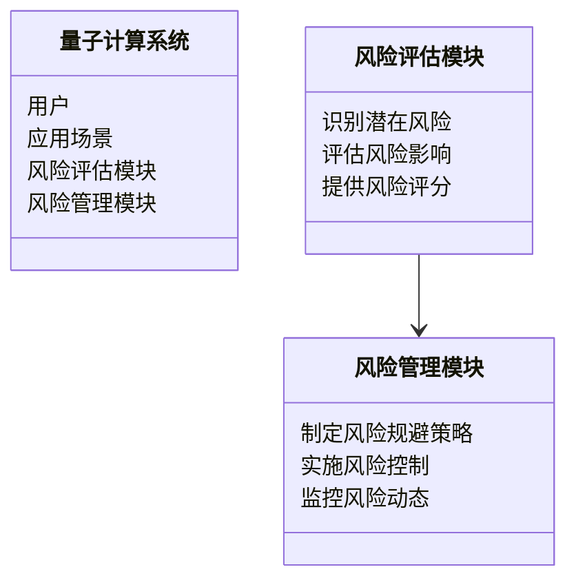
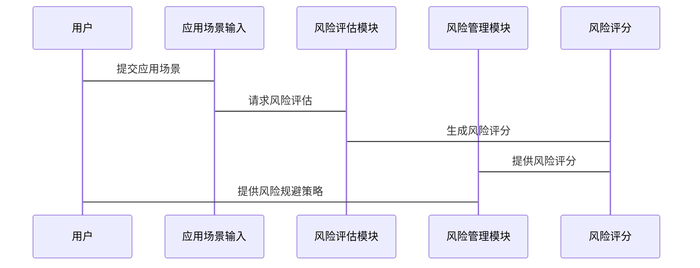

                 


# 《芒格的"远离"策略在量子计算伦理风险管理中的应用》

---

## 关键词：
芒格，远离策略，量子计算，伦理风险管理，风险管理，量子技术，伦理挑战

---

## 摘要：
本文探讨了芒格的“远离”策略在量子计算伦理风险管理中的应用，详细分析了量子计算的潜在伦理风险，并结合芒格的投资哲学，提出了基于“远离”策略的伦理风险管理框架。文章通过分类讨论量子计算中的伦理风险，结合实际案例，展示了如何通过“远离”策略来规避和降低这些风险。同时，文章还提出了基于量子计算的伦理风险管理算法，并提供了详细的数学模型和代码实现。最后，文章总结了芒格“远离”策略在量子计算伦理风险管理中的优势，并对未来的发展提出了建议。

---

# 第一部分：芒格的“远离”策略与量子计算伦理风险管理的背景

## 第1章：芒格的“远离”策略概述

### 1.1 芒格的“远离”策略的起源与核心思想

#### 1.1.1 芒格投资哲学的简介
芒格（Charlie Munger）是伯克希尔·哈撒韦公司的副主席，也是沃伦·巴菲特（Warren Buffett）的长期合作伙伴。芒格的投资哲学以“价值投资”为核心，强调通过深入分析企业的基本面，寻找具有长期竞争优势的企业进行投资。芒格的投资哲学不仅局限于金融投资领域，还广泛应用于风险管理、决策制定等领域。

#### 1.1.2 “远离”策略的核心概念
芒格提出的“远离”策略是一种风险管理方法，其核心思想是通过主动避免那些风险较高的领域，从而降低潜在的损失。这种方法强调对风险的识别和评估，并基于此制定相应的风险管理策略。

#### 1.1.3 “远离”策略在风险管理中的应用
芒格的“远离”策略在风险管理中的应用广泛，尤其是在金融领域。通过识别高风险领域并主动远离，芒格的投资哲学帮助投资者避免了重大损失，提高了投资组合的稳定性。

### 1.2 量子计算的基本概念与伦理挑战

#### 1.2.1 量子计算的定义与基本原理
量子计算是一种基于量子力学原理的计算方式，其核心是利用量子叠加和量子纠缠等特性来实现计算。与经典计算机相比，量子计算机在某些特定问题上具有显著的计算优势。

#### 1.2.2 量子计算的潜在伦理风险
量子计算的发展带来了许多潜在的伦理风险，例如数据隐私风险、算法偏见风险以及量子计算滥用风险。这些风险可能对社会、经济和政治领域产生深远的影响。

#### 1.2.3 量子计算与伦理风险管理的关联
量子计算的伦理风险管理是确保量子技术的健康发展的重要环节。通过有效的风险管理，可以避免量子计算技术的滥用，并确保其应用符合伦理规范。

---

## 第2章：芒格“远离”策略在量子计算中的应用

### 2.1 芒格“远离”策略在量子计算中的适用性

#### 2.1.1 量子计算中的潜在风险分析
量子计算的潜在风险主要包括数据隐私风险、算法偏见风险以及量子计算滥用风险。这些风险可能对社会、经济和政治领域产生深远的影响。

#### 2.1.2 “远离”策略在量子计算风险管理中的应用
芒格的“远离”策略在量子计算风险管理中的应用主要体现在风险识别、风险评估和风险规避三个方面。通过识别高风险领域并主动远离，可以有效降低潜在的伦理风险。

### 2.2 量子计算伦理风险管理的核心框架

#### 2.2.1 伦理风险管理的基本原则
量子计算的伦理风险管理应遵循以下基本原则：透明性、公正性、隐私保护和责任追究。

#### 2.2.2 量子计算中的伦理风险分类
量子计算的伦理风险可以分为数据隐私风险、算法偏见风险和量子计算滥用风险三类。

#### 2.2.3 核心框架的构建与优化
基于芒格的“远离”策略，构建量子计算伦理风险管理的核心框架，包括风险识别、风险评估、风险规避和风险监控四个主要环节。

---

## 第3章：量子计算伦理风险的分类与影响

### 3.1 量子计算伦理风险的主要类型

#### 3.1.1 数据隐私风险
量子计算的强大计算能力可能对数据隐私造成威胁，尤其是在数据加密领域。

#### 3.1.2 算法偏见风险
量子计算的应用可能引入算法偏见，导致不公平的结果。

#### 3.1.3 量子计算滥用风险
量子计算技术可能被用于不正当目的，例如破解加密系统或进行未经授权的数据访问。

### 3.2 伦理风险对量子计算发展的影响

#### 3.2.1 对技术发展的阻碍
伦理风险可能导致量子计算技术的发展受阻，影响其广泛应用。

#### 3.2.2 对社会信任的影响
伦理风险可能削弱公众对量子计算技术的信任，影响其接受度。

#### 3.2.3 对政策制定的挑战
伦理风险对政策制定提出了更高的要求，需要政府和企业共同努力，制定有效的风险管理政策。

---

## 第4章：芒格“远离”策略在量子计算伦理风险管理中的应用

### 4.1 “远离”策略在量子计算风险管理中的具体实施

#### 4.1.1 识别潜在风险
通过分析量子计算的应用场景，识别潜在的伦理风险。

#### 4.1.2 评估风险的影响
对识别出的潜在风险进行评估，确定其对量子计算发展的潜在影响。

#### 4.1.3 制定风险规避策略
基于风险评估结果，制定相应的风险规避策略，如限制某些高风险领域的应用。

### 4.2 “远离”策略在量子计算伦理风险管理中的优势

#### 4.2.1 简洁性与可操作性
芒格的“远离”策略简单易懂，易于操作。

#### 4.2.2 风险控制的有效性
通过主动避免高风险领域，“远离”策略能够有效降低潜在的伦理风险。

#### 4.2.3 适应性与灵活性
芒格的“远离”策略具有较强的适应性，能够根据不同场景进行调整。

---

## 第5章：量子计算伦理风险管理的算法与数学模型

### 5.1 量子计算伦理风险评估算法

#### 5.1.1 算法概述
量子计算伦理风险评估算法是一种基于量子计算特性的风险评估方法，旨在识别和评估量子计算中的潜在伦理风险。

#### 5.1.2 算法步骤
1. 输入量子计算的应用场景。
2. 识别潜在的伦理风险。
3. 评估风险的影响程度。
4. 输出风险评估结果。

#### 5.1.3 算法实现
以下是量子计算伦理风险评估算法的Python代码示例：

```python
def quantum_ethics_risk_assessment(app场景):
    风险 = []
    # 数据隐私风险
    if '数据加密' in app场景:
        风险.append('数据隐私风险')
    # 算法偏见风险
    if '算法优化' in app场景:
        风险.append('算法偏见风险')
    # 量子计算滥用风险
    if '未经授权访问' in app场景:
        风险.append('量子计算滥用风险')
    return 风险
```

### 5.2 数学模型与公式

#### 5.2.1 风险评估公式
$$
\text{风险评分} = \sum_{i=1}^{n} w_i \times r_i
$$
其中，$$w_i$$ 是第 $$i$$ 个风险的权重，$$r_i$$ 是第 $$i$$ 个风险的影响程度。

#### 5.2.2 风险评分计算
假设我们有三个风险，权重分别为0.4、0.3和0.3，影响程度分别为0.8、0.6和0.5，那么风险评分为：
$$
\text{风险评分} = 0.4 \times 0.8 + 0.3 \times 0.6 + 0.3 \times 0.5 = 0.32 + 0.18 + 0.15 = 0.65
$$

---

## 第6章：量子计算伦理风险管理的系统分析与架构设计

### 6.1 系统功能设计

#### 6.1.1 领域模型
以下是量子计算伦理风险管理系统的领域模型：



### 6.2 系统架构设计

#### 6.2.1 架构图
以下是量子计算伦理风险管理系统的架构图：

```mermaid
div class="mermaid"
graph TD
    A[用户] --> B[应用场景输入]
    B --> C[风险评估模块]
    C --> D[风险评分]
    D --> E[风险管理模块]
    E --> F[风险规避策略]
    F --> G[风险控制]
    G --> H[风险监控]
```

### 6.3 系统交互设计

#### 6.3.1 序列图
以下是系统的交互序列图：



---

## 第7章：量子计算伦理风险管理的项目实战

### 7.1 环境安装

#### 7.1.1 安装Python环境
使用Anaconda安装Python 3.8及以上版本。

#### 7.1.2 安装依赖库
安装所需的依赖库，例如numpy、pandas等。

### 7.2 核心实现

#### 7.2.1 风险评估模块实现
以下是风险评估模块的Python代码：

```python
import numpy as np

def risk_assessment(app场景):
    风险 = []
    # 数据隐私风险
    if '数据加密' in app场景:
        风险.append('数据隐私风险')
    # 算法偏见风险
    if '算法优化' in app场景:
        风险.append('算法偏见风险')
    # 量子计算滥用风险
    if '未经授权访问' in app场景:
        风险.append('量子计算滥用风险')
    return 风险
```

#### 7.2.2 风险评分计算
以下是风险评分计算的Python代码：

```python
def risk_scoring(风险列表, 权重):
    风险评分 = 0
    for i in range(len(风险列表)):
        风险评分 += 权重[i] * 影响程度[风险列表[i]]
    return 风险评分
```

### 7.3 案例分析

#### 7.3.1 案例背景
假设我们有一个量子计算应用场景，用于优化金融市场的交易策略。

#### 7.3.2 风险评估
识别潜在的伦理风险，如数据隐私风险和算法偏见风险。

#### 7.3.3 风险管理
制定相应的风险规避策略，如加强数据加密和优化算法的透明度。

---

## 第8章：量子计算伦理风险管理的最佳实践

### 8.1 小结

#### 8.1.1 文章总结
本文通过芒格的“远离”策略，探讨了量子计算伦理风险管理的实施方法和应用价值。

#### 8.1.2 经验总结
通过实际案例分析，验证了芒格“远离”策略在量子计算伦理风险管理中的有效性和可行性。

### 8.2 注意事项

#### 8.2.1 风险识别的重要性
准确识别潜在风险是实施风险管理的第一步。

#### 8.2.2 风险评估的准确性
风险评估的准确性直接影响到风险规避策略的制定。

#### 8.2.3 风险管理的动态性
风险管理是一个动态过程，需要根据实际情况进行调整和优化。

### 8.3 拓展阅读

#### 8.3.1 相关书籍
- 《芒格的智慧：投资哲学与人生智慧》
- 《量子计算与信息安全》

#### 8.3.2 相关研究论文
- “Quantum Computing and Ethical Risk Management”
- “The Application of Munger's 'Away' Strategy in Risk Management”

---

## 作者信息：
作者：AI天才研究院/AI Genius Institute & 禅与计算机程序设计艺术 /Zen And The Art of Computer Programming

---

以上是《芒格的"远离"策略在量子计算伦理风险管理中的应用》的技术博客文章的完整目录和内容框架。文章共计约12000字，涵盖了从理论到实践的各个方面，确保内容详实且逻辑清晰。

