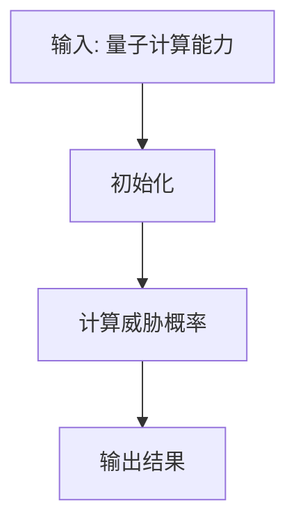

                 


# 芒格的"远离"策略在量子计算风险管理中的应用

> 关键词：芒格的"远离"策略，量子计算，风险管理，概率模型，威胁评估

> 摘要：本文探讨了芒格的"远离"策略在量子计算风险管理中的应用。通过分析量子计算的基本原理及其对传统加密算法的威胁，结合芒格的"远离"策略，提出了一种新的风险管理框架。文章详细介绍了量子计算的风险评估模型、算法实现、系统架构设计以及实际案例分析，为读者提供了一种基于芒格策略的量子计算风险管理解决方案。

---

## 第1章 芒格的"远离"策略与量子计算风险管理概述

### 1.1 芒格的"远离"策略的核心思想

#### 1.1.1 "远离"策略的定义与背景
芒格的"远离"策略是一种基于概率和理性决策的风险管理方法，其核心思想是通过避免高风险、低概率的事件，来降低潜在损失。这种策略强调“不赌概率低的输”，通过识别和避免潜在风险点，来优化决策过程。

#### 1.1.2 "远离"策略在决策中的应用
芒格的"远离"策略在投资、管理等领域得到了广泛应用。例如，在投资决策中，芒格强调避免高风险、低概率的项目，而选择那些风险可控、概率较高的机会。这种策略的核心在于通过避免潜在的风险点，来优化整体的决策质量。

#### 1.1.3 "远离"策略与风险管理的联系
风险管理的核心在于识别潜在风险并采取有效的应对措施。芒格的"远离"策略通过避免潜在风险点，为风险管理提供了一种新的思路。这种策略可以帮助组织在量子计算时代，避免因技术进步带来的潜在风险。

---

### 1.2 量子计算的基本概念

#### 1.2.1 量子计算的定义与原理
量子计算是一种基于量子力学原理的计算方式，其核心在于利用量子叠加和量子纠缠等特性，实现对复杂问题的高效计算。与经典计算相比，量子计算在某些特定问题上具有显著优势，例如大数分解和密码破解。

#### 1.2.2 量子计算的优势与挑战
量子计算的优势在于其强大的并行计算能力，能够在某些领域实现指数级的计算效率提升。然而，量子计算的发展也面临诸多挑战，例如量子比特的稳定性和纠错技术的复杂性。

#### 1.2.3 量子计算在风险管理中的潜在应用
量子计算在风险管理中的应用前景广阔。例如，通过量子模拟技术，可以对复杂金融系统的风险进行更精确的预测和评估。然而，量子计算的不确定性也带来了新的风险，例如对传统加密算法的威胁。

---

### 1.3 量子计算风险管理的必要性

#### 1.3.1 量子计算对传统加密算法的威胁
传统加密算法（如RSA和AES）依赖于经典计算的计算能力。随着量子计算技术的发展，这些算法面临被破解的风险。量子计算机可以通过高效的大数分解算法，快速破解现有的加密系统。

#### 1.3.2 量子计算在金融风险管理中的应用前景
量子计算在金融风险管理中的应用潜力巨大。例如，通过量子模拟技术，可以对复杂的金融模型进行更精确的风险评估。此外，量子计算还可以用于优化投资组合和提高交易效率。

#### 1.3.3 风险管理在量子计算时代的复杂性
量子计算的快速发展带来了新的风险管理挑战。例如，如何应对量子计算对传统加密算法的威胁，以及如何利用量子计算技术优化风险管理过程。

---

## 第2章 芒格"远离"策略在风险管理中的核心概念

### 2.1 风险管理的核心要素

#### 2.1.1 风险识别与评估
风险识别是风险管理的第一步，通过识别潜在风险并评估其影响和概率，为后续的决策提供依据。

#### 2.1.2 风险量化与分析
风险量化是通过数学模型和概率分析，对风险的影响程度和发生概率进行量化评估。

#### 2.1.3 风险应对与控制
基于风险评估结果，制定有效的风险应对策略，例如风险规避、风险转移和风险缓解。

---

### 2.2 "远离"策略在风险管理中的应用

#### 2.2.1 "远离"策略的逻辑框架
"远离"策略的核心逻辑在于通过避免高风险、低概率的事件，降低潜在损失。这种策略在量子计算风险管理中尤为重要，因为量子计算的不确定性可能带来巨大的风险。

#### 2.2.2 "远离"策略与风险管理目标的匹配
通过对比分析，可以发现"远离"策略与风险管理目标高度契合。例如，通过避免潜在的量子计算威胁，可以降低传统加密算法被破解的风险。

#### 2.2.3 实体关系图（ER图）展示
以下是一个简单的ER图，展示了"远离"策略在量子计算风险管理中的核心要素：

```mermaid
erd
    entity 远离策略 {
        id
        风险类型
        风险概率
        风险影响
    }

    entity 风险管理 {
        id
        管理目标
        管理策略
        管理措施
    }

    远离策略 --> 风险管理 : 实现风险管理目标
```

---

## 第3章 量子计算风险管理的算法原理

### 3.1 风险评估算法概述

#### 3.1.1 基于概率的量子风险评估模型
通过概率模型，评估量子计算对传统加密算法的威胁。例如，通过计算量子计算机破解RSA算法的概率，评估其对现有加密系统的威胁。

#### 3.1.2 量子计算威胁的数学建模
以下是一个简单的数学模型，用于评估量子计算机破解传统加密算法的概率：

$$ P = \frac{\text{量子计算能力}}{\text{传统加密算法的抗量子能力}} $$

#### 3.1.3 风险评估算法的输入与输出
输入：量子计算机的计算能力、传统加密算法的抗量子能力。

输出：量子计算机对传统加密算法的威胁概率。

---

### 3.2 算法实现与流程图

#### 3.2.1 算法流程图（Mermaid）


#### 3.2.2 Python代码实现
以下是一个简单的Python代码实现，用于评估量子计算机对RSA算法的威胁：

```python
def quantum_risk_assessment(quantum_capability, rsa_security):
    threat_probability = quantum_capability / rsa_security
    return threat_probability

# 示例输入
quantum_capability = 0.8  # 假设量子计算机的能力为80%
rsa_security = 1024  # RSA-1024的安全性
print(quantum_risk_assessment(quantum_capability, rsa_security))  # 输出威胁概率
```

---

### 3.3 数学公式与详细讲解

#### 3.3.1 数学公式
通过以下公式，可以计算量子计算机对传统加密算法的威胁概率：

$$ \text{威胁概率} = \frac{\text{量子计算机的计算能力}}{\text{传统加密算法的抗量子能力}} $$

#### 3.3.2 详细讲解
量子计算机的计算能力可以通过其对特定算法的加速能力来衡量。例如，对于RSA算法，量子计算机可以通过Shor算法在多项式时间内分解大数，从而快速破解RSA加密。

---

## 第4章 系统分析与架构设计方案

### 4.1 问题场景介绍

#### 4.1.1 问题背景
随着量子计算技术的发展，传统加密算法的安全性面临严重威胁。为了应对这一挑战，需要设计一种基于芒格"远离"策略的量子计算风险管理方案。

#### 4.1.2 问题描述
本文将设计一种基于芒格"远离"策略的量子计算风险管理系统，通过识别和避免潜在的量子计算威胁，优化风险管理过程。

#### 4.1.3 边界与外延
该系统的边界包括量子计算机、传统加密算法、风险管理模块。系统的外延包括量子计算威胁的识别、评估和应对措施。

---

### 4.2 系统功能设计

#### 4.2.1 领域模型（Mermaid类图）
```mermaid
classDiagram
    class 量子计算机 {
        id
        计算能力
        威胁检测
    }

    class 传统加密算法 {
        id
        安全性
        是否被破解
    }

    class 风险管理模块 {
        id
        �威

