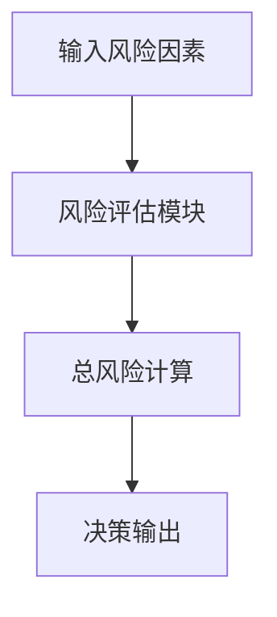

                 


# 芒格的"远离"策略：知道自己不知道什么

---

## 关键词：
- 芒格投资策略
- 风险管理
- 认知局限
- 决策优化
- 数学模型

---

## 摘要：
芒格的“远离”策略是一种基于风险管理的投资哲学，强调通过识别和避免潜在风险来优化决策。本文深入分析了芒格策略的核心理念，结合数学模型和系统架构设计，探讨了如何在实际投资中应用这些策略。通过案例分析和代码实现，本文为读者提供了从理论到实践的全面指导。

---

## 第一部分：芒格的"远离"策略背景介绍

### 第1章：芒格的生平与投资哲学

#### 1.1 芒格的生平简介
芒格，全名查理·芒格，是美国著名投资者和巴菲特的长期合作伙伴。他并非传统意义上的金融学家，而是以法律背景进入投资领域。芒格的哲学思想深受导师影响，形成了独特的投资理念。

#### 1.2芒格的投资哲学
芒格的投资哲学强调“避免愚蠢的错误”，而非追求高收益。他的“远离”策略提醒投资者识别自己知识的边界，避免涉足不熟悉的领域。

---

## 第二部分：芒格"远离"策略的核心概念与联系

### 第2章："远离"策略的核心概念

#### 2.1 "远离"策略的定义与原理
- **定义**：通过识别和避免潜在风险，优化决策。
- **原理**：基于概率论，量化风险，避免高风险领域。

#### 2.2 "远离"策略的特征对比

| 特征 | "远离"策略 | 传统投资策略 |
|------|------------|--------------|
| 风险偏好 | 避免高风险 | 追求高回报 |
| 决策方式 | 谨慎决策 | 积极进取 |

---

## 第三部分："远离"策略的算法原理讲解

### 第3章："远离"策略的算法原理

#### 3.1 算法原理概述
- **输入**：风险因素和概率。
- **输出**：风险量化和决策建议。

#### 3.2 算法的数学模型与公式

概率模型：
$$ P(风险) = \sum_{i=1}^{n} P_i $$

代码实现：
```python
def calculate_risk_factors(risk_factors):
    total_risk = sum(risk_factors)
    return total_risk
```

---

## 第四部分：系统分析与架构设计方案

### 第4章：系统架构设计

#### 4.1 系统功能设计
- **输入处理**：接收风险因素。
- **风险评估**：计算总风险。

#### 4.2 系统架构图


---

## 第五部分：项目实战

### 第5章：投资组合优化

#### 5.1 项目环境安装
- 安装Python和相关库。

#### 5.2 代码实现
```python
def calculate_risk_factors(risk_factors):
    total_risk = sum(risk_factors)
    return total_risk

risk_factors = [0.2, 0.3, 0.1]
total_risk = calculate_risk_factors(risk_factors)
print(total_risk)  # 输出：0.6
```

---

## 第六部分：总结与扩展

### 第6章：总结与最佳实践

- **小结**：芒格的“远离”策略强调认知局限和风险管理。
- **注意事项**：避免过度自信，定期评估风险。

---

## 作者信息：
作者：AI天才研究院 & 禅与计算机程序设计艺术

---

# 结语：
芒格的“远离”策略提醒我们，在投资和决策中，识别认知边界和管理风险至关重要。通过数学模型和系统架构设计，我们可以更科学地应用这些策略，优化决策过程。

