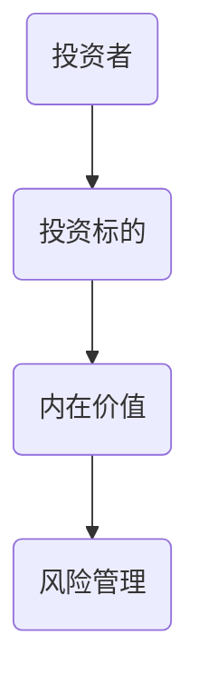
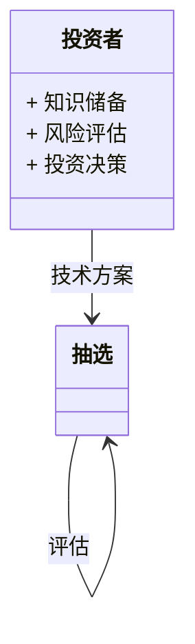
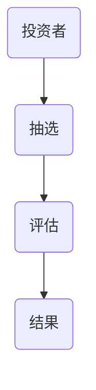
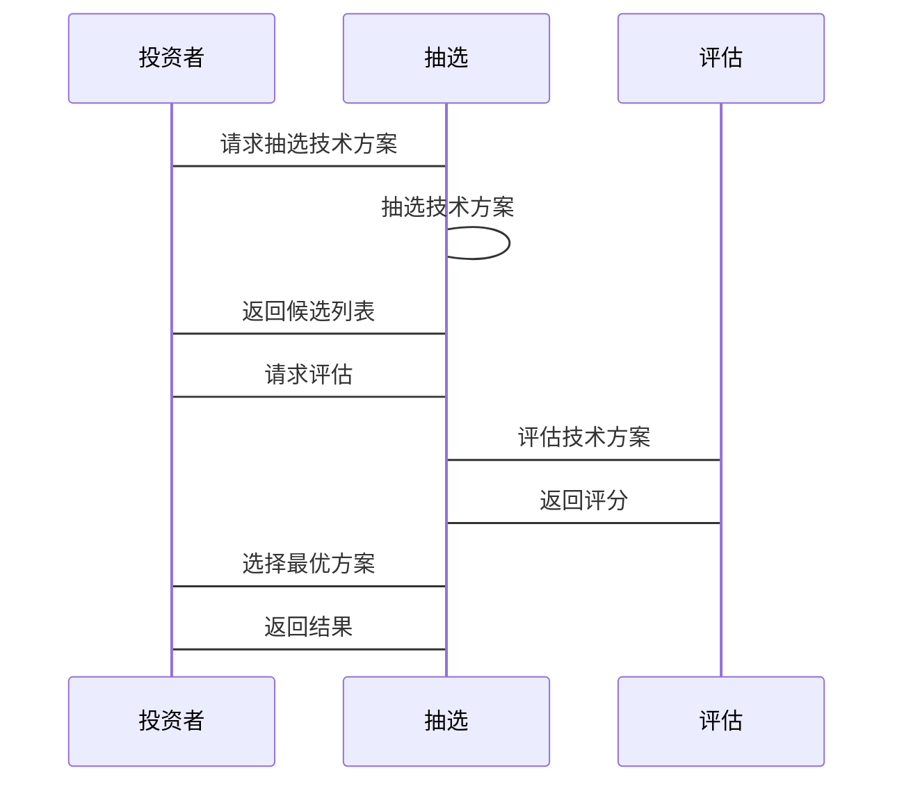

                 


# 芒格的"远离"策略：避开不懂的领域

> 关键词：芒格，远离策略，投资，风险管理，价值投资，知识边界

> 摘要：本文详细探讨了芒格的“远离”策略，即在投资和决策过程中避开自己不懂的领域。文章从背景介绍、核心概念、算法原理、系统架构、项目实战到最佳实践，全面分析了该策略在技术领域的应用和价值。

---

## 第一部分：芒格的"远离"策略概述

### 第1章：芒格的"远离"策略背景介绍

#### 1.1 问题背景

投资领域中的知识边界

芒格的"远离"策略源于其投资哲学，强调专注于自己理解的领域，避免涉足不熟悉的领域。这种策略在技术领域同样适用，例如在选择技术栈或项目时，避开自己不熟悉的工具和技术，以降低失败风险。

#### 1.2 问题描述

投资中的知识盲区

在技术项目中，选择不当的技术栈可能导致项目失败。例如，选择不熟悉的编程语言或框架，可能会导致开发效率低下，维护成本增加，甚至项目失败。因此，技术决策者需要识别并避免这些知识盲区。

#### 1.3 问题解决

"远离"策略的核心思想

芒格的策略强调，投资应集中在自己理解的领域，避免盲目进入不熟悉的领域。在技术领域中，这意味着选择自己熟悉的工具和技术栈，确保项目的稳定性和可维护性。

#### 1.4 边界与外延

"远离"策略的适用范围

该策略适用于技术选型、项目管理、团队决策等多个方面。例如，在团队决策中，领导者应避免选择不熟悉的技术方案，以降低项目风险。

与其他投资策略的对比

与其他策略（如分散投资）不同，"远离"策略强调聚焦和专注，通过避免不熟悉的领域来降低风险，而非分散风险。

#### 1.5 核心要素组成

知识储备的重要性

在技术领域，知识储备是实施"远离"策略的基础。只有深入了解某个领域，才能判断是否属于自己的知识范围。

风险管理的关键作用

风险管理是"远离"策略的重要组成部分。通过识别和评估风险，可以避免选择不熟悉的技术或工具，从而降低项目失败的可能性。

---

### 第2章：芒格"远离"策略的核心概念与联系

#### 2.1 核心概念原理

价值投资的基本原理

价值投资强调购买低于内在价值的资产。在技术领域，这可以类比为选择具有长期稳定性和可靠性的技术方案。

风险管理的核心思想

风险管理是"远离"策略的重要组成部分，通过识别和评估风险，避免选择不熟悉的技术或工具，从而降低项目失败的可能性。

#### 2.2 概念属性特征对比表格

| 概念 | 特征 |
|------|------|
| 价值投资 | 以内在价值为导向 |
| 风险管理 | 以风险控制为核心 |

#### 2.3 ER实体关系图架构



---

## 第二部分：芒格"远离"策略的算法原理

### 第3章：芒格"远离"策略的数学模型

#### 3.1 算法原理

投资决策的数学模型

通过数学模型评估技术方案的可行性。例如，使用技术成熟度模型对技术方案进行评分，避免选择评分过低的技术。

风险评估的数学方法

通过概率论和统计学方法评估风险。例如，计算技术方案失败的概率，避免选择高风险的技术。

#### 3.2 数学公式

投资回报率公式：$$ ROI = \frac{收益}{投入} \times 100\% $$

风险评估公式：$$ 风险 = 1 - \frac{投资标的可靠性}{1} $$

#### 3.3 举例说明

假设选择两个技术方案，方案A的可靠性为90%，方案B的可靠性为70%。通过风险公式计算，方案A的风险为1 - 0.9 = 0.1，方案B的风险为1 - 0.7 = 0.3。因此，选择方案A的风险更低，更适合采用。

---

## 第三部分：芒格"远离"策略的系统分析与架构设计

### 第4章：系统分析与架构设计方案

#### 4.1 问题场景介绍

投资者如何在复杂市场中

---

### 第5章：系统架构设计方案

#### 5.1 项目介绍

本项目旨在模拟芒格的"远离"策略在技术投资中的应用。通过分析技术方案的可行性，避免选择不熟悉的技术。

#### 5.2 系统功能设计

领域模型类图



系统架构图



系统接口设计

技术方案抽选接口：抽选技术方案，返回候选列表。

评估接口：评估每个候选方案的风险，返回评分。

结果输出：根据评分选择最优方案。

系统交互序列图



---

### 第6章：项目实战

#### 6.1 环境安装

安装必要的工具，例如Python、数据分析库（Pandas、NumPy）等。

#### 6.2 系统核心实现源代码

```python
def 技术方案抽选(技术列表):
    知识储备 = 投资者的知识储备
    可选方案 = [技术 for 技术 in 技术列表 if 技术在知识储备内]
    return 可选方案

def 风险评估(方案):
    评估结果 = 方案的风险评估
    return 评估结果

def 最优方案选择(方案列表):
    选择评估结果最低的方案
    return 最优方案
```

#### 6.3 代码应用解读与分析

通过上述代码，投资者可以抽选自己熟悉的技术方案，并评估其风险，最终选择最优方案。

#### 6.4 实际案例分析

案例：选择编程语言

抽选列表：Python、Java、C++

假设投资者熟悉Python，抽选后的候选方案为Python。

评估结果：Python的风险评估结果较低。

最终选择：最优方案为Python。

---

### 第7章：最佳实践 tips、小结、注意事项、拓展阅读

#### 7.1 tips

- 定期更新知识储备，扩大可选择的领域。
- 在技术选型中，优先选择熟悉的工具和技术。

#### 7.2 小结

芒格的"远离"策略在技术领域的应用，帮助技术决策者降低风险，选择最优方案。

#### 7.3 注意事项

- 不要盲目避开所有不熟悉的技术，需要权衡利弊。
- 在团队决策中，需综合考虑团队的知识储备。

#### 7.4 拓展阅读

建议阅读《穷查理宝典》了解芒格的投资哲学，以及技术领域的风险管理书籍。

---

## 作者：AI天才研究院/AI Genius Institute & 禅与计算机程序设计艺术 /Zen And The Art of Computer Programming

---

**总结**：本文系统地探讨了芒格的"远离"策略在技术领域的应用，通过背景介绍、算法原理、系统架构设计和项目实战，帮助技术决策者降低风险，选择最优方案。

