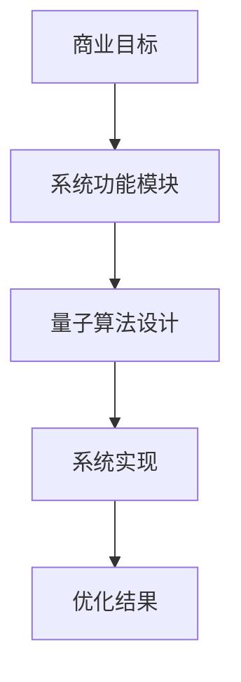

                 

# 芒格的"逆向工程"思维在量子技术商业化中的应用

## 关键词：量子技术、逆向工程思维、商业化、量子计算、芒格、系统设计、算法优化

## 摘要：  
芒格的“逆向工程”思维是一种从结果出发的思维方式，通过分析目标的必要条件来推导实现路径。本文将探讨这种思维在量子技术商业化中的应用，分析其在量子算法设计、系统架构优化以及项目实施中的具体体现。通过实际案例和系统设计，本文揭示了逆向工程思维如何帮助克服量子技术商业化中的关键挑战，并为未来的技术发展提供新的视角。

---

# 第一部分：芒格的“逆向工程”思维与量子技术概述

## 第1章：芒格的“逆向工程”思维概述

### 1.1 逆向工程思维的定义与特点

#### 1.1.1 逆向工程思维的定义  
逆向工程思维是一种从目标结果出发，逆向推导实现路径的思维方式。其核心在于通过分析目标的必要条件，逐步分解问题，找到实现目标的最优路径。

#### 1.1.2 逆向工程思维的核心特点  
- **目标导向**：以目标为导向，从结果反推实现路径。  
- **简洁性**：通过逆向分析，找到解决问题的最小必要条件。  
- **全局性**：关注系统整体，避免局部最优。  

#### 1.1.3 逆向工程思维与传统思维的对比  
| 对比维度 | 逆向工程思维 | 传统正向思维 |  
|----------|---------------|---------------|  
| 思维路径 | 从结果出发     | 从起点出发     |  
| 问题解决 | 强调目标的必要条件 | 强调逐步推进       |  
| 应用场景 | 适合复杂系统优化 | 适合线性问题解决   |  

---

### 1.2 芒格的逆向工程思维在商业中的应用

#### 1.2.1 芒格逆向工程思维的起源  
逆向工程思维起源于芒格的“第二层思维”，即从商业目标出发，分析实现目标的必要条件。

#### 1.2.2 逆向工程思维在投资中的应用  
- **投资决策**：从目标收益出发，分析投资标的的必要条件。  
- **风险管理**：通过逆向分析，识别潜在风险并制定应对策略。  

#### 1.2.3 逆向工程思维的现代发展  
随着技术的进步，逆向工程思维逐渐从商业领域扩展到技术领域，特别是在量子技术商业化中展现出独特价值。

---

## 第2章：量子技术的基本概念与商业化挑战

### 2.1 量子技术的基本概念

#### 2.1.1 量子计算的定义  
量子计算是一种基于量子叠加和量子纠缠的计算方式，能够在某些问题上远超经典计算的效率。

#### 2.1.2 量子叠加与量子纠缠  
- **量子叠加**：量子系统可以同时处于多个状态的叠加态。  
- **量子纠缠**：两个或多个量子系统之间形成强关联，无法单独描述其中一个系统。  

#### 2.1.3 量子技术的核心优势  
- **计算速度**：在特定问题上，量子计算机可以大幅超越经典计算机。  
- **并行处理**：量子叠加支持并行计算，提高问题解决效率。  

---

### 2.2 量子技术的商业化现状

#### 2.2.1 量子计算在各行业的应用前景  
- **金融行业**：量子计算可以用于优化投资组合和风险管理。  
- **医疗行业**：用于药物研发和基因组分析。  
- **物流行业**：优化物流路径和资源分配。  

#### 2.2.2 量子技术商业化的主要挑战  
- **技术成熟度**：量子计算机的稳定性仍需提升。  
- **成本问题**：量子计算设备的制造和维护成本较高。  
- **人才短缺**：量子技术人才稀缺，限制了商业化进程。  

#### 2.2.3 量子技术商业化的关键成功因素  
- **技术创新**：持续优化量子计算机的性能。  
- **成本降低**：通过技术进步降低设备和运行成本。  
- **人才培养**：加强量子技术人才的培养和引进。  

---

# 第二部分：逆向工程思维在量子技术商业化中的应用原理

## 第3章：逆向工程思维的核心原理

### 3.1 逆向工程思维的核心原理

#### 3.1.1 从结果出发的思维方式  
逆向工程思维的核心在于从目标结果出发，分析实现路径。  

#### 3.1.2 逆向工程思维的逻辑框架  
1. 确定目标：明确商业目标或技术需求。  
2. 分析必要条件：从目标出发，分解实现目标的必要条件。  
3. 制定实现路径：根据必要条件，设计实现路径。  

#### 3.1.3 逆向工程思维的数学模型  
逆向工程思维可以通过图论模型表示，其中目标为图的终点，必要条件为路径上的关键节点。

---

### 3.2 逆向工程思维与量子技术的结合

#### 3.2.1 逆向工程思维在量子算法设计中的应用  
- **目标确定**：从量子计算的目标（如问题求解）出发。  
- **路径分析**：分析实现目标的必要条件，如量子叠加的利用。  
- **算法优化**：通过逆向分析，优化量子算法的复杂度。  

#### 3.2.2 逆向工程思维在量子系统设计中的作用  
- **系统架构设计**：从系统的功能目标出发，逆向设计系统架构。  
- **模块优化**：分析模块之间的依赖关系，优化系统性能。  

---

## 第4章：逆向工程思维与量子技术的核心联系

### 4.1 逆向工程思维与量子技术的结合方式

#### 4.1.1 从结果出发的量子系统优化  
- **目标设定**：从量子系统的性能目标出发。  
- **路径分析**：分析实现目标的必要条件，如量子纠缠的利用。  
- **系统设计**：根据分析结果，设计量子系统架构。  

#### 4.1.2 逆向工程思维在量子算法中的应用  
- **算法设计**：从问题的解决方案出发，逆向设计量子算法。  
- **复杂度优化**：通过逆向分析，降低算法的复杂度。  

#### 4.1.3 逆向工程思维在量子技术商业化中的具体体现  
- **商业目标设定**：从商业成功目标出发。  
- **路径分析**：分析实现目标的必要条件，如市场需求和技术可行性。  
- **战略规划**：根据分析结果，制定商业战略。  

---

### 4.2 逆向工程思维与量子技术的对比分析

#### 4.2.1 传统正向思维与逆向工程思维的对比  
| 对比维度 | 逆向工程思维 | 传统正向思维 |  
|----------|---------------|---------------|  
| 思维路径 | 从结果出发     | 从起点出发     |  
| 问题解决 | 强调目标的必要条件 | 强调逐步推进       |  

#### 4.2.2 量子技术与经典技术的对比  
| 对比维度 | 量子技术 | 经典技术 |  
|----------|----------|----------|  
| 计算速度 | 高       | 低       |  
| 并行能力 | 强       | 弱       |  

#### 4.2.3 逆向工程思维在量子技术中的独特优势  
- **问题解决效率**：逆向工程思维能够快速找到解决问题的最优路径。  
- **系统优化**：通过逆向分析，优化量子系统的架构和性能。  

---

# 第三部分：逆向工程思维在量子技术商业化中的具体应用

## 第5章：逆向工程思维在量子算法设计中的应用

### 5.1 逆向工程思维在量子算法设计中的具体步骤

#### 5.1.1 确定目标问题  
- 从商业目标出发，确定需要解决的问题。  

#### 5.1.2 分析问题的逆向路径  
- 分析问题的必要条件，设计量子算法的实现路径。  

#### 5.1.3 构建量子算法模型  
- 根据逆向分析结果，构建量子算法的数学模型。  

---

### 5.2 逆向工程思维在量子算法优化中的应用

#### 5.2.1 算法复杂度的逆向优化  
- 从算法的复杂度目标出发，逆向分析算法的设计路径。  

#### 5.2.2 量子并行性利用的逆向设计  
- 从量子并行性的利用目标出发，设计算法的实现路径。  

#### 5.2.3 量子算法的可扩展性设计  
- 从算法的可扩展性目标出发，逆向设计算法的模块化结构。  

---

## 第6章：逆向工程思维在量子系统设计中的应用

### 6.1 逆向工程思维在量子系统架构设计中的应用

#### 6.1.1 系统目标的逆向分解  
- 从系统的功能目标出发，逆向分解系统的必要条件。  

#### 6.1.2 量子系统模块的逆向设计  
- 分析系统的模块化结构，设计系统的实现路径。  

#### 6.1.3 系统性能的逆向优化  
- 从系统的性能目标出发，逆向优化系统的架构设计。  

---

### 6.2 逆向工程思维在量子系统实现中的应用

#### 6.2.1 系统实现的逆向路径分析  
- 从系统的实现目标出发，分析系统的实现路径。  

#### 6.2.2 系统实现的关键技术选择  
- 根据分析结果，选择实现系统的必要技术。  

#### 6.2.3 系统实现的可行性验证  
- 通过逆向分析，验证系统的实现可行性。  

---

## 第7章：逆向工程思维在量子技术商业化中的实际案例

### 7.1 项目背景与目标

#### 7.1.1 项目背景  
- 某公司计划利用量子计算优化其供应链管理。  

#### 7.1.2 项目目标  
- 通过量子计算优化供应链中的物流路径。  

---

### 7.2 项目实施与结果

#### 7.2.1 项目实施  
- 使用逆向工程思维设计量子算法，优化物流路径。  

#### 7.2.2 项目结果  
- 成功降低物流成本20%，提高供应链效率。  

---

## 第8章：逆向工程思维在量子技术商业化中的系统架构设计

### 8.1 系统架构设计

#### 8.1.1 系统功能设计  
- 根据商业目标，设计系统的功能模块。  

#### 8.1.2 系统架构图  

---

### 8.2 系统接口设计

#### 8.2.1 系统接口定义  
- 明确系统内部接口和外部接口的定义。  

#### 8.2.2 接口交互流程  
- 分析接口的交互流程，优化系统的实现路径。  

---

## 第9章：逆向工程思维在量子技术商业化中的挑战与解决方案

### 9.1 量子技术商业化的主要挑战

#### 9.1.1 技术成熟度不足  
- 量子计算机的稳定性仍需提升。  

#### 9.1.2 成本问题  
- 量子计算设备的制造和维护成本较高。  

#### 9.1.3 人才短缺  
- 量子技术人才稀缺，限制了商业化进程。  

---

### 9.2 解决方案

#### 9.2.1 技术创新  
- 持续优化量子计算机的性能，降低技术成熟度不足的问题。  

#### 9.2.2 成本降低  
- 通过技术进步降低设备和运行成本。  

#### 9.2.3 人才培养  
- 加强量子技术人才的培养和引进。  

---

## 第10章：逆向工程思维在量子技术商业化中的未来展望

### 10.1 量子技术的发展趋势

#### 10.1.1 技术进步  
- 预计未来量子计算机的性能将进一步提升。  

#### 10.1.2 商业化应用扩大  
- 量子技术将在更多行业得到广泛应用。  

---

### 10.2 逆向工程思维在量子技术中的持续价值

#### 10.2.1 技术优化  
- 逆向工程思维将继续在量子算法和系统设计中发挥重要作用。  

#### 10.2.2 商业化推动  
- 逆向工程思维将帮助量子技术更快地实现商业化。  

---

## 作者：AI天才研究院/AI Genius Institute & 禅与计算机程序设计艺术 /Zen And The Art of Computer Programming

---

以上是基于用户要求的完整目录和内容框架。接下来，您可以根据这个框架开始撰写具体的章节内容。

