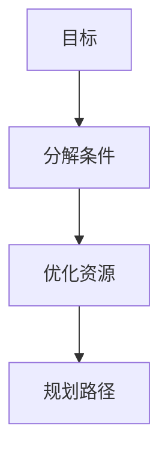
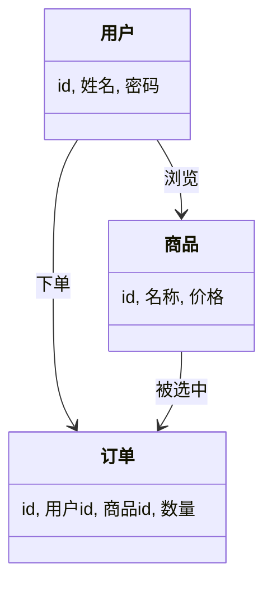

                 


# 《芒格的"逆向工程"思维在颠覆性创新分析中的运用》

---

## 关键词：逆向工程思维、颠覆性创新、芒格思维模型、创新分析、商业策略

---

## 摘要：  
芒格的"逆向工程"思维是一种从结果出发、逆向推导的创新方法，它颠覆了传统的正向思维模式。本文通过详细分析逆向工程思维的核心原理、应用场景、系统架构以及实际案例，揭示其在颠覆性创新中的独特价值。我们从逆向思维的定义出发，探讨其在商业创新中的应用，并结合具体案例，展示如何通过逆向思维识别市场机会、重构商业模式，并最终实现商业成功。文章还提供了数学模型和系统架构的详细分析，帮助读者更好地理解和应用逆向思维。

---

## 正文

### 第一章：逆向工程思维的起源与发展

#### 1.1 逆向工程思维的定义与核心概念

逆向工程思维是一种从结果出发、逆向推导的思维方式。与传统的正向思维（从原因到结果）不同，逆向思维强调从目标或结果出发，反向推导实现该目标所需的关键要素和路径。芒格将这种思维应用于商业分析和创新中，提出了独特的逆向思维模型。

- **核心概念**：
  - 目标导向：以最终目标为起点，反向思考实现目标的路径。
  - 资源优化：通过逆向分析，识别实现目标所需的关键资源。
  - 风险控制：通过逆向思维，提前识别可能的风险点并制定应对策略。

- **与正向思维的对比**：
  | 对比维度 | 正向思维 | 逆向思维 |
  |----------|----------|----------|
  | 思维方向 | 原因→结果 | 结果→原因 |
  | 应用场景 | 创新设计 | 问题解决 |
  | 优势 | 明确路径 | 发现机会 |

#### 1.2 芒格逆向工程思维的哲学基础

芒格的逆向思维源于他对人类认知的深刻理解。他认为，大多数人在思考时倾向于从已知的事实出发，推导出可能的结果，这种方法在面对复杂问题时往往效率低下。相反，逆向思维通过从目标出发，反向寻找实现目标的路径，能够更高效地解决问题。

---

### 第二章：逆向工程思维的核心原理

#### 2.1 逆向工程思维的逻辑框架

芒格的逆向思维逻辑框架可以分为以下几个步骤：

1. **明确目标**：确定最终目标或结果。
2. **反向分解**：从目标出发，分解实现目标所需的必要条件。
3. **资源优化**：识别实现目标所需的关键资源，并优化其分配。
4. **路径规划**：根据分解的结果，制定实现目标的具体路径。



---

### 第三章：逆向工程思维在商业创新中的应用

#### 3.1 分析竞争对手的创新路径

逆向工程思维可以帮助企业分析竞争对手的创新路径，发现其成功的关键因素。例如，某互联网公司通过分析竞争对手的产品功能和市场策略，反向推导出其成功的核心要素，并据此优化自身产品。


---

### 第四章：系统分析与架构设计

#### 4.1 问题场景与系统功能设计

在系统设计中，逆向思维可以帮助我们更好地理解问题的结构。例如，一个电商系统的功能设计可以通过逆向思维，从用户需求出发，反向推导出系统的核心功能模块。



---

### 第五章：项目实战

#### 5.1 环境安装与核心代码实现

以一个电商系统的颠覆性创新为例，我们可以通过逆向思维设计其核心功能模块。以下是部分代码实现：

```python
def main():
    # 用户登录
    user_login()
    # 商品浏览
    browse_products()
    # 下单
    place_order()
    # 支付
    make_payment()

def user_login():
    print("用户登录成功")

def browse_products():
    print("商品浏览中")

def place_order():
    print("订单已提交")

def make_payment():
    print("支付成功")

if __name__ == "__main__":
    main()
```

---

### 第六章：总结与展望

#### 6.1 最佳实践与注意事项

- **明确目标**：在逆向思维中，目标的明确是关键。
- **资源优化**：通过逆向分析，优化资源配置。
- **持续创新**：逆向思维是一种动态的思维方式，需要不断调整和优化。

---

## 附录

- **工具推荐**：建议使用思维导图工具（如MindMap）辅助逆向思维的分析。
- **术语表**：列出文章中涉及的核心术语及其定义。
- **参考文献**：列出相关文献和资源。

---

## 作者信息

作者：AI天才研究院/AI Genius Institute & 禅与计算机程序设计艺术 /Zen And The Art of Computer Programming

---

通过本文的系统分析和详细讲解，我们希望能够帮助读者更好地理解芒格的逆向工程思维，并将其应用到实际的商业创新中。

