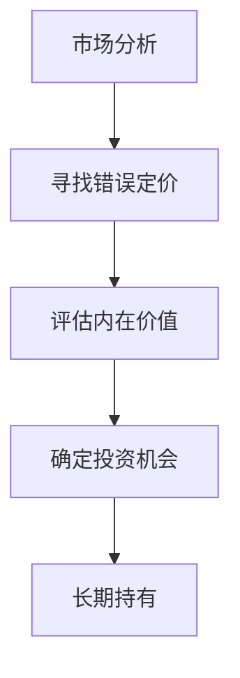

                 

# 芒格的"逆向工程"思维：从成功投资中提取核心原则

## 关键词：逆向思维, 投资原则, 巴菲特, 价值投资, 思维模型

## 摘要：  
本文深入探讨了芒格的“逆向工程”思维，从其成功投资案例中提取核心原则，并分析其在投资决策中的应用。通过详细分析芒格的投资理念、决策框架和思维模型，本文揭示了逆向思维在投资中的独特价值，并为读者提供了实用的行动指南。

---

## 第一部分：芒格及其投资理念

### 第1章：芒格的生平与投资哲学

#### 1.1 芒格的生平与成就
- **早年经历与教育背景**：芒格出生于美国密歇根州，早年在密歇根大学学习法学，后转学到加州大学洛杉矶分校（UCLA）并获得经济学硕士学位。  
- **投资生涯的起点与发展**：芒格与巴菲特的合作始于1959年，他以合伙人的身份加入巴菲特的合伙公司，逐步成为伯克希尔哈撒韦的副主席。  
- **在伯克希尔哈撒韦的贡献**：芒格以其独特的投资理念和决策能力，帮助伯克希尔哈撒韦成为全球最大的保险公司之一，实现了长期稳健的收益。

#### 1.2 逆向工程思维的定义
- **逆向思维的起源与概念**：逆向思维是一种从结果推导原因的思维方式，与传统的正向思维（从原因推导结果）相反。  
- **投资中的逆向思维**：芒格将逆向思维应用于投资领域，通过分析市场的错误定价和企业的内在价值，寻找投资机会。  
- **逆向思维的核心要素**：  
  - **安全性**：优先考虑企业的安全边际，避免高风险投资。  
  - **长期价值**：关注企业的长期盈利能力，而非短期股价波动。  
  - **避免错误**：通过逆向思维避免情绪化决策和市场泡沫。

#### 1.3 芒格的核心投资原则
- **避免常见错误**：芒格强调避免“愚蠢”的投资行为，如盲目跟风、过度自信和忽视风险。  
- **资本主义的“内在张力”**：芒格认为，企业与市场之间存在一种内在张力，这种张力推动着资源的优化配置和价值的实现。  
- **股价与价值的悖论**：芒格指出，股价的短期波动与企业的长期价值之间存在矛盾，投资者应关注企业的内在价值而非短期股价。

---

## 第二部分：逆向工程思维的原理与应用

### 第2章：逆向工程思维的原理

#### 2.1 逆向思维的原理
- **从结果出发**：逆向思维的基本逻辑是通过分析结果，推导出可能的原因。例如，通过分析企业的财务数据，推断其内在价值。  
- **资本市场中的逆向思维**：芒格认为，市场往往会出现错误定价，这为逆向思维提供了机会。  
- **逆向思维与安全边际**：芒格强调通过逆向思维寻找具有安全边际的投资标的，即企业的市场价格低于其内在价值。

#### 2.2 逆向思维在投资中的具体应用
- **寻找“便宜的烟屁股”**：芒格将投资目标比作“便宜的烟屁股”，即那些被市场低估但具有稳定现金流的企业。  
- **避免情绪化决策**：通过逆向思维，芒格帮助投资者克服贪婪和恐惧等情绪化决策。  
- **逆向思维的步骤与流程图（Mermaid）**：

---

## 第三部分：芒格的成功投资案例分析

### 第3章：可口可乐的投资案例

#### 3.1 投资背景与决策过程
- **背景**：20世纪80年代，可口可乐因管理层决策失误导致股价下跌，市场对其前景持怀疑态度。  
- **决策过程**：芒格通过逆向思维，分析了可口可乐的强品牌和稳定的现金流，认为其内在价值被市场低估。  
- **结果**：投资可口可乐为芒格带来了丰厚的回报，进一步验证了逆向思维的有效性。

### 第4章：富国银行的投资案例

#### 4.1 投资背景与决策过程
- **背景**：富国银行在20世纪90年代因管理层激进的扩张策略导致资产质量下降，市场对其前景持悲观态度。  
- **决策过程**：芒格通过逆向思维，分析了富国银行的客户基础和品牌价值，认为其内在价值被市场低估。  
- **结果**：投资富国银行为芒格带来了长期稳定的收益，进一步验证了逆向思维的有效性。

---

## 第四部分：芒格的决策框架与思维模型

### 第5章：芒格的决策框架

#### 5.1 多元思维模型
- **定义**：芒格提出“多元思维模型”，即通过多个学科的视角分析问题，避免单一思维的局限性。  
- **应用**：例如，通过经济学、心理学和数学等多学科视角分析企业的内在价值和市场行为。  
- **对比表格**：以下是几种思维模型的对比：

| 思维模型       | 描述                                                                 |
|----------------|----------------------------------------------------------------------|
| 经济学模型     | 分析企业的成本、收益和市场结构。                                       |
| 心理学模型     | 理解投资者的行为偏差和情绪化决策。                                     |
| 数学模型       | 计算企业的内在价值和风险指标。                                         |

#### 5.2 风险管理
- **定义**：芒格认为风险管理是投资决策的核心，通过逆向思维识别和规避高风险投资。  
- **应用**：例如，通过分析企业的财务状况和市场环境，评估其潜在风险并制定应对策略。

### 第6章：芒格的思维模型

#### 6.1 思维模型的具体应用
- **案例分析**：通过具体案例分析，展示芒格如何利用多元思维模型做出投资决策。  
- **对比分析**：通过对比不同企业的财务数据和市场表现，展示芒格思维模型的优势。

---

## 第五部分：逆向思维在其他领域的应用

### 第7章：逆向思维在商业与个人成长中的应用

#### 7.1 逆向思维在商业中的应用
- **企业战略**：通过逆向思维制定企业战略，例如从目标市场出发，推导出产品和服务策略。  
- **风险管理**：通过逆向思维识别潜在风险并制定应对措施。  

#### 7.2 逆向思维在个人成长中的应用
- **目标设定**：通过逆向思维设定个人目标，例如从最终成果出发，推导出实现目标的具体步骤。  
- **习惯养成**：通过逆向思维制定个人习惯，例如从长期目标出发，推导出每日需要完成的任务。

---

## 第六部分：总结与启示

### 第8章：总结与启示

#### 8.1 总结
- 芒格的逆向思维是一种从结果出发的思维方式，通过分析市场的错误定价和企业的内在价值，寻找投资机会。  
- 逆向思维的核心在于避免情绪化决策和高风险投资，强调长期价值和安全边际。

#### 8.2 启示与行动建议
- **学习芒格的投资理念**：通过阅读芒格的著作和案例分析，理解逆向思维的原理和应用。  
- **实践逆向思维**：在投资和生活中尝试逆向思维，从结果出发分析问题，寻找解决方案。  
- **建立多元思维模型**：通过多学科的视角分析问题，避免单一思维的局限性。  

---

## 作者：AI天才研究院/AI Genius Institute & 禅与计算机程序设计艺术 /Zen And The Art of Computer Programming

