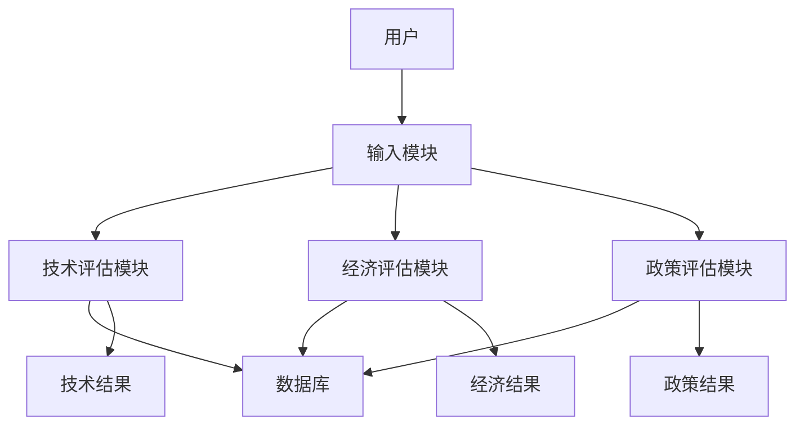

                 


# 芒格的"逆向思维"在可控核聚变商业化评估中的应用

---

## 关键词：芒格逆向思维，可控核聚变，商业化评估，技术可行性，经济可行性，政策可行性

---

## 摘要

本文探讨了芒格的"逆向思维"在可控核聚变商业化评估中的应用。首先，我们介绍了可控核聚变的基本概念和其在能源领域的重要性，接着详细阐述了芒格逆向思维的核心理念及其在投资和决策中的应用。随后，我们将逆向思维应用于可控核聚变的商业化评估，从技术、经济和政策三个维度进行分析。通过具体案例和系统架构的设计，我们展示了如何利用逆向思维来优化评估过程，识别潜在风险和机会，从而为可控核聚变的商业化提供有力支持。最后，我们总结了逆向思维在可控核聚变评估中的优势和未来研究方向。

---

## 第一部分：可控核聚变的基本概念与商业化的重要性

### 第1章：可控核聚变的基本概念

#### 1.1 核聚变的基本概念

核聚变是指两个轻核原子在高温高压下结合成一个较重的原子，同时释放出巨大的能量。与核裂变不同，核聚变不会产生长期放射性废物，且资源丰富，是未来清洁能源的重要来源。

#### 1.2 可控核聚变的实现条件

1. **高温条件**：需要在极高的温度下（通常超过1亿摄氏度）使等离子体发生聚变反应。
2. **磁场约束**：通过强大的磁场将高温等离子体约束在特定区域内，防止其接触容器壁。
3. **燃料供应**：主要使用氘和氚作为燃料，这两种元素在自然界中广泛存在。
4. **技术集成**：需要多学科的技术集成，包括高温等离子体物理、材料科学、工程热力学等。

#### 1.3 可控核聚变在能源领域的潜力

1. **清洁能源**：核聚变不会产生二氧化碳或其他污染物，是应对气候变化的理想能源。
2. **能源安全性**：与核裂变相比，核聚变的风险更低，且不受资源限制。
3. **可持续性**：氘和氚的储量丰富，能够支持长期的能源需求。

---

### 第2章：可控核聚变商业化的重要性

#### 2.1 当前能源危机与核聚变能源的优势

1. **能源需求增长**：随着全球人口增长和工业化进程的加快，能源需求不断增加。
2. **化石能源的局限性**：化石能源的不可再生性和环境污染问题使其难以长期依赖。
3. **核聚变的优势**：核聚变能源的可持续性和安全性使其成为未来能源结构的重要组成部分。

#### 2.2 可控核聚变商业化面临的挑战

1. **技术难度**：高温等离子体的约束和控制技术尚未完全成熟。
2. **高昂成本**：核聚变装置的建设和运营成本极高。
3. **政策与社会因素**：核聚变技术的推广需要政策支持和公众认可。

#### 2.3 可控核聚变商业化对社会经济的影响

1. **经济增长**：核聚变技术的商业化将推动相关产业的发展，创造大量就业机会。
2. **能源价格稳定**：核聚变能源的成本低且稳定，有助于降低能源价格波动。
3. **国际竞争力**：掌握核聚变技术的国家将在未来能源市场中占据优势。

---

## 第二部分：芒格的"逆向思维"概述

### 第3章：芒格"逆向思维"的核心理念

#### 3.1 "逆向思维"的定义与核心理念

"逆向思维"是指从相反的方向思考问题，寻找解决问题的新方法。芒格认为，逆向思维可以帮助人们避免盲从，发现被忽视的机会。

#### 3.2 "逆向思维"与传统思维方式的区别

| 特性 | 传统思维 | 逆向思维 |
|------|----------|----------|
| 思考方向 | 正向推理 | 逆向推理 |
| 解决问题 | 寻找路径 | 从结果反推 |
| 应用场景 | 日常决策 | 高风险投资 |

#### 3.3 "逆向思维"在投资与决策中的应用

1. **投资领域**：芒格通过逆向思维寻找被市场低估的投资机会。
2. **决策领域**：逆向思维帮助制定更加稳健的决策策略。

---

### 第4章：芒格"逆向思维"与可控核聚变商业化评估的结合

#### 4.1 逆向思维在技术评估中的应用

1. **从结果反推路径**：通过分析现有技术的不足，反向寻找改进方向。
2. **从失败案例中寻找经验**：研究过去失败的核聚变项目，总结经验教训。

#### 4.2 逆向思维在经济评估中的应用

1. **成本控制**：从最终的经济目标反推成本控制的关键点。
2. **商业模式优化**：通过逆向思维设计更加合理的商业模式。

#### 4.3 逆向思维在政策评估中的应用

1. **政策优化**：从政策效果反推政策实施的关键因素。
2. **风险规避**：通过逆向思维提前识别政策风险。

---

## 第三部分：系统架构与算法设计

### 第5章：系统架构设计

#### 5.1 问题场景介绍

可控核聚变商业化评估需要综合考虑技术、经济和政策三个维度，构建一个复杂的评估系统。

#### 5.2 系统功能设计

- **技术评估模块**：评估核聚变技术的可行性。
- **经济评估模块**：分析商业化过程中的经济成本和收益。
- **政策评估模块**：评估政策环境对商业化的影响。

#### 5.3 系统架构设计（Mermaid图）



---

### 第6章：算法原理与实现

#### 6.1 算法原理

逆向思维评估算法通过反向推理，从结果出发，逐步推导出实现目标的关键因素。

#### 6.2 算法实现（Python代码）

```python
def inverse_thinking_assessment(target, factors):
    # 从目标反推影响因素
    result = []
    for factor in factors:
        if factor impacts target:
            result.append(factor)
    return result

# 示例应用
target = "商业化成功"
factors = ["技术可行", "经济可行", "政策支持"]
result = inverse_thinking_assessment(target, factors)
print("关键影响因素:", result)
```

---

## 第四部分：项目实战与案例分析

### 第7章：项目实战

#### 7.1 环境安装

1. **工具安装**：安装Python和相关库（如numpy、pandas）。
2. **数据准备**：收集核聚变技术、经济和政策相关数据。

#### 7.2 核心代码实现

```python
import numpy as np

def calculate_economic_impact(cost, revenue):
    return revenue - cost

# 示例数据
cost = 1000
revenue = 2000
impact = calculate_economic_impact(cost, revenue)
print("经济影响:", impact)
```

---

### 第8章：案例分析

#### 8.1 技术评估案例

分析某核聚变项目的失败案例，总结技术上的不足，并提出改进方向。

#### 8.2 经济评估案例

通过逆向思维优化商业模式，降低运营成本，提高经济效益。

---

## 第五部分：总结与展望

### 第9章：总结

#### 9.1 核心观点回顾

- 芒格的逆向思维为可控核聚变商业化评估提供了新的视角。
- 通过逆向思维，可以更高效地识别关键因素和优化方案。

#### 9.2 优势与局限性

- **优势**：提高决策的科学性和前瞻性。
- **局限性**：逆向思维需要大量数据支持，且依赖于分析者的经验。

---

### 第10章：展望

#### 10.1 未来研究方向

- 进一步优化逆向思维评估算法。
- 探索逆向思维在更多领域的应用。

#### 10.2 对读者的建议

- 多学习逆向思维的相关知识。
- 结合实际案例，深入理解其应用。

---

## 附录

### 附录A：术语表

- **可控核聚变**：通过受控方式释放核聚变能的技术。
- **逆向思维**：从相反方向思考问题，寻找解决问题的新方法。

### 附录B：参考文献

- [1] 芒格《穷查理宝典》
- [2] 核聚变相关技术文献

### 附录C：工具推荐

- **Python**：数据处理和算法实现的首选工具。
- **Mermaid**：绘制系统架构图的利器。

---

## 作者：AI天才研究院 & 禅与计算机程序设计艺术

---

通过本文的系统分析和详细讲解，我们展示了芒格的逆向思维在可控核聚变商业化评估中的广泛应用。希望读者能够从中学到如何利用逆向思维优化决策，推动技术创新。

