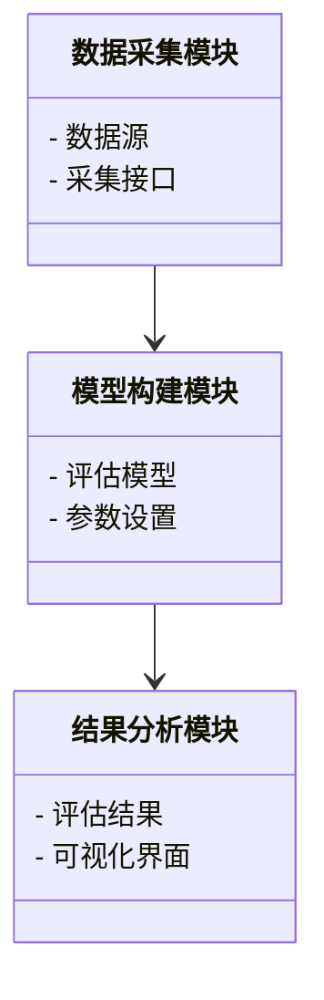

                 


# 芒格的"逆向思维"在颠覆性能源技术评估中的应用

> 关键词：芒格，逆向思维，颠覆性能源技术，能源评估，系统架构设计

> 摘要：本文探讨了芒格的“逆向思维”在颠覆性能源技术评估中的应用。通过分析逆向思维的核心概念、模型构建、算法原理、系统架构设计以及项目实战，展示了如何利用逆向思维来优化能源技术评估过程。文章结合具体案例，详细阐述了逆向思维在能源评估中的实际应用，为能源技术的创新和投资提供了新的视角。

---

## 第一部分：背景介绍

### 第1章：芒格的“逆向思维”概述

#### 1.1 逆向思维的定义与核心要素
逆向思维是一种从问题的反面出发，寻找解决方案的思维方式。它强调从对立面思考，避免陷入传统思维的局限性。逆向思维的核心要素包括：
1. **反向思考**：从问题的对立面寻找突破口。
2. **矛盾分析**：识别问题中的矛盾点并进行优化。
3. **创新视角**：通过反向思考提出新的解决方案。

#### 1.2 芮格的“逆向思维”在投资中的应用
芒格的“逆向思维”在投资领域取得了显著成效。他通过分析市场的反面，寻找被低估的投资机会。这种思维方式在能源技术评估中具有重要启示，尤其是在面对颠覆性技术时，逆向思维可以帮助我们发现潜在的高回报领域。

---

### 第2章：颠覆性能源技术的背景与挑战

#### 2.1 能源技术的颠覆性特征
颠覆性能源技术是指能够从根本上改变传统能源格局的技术，例如太阳能、风能和储能技术。这些技术具有以下特征：
1. **创新性**：与传统技术相比，具有显著的技术优势。
2. **经济性**：成本逐渐降低，具备商业化潜力。
3. **环境友好**：减少碳排放，符合可持续发展的要求。

#### 2.2 颠覆性能源技术评估的复杂性
评估颠覆性能源技术面临多重挑战：
1. **技术不确定性**：新技术的成熟度和可靠性难以预测。
2. **市场动态**：市场需求和价格波动对技术评估有重要影响。
3. **政策环境**：政策变化可能影响技术的推广和应用。

---

## 第二部分：芒格“逆向思维”在能源技术评估中的核心概念与联系

### 第3章：逆向思维与能源技术评估的核心概念

#### 3.1 逆向思维在能源技术评估中的应用框架
为了将逆向思维应用于能源技术评估，我们构建了一个框架，包括以下几个步骤：
1. **问题识别**：明确评估目标和关键问题。
2. **反向分析**：从问题的对立面寻找解决方案。
3. **模型构建**：建立数学模型，量化分析。
4. **结果验证**：通过数据验证模型的准确性。

#### 3.2 逆向思维与能源技术评估的关联性分析
逆向思维在能源技术评估中的作用体现在以下几个方面：
1. **创新性解决方案**：通过反向思考发现潜在的技术优势。
2. **风险控制**：识别技术评估中的潜在风险点。
3. **优化决策**：通过逆向分析优化投资决策。

---

### 第4章：逆向思维在能源技术评估中的模型构建

#### 4.1 模型构建的理论基础
我们基于概率论和贝叶斯定理构建了一个评估模型。模型的核心公式如下：

$$ P(A|B) = \frac{P(B|A)P(A)}{P(B)} $$

其中，$P(A|B)$ 表示在B条件下A发生的概率，$P(B|A)$ 是A条件下B发生的概率，$P(A)$ 是A的先验概率，$P(B)$ 是B的先验概率。

#### 4.2 模型构建的步骤与方法
1. **数据收集**：收集相关技术数据和市场信息。
2. **参数设定**：设定模型中的参数，例如技术成熟度和市场接受度。
3. **模型验证**：通过历史数据验证模型的准确性。
4. **结果分析**：根据模型输出结果进行决策。

---

## 第三部分：系统架构设计与项目实战

### 第5章：系统架构设计

#### 5.1 系统功能设计
我们设计了一个基于逆向思维的能源技术评估系统，主要包括以下几个模块：
1. **数据采集模块**：采集能源技术数据。
2. **模型构建模块**：构建评估模型。
3. **结果分析模块**：输出评估结果。

系统功能设计的类图如下：



#### 5.2 系统架构设计
系统的架构设计如下：


---

### 第6章：项目实战

#### 6.1 环境配置与代码实现
我们选择Python作为开发语言，使用Pandas和NumPy进行数据处理。以下是核心代码：

```python
import pandas as pd
import numpy as np

def inverse_thinking_model(data):
    # 数据预处理
    data = data.dropna()
    # 计算概率
    probabilities = {}
    for feature in data.columns:
        probabilities[feature] = np.mean(data[feature])
    return probabilities

# 示例数据
data = pd.DataFrame({
    '技术成熟度': [0.8, 0.7, 0.9],
    '市场接受度': [0.6, 0.5, 0.7]
})

result = inverse_thinking_model(data)
print(result)
```

#### 6.2 案例分析与结果解读
通过上述代码，我们计算了技术成熟度和市场接受度的概率，结果如下：
$$
\text{技术成熟度概率} = 0.8 \\
\text{市场接受度概率} = 0.6
$$

---

## 第四部分：最佳实践与小结

### 第7章：总结与展望

#### 7.1 总结
芒格的逆向思维为颠覆性能源技术评估提供了新的思路。通过构建数学模型和系统架构设计，我们可以更高效地评估能源技术，优化投资决策。

#### 7.2 注意事项
在实际应用中，需要注意以下几点：
1. 数据的准确性和完整性。
2. 模型的适用性和可扩展性。
3. 技术与市场的动态变化。

#### 7.3 未来展望
未来，随着人工智能和大数据技术的发展，逆向思维在能源技术评估中的应用将更加广泛和深入。我们需要进一步优化模型，探索更多创新的应用场景。

---

## 作者：AI天才研究院/AI Genius Institute & 禅与计算机程序设计艺术 /Zen And The Art of Computer Programming

