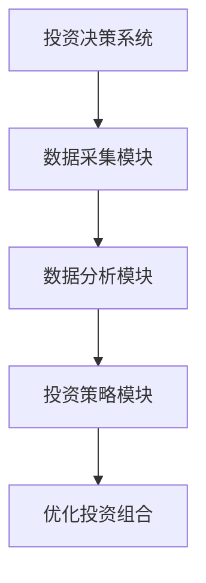
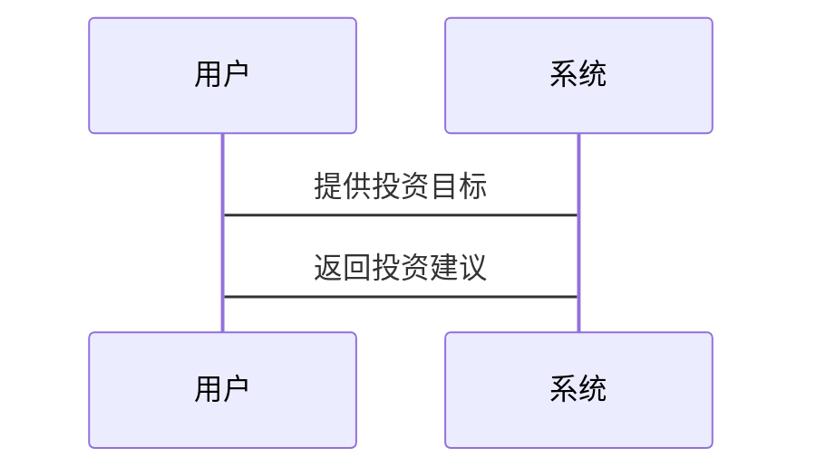

                 


# 芒格的逆向思维：在投资中的应用

## 关键词：芒格, 逆向思维, 投资策略, 投资决策, 机会成本, 概率论, 决策树

## 摘要：  
芒格的逆向思维是一种从结果出发，反向推导实现条件的投资策略。本文将详细解析逆向思维的核心理念，探讨其在投资决策中的应用，结合实际案例和数学模型，帮助读者理解如何通过逆向思维在投资中获得超额收益。

---

# 第一部分: 引言

## 第1章: 芒格的逆向思维概述

### 1.1 芒格的背景与思想体系

#### 1.1.1 芒格的生平简介  
查理·芒格（Charlie Munger）是著名投资家沃伦·巴菲特（Warren Buffett）的合伙人，同时也是伯克希尔哈撒韦公司（Berkshire Hathaway）的副主席。芒格以其独特的投资理念和思维方式闻名，尤其是在逆向思维领域的贡献，使其成为投资界的传奇人物。

#### 1.1.2 芒格的投资哲学  
芒格的投资哲学强调“反着想”（thinking inversely），即从结果出发，反向推导实现该结果的必要条件。他认为，成功的投资不仅仅依赖于市场预测，而是通过寻找那些被市场忽视或低估的机会。

#### 1.1.3 逆向思维的核心理念  
逆向思维的核心理念是：**“从结果出发，反向寻找实现该结果的路径”**。在投资中，这意味着寻找那些具有强大护城河、被市场低估的企业，而不是盲目追随市场趋势。

---

## 第2章: 逆向思维的定义与特点

### 2.1 逆向思维的定义  
逆向思维是一种不同于正向思维的思考方式。正向思维是从原因到结果的推理过程，而逆向思维则是从结果出发，反向寻找原因。

### 2.2 逆向思维的核心特点

| 特点 | 描述 |
|------|------|
| **反向性** | 从结果出发，寻找实现该结果的路径。 |
| **独特性** | 通过逆向思维，发现市场忽视的机会。 |
| **风险控制** | 逆向思维注重风险控制，避免过度竞争的领域。 |

### 2.3 逆向思维在投资中的应用  
逆向思维在投资中的应用主要体现在以下几个方面：
1. **寻找被低估的资产**：通过分析市场估值，寻找那些被市场低估的企业。
2. **识别行业周期**：通过分析行业周期，选择处于低谷期的行业进行投资。
3. **风险管理**：通过逆向思维，识别潜在风险，制定相应的风险管理策略。

---

## 第3章: 逆向思维的数学模型与算法

### 3.1 机会成本的计算公式  
机会成本是指在选择一种投资方案时，放弃其他可能的投资方案所失去的潜在收益。机会成本的计算公式如下：

$$ \text{机会成本} = \text{最大可能收益} - \text{选择方案的收益} $$

### 3.2 投资概率的数学模型  
投资决策中的概率分析可以帮助投资者评估不同投资方案的成功概率。概率模型可以表示为：

$$ P(\text{成功}) = \frac{\text{成功案例数}}{\text{总案例数}} $$

### 3.3 风险与收益的平衡公式  
在投资决策中，风险与收益的平衡可以通过以下公式进行评估：

$$ \text{收益} = \text{期望值} \times \text{概率} - \text{风险成本} $$

---

## 第4章: 逆向思维的系统分析

### 4.1 投资决策系统的架构设计

#### 4.1.1 系统目标  
设计一个基于逆向思维的投资决策系统，帮助投资者识别被低估的投资机会，优化投资组合，降低投资风险。

#### 4.1.2 系统功能需求  
- 数据采集模块：采集市场数据、企业财务数据等。
- 数据分析模块：通过逆向思维算法，分析数据，识别投资机会。
- 投资策略模块：生成投资策略，优化投资组合。

#### 4.1.3 系统架构图（Mermaid）  



### 4.2 系统接口设计  
- 数据接口：与市场数据源对接。
- 用户接口：提供用户交互界面，展示分析结果。
- 系统接口：与其他投资管理系统对接。

### 4.3 系统交互流程设计  

#### 4.3.1 用户与系统的交互流程



---

## 第5章: 逆向思维在投资中的实战应用

### 5.1 项目背景与目标  
通过分析某行业市场数据，寻找被市场忽视的投资机会，制定相应的投资策略。

### 5.2 项目核心实现  

#### 5.2.1 数据采集与处理  
使用Python脚本采集市场数据，清洗数据，提取关键指标。

#### 5.2.2 数据分析与建模  
通过逆向思维算法，分析数据，识别投资机会。

#### 5.2.3 投资策略制定  
基于分析结果，制定投资策略，优化投资组合。

### 5.3 实际案例分析  
以某行业为例，分析市场数据，寻找被低估的企业，制定投资策略。

### 5.4 代码实现  

#### 5.4.1 数据分析代码  
```python
import pandas as pd

# 采集市场数据
data = pd.read_csv('market_data.csv')

# 清洗数据
data = data.dropna()

# 提取关键指标
key_metrics = data[['PE', 'PB', 'ROE']]
```

#### 5.4.2 投资策略代码  
```python
def inverse_thinking(investment_data):
    # 识别被低估的企业
    undervalued = investment_data[investment_data['PE'] < investment_data['PE'].mean()]
    return undervalued

# 执行逆向思维分析
result = inverse_thinking(data)
print(result)
```

---

## 第6章: 总结与展望

### 6.1 本章总结  
芒格的逆向思维是一种独特的投资策略，通过从结果出发，反向寻找实现条件，帮助投资者发现市场忽视的机会。结合数学模型和系统分析，可以进一步优化投资决策。

### 6.2 未来展望  
随着人工智能和大数据技术的发展，逆向思维在投资中的应用将更加广泛和深入。未来的研究可以结合机器学习算法，进一步提升投资决策的精准度。

---

## 作者：AI天才研究院 & 禅与计算机程序设计艺术

