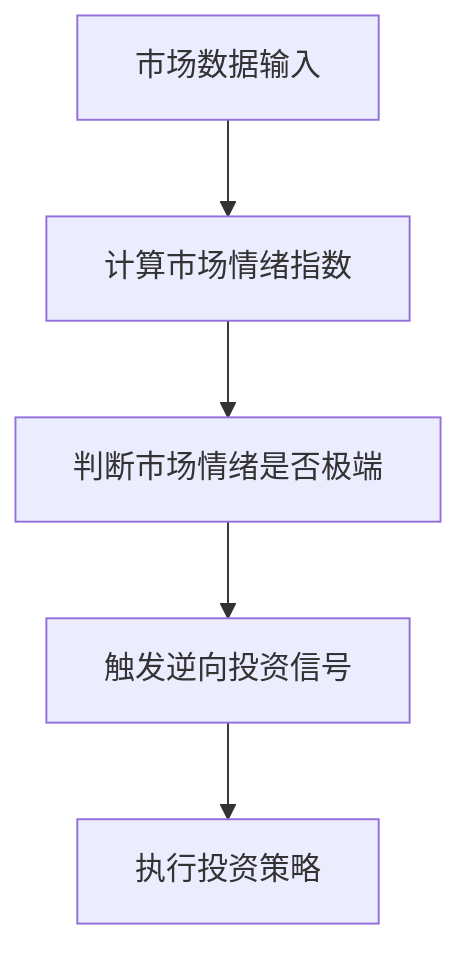
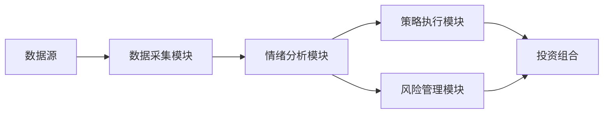

                 


# 芒格的逆向投资思维：如何在市场恐慌中获利

## 关键词：逆向思维、价值投资、芒格、投资策略、市场恐慌、风险管理、投资机会

## 摘要：  
本文深入探讨了芒格的逆向投资思维，分析了其在市场恐慌中的独特优势和具体应用。通过结合芒格的多元思维模型，文章详细阐述了如何利用逆向思维在市场恐慌中发现投资机会，并通过数学模型和算法原理进一步解释了其背后的逻辑。最后，结合实际案例和项目实战，为读者提供了可操作的投资策略和风险管理方法。

---

# 第一部分：芒格的逆向投资思维概述

## 第1章：芒格的生平与投资理念

### 1.1 芒格的生平简介

查理·芒格（Charlie Munger）是美国著名投资者、伯克希尔·哈撒韦公司副董事长，被誉为“巴菲特的导师”。他出生于1924年，早年在哈佛大学学习法律，后转至耶鲁大学完成学业。芒格的职业生涯从律师开始，但他在投资领域的成就使他成为全球最受尊敬的投资者之一。芒格与巴菲特的合作始于1959年，两人共同创立了伯克希尔·哈撒韦公司，并将其打造成全球最大的投资公司之一。

### 1.2 芒格的投资理念

芒格的投资理念深受本杰明·格雷厄姆的影响，但他进一步发展了价值投资理论。他强调“多元思维模型”，认为投资者需要从多个角度（包括心理学、经济学、物理学等）理解问题。芒格的核心思想是：**“价格是价值的奴仆”**，即长期来看，股票的价格会回归其内在价值。

芒格的逆向思维是其投资理念的重要组成部分。他认为，市场的情绪波动为投资者提供了机会。当市场恐慌时，许多优质资产会被低估，此时正是买入的好时机；而当市场狂热时，许多资产会被高估，此时应考虑卖出。

---

## 第2章：逆向思维的核心概念

### 2.1 逆向思维的定义与特征

逆向思维是一种与传统思维方式相反的思考方式，它强调在市场情绪极端时寻找机会。具体来说，逆向思维的核心在于：**“别人贪婪时恐惧，别人恐惧时贪婪”**。

**特征对比表：**

| 特征         | 正向思维                  | 逆向思维                  |
|--------------|---------------------------|---------------------------|
| 市场情绪       | 追随市场主流情绪           | �反向利用市场极端情绪       |
| 投资时机       | 市场繁荣时积极投资           | 市场恐慌时积极寻找机会       |
| 风险控制       | 追求高收益，忽视潜在风险       | 优先控制风险，寻找高安全边际资产 |

### 2.2 逆向思维的核心要素

1. **市场情绪的反向操作**：芒格认为，市场情绪是波动的，而投资者的理性决策可以利用这种波动。当市场情绪过于乐观时，投资者应该保持警惕；当市场情绪极度悲观时，投资者应该寻找机会。

2. **价值发现的逆向逻辑**：芒格强调，投资的本质是寻找市场低估的资产。他通过分析企业的基本面（如盈利能力、财务状况、竞争优势等）来判断其内在价值，并在市场恐慌时寻找那些被低估的资产。

3. **风险控制的逆向策略**：芒格认为，风险控制是投资成功的关键。他通过逆向思维，在市场恐慌时降低风险敞口，在市场繁荣时控制杠杆。

---

## 第3章：逆向思维在投资中的应用

### 3.1 逆向思维的市场应用场景

1. **市场恐慌中的投资机会**：当市场因突发事件或经济危机而陷入恐慌时，许多优质资产会被抛售，价格大幅低于其内在价值。此时，逆向投资者可以买入这些资产，等待市场恢复后获利。

2. **市场狂热中的风险预警**：当市场因投机情绪而狂热时，许多资产价格被推高，远超其内在价值。此时，逆向投资者应警惕市场风险，并考虑逐步减少投资。

3. **逆向思维在资产配置中的作用**：通过逆向思维，投资者可以在市场低迷时增加对优质资产的配置，在市场繁荣时减少配置，从而优化整体资产组合的风险收益比。

---

# 第二部分：逆向思维的数学模型与算法原理

## 第4章：逆向思维的数学模型

### 4.1 逆向思维的数学表达式

1. **市场情绪指数的计算公式**：
   市场情绪指数可以通过投资者情绪调查、成交量、资金流动等指标来综合计算。假设我们用 $M$ 表示市场情绪指数，其计算公式为：
   $$ M = \alpha \cdot V + \beta \cdot C + \gamma \cdot F $$
   其中，$V$ 是投资者情绪调查值，$C$ 是成交量指标，$F$ 是资金流动指标，$\alpha$、$\beta$、$\gamma$ 是权重系数。

2. **价值与价格的偏离度模型**：
   当市场价格偏离其内在价值时，逆向投资者可以介入。假设 $P$ 是市场价格，$V$ 是内在价值，偏离度 $D$ 的计算公式为：
   $$ D = \frac{P - V}{V} $$
   当 $D$ 为负数且绝对值较大时，表示市场价格被低估，此时是买入的好时机。

3. **风险与收益的逆向关系公式**：
   逆向投资者通过控制风险来获取超额收益。假设 $R$ 是收益，$r$ 是风险，其逆向关系可以表示为：
   $$ R = -k \cdot r + b $$
   其中，$k$ 是风险系数，$b$ 是常数项。

### 4.2 逆向思维的算法流程图



### 4.3 逆向思维的Python实现示例

```python
def inverse_thinking_strategy(data):
    # 计算市场情绪指数
    market_sentiment = (0.5 * data['investor_mood'] + 
                        0.3 * data['volume'] + 
                        0.2 * data['capital_flow'])
    
    # 判断市场情绪是否极端
    if market_sentiment < 0.3:
        return "Buy"  # 市场情绪极低，买入信号
    elif market_sentiment > 0.7:
        return "Sell"  # 市场情绪极高，卖出信号
    else:
        return "Hold"  # 市场情绪正常，持有观望
```

---

## 第5章：逆向思维的系统架构设计

### 5.1 系统功能设计

1. **数据采集模块**：从市场数据源获取实时数据，包括价格、成交量、投资者情绪等。
2. **情绪分析模块**：计算市场情绪指数，并判断其是否极端。
3. **策略执行模块**：根据逆向思维策略，触发买入或卖出信号。
4. **风险管理模块**：监控投资组合的风险，并进行动态调整。

### 5.2 系统架构设计



### 5.3 系统接口设计

- 数据输入接口：接收市场数据，格式为JSON或CSV。
- 策略执行接口：输出买卖信号，格式为文本或API调用。
- 风险管理接口：监控投资组合风险，输出风险报告。

---

## 第6章：逆向思维的项目实战

### 6.1 环境安装

1. **Python环境**：安装Python 3.8及以上版本。
2. **数据处理库**：安装Pandas、NumPy。
3. **可视化库**：安装Matplotlib、Seaborn。
4. **情绪分析库**：安装Textblob。

### 6.2 核心代码实现

```python
import pandas as pd
from textblob import TextBlob

def calculate_market_sentiment(text_data):
    sentiment_scores = []
    for text in text_data:
        blob = TextBlob(text)
        sentiment = blob.sentiment.polarity
        sentiment_scores.append(sentiment)
    return sentiment_scores

# 示例数据
text_data = ["Market is bullish", "Investors are optimistic", "Stocks are falling"]
sentiment = calculate_market_sentiment(text_data)
print(sentiment)
```

### 6.3 代码解读与分析

上述代码通过Textblob库对市场情绪文本进行分析，计算出每条文本的情绪得分。得分范围在-1到1之间，-1表示极度悲观，1表示极度乐观。逆向投资者可以根据情绪得分判断市场是否进入极端状态。

### 6.4 实际案例分析

假设在2020年新冠疫情爆发期间，市场情绪极度恐慌，许多优质股票被抛售，价格大幅低于其内在价值。逆向投资者可以利用芒格的逆向思维策略，在市场恐慌时买入优质资产，待市场恢复后卖出，从而获得超额收益。

---

## 第7章：逆向思维的最佳实践

### 7.1 小结

芒格的逆向投资思维是一种在市场恐慌中获利的有效策略。通过反向利用市场情绪，投资者可以在市场低估时买入，在市场高估时卖出，从而实现长期稳定的收益。

### 7.2 注意事项

1. **风险控制**：逆向投资需要严格控制风险，尤其是在市场恐慌时，投资者需要确保自身的资金安全。
2. **长期视角**：逆向投资是一种长期策略，投资者需要耐心等待市场恢复，避免被短期波动影响。
3. **多元化投资**：通过多元化投资降低风险，避免将所有资金投入单一资产。

### 7.3 拓展阅读

1. 查理·芒格的《Poor Charlie's Almanack》
2. 巴菲特的《投资之道》
3. 《逆向思考：芒格的成功投资哲学》

---

# 作者：AI天才研究院/AI Genius Institute & 禅与计算机程序设计艺术 /Zen And The Art of Computer Programming

