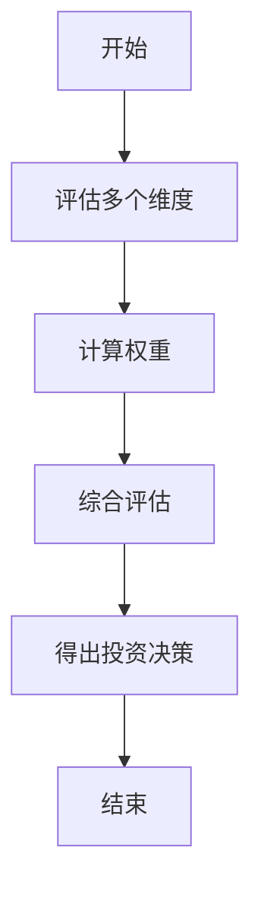
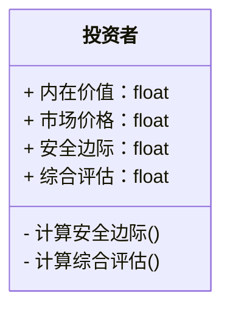

                 


# 芒格的"避免失败"原则在前沿科技风险投资中的应用

## 关键词：
芒格，避免失败，风险投资，前沿科技，安全边际，多元思维模型

## 摘要：
本文深入探讨了芒格的“避免失败”原则在前沿科技风险投资中的应用。通过分析芒格的核心理念，如逆向思维、安全边际和多元思维模型，结合实际案例，展示了这些原则如何帮助投资者在科技投资中降低风险、提高成功率。文章结构清晰，从理论到实践，为投资者提供了详实的指导和实用的策略。

---

## 第1章：芒格的“避免失败”原则概述

### 1.1 芒格“避免失败”原则的核心理念
#### 1.1.1 芒格的“避免失败”原则的起源
芒格的“避免失败”原则源自其投资哲学，强调通过逆向思维和安全边际来降低投资风险。这一原则的核心在于避免重大损失，而非追求最大收益。

#### 1.1.2 原则的核心要素与特征对比
- **逆向思维**：通过寻找“击倒”的机会，而非“击中”。
- **安全边际**：确保买入价格远低于内在价值。
- **多元思维模型**：整合多个学科的思维方式，避免单一视角的局限性。

#### 1.1.3 该原则在投资中的应用价值
通过避免常见错误和系统性风险，芒格原则帮助投资者在不确定的市场中做出更明智的决策。

---

### 1.2 前沿科技风险投资的现状与挑战
#### 1.2.1 前沿科技的定义与分类
前沿科技包括人工智能、量子计算、区块链等领域，具有高增长潜力，但也伴随高风险。

#### 1.2.2 风险投资的基本特征与流程
- **高风险高回报**：科技投资的不确定性较高，但潜在回报巨大。
- **流程复杂**：涉及市场分析、技术评估、团队评估等多个环节。

#### 1.2.3 当前科技投资的主要挑战
- **技术不确定性**：技术可能迅速变化，导致投资失败。
- **市场波动**：科技市场的波动性极高，增加了投资难度。

---

### 1.3 芒格原则与科技投资的结合
#### 1.3.1 芒格原则在科技投资中的适用性
- **逆向思维**：寻找被市场低估的机会。
- **安全边际**：确保投资标的具有足够的安全空间。
- **多元思维模型**：综合评估技术、市场、团队等多个因素。

#### 1.3.2 科技投资中的失败案例分析
通过具体案例，分析芒格原则如何帮助投资者避免失败。

#### 1.3.3 本章小结
芒格原则为科技投资提供了系统性的框架，帮助投资者在高风险环境中做出更明智的决策。

---

## 第2章：芒格“避免失败”原则的核心概念与联系

### 2.1 芒格“避免失败”原则的核心要素
#### 2.1.1 逆向思维与安全边际
- **逆向思维**：寻找市场忽视的机会。
- **安全边际**：确保买入价格远低于内在价值，降低风险。

#### 2.1.2 多元思维模型与能力圈
- **多元思维模型**：整合物理学、心理学、经济学等多学科知识，全面评估投资标的。
- **能力圈**：专注于自己熟悉的技术领域，避免跨界投资。

#### 2.1.3 耐心与纪律的重要性
- **耐心**：等待合适的投资机会，避免冲动投资。
- **纪律**：坚持原则，不因市场波动而改变策略。

---

### 2.2 芒格原则与传统投资理念的对比
#### 2.2.1 传统投资策略的优缺点
- **优点**：注重市场趋势和短期收益。
- **缺点**：忽视长期风险，可能导致重大损失。

#### 2.2.2 芒格原则的独特之处
- **注重风险管理**：优先考虑如何避免失败，而非如何获得最大收益。
- **强调安全边际**：确保投资的安全性，而非追求高回报。

#### 2.2.3 两者在科技投资中的结合
结合传统投资的市场分析和芒格原则的风险管理，形成更全面的投资策略。

---

### 2.3 芒格原则在科技投资中的ER实体关系图
```mermaid
er
actor(投资者) -[遵循芒格原则]-> strategy(投资策略)
strategy <-[应用于]-> technology(前沿科技)
technology <-[影响]-> risk(风险因素)
risk <-[评估]-> decision(投资决策)
```

---

## 第3章：芒格原则在科技投资中的算法与数学模型

### 3.1 安全边际的计算方法
#### 3.1.1 安全边际的定义与公式
$$ \text{安全边际} = \text{内在价值} - \text{市场价格} $$

#### 3.1.2 安全边际的计算步骤
1. 评估目标公司的内在价值。
2. 比较市场价格与内在价值。
3. 确保市场价格低于内在价值的一定比例。

#### 3.1.3 实例分析：某科技公司的安全边际计算
假设某科技公司的内在价值为100亿元，市场价格为80亿元，安全边际为20亿元。

---

### 3.2 多元思维模型的应用
#### 3.2.1 多元思维模型的数学表示
$$ \text{综合评估} = \sum (\text{权重}_i \times \text{维度}_i) $$

#### 3.2.2 实际案例中的应用
通过整合技术、市场、团队等多个维度的评估，得出投资决策。

#### 3.2.3 模型的优缺点分析
- **优点**：全面评估，降低单一维度的偏差。
- **缺点**：计算复杂，需要大量数据支持。

---

### 3.3 算法流程图


---

## 第4章：系统分析与架构设计

### 4.1 系统功能设计
#### 4.1.1 领域模型


#### 4.1.2 系统架构设计


---

## 第5章：项目实战

### 5.1 环境安装与配置
- 安装必要的工具和库，如数据分析工具、编程语言等。

### 5.2 核心代码实现
```python
def calculate_margin_of_safety(intrinsic_value, market_price):
    return intrinsic_value - market_price

# 示例
intrinsic_value = 100  # 亿元
market_price = 80      # 亿元
margin = calculate_margin_of_safety(intrinsic_value, market_price)
print(f"安全边际为：{margin}亿元")
```

### 5.3 实际案例分析
分析某科技公司的投资决策，展示芒格原则的应用。

---

## 第6章：最佳实践与总结

### 6.1 最佳实践 tips
- 保持耐心和纪律，避免冲动投资。
- 多元化评估，避免单一维度的偏差。
- 定期复盘，总结经验教训。

### 6.2 本章小结
通过芒格的“避免失败”原则，投资者可以在前沿科技领域做出更明智的投资决策，降低风险，提高成功率。

---

## 第7章：注意事项与拓展阅读

### 7.1 注意事项
- 投资有风险，需谨慎评估。
- 确保数据的准确性和完整性。

### 7.2 拓展阅读
- 《穷查理宝典》：深入理解芒格的投资哲学。
- 《科技投资指南》：了解前沿科技领域的投资策略。

---

## 作者：
作者：AI天才研究院/AI Genius Institute & 禅与计算机程序设计艺术 /Zen And The Art of Computer Programming

