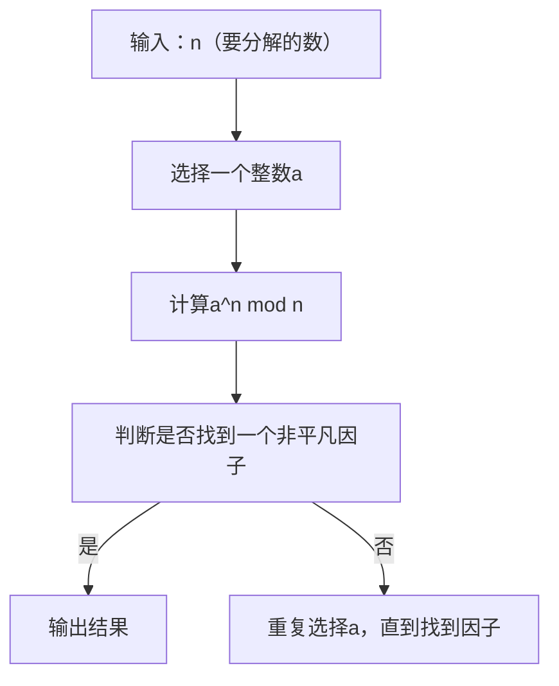
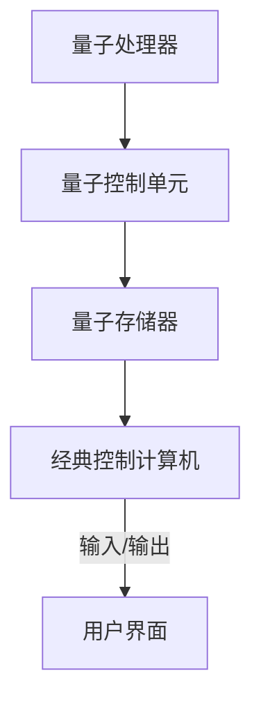

                 


# 芒格的"避免失败"原则在量子计算创业投资中的应用

---

## 关键词：
芒格原则，量子计算，创业投资，风险控制，决策框架

---

## 摘要：
本文探讨了芒格的“避免失败”原则在量子计算创业投资中的应用。通过分析芒格原则的核心思想、量子计算的技术特点和创业投资的风险因素，结合实际案例和数学模型，详细讲解如何在量子计算领域应用芒格的决策框架，避免投资失败，实现长期稳健的投资回报。

---

## 第一部分：引言

### 1.1 量子计算与创业投资的结合
#### 1.1.1 量子计算的基本概念
量子计算是一种基于量子力学原理的计算方式，利用量子叠加和量子纠缠的特性，能够在某些问题上远超经典计算机的计算能力。量子计算机的核心在于其量子位（qubit）的处理能力，可以在复杂问题上实现指数级的加速。

#### 1.1.2 创业投资的高风险性
创业投资是高风险、高回报的领域，尤其在科技领域，失败率非常高。量子计算作为一个前沿技术领域，其创业投资的不确定性和风险更大。

#### 1.1.3 芒格"避免失败"原则的核心思想
芒格强调“避免失败”而非“追求成功”，认为投资的关键是避免重大错误，而不是寻找成功的捷径。这种思维方式在量子计算投资中尤为重要，因为技术复杂性和市场不确定性使得失败的风险极高。

---

## 第二部分：芒格的"避免失败"原则

### 2.1 芒格"避免失败"原则的核心思想
#### 2.1.1 "避免失败"的定义与内涵
芒格的“避免失败”原则强调通过深度的知识储备、理性的决策和对逆境的准备，来降低投资中的失败概率。芒格认为，成功的投资不是依赖于预测未来，而是避免重大错误。

#### 2.1.2 芒格决策框架的三个关键要素
1. **知性资本**：通过广泛的知识储备和深度思考，识别潜在风险。
2. **情性资本**：控制情绪，避免冲动决策。
3. **逆性资本**：准备好应对逆境，降低失败的冲击。

#### 2.1.3 "避免失败"与投资成功的辩证关系
芒格认为，投资成功的最佳方式是通过避免重大失败来实现长期稳健的回报。他强调“先确保不会死，再考虑如何变得更成功”。

---

## 第三部分：量子计算创业投资的特点

### 3.1 量子计算的基本原理与技术难点
#### 3.1.1 量子计算的核心原理
量子计算依赖于量子叠加和量子纠缠的特性，可以在某些特定问题上实现指数级的计算速度。例如，Shor算法可以在量子计算机上高效分解大数，从而在密码学领域带来重大影响。

#### 3.1.2 量子计算的技术瓶颈
- **量子位的稳定性**：量子位容易受到外界干扰，导致量子态的退相干。
- **量子纠错**：需要复杂的量子纠错技术来保证计算的准确性。
- ** scalability**：目前量子计算机的规模有限，难以处理大规模问题。

#### 3.1.3 量子计算的商业化挑战
量子计算的商业化仍处于早期阶段，技术成熟度、市场需求和成本都是需要解决的问题。

### 3.2 创业投资中的量子计算机会
#### 3.2.1 量子计算的市场潜力
随着技术进步，量子计算在密码学、优化问题、药物研发等领域有巨大的潜力。例如，量子计算可以在药物研发中加速分子结构的计算，显著缩短研发周期。

#### 3.2.2 创业投资中的风险与回报
量子计算创业投资的回报潜力巨大，但失败风险也极高。投资者需要具备深入的技术理解和市场洞察力。

#### 3.2.3 量子计算企业的成长阶段与投资策略
量子计算企业通常处于早期阶段，投资者需要关注技术可行性、团队能力和市场定位。

### 3.3 量子计算创业投资的独特性
#### 3.3.1 技术驱动型投资的特点
量子计算的投资高度依赖于技术创新，技术瓶颈的突破是企业成功的关键。

#### 3.3.2 创业团队的关键作用
量子计算领域的成功离不开高水平的技术团队和科学家，他们的能力和决策直接影响企业的命运。

#### 3.3.3 量子计算的长期性和不确定性
量子计算技术的成熟需要时间，投资者需要有长期投资的耐心，并能够应对技术路径的不确定性。

---

## 第四部分：芒格原则在量子计算投资中的应用

### 4.1 芒格原则在投资决策中的应用
#### 4.1.1 知性资本：深入理解量子计算技术
投资者需要具备量子计算领域的专业知识，了解其技术原理、瓶颈和应用潜力。通过广泛阅读论文、参加行业会议和与专家交流，投资者可以建立系统的知识体系。

#### 4.1.2 情性资本：控制情绪，避免冲动决策
在量子计算投资中，市场波动和媒体报道可能引发投资者的非理性决策。芒格强调，投资者需要控制情绪，避免因短期波动而做出错误决策。

#### 4.1.3 逆性资本：应对技术失败的准备
量子计算的技术不确定性意味着失败的可能性很高。投资者需要做好应对失败的准备，分散投资组合，降低单一项目的风险。

### 4.2 芒格原则在量子计算投资中的具体实践
#### 4.2.1 通过“三重筛子”筛选投资机会
芒格的“三重筛子”法包括：
1. **行业筛子**：选择具有长期增长潜力的行业，如量子计算在密码学和优化问题中的应用。
2. **企业筛子**：评估企业的技术实力、团队能力和市场定位。
3. **价格筛子**：确保投资价格合理，避免过高估值。

#### 4.2.2 避免“能力圈”的扩展
芒格强调投资于自己熟悉的企业。在量子计算领域，投资者需要专注于自己了解的技术和市场，避免盲目跟风。

#### 4.2.3 长期视角下的投资策略
量子计算技术的成熟需要时间，投资者需要具备长期视角，耐心等待技术突破和市场验证。

---

## 第五部分：量子计算算法与系统设计

### 5.1 量子计算算法的实现
#### 5.1.1 Shor算法的实现
Shor算法是量子计算中的经典算法，用于大数分解。以下是一个简单的Shor算法流程图：



#### 5.1.2 Shor算法的数学模型
Shor算法的核心在于利用量子傅里叶变换找到周期，从而分解整数。数学模型如下：

$$
x = a \cdot q + r
$$

其中，\( x \) 是周期，\( a \) 是整数，\( q \) 是商，\( r \) 是余数。

### 5.2 量子计算系统的架构设计
#### 5.2.1 系统架构图
以下是一个量子计算系统的架构图：



#### 5.2.2 系统接口设计
量子计算系统的接口设计需要考虑与经典计算机的交互。以下是一个接口交互序列图：

```mermaid
sequenceDiagram
参与者：用户
参与者：量子计算机
参与者：经典控制计算机
用户 -> 经典控制计算机：提交量子计算任务
经典控制计算机 -> 量子计算机：执行量子算法
量子计算机 -> 经典控制计算机：返回结果
经典控制计算机 -> 用户：显示结果
```

---

## 第六部分：项目实战

### 6.1 量子计算创业投资的实战案例
#### 6.1.1 案例分析：某量子计算初创企业的投资决策
假设某初创企业专注于量子计算在密码学中的应用，投资者需要评估以下方面：
1. **技术可行性**：企业的量子计算技术是否可行。
2. **市场需求**：是否有明确的市场需求。
3. **团队能力**：团队是否具备相关领域的专业知识。

#### 6.1.2 投资决策的步骤
1. **初步筛选**：通过行业分析和市场研究，筛选出具有潜力的企业。
2. **深度尽职调查**：评估企业的技术实力、财务状况和团队能力。
3. **投资决策**：基于芒格的“三重筛子”法，做出最终的投资决策。

### 6.2 量子计算算法的实现
#### 6.2.1 环境安装
在实现量子计算算法之前，需要安装量子计算开发环境，如Qiskit（用于IBM量子计算机）或Cirq（用于Google量子计算机）。

#### 6.2.2 核心代码实现
以下是Shor算法的Python代码实现（使用Qiskit框架）：

```python
from qiskit import QuantumCircuit, execute, Aer
from qiskit.circuit import ClassicalRegister, QuantumRegister
from qiskit.circuit.library import QuantumFourierTransform
from qiskit.circuit import Measure

def shor_algorithm(n):
    # 选择一个整数a
    a = 2
    # 计算周期
    q = QuantumRegister(2 * (n.bit_length()), 'q')
    c = ClassicalRegister(n.bit_length(), 'c')
    circuit = QuantumCircuit(q, c)
    
    # 执行Shor算法的量子部分
    circuit.h(q)
    circuit.cnot(q[0], q[1])
    circuit.h(q[1])
    
    # 反向傅里叶变换
    circuit.add_gate(QuantumFourierTransform(n.bit_length()), q[:n.bit_length()])
    
    # 测量
    circuit.measure(q[n.bit_length():2*n.bit_length()], c)
    
    # 执行量子计算
    backend = Aer.get_backend('qasm_simulator')
    result = execute(circuit, backend).result()
    return result.get_counts(circuit)

# 示例：分解n=15
n = 15
print(shor_algorithm(n))
```

---

## 第七部分：总结与展望

### 7.1 总结
通过芒格的“避免失败”原则，投资者可以在量子计算创业投资中降低失败风险，实现长期稳健的投资回报。芒格的决策框架提供了系统的知识储备、情绪控制和应对逆境的能力，帮助投资者在量子计算领域做出明智的决策。

### 7.2 展望
随着量子计算技术的不断发展，其应用潜力将更加广泛。投资者需要持续关注技术进展和市场动态，灵活调整投资策略。芒格的“避免失败”原则将继续为量子计算投资提供重要的指导意义。

---

## 作者：AI天才研究院/AI Genius Institute & 禅与计算机程序设计艺术 /Zen And The Art of Computer Programming

