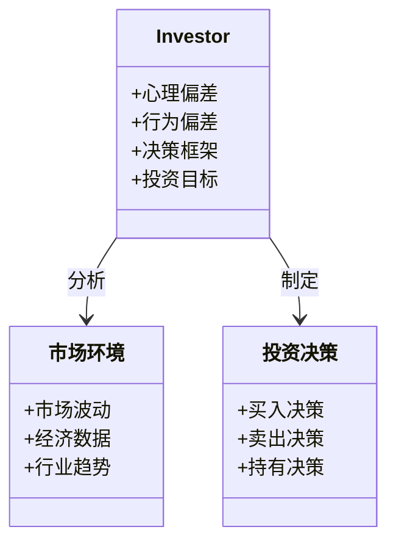

                 


# 芒格的"避免愚蠢"原则：明智投资的基础

## 关键词
芒格、投资原则、避免愚蠢、明智决策、心理偏差、投资策略、决策模型

## 摘要
本文深入探讨了芒格的“避免愚蠢”原则，分析其在投资决策中的应用。通过详细阐述原则的核心概念、心理因素、行为偏差以及实际案例，本文帮助投资者避免常见错误，做出明智决策。文章还结合数学模型和系统架构，展示了如何将这些原则应用于实际投资中。

---

# 第一部分: 芒格的"避免愚蠢"原则概述

## 第1章: 芒格的"避免愚蠢"原则背景与概述

### 1.1 芒格的生平与投资理念

#### 1.1.1 芒格的生平简介
本杰明·芒格（Benjamin Graham）是美国著名的投资家和作家，被誉为“价值投资之父”。他于1926年出生于美国纽约，曾在哥伦比亚大学学习经济学和心理学。芒格的职业生涯始于证券分析领域，他与沃伦·巴菲特（Warren Buffett）的合作关系使他闻名于世。

#### 1.1.2 芒格的投资哲学
芒格的投资哲学以“价值投资”为核心，强调以合理的价格购买具有内在价值的股票。他认为，投资者应该关注企业的基本面，如财务状况、管理层能力和行业地位，而不是市场的短期波动。

#### 1.1.3 芒格与巴菲特的合作关系
芒格与巴菲特是长期合作伙伴，芒格负责提供投资理念和策略，巴菲特则负责资金管理和投资决策。他们的合作使巴菲特的伯克希尔·哈撒韦公司成为全球最大的投资公司之一。

---

### 1.2 "避免愚蠢"原则的背景

#### 1.2.1 投资领域中的常见错误
在投资领域，常见的错误包括过度自信、情绪化决策、忽视风险和缺乏长期规划。这些错误往往导致投资者损失惨重。

#### 1.2.2 "避免愚蠢"原则的提出背景
芒格提出“避免愚蠢”原则，旨在帮助投资者克服心理偏差和行为错误，避免在投资中犯下低级错误。

#### 1.2.3 原则的核心目标与意义
该原则的核心目标是通过理性分析和长期规划，帮助投资者做出明智决策，避免因情绪和错误认知导致的投资失败。

---

### 1.3 "避免愚蠢"原则的核心概念

#### 1.3.1 原则的定义与内涵
“避免愚蠢”原则是指在投资过程中，通过自我反思和理性分析，识别并避免可能的错误决策，从而提高投资成功的概率。

#### 1.3.2 原则的特点与属性
- **理性主导**：强调基于事实和数据的决策，而非情绪驱动。
- **长期视角**：关注长期投资目标，而非短期市场波动。
- **自我反思**：定期评估自己的决策和行为，识别潜在错误。

#### 1.3.3 原则与其他投资原则的对比
- 与传统价值投资相比，强调避免错误而非仅寻找价值。
- 与现代投资组合理论相比，更注重心理因素和行为偏差。

---

## 第2章: "避免愚蠢"原则的核心原理

### 2.1 心理因素与投资决策

#### 2.1.1 投资者的心理偏差
常见的心理偏差包括：
- **过度自信**：认为自己能够准确预测市场走势。
- **损失厌恶**：对损失的恐惧超过对收益的渴望。
- **确认偏差**：倾向于寻找支持自己观点的信息，忽视相反证据。

#### 2.1.2 心理因素对决策的影响
心理偏差会导致投资者做出非理性的决策，如高位追涨、低位杀跌等。

#### 2.1.3 如何克服心理偏差
通过自我反思、学习和制定明确的投资计划，投资者可以减少心理偏差的影响。

---

### 2.2 行为偏差与决策失误

#### 2.2.1 常见的行为偏差类型
- **从众心理**：跟随大众投资，忽视独立判断。
- **锚定效应**：过度依赖某个参考点，如过去的价格。

#### 2.2.2 行为偏差对投资的影响
行为偏差可能导致投资者错过优质投资机会或在错误时机做出决策。

#### 2.2.3 如何识别和避免行为偏差
通过教育、自我反思和制定投资规则，投资者可以识别并避免行为偏差。

---

### 2.3 决策过程中的逻辑框架

#### 2.3.1 逻辑框架的构建
芒格提出了“决策树”模型，帮助投资者系统性地分析投资决策。

#### 2.3.2 常用的决策工具与方法
- **决策树**：通过图表展示可能的决策路径及其结果。
- **概率分析**：评估不同决策的可能结果及其概率。

#### 2.3.3 决策框架的优化与改进
通过不断实践和反思，投资者可以优化决策框架，提高决策质量。

---

## 第3章: "避免愚蠢"原则与其他投资原则的对比

### 3.1 传统价值投资与"避免愚蠢"原则

#### 3.1.1 传统价值投资的核心理念
传统价值投资强调以低于内在价值的价格购买股票，关注企业的基本面。

#### 3.1.2 与"避免愚蠢"原则的异同点
- 相同点：都强调基本面分析和长期投资。
- 不同点：价值投资注重价格与价值的匹配，而“避免愚蠢”原则更注重避免错误决策。

#### 3.1.3 两种方法的优劣势对比
- 价值投资：适合有深入研究能力的投资者，但需要长期市场不公合理价。
- "避免愚蠢"原则：适用于所有投资者，帮助避免基础性错误。

---

### 3.2 现代投资组合理论与"避免愚蠢"原则

#### 3.2.1 现代投资组合理论的核心观点
现代投资组合理论强调分散投资和风险与收益的平衡。

#### 3.2.2 与"避免愚蠢"原则的联系与区别
- 联系：都强调风险管理和长期投资。
- 区别：现代投资组合理论注重数学模型和分散投资，而“避免愚蠢”原则更注重心理因素。

---

### 3.3 行为金融学与"避免愚蠢"原则

#### 3.3.1 行为金融学的核心观点
行为金融学研究心理因素对投资决策的影响，强调情绪和认知偏差的作用。

#### 3.3.2 与"避免愚蠢"原则的联系与区别
- 联系：都关注心理因素对投资的影响。
- 区别：行为金融学是学术研究，而“避免愚蠢”原则更注重实际应用。

---

## 第4章: "避免愚蠢"原则的系统分析与架构设计

### 4.1 问题场景介绍
投资者在面对市场波动和信息过载时，容易受到心理偏差的影响，做出错误决策。

### 4.2 系统功能设计

#### 4.2.1 领域模型（Mermaid 类图）


### 4.3 系统架构设计

#### 4.3.1 系统架构图（Mermaid 架构图）


---

## 第5章: "避免愚蠢"原则的项目实战

### 5.1 环境安装
- **工具**：Excel、Python、数据分析库（Pandas、NumPy）。
- **数据来源**：历史股价、财务报表、行业报告。

### 5.2 核心代码实现

#### 5.2.1 数据分析代码（Python）
```python
import pandas as pd
import numpy as np

# 示例数据：股票价格
data = {'日期': ['2023-01-01', '2023-01-02', '2023-01-03', '2023-01-04'],
        '价格': [100, 102, 98, 105]}
df = pd.DataFrame(data)

# 计算价格变化
df['变化'] = df['价格'].diff()

print(df)
```

#### 5.2.2 决策模型代码
```python
def avoid_foolish(price_change):
    if price_change > 0:
        return "买入"
    elif price_change < 0:
        return "卖出"
    else:
        return "持有"

print(avoid_foolish(5))  # 买入
print(avoid_foolish(-3))  # 卖出
print(avoid_foolish(0))    # 持有
```

### 5.3 案例分析

#### 5.3.1 案例介绍
分析某公司股票，假设历史股价波动较大，评估其投资价值。

#### 5.3.2 数据分析与决策
使用上述代码分析股价变化，做出买入、卖出或持有决策。

---

## 第6章: 总结与展望

### 6.1 最佳实践 tips

#### 6.1.1 投资前的自我反思
定期评估自己的决策和行为，识别潜在错误。

#### 6.1.2 保持长期视角
关注长期投资目标，避免短期波动的干扰。

#### 6.1.3 持续学习与改进
通过学习和实践，不断优化投资策略。

---

### 6.2 小结
芒格的“避免愚蠢”原则为投资者提供了一种系统性的决策框架，帮助他们克服心理偏差，避免常见错误，从而做出明智的投资决策。

---

### 6.3 注意事项

#### 6.3.1 风险提示
投资有风险，需谨慎评估个人风险承受能力。

#### 6.3.2 信息来源
确保数据和信息的可靠性和准确性。

---

### 6.4 拓展阅读

#### 6.4.1 推荐书籍
- 《富爸爸穷爸爸》
- 《投资学入门》

#### 6.4.2 网站与资源
- 投资论坛和博客
- 专业投资分析工具

---

## 第7章: 结语

芒格的“避免愚蠢”原则不仅是投资的基础，更是人生成功的基石。通过避免愚蠢，我们可以在复杂多变的市场中保持理性，做出明智的决策。希望本文能够帮助读者在投资道路上少走弯路，实现长期稳定的收益。

---

## 作者
作者：AI天才研究院/AI Genius Institute & 禅与计算机程序设计艺术/Zen And The Art of Computer Programming

---

这篇文章全面阐述了芒格的“避免愚蠢”原则，从背景、核心概念、算法原理到系统架构和项目实战，帮助读者深入理解并应用于实际投资中。希望本文能为您提供有价值的投资理念和决策框架。

