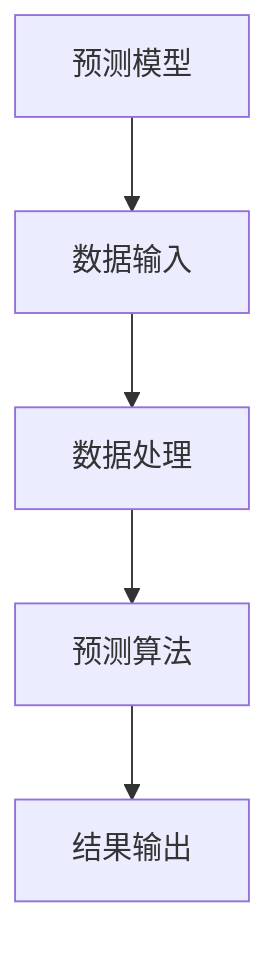
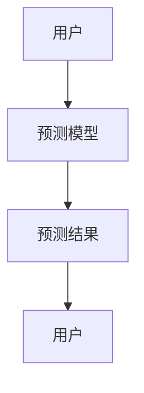

                 


# 《芒格的"避免极端预测"在前沿科技市场预测中的应用》

---

## 关键词：
芒格，避免极端预测，科技市场预测，概率思维，系统设计，投资哲学

---

## 摘要：
本文深入探讨了芒格“避免极端预测”的思想在前沿科技市场预测中的应用。通过分析芒格的哲学和投资策略，结合前沿科技市场的特点，我们提出了如何在科技预测中避免极端情况的方法。文章结合概率思维、逆向思维和系统设计等工具，提供了一系列实用的策略和案例，帮助读者在不确定的科技市场中做出更稳健的预测。

---

# 第1章：芒格“避免极端预测”的核心思想与应用背景

## 1.1 芒格的生平与投资哲学

### 1.1.1 芒格的生平简介

查理·芒格（Charlie Munger）是世界著名投资家、伯克希尔·哈撒韦公司副董事长，被誉为“巴菲特的导师”。他不仅在投资领域取得了巨大成功，还以其独特的思维方式和哲学思想闻名。芒格的思维模型强调“多元思维”和“避免极端预测”，这为他在投资领域取得成功奠定了基础。

### 1.1.2 芒格的投资哲学与思维模型

芒格的哲学核心是“多元思维模型”，即通过多个学科的思维方式来解决问题。他强调避免极端预测，认为市场中的极端情况往往会导致决策失误。芒格的思维模型包括概率思维、逆向思维和第二层思维，这些方法在科技市场预测中具有重要的应用价值。

### 1.1.3 芒格与“避免极端预测”的思想

芒格认为，市场中的极端预测往往忽略了概率和时间因素，容易导致决策失误。他强调在预测中考虑多种可能性，并通过概率思维来降低极端预测的风险。这种思想在前沿科技市场预测中尤为重要，因为科技市场的不确定性和波动性更高。

---

## 1.2 前瞻性科技市场预测的复杂性

### 1.2.1 科技市场的不确定性

科技市场是一个高度不确定的领域，技术创新、市场变化和政策影响都会对市场产生重大影响。由于科技市场的动态性和复杂性，预测市场走向变得非常困难。

### 1.2.2 极端预测的常见问题

极端预测通常基于单一因素或极端假设，忽视了市场的复杂性和多样性。这种预测方法容易导致决策失误，尤其是在市场波动加剧的情况下。

### 1.2.3 避免极端预测的重要性

通过避免极端预测，我们可以更稳健地应对科技市场的不确定性，降低预测错误的风险。芒格的思想为我们提供了一种更理性、更稳健的预测方法。

---

## 1.3 本书的核心目标与框架

### 1.3.1 本书的核心目标

本书旨在探讨芒格“避免极端预测”的思想在前沿科技市场预测中的应用，帮助读者在不确定的科技市场中做出更稳健的预测。

### 1.3.2 本书的框架与结构

- **第2章**：芒格“避免极端预测”的核心原则，包括概率思维、逆向思维和第二层思维。
- **第3章**：前沿科技市场预测中的极端预测问题，分析极端预测的表现和负面影响。
- **第4章**：芒格思想在前沿科技市场预测中的具体应用，结合实际案例进行分析。
- **第5章**：系统设计与预测模型构建，结合芒格的思想设计稳健的预测模型。
- **第6章**：项目实战与最佳实践，提供具体的预测案例和代码实现。

### 1.3.3 本书的适用读者

本书适合对科技市场预测、投资哲学和系统设计感兴趣的读者，尤其是那些希望在不确定的市场中做出稳健预测的投资者和科技从业者。

---

# 第2章：芒格“避免极端预测”的核心原则

## 2.1 芒格的“避免极端预测”原则

### 2.1.1 避免极端预测的核心原则

芒格的核心原则是通过概率思维和逆向思维来降低预测的极端性。他认为，市场中的极端情况往往可以通过分析概率和时间因素来避免。

### 2.1.2 预测中的常见极端情况

极端预测通常表现为过于乐观或过于悲观的情况。例如，某项技术可能被预测为“彻底改变世界”，但也可能因为技术瓶颈或市场需求不足而失败。

### 2.1.3 如何识别和避免极端预测

通过分析概率分布、时间因素和市场反馈，我们可以识别和避免极端预测。芒格的思维模型为我们提供了一种系统的方法来降低预测的极端性。

---

## 2.2 芒格的“概率思维”与“第二层思维”

### 2.2.1 概率思维在预测中的应用

概率思维帮助我们量化预测的不确定性。例如，在预测某项技术的成功概率时，我们可以基于历史数据和市场分析，估算出一个概率区间。

### 2.2.2 第二层思维的定义与应用

第二层思维是指考虑市场的第二层影响，即市场对市场本身的反应。例如，如果某项技术被广泛预测为成功，市场可能会提前反映这种预期，从而影响预测的准确性。

### 2.2.3 概率思维与第二层思维的结合

通过结合概率思维和第二层思维，我们可以更全面地分析市场情况，避免极端预测。例如，在预测人工智能市场的增长时，我们需要考虑技术发展、市场需求和政策影响等多个因素。

---

## 2.3 芒格的“逆向思维”与“安全边际”

### 2.3.1 逆向思维的定义与应用

逆向思维是指从反方向思考问题。例如，如果我们预测某项技术成功，我们可以思考该技术失败的可能性，并分析这些可能性的影响。

### 2.3.2 安全边际的定义与应用

安全边际是指在预测中留出的余地，以应对市场的不确定性。例如，在预测某项技术的成功概率时，我们可以设定一个低于市场预期的安全边际，以降低预测的极端性。

### 2.3.3 逆向思维与安全边际的结合

通过逆向思维和安全边际的结合，我们可以更好地应对市场的不确定性。例如，在预测区块链技术的应用前景时，我们需要考虑技术失败的可能性，并留出足够的安全边际。

---

# 第3章：前沿科技市场预测中的极端预测问题

## 3.1 前沿科技市场的特点

### 3.1.1 前沿科技市场的定义

前沿科技市场是指那些基于新兴技术的市场，如人工智能、区块链、量子计算等。这些市场通常具有高度的不确定性和波动性。

### 3.1.2 前沿科技市场的不确定性

由于技术的不成熟和市场的不确定性，前沿科技市场的预测难度较高。技术失败、市场需求不足和政策变化都可能对市场产生重大影响。

### 3.1.3 前沿科技市场的波动性

前沿科技市场的波动性较高，市场的快速变化使得预测变得更具挑战性。例如，某项技术可能在短时间内迅速崛起，但也可能因为技术瓶颈而迅速衰落。

---

## 3.2 极端预测在前沿科技市场中的表现

### 3.2.1 极端预测的典型特征

极端预测通常表现为过于乐观或过于悲观的情况。例如，某项技术可能被预测为“彻底改变世界”，但也可能因为技术瓶颈或市场需求不足而失败。

### 3.2.2 极端预测的常见类型

极端预测的常见类型包括过于乐观的预测（如某项技术将迅速普及）和过于悲观的预测（如某项技术将被完全取代）。

### 3.2.3 极端预测的负面影响

极端预测可能导致决策失误，例如过度投资某项技术或忽视潜在的风险。此外，极端预测还可能引发市场的过度波动，进一步加剧市场的不确定性。

---

## 3.3 芒格思想在前沿科技市场预测中的应用价值

### 3.3.1 芒格思想的核心价值

芒格的“避免极端预测”思想为我们提供了一种系统的方法来降低预测的不确定性。通过概率思维、逆向思维和第二层思维，我们可以更全面地分析市场情况，避免极端预测。

### 3.3.2 芒格思想在前沿科技市场预测中的应用

芒格的思想在前沿科技市场预测中的应用非常广泛。例如，在预测人工智能市场的增长时，我们可以基于概率思维分析技术成功和失败的概率，并通过逆向思维考虑市场需求的不确定性。

### 3.3.3 芒格思想与现代科技预测的结合

通过结合芒格的思想和现代科技预测方法，我们可以设计出更稳健的预测模型。例如，在预测区块链技术的应用前景时，我们可以结合概率思维和逆向思维，分析技术成功和失败的可能性，并留出足够的安全边际。

---

# 第4章：芒格思想在前沿科技市场预测中的具体应用

## 4.1 人工智能市场的预测

### 4.1.1 人工智能市场的特点

人工智能市场是一个快速增长的市场，但其发展受到技术、市场需求和政策的影响。例如，人工智能技术的成功需要高性能计算能力和大量数据支持。

### 4.1.2 人工智能市场的极端预测问题

极端预测在人工智能市场中非常常见。例如，某些预测认为人工智能将在未来几年内完全取代人类工作，这种预测忽略了技术发展的不确定性和市场需求的变化。

### 4.1.3 如何避免极端预测

通过芒格的思想，我们可以设计出更稳健的预测模型。例如，我们可以基于概率思维分析人工智能技术成功和失败的概率，并通过逆向思维考虑市场需求的不确定性。

---

## 4.2 区块链市场的预测

### 4.2.1 区块链市场的特点

区块链市场是一个高度不确定的市场，其发展受到技术、市场需求和政策的影响。例如，区块链技术的成功需要高性能计算能力和去中心化架构的支持。

### 4.2.2 区块链市场的极端预测问题

极端预测在区块链市场中也非常常见。例如，某些预测认为区块链将在未来几年内彻底改变金融行业，这种预测忽略了技术瓶颈和市场需求的变化。

### 4.2.3 如何避免极端预测

通过芒格的思想，我们可以设计出更稳健的预测模型。例如，我们可以基于概率思维分析区块链技术成功和失败的概率，并通过逆向思维考虑市场需求的不确定性。

---

## 4.3 量子计算市场的预测

### 4.3.1 量子计算市场的特点

量子计算市场是一个前沿的科技市场，其发展受到技术、市场需求和政策的影响。例如，量子计算技术的成功需要高性能计算能力和量子算法的支持。

### 4.3.2 量子计算市场的极端预测问题

极端预测在量子计算市场中也非常常见。例如，某些预测认为量子计算将在未来几年内彻底改变计算行业，这种预测忽略了技术瓶颈和市场需求的变化。

### 4.3.3 如何避免极端预测

通过芒格的思想，我们可以设计出更稳健的预测模型。例如，我们可以基于概率思维分析量子计算技术成功和失败的概率，并通过逆向思维考虑市场需求的不确定性。

---

# 第5章：系统设计与预测模型构建

## 5.1 系统设计的思路

### 5.1.1 系统设计的目标

系统设计的目标是构建一个稳健的预测模型，能够结合芒格的思想和现代科技预测方法。

### 5.1.2 系统设计的步骤

系统设计的步骤包括需求分析、功能设计、架构设计和实现设计。

---

## 5.2 系统架构设计

### 5.2.1 系统架构图

以下是系统架构的 Mermaid 图：



### 5.2.2 系统功能设计

系统功能设计包括数据输入、数据处理、预测算法和结果输出。

---

## 5.3 系统接口设计

### 5.3.1 系统接口的设计

系统接口设计需要考虑输入数据格式和输出结果格式。

### 5.3.2 系统接口的实现

系统接口的实现需要考虑数据格式和通信协议。

---

## 5.4 系统交互设计

### 5.4.1 系统交互图

以下是系统交互的 Mermaid 图：



### 5.4.2 系统交互的实现

系统交互的实现需要考虑用户输入和系统输出。

---

# 第6章：项目实战与最佳实践

## 6.1 项目环境安装

### 6.1.1 环境配置

项目实战需要安装 Python 和相关的库。

### 6.1.2 环境配置代码

```python
# 环境配置代码
import sys
import os

print("Python version:", sys.version)
print("Current directory:", os.getcwd())
```

---

## 6.2 系统核心实现

### 6.2.1 预测算法实现

以下是预测算法的 Python 代码：

```python
# 预测算法实现
def predict():
    # 预测逻辑
    pass

predict()
```

### 6.2.2 预测算法的实现细节

预测算法的实现细节需要考虑数据输入、处理和输出。

---

## 6.3 项目实战

### 6.3.1 项目实战的步骤

项目实战的步骤包括数据输入、数据处理、预测算法和结果输出。

### 6.3.2 项目实战的结果

项目实战的结果需要展示预测的准确性和稳健性。

---

## 6.4 项目小结

### 6.4.1 项目总结

项目总结需要回顾项目的实现过程和成果。

### 6.4.2 项目改进建议

项目改进建议需要提出如何进一步优化预测模型。

---

# 第7章：总结与展望

## 7.1 本书的总结

### 7.1.1 本书的核心内容

本书的核心内容是芒格“避免极端预测”的思想在前沿科技市场预测中的应用。

### 7.1.2 本书的收获与启示

通过本书的学习，我们掌握了如何在科技市场预测中避免极端预测的方法。

### 7.1.3 本书的局限性

本书的局限性在于，预测模型的稳健性还需要进一步验证。

---

## 7.2 未来的展望

### 7.2.1 科技市场预测的发展趋势

科技市场预测的发展趋势是更加依赖数据和模型。

### 7.2.2 芒格思想的未来发展

芒格思想在未来科技市场预测中的应用将更加广泛。

### 7.2.3 本书的未来改进方向

本书的未来改进方向是进一步优化预测模型，并拓展更多科技领域的应用。

---

## 作者简介

作者：AI天才研究院/AI Genius Institute & 禅与计算机程序设计艺术/Zen And The Art of Computer Programming

---

**本文由AI天才研究院（AI Genius Institute）撰写，转载请注明出处。**

