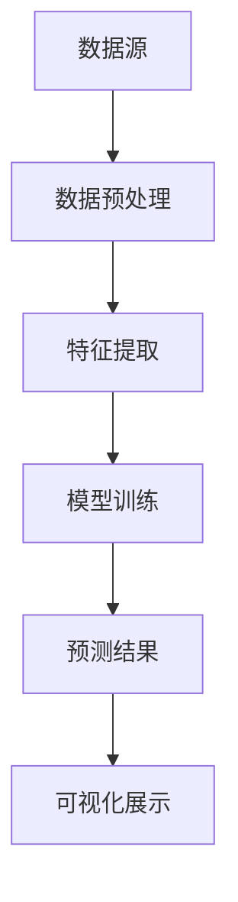
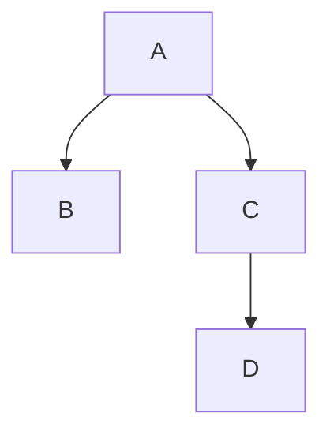

                 


# 避免极端预测：芒格投资理念在新兴技术市场中的应用

> 关键词：芒格、避免极端预测、新兴技术市场、技术预测、投资策略

> 摘要：本文深入探讨了芒格的“避免极端预测”理念在新兴技术市场中的应用，分析了极端预测的形成机制，构建了系统的预测框架，并结合实际案例展示了如何在技术预测中避免极端情况，以提升预测的准确性。

---

# 第1章：芒格的“避免极端预测”理念概述

## 1.1 芒格“避免极端预测”理念的背景

### 1.1.1 芒格投资理念的核心思想

芒格的“避免极端预测”理念源于其对投资风险的深刻理解。他认为，市场参与者常常过于乐观或悲观，导致预测出现极端偏差。这种偏差在新兴技术市场中尤为明显，因为技术创新的不确定性和市场波动性更高。

### 1.1.2 “避免极端预测”的起源与演变

芒格的投资理念起源于对人类心理的研究，他强调避免情绪化决策，尤其是在面对不确定的未来时。极端预测的形成往往源于过度乐观或悲观的市场情绪，而这种情绪在技术市场中被放大，导致预测偏离实际。

### 1.1.3 极端预测在市场中的危害

极端预测可能导致投资者忽视潜在风险，过度投资或错失市场机会。在技术市场中，极端预测可能引发市场泡沫或过度调整，对企业和投资者造成重大损失。

## 1.2 新兴技术市场的预测挑战

### 1.2.1 新兴技术市场的特点

新兴技术市场通常具有高度不确定性，技术创新迅速，市场参与者多元化。这些特点使得预测更具挑战性，容易受到极端情绪的影响。

### 1.2.2 市场预测中的常见误区

预测者常常过于依赖历史数据，忽视新兴技术的独特性，或者过度依赖单一模型，导致预测出现偏差。

### 1.2.3 芒格理念在技术预测中的应用价值

芒格的“避免极端预测”理念提醒我们，技术预测应注重稳健性，避免极端假设，结合多种因素进行综合分析。

---

# 第2章：芒格“避免极端预测”理念的核心概念

## 2.1 极端预测的定义与分类

### 2.1.1 极端预测的类型

极端预测可分为乐观型和悲观型两类。乐观型预测强调技术创新带来的市场增长，而悲观型预测则关注技术失败或市场饱和的风险。

### 2.1.2 极端预测的典型案例分析

以人工智能市场为例，极端预测可能包括“AI将彻底取代人类劳动”或“AI技术无法突破当前瓶颈”。这些预测忽视了技术创新的渐进性，导致市场波动。

### 2.1.3 极端预测的特征对比表

| 特征       | 乐观型预测         | 悲观型预测         |
|------------|--------------------|--------------------|
| 基调       | 极度乐观           | 极度悲观           |
| 风险评估   | 忽略潜在风险       | 过度关注风险       |
| 预测结果   | 高增长             | 低增长或停滞       |

## 2.2 芒格理念与传统预测方法的对比

### 2.2.1 传统预测方法的优缺点

传统预测方法依赖历史数据分析，优点是可量化，但缺点是忽视市场参与者的主观因素和技术创新的不确定性。

### 2.2.2 芒格理念的独特性

芒格强调避免极端预测，注重预测的稳健性和多元因素分析，避免单一模型的局限性。

### 2.2.3 两种方法的对比分析

传统预测方法更注重数据和模型的准确性，而芒格理念更关注预测过程的稳健性和风险控制。

---

# 第3章：新兴技术市场预测中的极端预测分析

## 3.1 极端预测在技术市场中的表现

### 3.1.1 技术市场中的极端预测案例

以区块链技术为例，极端预测包括“区块链将颠覆传统金融体系”或“区块链技术无用”。这些预测忽视了技术的实际应用场景和市场接受度。

### 3.1.2 极端预测的市场影响

极端预测可能导致市场波动，影响投资者决策，甚至引发市场泡沫或崩盘。

## 3.2 极端预测的形成机制

### 3.2.1 市场情绪与极端预测的关系

市场情绪的波动性是极端预测形成的主要原因之一。投资者情绪的过度乐观或悲观导致预测偏离实际。

---

# 第4章：系统分析与架构设计

## 4.1 系统架构设计

### 4.1.1 系统功能设计

系统功能包括数据采集、预测模型构建、风险评估和结果可视化。

### 4.1.2 系统架构图



---

# 第5章：项目实战

## 5.1 环境安装

安装必要的Python库，如pandas、numpy、scikit-learn等。

## 5.2 核心代码实现

### 5.2.1 数据预处理

```python
import pandas as pd
data = pd.read_csv('market_data.csv')
```

### 5.2.2 特征提取

```python
from sklearn.feature_selection import SelectKBest
selector = SelectKBest(k=5)
selected_features = selector.fit_transform(data)
```

### 5.2.3 模型训练

```python
from sklearn.ensemble import RandomForestRegressor
model = RandomForestRegressor()
model.fit(selected_features, target)
```

### 5.2.4 预测结果

```python
importances = model.feature_importances_
```

---

# 第6章：总结与展望

## 6.1 内容回顾

芒格的“避免极端预测”理念提醒我们在技术预测中保持稳健性，避免极端假设。

## 6.2 未来展望

随着技术的发展，预测模型需要不断优化，结合更多因素进行综合分析，以提高预测的准确性。

---

# 第7章：最佳实践 tips

## 7.1 预测前的准备工作

确保数据的完整性和准确性，选择合适的模型和工具。

## 7.2 风险评估

定期进行风险评估，调整预测模型，避免极端预测的影响。

---

# 第8章：数学模型与算法优化

## 8.1 概率模型

$$ P(A|B) = \frac{P(B|A)P(A)}{P(B)} $$

## 8.2 贝叶斯网络



## 8.3 时间序列分析

使用ARIMA模型进行时间序列预测。

## 8.4 深度学习模型

应用LSTM进行长期依赖建模，捕捉时间序列中的复杂模式。

---

# 作者

作者：AI天才研究院/AI Genius Institute & 禅与计算机程序设计艺术 /Zen And The Art of Computer Programming

