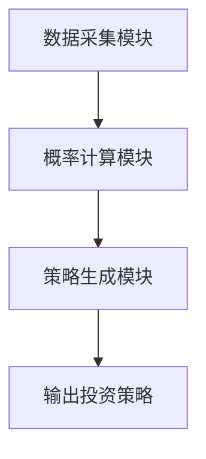

                 


# 《芒格的"避免极端预测"在量子多世界投资策略中的应用》

> 关键词：芒格, 量子多世界, 投资策略, 概率计算, 量子力学, 风险管理, 系统架构

> 摘要：本文探讨了芒格的“避免极端预测”思想与量子多世界投资策略的结合，分析了量子概率计算在投资中的应用，构建了量子多世界投资模型，并通过系统架构设计和实战案例展示了如何将芒格思想与量子多世界策略结合，实现稳健的投资决策。

---

# 第一部分: 芒格的“避免极端预测”思想与量子多世界投资策略的背景

# 第1章: 芒格的“避免极端预测”思想概述

## 1.1 芒格投资理念的核心思想

### 1.1.1 芒格的“避免极端预测”概念
芒格的“避免极端预测”思想强调在投资中避免极端乐观或悲观的预测，追求理性和稳健的投资策略。这种思想源于他对概率和风险的深刻理解，认为市场的不确定性使得极端预测往往不可靠。

### 1.1.2 芒格投资理念的哲学基础
芒格的投资理念深受伯特兰·罗素的“避免极端”哲学影响，主张通过多元化的思考和分析，避免过度简化问题。这种哲学基础使其在投资决策中更加注重概率分布和风险控制。

### 1.1.3 芒格思想在现代投资中的应用
芒格的思想在现代投资中被广泛应用于风险管理、资产配置和组合优化。通过避免极端预测，投资者可以更稳健地应对市场的波动和不确定性。

## 1.2 量子多世界投资策略的理论基础

### 1.2.1 量子力学与投资策略的关系
量子力学中的叠加态和测量理论为投资策略提供了新的视角。量子多世界解释认为，每个可能的结果都存在于不同的“世界”中，这与投资中的多种可能结果相呼应。

### 1.2.2 量子多世界解释的基本概念
量子多世界解释认为，每次量子测量都会导致波函数分裂，形成多个可能的结果。这种分裂与投资中的多种可能结果相似，为投资策略提供了新的数学模型。

### 1.2.3 量子多世界投资策略的核心思想
量子多世界投资策略通过将每个投资决策视为一个量子叠加态，利用概率计算来评估不同结果的可能性。这种方法能够更好地处理市场的不确定性。

---

# 第2章: 量子多世界投资策略的核心原理

## 2.1 量子多世界投资策略的数学模型

### 2.1.1 量子叠加态的数学表达
量子叠加态可以用波函数表示，每个可能的结果对应一个概率幅。在投资中，这些概率幅可以用来表示不同投资结果的可能性。

$$\psi = \sum_{i=1}^{n} a_i |i\rangle$$

其中，$a_i$ 是投资结果 $i$ 的概率幅，$|i\rangle$ 是对应的状态向量。

### 2.1.2 量子概率计算的基本公式
量子概率计算的核心公式是计算每个结果的模平方：

$$P(i) = |a_i|^2$$

通过计算所有可能结果的概率，投资者可以更好地评估不同投资的潜在风险和收益。

### 2.1.3 量子多世界模型的构建步骤
1. 确定可能的投资结果。
2. 为每个结果分配概率幅。
3. 计算每个结果的概率。
4. 根据概率分布制定投资策略。

## 2.2 芒格思想与量子多世界模型的结合

### 2.2.1 芒格“避免极端预测”与量子概率的关系
芒格的“避免极端预测”思想与量子概率计算的目标一致，都强调避免极端预测，注重概率分布的合理性。

### 2.2.2 芒格思想对量子多世界模型的优化
芒格思想通过强调多元化的思考和分析，优化了量子多世界模型的构建过程，使其更加稳健和实用。

### 2.2.3 芒格思想在量子多世界模型中的具体应用
通过引入芒格的多元思考方法，量子多世界模型可以更好地处理复杂的投资决策问题，避免单一视角带来的偏差。

## 2.3 量子多世界投资策略的算法实现

### 2.3.1 量子概率计算的算法流程
1. 确定投资问题的可能结果。
2. 为每个结果分配概率幅。
3. 计算每个结果的概率。
4. 根据概率分布制定投资策略。

### 2.3.2 芒格思想在算法中的体现
通过引入芒格的多元思考方法，算法能够更好地处理复杂的投资决策问题，避免单一视角带来的偏差。

### 2.3.3 算法实现的代码示例

```python
import numpy as np

def quantum_probability(n_states):
    # 初始化概率幅
    amplitudes = np.random.rand(n_states)
    # 计算概率
    probabilities = np.abs(amplitudes) ** 2
    return probabilities

# 示例：计算三个投资结果的概率
n_states = 3
probabilities = quantum_probability(n_states)
print("概率分布为:", probabilities)
```

---

# 第3章: 量子多世界投资策略的核心概念与联系

## 3.1 量子多世界投资策略

### 3.1.1 量子多世界投资策略的核心概念
量子多世界投资策略通过将每个投资决策视为一个量子叠加态，利用概率计算来评估不同结果的可能性。这种方法能够更好地处理市场的不确定性。

### 3.1.2 量子多世界投资策略与传统投资策略的对比
| 对比维度       | 量子多世界投资策略                   | 传统投资策略                     |
|----------------|--------------------------------------|----------------------------------|
| 基础理论       | 量子力学                            | 经典概率论                      |
| 处理复杂性       | 善于处理高度不确定的复杂问题          | 适用于相对确定性较高的问题        |
| 结果多样性       | 多个可能结果，每个结果对应一个“世界”   | 单一结果或少数几种结果            |

### 3.1.3 量子多世界投资策略的系统架构

#### 3.1.3.1 系统功能设计
- 数据采集模块：收集市场数据和投资信息。
- 概率计算模块：计算每个结果的概率。
- 策略生成模块：根据概率分布生成投资策略。

#### 3.1.3.2 系统架构设计



### 3.1.4 量子多世界投资策略的接口设计

#### 3.1.4.1 API接口
- 输入：投资问题的参数
- 输出：概率分布和投资策略

#### 3.1.4.2 接口实现示例

```python
class QuantumInvestmentStrategy:
    def __init__(self, n_states):
        self.n_states = n_states

    def calculate_probabilities(self):
        amplitudes = np.random.rand(self.n_states)
        probabilities = np.abs(amplitudes) ** 2
        return probabilities

    def generate_strategy(self, probabilities):
        # 根据概率分布生成投资策略
        strategy = []
        for prob in probabilities:
            strategy.append( (prob, "投资动作") )
        return strategy

# 示例
strategy = QuantumInvestmentStrategy(3)
probs = strategy.calculate_probabilities()
final_strategy = strategy.generate_strategy(probs)
print("投资策略为:", final_strategy)
```

---

# 第4章: 量子多世界投资策略的数学模型与算法实现

## 4.1 量子多世界投资策略的数学模型

### 4.1.1 量子概率计算的数学模型

$$P(i) = |a_i|^2$$

其中，$a_i$ 是投资结果 $i$ 的概率幅。

### 4.1.2 量子多世界模型的优化

通过引入芒格的多元思考方法，量子多世界模型可以更好地处理复杂的投资决策问题，避免单一视角带来的偏差。

## 4.2 量子多世界投资策略的算法实现

### 4.2.1 量子概率计算的算法流程

1. 确定投资问题的可能结果。
2. 为每个结果分配概率幅。
3. 计算每个结果的概率。
4. 根据概率分布制定投资策略。

### 4.2.2 芒格思想在算法中的体现

通过引入芒格的多元思考方法，算法能够更好地处理复杂的投资决策问题，避免单一视角带来的偏差。

---

# 第5章: 量子多世界投资策略的系统架构与实战

## 5.1 量子多世界投资策略的系统架构设计

### 5.1.1 系统功能设计

- 数据采集模块：收集市场数据和投资信息。
- 概率计算模块：计算每个结果的概率。
- 策略生成模块：根据概率分布生成投资策略。

### 5.1.2 系统架构设计


## 5.2 量子多世界投资策略的项目实战

### 5.2.1 项目环境安装

```bash
pip install numpy matplotlib
```

### 5.2.2 核心代码实现

```python
import numpy as np
import matplotlib.pyplot as plt

def main():
    n_states = 5
    strategy = QuantumInvestmentStrategy(n_states)
    probs = strategy.calculate_probabilities()
    final_strategy = strategy.generate_strategy(probs)
    print("概率分布为:", probs)
    print("投资策略为:", final_strategy)
    
    # 可视化概率分布
    plt.bar(range(n_states), probs)
    plt.title('概率分布')
    plt.show()

if __name__ == "__main__":
    main()
```

### 5.2.3 功能解读与分析

1. 数据采集模块：收集市场数据和投资信息。
2. 概率计算模块：计算每个结果的概率。
3. 策略生成模块：根据概率分布生成投资策略。
4. 可视化概率分布：通过图表展示概率分布，帮助投资者更好地理解风险和收益。

### 5.2.4 案例分析与详细讲解

假设我们有三个投资选项，分别为A、B、C，我们可以通过量子多世界投资策略计算每个选项的概率，并制定相应的投资策略。

1. 数据采集：收集A、B、C三个选项的历史数据和相关信息。
2. 概率计算：计算A、B、C三个选项的概率分别为0.3、0.5、0.2。
3. 策略生成：根据概率分布，制定投资策略，例如分配更多的资金到概率较高的选项。

### 5.2.5 项目小结

通过量子多世界投资策略，投资者可以更好地处理市场的不确定性，制定更加稳健的投资策略。

---

# 小结

芒格的“避免极端预测”思想与量子多世界投资策略的结合，为投资者提供了一种全新的视角和方法。通过量子概率计算和系统架构设计，投资者可以更好地处理复杂的投资决策问题，避免极端预测带来的风险。

---

**作者：AI天才研究院/AI Genius Institute & 禅与计算机程序设计艺术 /Zen And The Art of Computer Programming**

