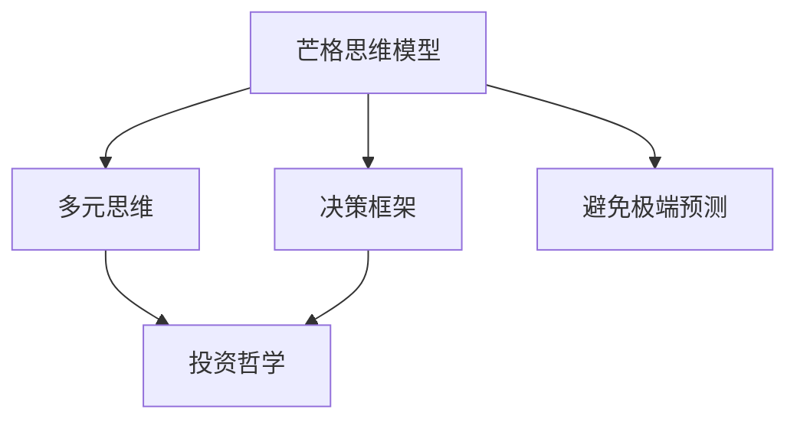
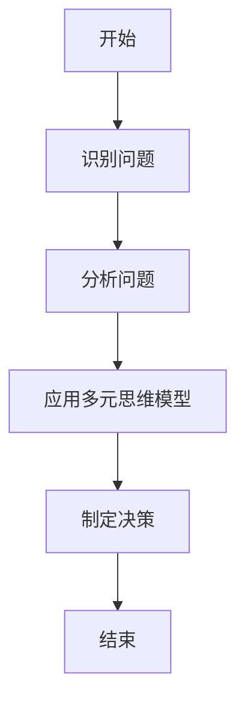
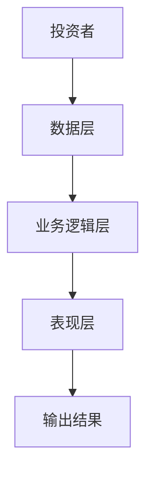
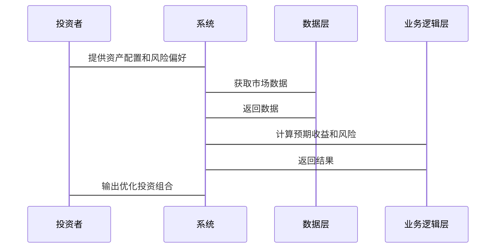

                 


# 目录大纲：《芒格的"避免极端预测"：保持投资预期的理性》

---

## 第一部分：背景介绍

### 第1章：芒格投资理念的背景与核心问题

#### 1.1 芒格的生平与投资哲学
- 1.1.1 芮格的生平简介
  - 早期生活与教育背景
  - 职业生涯与投资成就
- 1.1.2 芮格的投资哲学与思维模型
  - 多元思维模型的核心理念
  - 独特的决策框架与投资策略

#### 1.2 投资中的极端预测问题
- 1.2.1 极端预测的定义与特征
  - 极端预测的类型（市场崩盘、股灾等）
  - 如何识别潜在的极端预测
- 1.2.2 极端预测对投资决策的影响
  - 投资者心理偏差与行为偏差
  - 极端预测导致的投资失误案例分析
- 1.2.3 芮格对极端预测的批判与解决方案
  - 批判极端预测的逻辑与方法
  - 如何通过理性预期避免极端预测

---

## 第二部分：核心概念与联系

### 第2章：芒格的思维模型与决策框架

#### 2.1 多元思维模型
- 2.1.1 多元思维模型的定义与特点
  - 多元思维模型的定义
  - 多元思维模型的优势（全面性、交叉性）
- 2.1.2 多元思维模型在投资决策中的应用
  - 通过多学科视角分析投资问题
  - 结合心理学、经济学等学科进行决策
- 2.1.3 多元思维模型与其他投资方法的对比
  - 传统技术分析与基本面分析的局限性
  - 多元思维模型的综合优势

#### 2.2 芮格的决策框架
- 2.2.1 决策框架的核心要素
  - 信息收集与处理
  - 风险评估与控制
  - 投资组合优化
- 2.2.2 决策框架的逻辑结构
  - 信息输入、处理、输出的流程
  - 各阶段的关键步骤与注意事项
- 2.2.3 决策框架的优缺点分析
  - 优点：系统性、全面性
  - 缺点：复杂性、时间成本高

#### 2.3 芮格思维模型的ER实体关系图


---

## 第三部分：算法原理讲解

### 第3章：芒格方法论的算法原理

#### 3.1 芮格方法论的逻辑步骤
- 3.1.1 问题识别与分析
  - 识别潜在风险因素
  - 分析问题的多维度影响
- 3.1.2 多元思维模型的应用
  - 跨学科分析问题的本质
  - 综合不同视角得出结论
- 3.1.3 决策框架的实施
  - 设定决策准则与优先级
  - 执行决策并监控结果

#### 3.2 芮格方法论的流程图


---

## 第四部分：数学模型与公式

### 第4章：芒格方法论的数学模型

#### 4.1 投资预期的理性模型
- 4.1.1 投资预期的期望值公式
  $$ E[X] = \sum_{i=1}^{n} P_i X_i $$
  - 解释：期望值的计算方法，各可能结果及其概率的加权和
- 4.1.2 投资风险的方差公式
  $$ \text{Var}(X) = E[(X - E[X])^2] $$
  - 解释：方差衡量结果与期望值的偏离程度

#### 4.2 芮格方法论的数学应用
- 4.2.1 投资组合优化的数学模型
  $$ \text{最大化 } E[R] - \lambda \text{Var}(R) $$
  - 解释：通过调整λ来平衡期望收益与风险
- 4.2.2 风险调整后的收益计算
  $$ R_{\text{adj}} = R - \text{风险溢价} $$
  - 解释：调整收益以反映承担的风险

---

## 第五部分：系统分析与架构设计

### 第5章：投资决策系统的架构设计

#### 5.1 问题场景介绍
- 投资决策系统的应用场景
- 系统目标：帮助投资者避免极端预测，实现理性投资

#### 5.2 系统功能设计
- 领域模型Mermaid类图


#### 5.3 系统架构设计
- Mermaid架构图


#### 5.4 系统接口设计
- 输入接口：接收投资者的资产配置和风险偏好
- 输出接口：提供优化的投资组合和风险评估

#### 5.5 系统交互Mermaid序列图


---

## 第六部分：项目实战

### 第6章：芒格方法论的实际应用

#### 6.1 环境安装
- 安装必要的软件和工具
  - Python编程环境（如Jupyter Notebook）
  - 数据分析库（Pandas、NumPy）

#### 6.2 核心实现源代码
```python
import numpy as np
import pandas as pd

def expected_return(returns):
    return np.mean(returns)

def variance(returns):
    return np.var(returns)

# 示例数据
returns = [0.1, 0.2, 0.05, 0.15, 0.25]

print(f"期望回报率：{expected_return(returns)}")
print(f"回报率方差：{variance(returns)}")
```

#### 6.3 代码应用解读与分析
- 代码功能：
  - 计算投资回报的期望值和方差
- 分析结果：
  - 期望值反映了平均回报，方差反映了回报的波动性

#### 6.4 实际案例分析
- 案例：假设某股票的历史回报率为5%、7%、3%、6%，计算其期望回报和方差
  - 期望回报：5.25%
  - 方差：0.002125

#### 6.5 项目小结
- 芮格方法论在实际投资中的应用价值
- 关键点：通过理性预期避免极端预测

---

## 第七部分：总结与展望

### 第7章：总结与展望

#### 7.1 最佳实践 tips
- 投资者应保持理性，避免极端预测
- 多元思维模型是实现理性决策的关键
- 持续学习和优化投资策略

#### 7.2 小结
- 芮格方法论的核心理念
- 理性预期在投资中的重要性

#### 7.3 注意事项
- 投资者应结合自身情况调整策略
- 风险管理是投资成功的关键

#### 7.4 拓展阅读
- 推荐书籍：《穷查理宝典》
- 推荐文章：芒格的“反脆弱”投资理念

---

## 作者：AI天才研究院 & 禅与计算机程序设计艺术

