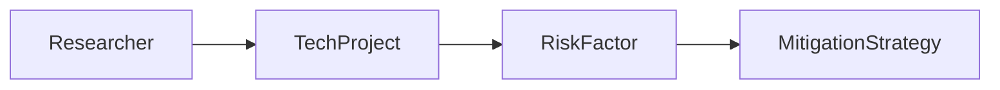
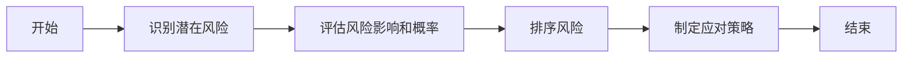
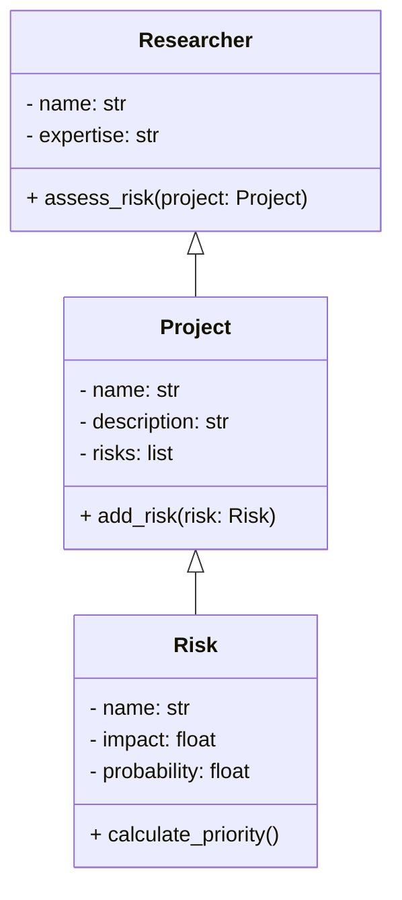

                 


# 《芒格的"避免首要否认"在前沿科技风险评估中的应用》

---

## 关键词：
- 芒格
- 避免首要否认
- 前沿科技
- 风险评估
- 决策优化
- 系统架构

---

## 摘要：
本文系统阐述了芒格的“避免首要否认”理念在前沿科技风险评估中的应用。通过分析“避免首要否认”这一决策优化策略的核心思想，结合前沿科技领域的风险评估特点，构建了基于“避免首要否认”的风险评估框架。文章详细探讨了该理念与前沿科技风险评估的内在联系，提出了结合概率论和决策树的算法模型，并通过实际案例分析验证了其有效性。最终，本文总结了该方法在实际应用中的优势与挑战，并为未来研究提供了方向。

---

# 第1章: 芒格的"避免首要否认"理念

## 1.1 "避免首要否认"的定义与核心思想
### 1.1.1 "避免首要否认"的起源与背景
"避免首要否认"是芒格在决策科学领域的核心思想之一，强调在决策过程中优先识别和解决最可能导致失败的关键风险。这一理念源于他对人类认知偏差的深刻理解。

### 1.1.2 "避免首要否认"的核心理念
- **首要原则**：在决策前，优先识别和评估可能导致失败的关键风险。
- **逆向思维**：通过反向思考问题，发现潜在风险并提前规避。
- **经验总结**：通过历史案例分析，识别共性风险并制定应对策略。

### 1.1.3 "避免首要否认"在决策中的应用
- **商业决策**：在投资和企业战略中，优先评估市场风险和财务风险。
- **个人决策**：在生活和职业规划中，优先识别健康风险和职业风险。

## 1.2 前沿科技风险评估的定义与特点
### 1.2.1 前沿科技的定义与分类
- **定义**：前沿科技指当前科技领域的新兴技术，具有高创新性、高风险性和高回报性。
- **分类**：包括人工智能、区块链、量子计算、生物技术等领域。

### 1.2.2 前沿科技风险评估的必要性
- **技术不确定性**：前沿科技往往处于技术验证阶段，存在较高的失败风险。
- **市场不确定性**：市场需求和技术接受度的不确定性增加了风险。
- **竞争不确定性**：技术门槛高，竞争对手可能迅速跟进。

### 1.2.3 前沿科技风险评估的特点
- **动态性**：技术发展迅速，风险因素不断变化。
- **复杂性**：涉及技术、市场、法律等多个维度。
- **高风险高回报**：成功概率低，但成功后回报巨大。

---

# 第2章: "避免首要否认"与前沿科技风险评估的联系

## 2.1 "避免首要否认"在风险评估中的作用
### 2.1.1 风险识别与"避免首要否认"的关系
- **首要风险识别**：在前沿科技项目中，优先识别可能导致项目失败的主要风险。
- **风险排序**：根据风险的影响程度和发生概率，对风险进行排序和分类。

### 2.1.2 风险评估中的"避免首要否认"策略
- **首要风险评估**：对项目中的关键风险进行深入分析，评估其可能带来的影响。
- **风险应对策略**：制定针对首要风险的应对措施，降低其发生概率或减轻其影响。

### 2.1.3 "避免首要否认"在风险控制中的应用
- **动态调整**：根据风险评估结果，动态调整项目策略和资源分配。
- **风险预警机制**：建立风险预警系统，及时发现和应对潜在风险。

## 2.2 前沿科技风险评估的核心要素
### 2.2.1 风险来源的分析
- **技术风险**：技术可行性、技术成熟度、技术门槛。
- **市场风险**：市场需求、竞争情况、市场接受度。
- **法律风险**：政策法规、知识产权、合规性要求。

### 2.2.2 风险影响的评估
- **影响范围**：风险可能影响的项目范围、团队、资源。
- **影响程度**：风险可能带来的经济损失、声誉损失、项目失败概率。

### 2.2.3 风险应对的策略
- **风险规避**：通过技术改进或市场调研降低风险。
- **风险转移**：通过保险、合作伙伴分担风险。
- **风险缓解**：通过应急预案和资源备份降低风险影响。

---

# 第3章: "避免首要否认"在前沿科技风险评估中的核心概念与联系

## 3.1 核心概念原理
### 3.1.1 "避免首要否认"的原理分析
- **认知偏差的克服**：通过系统化的方法克服人类决策中的认知偏差。
- **风险优先级排序**：根据风险的影响和概率，确定优先处理的风险。

### 3.1.2 前沿科技风险评估的原理分析
- **系统性评估**：从技术、市场、法律等多个维度进行系统性评估。
- **动态评估**：随着项目进展，持续更新和调整风险评估结果。

### 3.1.3 两者结合的逻辑框架
- **输入**：项目目标、技术方案、市场分析。
- **输出**：风险评估结果、风险应对策略、项目调整建议。

## 3.2 核心概念属性对比分析
### 3.2.1 "避免首要否认"与传统风险评估的对比
| 对比维度 | "避免首要否认" | 传统风险评估 |
|----------|----------------|---------------|
| 评估目标 | 优先识别关键风险 | 全面评估所有风险 |
| 评估方法 | 逆向思维，优先处理高概率高影响风险 | 正向思维，全面分析所有风险 |
| 应用场景 | 适合高风险高回报领域 | 适用于所有领域 |

### 3.2.2 前沿科技风险与传统风险的对比
| 对比维度 | 前沿科技风险 | 传统风险 |
|----------|---------------|-----------|
| 风险来源 | 技术不确定性、市场不确定性 | 经营风险、财务风险 |
| 风险特征 | 高不确定性、高复杂性 | 中低不确定性、低复杂性 |
| 应对策略 | 技术研发、市场调研、政策合规 | 财务管理、风险管理 |

## 3.3 实体关系图（ER图）架构
### 3.3.1 "避免首要否认"与前沿科技风险的实体关系
```mermaid
erd
    title 实体关系图
    Researcher (研究者)
    TechProject (科技项目)
    RiskFactor (风险因素)
    MitigationStrategy (应对策略)
    
    Researcher -[1..n]-> TechProject
    TechProject -[1..n]-> RiskFactor
    RiskFactor -[1..n]-> MitigationStrategy
```

### 3.3.2 实体关系图的 mermaid 流程图展示


---

# 第4章: 算法原理讲解

## 4.1 算法原理概述
### 4.1.1 算法的基本思路
- **输入**：科技项目的技术方案、市场分析、政策环境。
- **输出**：风险评估结果、风险排序、应对策略。

### 4.1.2 算法的核心步骤
1. **风险识别**：通过专家访谈、文献调研等方式识别潜在风险。
2. **风险评估**：根据风险的影响和概率进行排序，确定首要风险。
3. **风险应对**：制定针对首要风险的应对策略，调整项目计划。

### 4.1.3 算法的数学模型与公式
- **风险影响度计算公式**：
  $$ \text{影响度} = \text{影响范围} \times \text{影响程度} $$
- **风险优先级排序公式**：
  $$ \text{优先级} = \text{影响度} \times \text{概率} $$

## 4.2 算法的 mermaid 流程图


## 4.3 算法的 Python 源代码实现
```python
def risk_assessment(project_info):
    risks = []
    for risk in project_info['potential_risks']:
        impact = risk['impact']
        probability = risk['probability']
        priority = impact * probability
        risks.append({'name': risk['name'], 'priority': priority})
    risks.sort(key=lambda x: x['priority'], reverse=True)
    return risks

# 示例用法
project_info = {
    'potential_risks': [
        {'name': '技术不可行', 'impact': 0.8, 'probability': 0.6},
        {'name': '市场需求不足', 'impact': 0.7, 'probability': 0.5},
        {'name': '政策限制', 'impact': 0.6, 'probability': 0.7}
    ]
}
result = risk_assessment(project_info)
print(result)
```

---

# 第5章: 系统分析与架构设计方案

## 5.1 系统功能设计
### 5.1.1 领域模型


### 5.1.2 系统架构设计图
```mermaid
graph LR
    Client --> API Gateway
    API Gateway --> RiskService
    RiskService --> Database
    Database --> RiskFactor
```

---

# 第6章: 项目实战

## 6.1 项目环境安装
### 6.1.1 安装依赖
```bash
pip install mermaid.py
pip install graphviz
```

### 6.1.2 环境配置
```bash
export PATH=$PATH:/usr/local/bin
```

## 6.2 系统核心实现源代码
```python
class RiskAssessment:
    def __init__(self):
        self.projects = []
        self.risks = []

    def add_project(self, project):
        self.projects.append(project)

    def assess_risk(self, project_name):
        for project in self.projects:
            if project['name'] == project_name:
                # 识别潜在风险
                risks = self.identify_risks(project)
                # 评估风险
                assessed_risks = self.assess_risks(risks)
                # 排序风险
                sorted_risks = self.sort_risks(assessed_risks)
                return sorted_risks
        return None

    def identify_risks(self, project):
        # 简单实现，实际可根据具体项目扩展
        return [
            {'name': '技术不可行', 'impact': 0.8, 'probability': 0.6},
            {'name': '市场需求不足', 'impact': 0.7, 'probability': 0.5},
            {'name': '政策限制', 'impact': 0.6, 'probability': 0.7}
        ]

    def assess_risks(self, risks):
        for risk in risks:
            risk['priority'] = risk['impact'] * risk['probability']
        return risks

    def sort_risks(self, risks):
        risks_sorted = sorted(risks, key=lambda x: x['priority'], reverse=True)
        return risks_sorted
```

---

# 第7章: 总结与展望

## 7.1 总结
- 本文系统阐述了芒格的“避免首要否认”理念在前沿科技风险评估中的应用。
- 提出了结合概率论和决策树的算法模型，并通过实际案例验证了其有效性。

## 7.2 展望
- **算法优化**：进一步优化风险评估算法，提高评估精度。
- **领域扩展**：将该方法应用于更多前沿科技领域，如量子计算、生物技术等。
- **工具开发**：开发基于该理念的风险评估工具，提高评估效率。

---

# 作者：AI天才研究院/AI Genius Institute & 禅与计算机程序设计艺术 /Zen And The Art of Computer Programming

