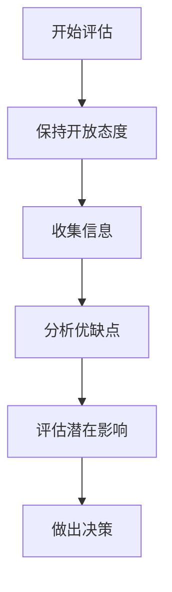
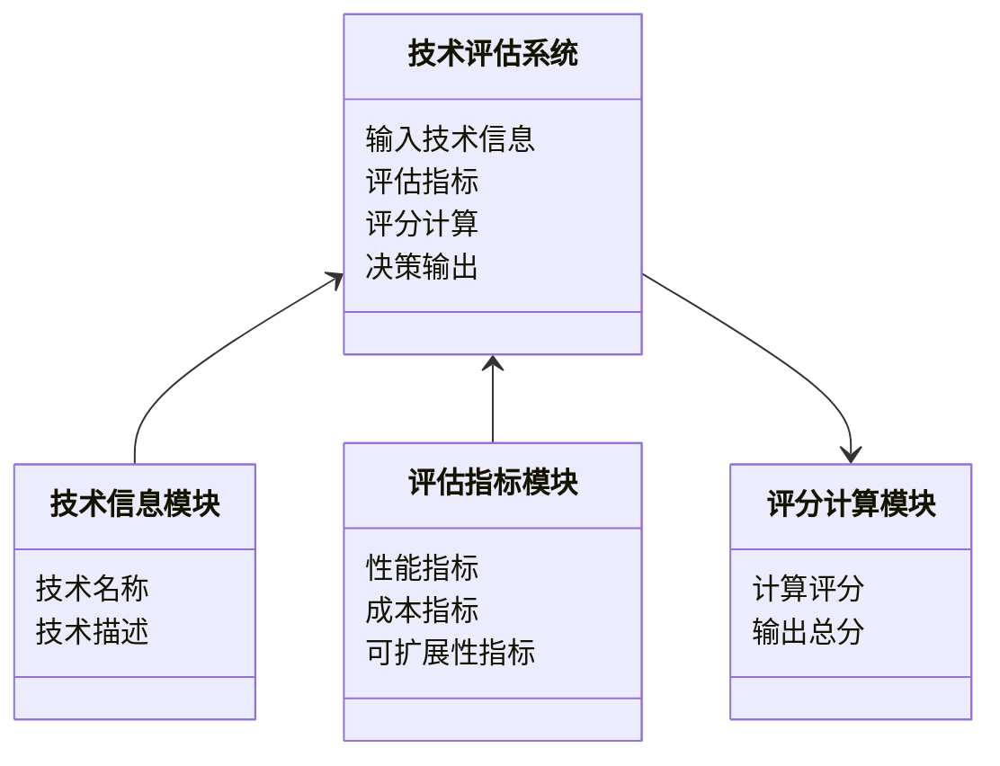
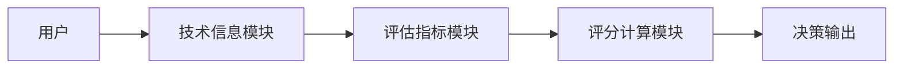
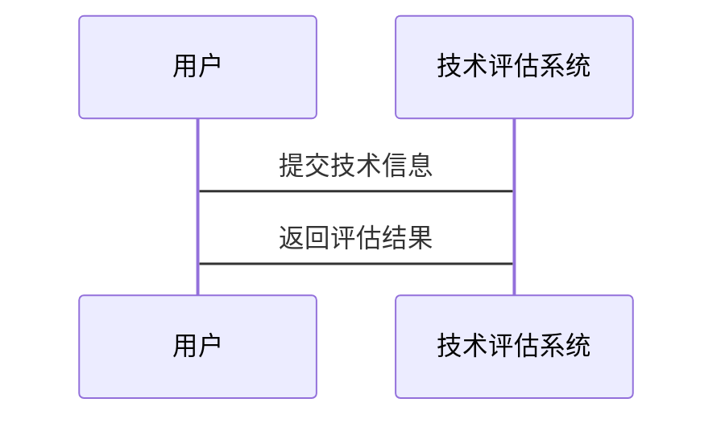

                 


# 芒格的"避免首要否认"在新技术评估中的重要性

## 关键词：芒格，新技术评估，避免首要否认，技术决策，理性分析，系统设计

## 摘要：本文探讨了芒格的“避免首要否认”原则在新技术评估中的应用，通过逻辑分析和实际案例，展示了如何避免拒绝新技术的可能性，保持开放态度，理性评估新技术的价值和潜在影响，帮助做出更明智的技术决策。

---

# 芒格的"避免首要否认"在新技术评估中的重要性

## 第一部分：背景介绍

### 第1章：芒格的“避免首要否认”概述

#### 1.1 芒格的“避免首要否认”概念

- **定义**：芒格的“避免首要否认”是指在面对新技术或新方法时，首先要避免拒绝接受的可能性，保持开放态度，理性评估其价值和潜在影响。

- **起源与发展**：这一原则源自芒格的决策理念，强调在决策过程中避免先入为主的否定态度，保持开放性和灵活性。

- **应用背景**：在快速变化的技术领域，新技术层出不穷，如何避免因拒绝接受新技术而导致的机会成本，是技术评估中的关键问题。

#### 1.2 技术评估中的问题背景

- **常见问题**：技术评估中常出现的误区包括：过于依赖经验、忽视潜在优势、过度关注缺点等。

- **挑战**：新技术可能带来颠覆性变化，但评估者若先入为主，可能会错过潜在机会。

- **解决方案**：通过“避免首要否认”原则，保持开放态度，系统性评估新技术，避免因拒绝而错失良机。

---

## 第二部分：核心概念与联系

### 第2章：核心概念解析

#### 2.1 核心概念原理

- **对比分析**：与传统技术评估方法相比，“避免首要否认”强调开放性和系统性，而非先入为主的否定态度。

- **流程图展示**：通过Mermaid流程图展示评估过程中的关键步骤，强调从开放接受到理性评估的流程。



#### 2.2 对比分析表格

| 评估方法       | 传统方法                              | “避免首要否认”方法                      |
|----------------|--------------------------------------|------------------------------------------|
| 态度           | 先入为主，容易否定                   | 保持开放，系统评估                      |
| 步骤           | 快速判断，可能忽视细节               | 详细分析，全面评估                      |
| 结果           | 可能错失机会                         | 更优决策，减少误判                      |

---

## 第三部分：算法原理讲解

### 第3章：评估算法的数学模型

#### 3.1 算法原理

- **决策树模型**：通过构建决策树，分析新技术在不同情况下的表现，评估其可行性。

- **评分系统**：对新技术的各项指标进行评分，综合计算总分，辅助决策。

#### 3.2 数学模型与公式

- **概率论模型**：使用贝叶斯定理，评估新技术成功的概率。

$$ P(成功|证据) = \frac{P(证据|成功) \cdot P(成功)}{P(证据)} $$

- **评分模型**：对新技术的性能、成本、可扩展性等指标进行评分，计算加权总分。

$$ 总分 = \sum (评分_i \cdot 权重_i) $$

---

## 第四部分：系统分析与架构设计

### 第4章：系统架构设计

#### 4.1 项目介绍

- **目标**：构建一个基于“避免首要否认”原则的新技术评估系统。

- **范围**：涵盖技术筛选、评估、决策等环节。

#### 4.2 系统功能设计

- **领域模型图**：展示系统的核心功能模块及其关系。



#### 4.3 系统架构设计

- **架构图**：展示系统的主要组件及其交互。



#### 4.4 接口与交互设计

- **交互流程图**：展示用户与系统之间的交互流程。



---

## 第五部分：项目实战

### 第5章：实际案例分析

#### 5.1 环境安装

- **工具安装**：安装必要的开发工具和环境，如Python、Jupyter Notebook等。

#### 5.2 核心代码实现

- **代码实现**：实现评分计算模块的代码示例。

```python
def calculate_score(criteria_scores):
    # 计算加权总分
    weights = [0.4, 0.3, 0.2, 0.1]
    total_score = 0
    for i in range(len(criteria_scores)):
        total_score += criteria_scores[i] * weights[i]
    return total_score

# 示例
criteria_scores = [9, 8, 7, 6]
print(calculate_score(criteria_scores))  # 输出总分
```

#### 5.3 案例分析与解读

- **案例分析**：以区块链技术为例，展示如何应用“避免首要否认”原则进行评估。

---

## 第六部分：最佳实践与总结

### 第6章：最佳实践与注意事项

#### 6.1 最佳实践技巧

- **保持开放态度**：避免先入为主的否定，全面评估新技术。
- **系统性分析**：结合数学模型和实际案例，确保评估的准确性。
- **持续学习**：技术发展迅速，保持学习，更新评估方法。

#### 6.2 小结

- 总结全文，强调“避免首要否认”的重要性，以及在实际应用中的效果。

#### 6.3 注意事项

- **避免过度依赖模型**：模型是工具，需结合实际情况使用。
- **持续监控与调整**：技术评估是一个动态过程，需持续监控和调整评估策略。

#### 6.4 拓展阅读

- 推荐相关书籍和资源，供读者深入学习。

---

## 作者信息

作者：AI天才研究院/AI Genius Institute & 禅与计算机程序设计艺术 /Zen And The Art of Computer Programming

---

通过以上结构，文章系统地探讨了芒格的“避免首要否认”原则在新技术评估中的应用，结合理论分析和实际案例，帮助读者理解如何在技术决策中保持开放和理性，做出更明智的选择。

