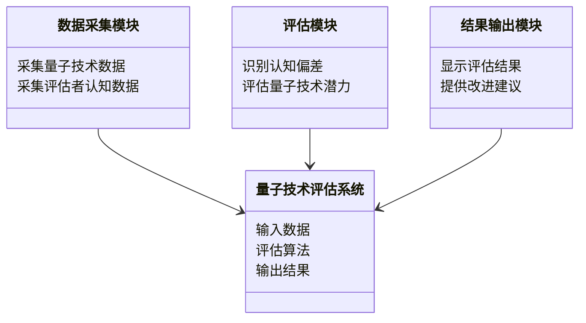
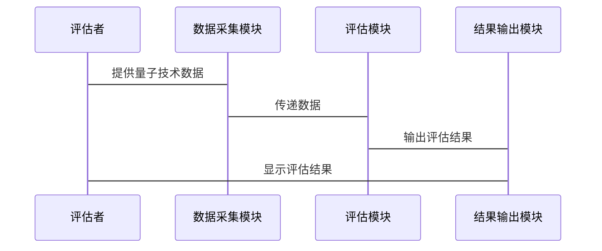

                 


# 《芒格的"避免首要否认"在量子技术颠覆性评估中的重要性》

**关键词：** 认知偏差、量子技术、颠覆性评估、系统架构、算法设计、项目实战、芒格思维

**摘要：**  
本文探讨了芒格的“避免首要否认”原则在量子技术颠覆性评估中的应用。通过分析认知偏差对技术评估的影响，结合量子技术的独特特性，提出了基于“避免首要否认”的评估框架和算法设计。文章从背景介绍、核心概念、系统架构到项目实战，全面阐述了如何在量子技术评估中克服认知偏差，确保评估的科学性和准确性。

---

## 第1章: 芒格的"避免首要否认"概述

### 1.1 "避免首要否认"的核心概念

#### 1.1.1 认知偏差的定义与分类

认知偏差是指人们在信息处理和决策过程中，由于主观因素的影响，导致对客观事实的曲解或误判。常见的认知偏差包括：

- **首因效应**：对首次接触的信息赋予过多权重。
- **证实性偏差**：倾向于寻找和确认已有的观点，忽视反面证据。
- **锚定效应**：对初始信息的过度依赖。

认知偏差是人类思维的自然产物，但它们可能影响技术评估的客观性。

#### 1.1.2 "避免首要否认"的内涵与外延

芒格的“避免首要否认”原则强调在决策过程中，主动识别和克服认知偏差，避免对新技术的首要否定态度。这一原则的核心在于：

- **认知重构**：通过主动反思和学习，调整思维方式。
- **信息处理优化**：在信息收集和处理过程中，保持开放和理性的态度。

#### 1.1.3 "避免首要否认"与量子技术评估的关系

量子技术的颠覆性特征使其容易受到认知偏差的影响。例如，传统技术从业者可能因惯性思维而低估量子技术的潜力。通过“避免首要否认”，可以减少这种偏差，提高评估的准确性。

---

### 1.2 量子技术的基本概念和颠覆性特征

#### 1.2.1 量子技术的定义与特点

量子技术基于量子力学原理，主要包括：

- **量子计算**：利用量子叠加和纠缠效应进行计算，计算速度远超经典计算机。
- **量子通信**：利用量子纠缠实现信息的超安全传输。
- **量子传感**：通过量子效应提高传感器的精度和灵敏度。

#### 1.2.2 量子技术的颠覆性特征

量子技术的颠覆性体现在以下几个方面：

- **计算能力的指数级提升**：量子计算机在某些领域（如密码破解、优化计算）的性能是经典计算机无法比拟的。
- **通信安全的革命性提升**：量子通信提供了理论上不可破解的通信安全。
- **传感精度的极限突破**：量子传感技术在测量精度上达到量子极限。

#### 1.2.3 量子技术的应用领域

量子技术在多个领域具有广泛的应用潜力，包括：

- **人工智能**：量子计算可以加速机器学习算法的训练。
- **医疗健康**：量子传感可用于疾病的早期诊断。
- **金融领域**：量子计算可以优化投资组合和风险管理。

---

## 第2章: "避免首要否认"在量子技术评估中的应用背景

### 2.1 量子技术颠覆性评估的必要性

#### 2.1.1 量子技术对传统技术的颠覆性影响

量子技术的出现可能对多个行业产生颠覆性影响。例如，量子计算的出现可能彻底改变密码学领域，使现有的加密算法失效。

#### 2.1.2 量子技术评估中的认知偏差问题

在量子技术评估中，常见的认知偏差包括：

- **证实性偏差**：评估者倾向于寻找支持自己已有观点的证据，忽视量子技术的潜在优势。
- **经验主义偏差**：基于传统技术的经验，低估量子技术的颠覆性。

#### 2.1.3 引入"避免首要否认"的必要性

为了准确评估量子技术的潜力，必须克服认知偏差。通过“避免首要否认”，评估者可以更客观地看待量子技术的优势和挑战。

---

### 2.2 传统技术评估方法的局限性

#### 2.2.1 传统技术评估的核心要素

传统技术评估通常包括以下几个方面：

- **技术可行性**：技术是否可行。
- **经济性**：技术的成本和收益。
- **社会影响**：技术对社会的潜在影响。

#### 2.2.2 传统评估方法在量子技术中的失效原因

量子技术的颠覆性特征使其难以用传统评估方法进行准确评估。例如，传统评估方法难以量化量子计算的指数级性能提升。

---

### 2.3 引入"避免首要否认"的必要性

#### 2.3.1 认知偏差对量子技术评估的影响

认知偏差可能导致评估者低估量子技术的潜力，或者过度夸大其风险。

#### 2.3.2 "避免首要否认"在量子技术评估中的作用

通过“避免首要否认”，评估者可以更客观地看待量子技术的优缺点，减少认知偏差的影响。

---

## 第3章: "避免首要否认"与量子技术评估的核心联系

### 3.1 认知偏差对量子技术评估的影响

#### 3.1.1 首要否认的定义与特征

首要否认是指对新技术的本能性否定态度。这种态度可能源于对现有技术的依赖或对变革的恐惧。

#### 3.1.2 首要否认在量子技术评估中的具体表现

在量子技术评估中，首要否认可能表现为：

- 对量子计算的怀疑态度。
- 对量子技术的潜在优势视而不见。

#### 3.1.3 认知重构的原理

认知重构是指通过主动学习和反思，调整原有的认知框架。在量子技术评估中，认知重构可以帮助评估者克服首要否认。

---

### 3.2 "避免首要否认"的核心机制

#### 3.2.1 认知重构的实现路径

认知重构可以通过以下步骤实现：

1. **识别偏差**：识别自己可能存在的认知偏差。
2. **反思**：反思自己的观点是否合理。
3. **学习**：通过学习新知识，调整原有的认知框架。

#### 3.2.2 信息处理的优化策略

信息处理的优化策略包括：

- **多角度分析**：从多个角度分析问题。
- **寻求专家意见**：参考专家的观点，避免片面性。

---

### 3.3 "避免首要否认"在量子技术评估中的具体应用

#### 3.3.1 量子技术颠覆性评估的框架

量子技术颠覆性评估框架包括以下几个步骤：

1. **识别潜在优势**：识别量子技术的潜在优势。
2. **评估技术可行性**：评估量子技术的可行性。
3. **分析社会影响**：分析量子技术对社会的潜在影响。

#### 3.3.2 "避免首要否认"在评估中的关键步骤

- **主动识别偏差**：在评估过程中，主动识别可能存在的认知偏差。
- **多角度分析**：从多个角度分析量子技术的优缺点。

---

## 第4章: 量子技术颠覆性评估的系统分析

### 4.1 量子技术颠覆性评估的系统模型

#### 4.1.1 评估系统的输入输出分析

评估系统的输入包括：

- 量子技术的核心参数。
- 评估者的认知状态。

评估系统的输出包括：

- 量子技术的颠覆性评分。
- 量子技术的潜在风险。

#### 4.1.2 评估系统的功能模块划分

评估系统可以划分为以下几个功能模块：

1. **数据采集模块**：采集量子技术的相关数据。
2. **评估模块**：对量子技术进行评估。
3. **结果输出模块**：输出评估结果。

---

### 4.2 系统架构设计

#### 4.2.1 分层架构的设计理念

系统架构采用分层设计，包括数据层、逻辑层和应用层。

#### 4.2.2 各模块之间的交互关系

数据层负责数据的存储和管理，逻辑层负责数据的处理和评估，应用层负责结果的输出和展示。

---

### 4.3 评估系统的实现方案

#### 4.3.1 数据采集与处理

数据采集包括量子技术的核心参数和评估者的认知状态。数据处理包括数据清洗和特征提取。

#### 4.3.2 评估算法的选择与实现

评估算法可以选择基于机器学习的方法，通过训练模型来预测量子技术的颠覆性潜力。

---

## 第5章: 基于"避免首要否认"的量子技术评估算法

### 5.1 算法原理概述

#### 5.1.1 算法的核心思想

算法的核心思想是通过主动识别和克服认知偏差，提高评估的准确性。

#### 5.1.2 算法的数学模型

算法的数学模型包括以下几个部分：

1. **认知偏差识别模型**：识别评估者可能存在的认知偏差。
2. **量子技术评估模型**：评估量子技术的颠覆性潜力。

---

### 5.2 算法实现步骤

#### 5.2.1 数据预处理

数据预处理包括数据清洗和特征提取。

#### 5.2.2 认知偏差的识别与纠正

通过分析评估者的认知状态，识别可能存在的认知偏差，并采取纠正措施。

---

### 5.3 算法的优化与改进

#### 5.3.1 参数调整的策略

参数调整的策略包括：

- **学习率调整**：根据评估结果调整学习率。
- **模型优化**：通过优化模型结构提高评估准确性。

#### 5.3.2 算法效率的提升方法

算法效率的提升方法包括：

- **并行计算**：利用并行计算加速算法的执行。
- **分布式计算**：利用分布式计算提高算法的处理能力。

---

## 第6章: 量子技术颠覆性评估的项目实战

### 6.1 项目背景与目标

#### 6.1.1 项目背景介绍

项目旨在通过“避免首要否认”的原则，评估量子技术的颠覆性潜力。

#### 6.1.2 项目目标

项目目标包括：

- 提供量子技术的颠覆性评估框架。
- 提供基于“避免首要否认”的评估算法。

---

### 6.2 系统功能设计

#### 6.2.1 领域模型（mermaid类图）



---

### 6.3 系统架构设计

#### 6.3.1 系统架构（mermaid架构图）

```mermaid
container 量子技术评估系统 {
    数据采集模块
    评估模块
    结果输出模块
}

数据采集模块 --> 评估模块
评估模块 --> 结果输出模块
```

---

### 6.4 系统交互设计

#### 6.4.1 系统交互（mermaid序列图）



---

## 第7章: 结论与展望

### 7.1 结论

通过本文的分析，我们可以得出以下结论：

- “避免首要否认”是量子技术评估的重要原则。
- 通过克服认知偏差，可以提高量子技术评估的准确性。

---

### 7.2 未来展望

未来的研究方向包括：

- 进一步优化量子技术评估算法。
- 研究“避免首要否认”在其他技术评估中的应用。

---

## 附录

### 附录A: 进一步阅读资料

- 《芒格的"避免首要否认"原则》
- 《量子技术的基本原理》

---

### 附录B: 工具推荐

- **量子技术评估工具**：推荐使用量子计算模拟软件。
- **认知偏差识别工具**：推荐使用认知偏差测试工具。

---

**作者：AI天才研究院/AI Genius Institute & 禅与计算机程序设计艺术 /Zen And The Art of Computer Programming**

