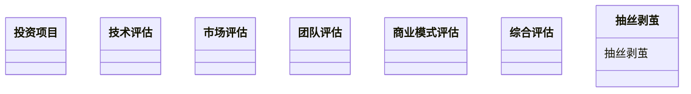
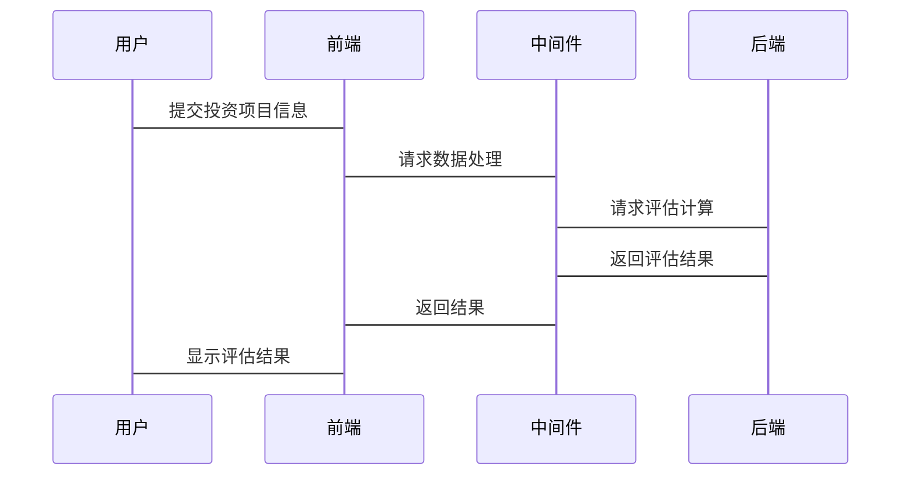

                 


# 《芒格的"铁锤人综合征"警示在跨维度科技投资中的应用》

## 关键词：芒格，铁锤人综合征，科技投资，跨维度分析，投资决策，认知偏差，风险管理

## 摘要：芒格的“铁锤人综合征”强调了投资者避免单一思维模式的重要性。本文从科技投资的角度，深入分析了“铁锤人综合征”的表现及其对投资决策的影响。通过构建多维度评估模型、系统架构设计和实际案例分析，本文展示了如何通过跨维度视角避免认知偏差，提升投资决策的质量。文章结合理论与实践，为科技投资者提供了规避“铁锤人综合征”的实用方法。

---

## 第1章：芒格的"铁锤人综合征"核心概念

### 1.1 "铁锤人综合征"的定义与背景

“铁锤人综合征”是指投资者在决策过程中，由于认知偏差和思维定式，倾向于使用单一的工具或方法来分析问题，导致决策失误。这一概念源自芒格对人类认知局限的深刻洞察。在科技投资领域，这种综合征的表现尤为明显，因为科技领域的快速变化和技术复杂性使得投资者容易陷入单一视角。

**问题背景**：科技投资涉及多个维度，包括技术、市场、团队、商业模式等。投资者若仅关注某一维度，容易忽略其他关键因素，导致决策失误。

**问题解决**：通过跨维度分析，投资者可以全面评估项目，避免单一思维模式。

### 1.2 "铁锤人综合征"的核心要素

#### 1.2.1 认知偏差的形成机制

认知偏差是“铁锤人综合征”的核心要素，主要由以下因素引起：

- **确认偏差**：投资者倾向于寻找支持自己假设的信息，忽略反面证据。
- **可得性偏差**：容易记住熟悉的信息，导致决策基于有限的数据。
- **从众心理**：受市场情绪影响，跟随大众决策。

#### 1.2.2 单一思维模式的特征与风险

- **特征**：投资者仅关注某一维度，如技术性能，而忽视市场潜力和团队能力。
- **风险**：可能导致误判，错失潜在风险或机会。

### 1.3 跨维度科技投资的定义与特点

#### 1.3.1 跨维度科技投资的定义

跨维度科技投资是指从技术、市场、团队、商业模式等多个维度全面评估投资项目，避免单一视角。

#### 1.3.2 跨维度科技投资的核心要素

- **技术评估**：评估技术的创新性和可行性。
- **市场评估**：分析市场规模和竞争环境。
- **团队评估**：考察团队的经验和能力。
- **商业模式评估**：评估商业模式的可行性和盈利能力。

#### 1.3.3 跨维度科技投资与传统投资的区别

- **传统投资**：通常关注财务指标和市场趋势。
- **跨维度科技投资**：全面评估技术、市场、团队等多维度因素。

### 1.4 本章小结

“铁锤人综合征”强调了避免单一思维模式的重要性，跨维度科技投资通过全面评估多个维度，帮助投资者做出更明智的决策。

---

## 第2章："铁锤人综合征"对科技投资的影响

### 2.1 科技投资中的认知偏差

#### 2.1.1 "铁锤人综合征"在科技投资中的具体表现

- **技术导向型决策**：仅关注技术性能，忽视市场潜力。
- **市场导向型决策**：过度关注市场趋势，忽视技术可行性。

#### 2.1.2 认知偏差对投资决策的影响

认知偏差可能导致投资者误判项目潜力，错失机会或承担更大风险。

### 2.2 科技投资中的思维定式

#### 2.2.1 单一技术视角的局限性

- **技术过于单一**：忽视市场需求和商业模式。
- **技术过时风险**：技术快速变化，单一技术可能迅速被淘汰。

#### 2.2.2 行业认知偏差对投资决策的干扰

- **行业偏见**：仅关注某一行业，忽视其他行业的潜在机会。
- **行业周期性**：忽视行业周期性变化，可能导致误判。

### 2.3 跨维度视角下的科技投资策略

#### 2.3.1 跨维度分析的必要性

- **全面评估**：确保投资者从多个维度全面评估项目。
- **风险分散**：通过跨维度分析，分散投资风险。

#### 2.3.2 多维度评估模型的构建

- **模型核心要素**：技术、市场、团队、商业模式。
- **评估标准**：每个维度的具体评估指标和权重。

### 2.4 本章小结

“铁锤人综合征”对科技投资的影响深远，跨维度视角是避免认知偏差的关键。

---

## 第3章：科技投资的多维度评估模型

### 3.1 多维度评估模型的构建

#### 3.1.1 模型的核心要素与维度划分

- **技术评估**：创新性、可行性。
- **市场评估**：市场规模、竞争环境。
- **团队评估**：经验、能力。
- **商业模式评估**：盈利模式、可行性。

#### 3.1.2 各维度的权重分配与评估标准

- **权重分配**：技术（30%）、市场（30%）、团队（20%）、商业模式（20%）。
- **评估标准**：每个维度的具体评分标准。

#### 3.1.3 模型的适用范围与限制

- **适用范围**：适用于早期科技项目评估。
- **限制**：模型需根据具体情况进行调整。

### 3.2 多维度评估模型的数学表达

#### 3.2.1 多维度加权评分模型

公式：
$$
\text{综合评分} = \sum (\text{各维度评分} \times \text{权重})
$$

---

## 第4章：系统分析与架构设计方案

### 4.1 系统设计背景

跨维度科技投资分析系统旨在帮助投资者全面评估项目。

### 4.2 领域模型构建

#### 4.2.1 领域模型（Mermaid 类图）



### 4.3 系统架构设计（Mermaid 架构图）


### 4.4 系统交互设计（Mermaid 序列图）



---

## 第5章：项目实战与案例分析

### 5.1 环境安装与系统核心实现

#### 5.1.1 Python 代码实现

```python
# 示例代码：多维度评估模型实现
def multi_dimensional_assessment(technology, market, team, business_model):
    weight_technology = 0.3
    weight_market = 0.3
    weight_team = 0.2
    weight_business_model = 0.2

    total_score = (technology * weight_technology) + (market * weight_market) + (team * weight_team) + (business_model * weight_business_model)
    return total_score

# 示例数据
technology_score = 80
market_score = 70
team_score = 90
business_model_score = 85

# 计算综合评分
total_score = multi_dimensional_assessment(technology_score, market_score, team_score, business_model_score)
print(f"综合评分：{total_score}")
```

---

## 第6章：总结与展望

### 6.1 本章总结

通过跨维度分析，投资者可以避免“铁锤人综合征”，做出更明智的投资决策。

### 6.2 未来展望

未来，科技投资将更加依赖跨维度分析和人工智能技术，进一步提升评估的准确性和效率。

---

## 作者：AI天才研究院 & 禅与计算机程序设计艺术

---

这篇文章通过理论分析、模型构建、系统设计和案例分析，全面探讨了芒格的“铁锤人综合征”在跨维度科技投资中的应用，帮助投资者避免认知偏差，提升投资决策的质量。

