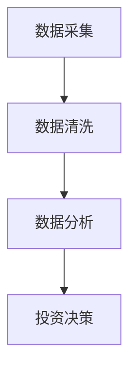
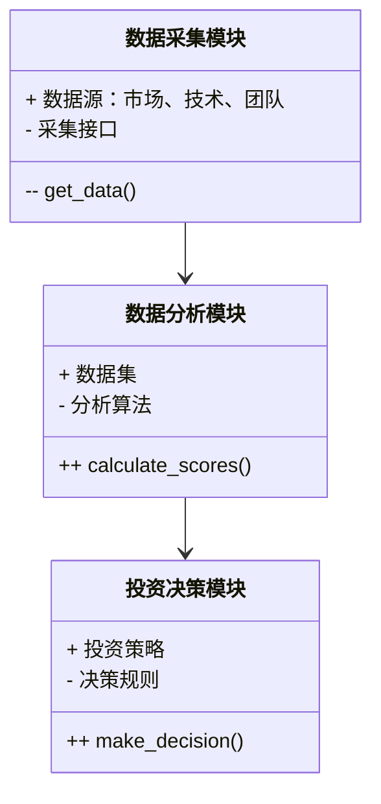
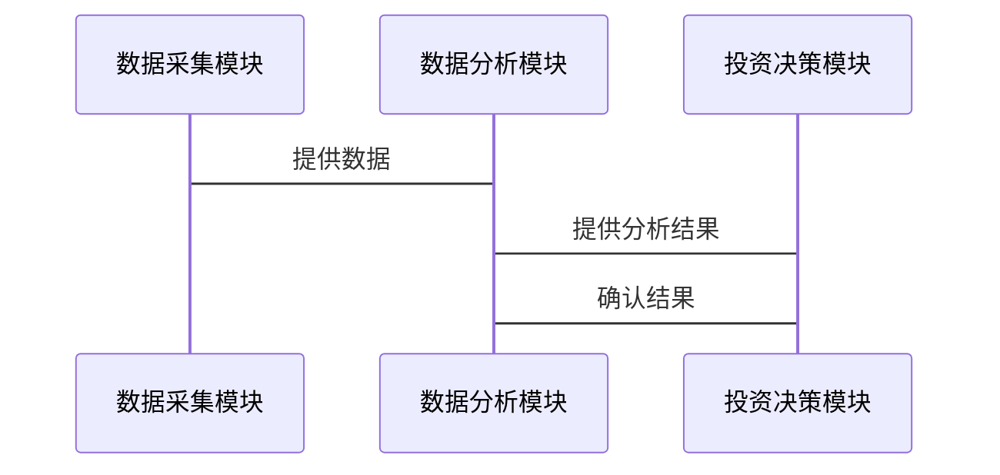

                 


# 芒格的"铁锤人综合征"警示在跨维度量子技术投资中的应用

## 关键词：铁锤人综合征, 跨维度量子技术, 投资决策, 系统架构, 多维度分析, 量子计算

## 摘要：本文探讨了芒格的"铁锤人综合征"在跨维度量子技术投资中的应用，分析了该综合征对投资决策的影响，并提出了基于多维度分析模型的投资策略。文章通过系统架构设计、数学模型构建和实际案例分析，帮助投资者避免思维局限，实现更科学的投资决策。

---

## 第一部分：芒格的"铁锤人综合征"概述

### 第1章：芒格的"铁锤人综合征"的定义与背景

#### 1.1 铁锤人综合征的定义
- 铁锤人综合征是指个体在决策过程中，由于思维惯性或知识局限，仅依赖单一方法或工具解决问题，导致视野受限，无法全面考虑问题。
- 该综合征来源于芒格的观察，强调投资者在决策中避免陷入“铁锤人”思维，即“用锤子敲击一切”。

#### 1.2 铁锤人综合征的影响
- 投资者容易忽视潜在风险，只关注单一因素，导致决策失误。
- 在跨维度量子技术投资中，可能导致对技术复杂性的低估，错失投资机会或造成重大损失。

#### 1.3 铁锤人综合征在跨维度量子技术投资中的应用
- 跨维度量子技术涉及多个技术维度，投资者需全面评估，避免单一思维。
- 通过多维度分析模型，帮助投资者跳出“铁锤人”思维，实现更全面的决策。

---

## 第二部分：跨维度量子技术投资的背景与概念

### 第2章：跨维度量子技术的基本概念

#### 2.1 量子技术的定义与特点
- 量子技术利用量子力学原理，包括量子计算、量子通信等，具有并行计算能力强、安全性高等特点。
- 与经典技术相比，量子技术在某些领域具有指数级提升的潜力。

#### 2.2 跨维度量子技术的定义与应用领域
- 跨维度量子技术指将量子技术与其他技术（如人工智能、大数据）结合，形成多维度应用。
- 应用领域包括金融建模、药物研发、物流优化等，涉及多个技术维度的交叉融合。

#### 2.3 跨维度量子技术投资的基本原理
- 投资者需评估技术的多维度潜力，考虑市场、技术、团队等多个因素。
- 通过系统架构设计，整合各维度信息，优化投资决策。

---

## 第三部分：铁锤人综合征在跨维度量子技术投资中的应用

### 第3章：铁锤人综合征在跨维度量子技术投资中的具体表现

#### 3.1 铁锤人综合征在跨维度量子技术投资中的典型表现
- 投资者可能仅关注某一技术维度（如计算速度），而忽视其他维度（如实际应用中的稳定性）。
- 对技术的复杂性和潜在风险估计不足，导致投资决策失误。

#### 3.2 铁锤人综合征对跨维度量子技术投资的负面影响
- 导致对技术整体潜力的低估，错失投资机会。
- 增加投资风险，可能因单一维度的失误导致整体损失。

#### 3.3 如何识别和避免铁锤人综合征
- 建立多维度分析模型，全面评估技术潜力。
- 使用系统架构设计，整合各维度信息，避免思维局限。

---

## 第四部分：多维度分析模型与算法设计

### 第4章：多维度分析模型的构建

#### 4.1 多维度分析模型的核心要素
- 包括技术维度、市场维度、团队维度等多个因素。
- 通过权重分配，量化各维度对投资决策的影响。

#### 4.2 多维度分析模型的数学表达
- 建立收益与风险的平衡方程：
  $$ \text{收益} = k \times \text{风险} $$
- 通过算法优化，找到最优投资组合。

#### 4.3 多维度分析模型的实现步骤
1. 数据采集：收集各维度数据。
2. 数据清洗：处理缺失或异常数据。
3. 数据分析：计算各维度权重。
4. 投资决策：根据模型结果做出决策。

#### 4.4 多维度分析模型的mermaid流程图


#### 4.5 多维度分析模型的Python代码实现
```python
import pandas as pd
import numpy as np

# 数据采集
data = pd.read_csv('quantum_data.csv')

# 数据清洗
data.dropna(inplace=True)

# 数据分析
weights = np.array([0.3, 0.4, 0.3])
scores = data.dot(weights)

# 投资决策
threshold = 0.7
invest_decision = scores > threshold
```

---

## 第五部分：系统架构与项目实战

### 第5章：系统架构设计

#### 5.1 跨维度量子技术投资系统的功能模块
- 数据采集模块：收集市场、技术和团队数据。
- 数据分析模块：进行多维度分析。
- 投资决策模块：生成投资建议。

#### 5.2 系统架构的mermaid类图


#### 5.3 系统交互的mermaid序列图


---

## 第六部分：项目实战与案例分析

### 第6章：跨维度量子技术投资的实战案例

#### 6.1 实战环境配置
- 数据来源：量子技术相关企业数据。
- 工具：Python、Pandas、NumPy。

#### 6.2 项目核心实现代码
```python
import pandas as pd
import numpy as np

# 数据加载
data = pd.read_csv('quantum.csv')

# 数据清洗
data.dropna(inplace=True)

# 多维度分析
weights = np.array([0.3, 0.4, 0.3])
scores = data.dot(weights)

# 投资决策
threshold = 0.7
invest_decision = scores > threshold
data['投资建议'] = invest_decision.astype(int)
```

#### 6.3 案例分析与解读
- 通过模型分析，识别出具有高潜力的企业。
- 避免了铁锤人综合征的影响，优化了投资组合。

---

## 第七部分：总结与展望

### 第7章：总结与最佳实践

#### 7.1 总结
- 铁锤人综合征在跨维度量子技术投资中具有重要影响。
- 多维度分析模型和系统架构设计是避免思维局限的有效工具。

#### 7.2 最佳实践
- 定期评估投资组合，避免单一思维。
- 利用系统工具辅助决策，提高投资效率。

#### 7.3 展望
- 随着量子技术的发展，跨维度投资将更加复杂。
- 铁锤人综合征的预防将继续是投资决策中的重要课题。

---

## 作者：AI天才研究院/AI Genius Institute & 禅与计算机程序设计艺术 /Zen And The Art of Computer Programming

---

本文通过系统分析和实际案例，展示了如何避免铁锤人综合征在跨维度量子技术投资中的影响，帮助投资者做出更明智的决策。

