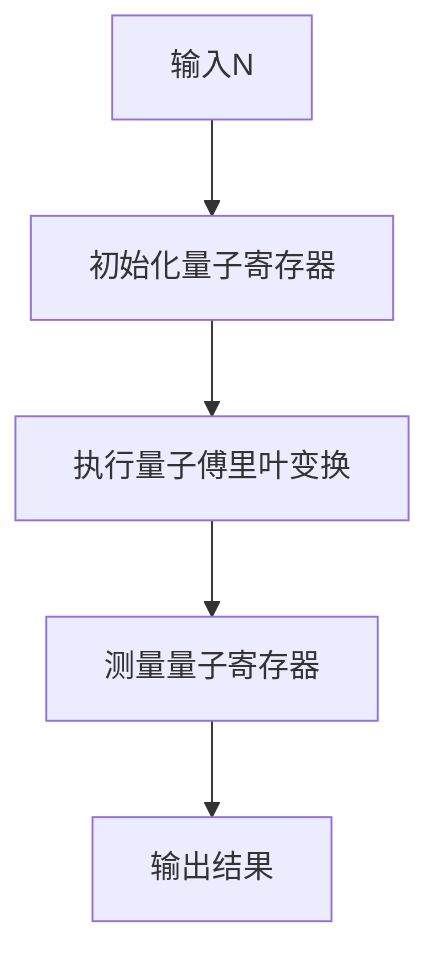
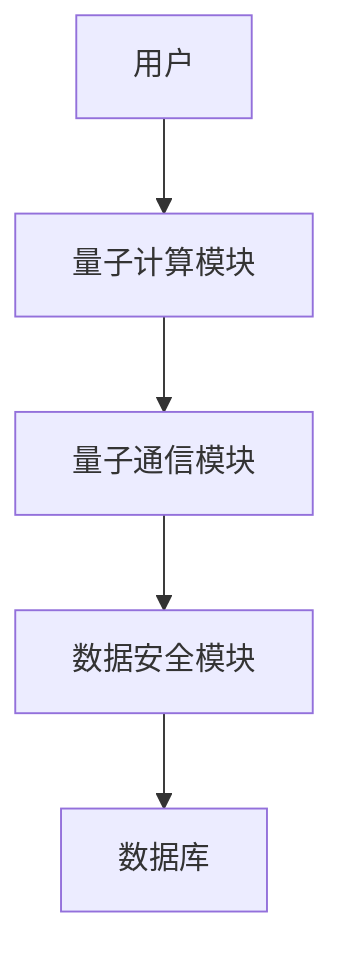

                 


# 芒格的"铁锤人综合征"警示在量子技术商业化中的应用

---

## 关键词

- 芒格思想
- 量子技术
- 量子计算
- 量子通信
- 量子算法
- 商业化

---

## 摘要

芒格的"铁锤人综合征"是指人们在解决问题时过于依赖单一工具或方法，导致思维僵化。本文从芒格的思想出发，分析了其在量子技术商业化中的潜在影响，并结合量子计算和量子通信的核心算法与系统架构，探讨了如何避免"铁锤人综合征"在量子技术商业化中的陷阱。文章通过详细讲解量子算法的数学模型、系统架构设计以及实际案例分析，为量子技术的商业化提供了新的视角和方法论。

---

## 第一部分：芒格思想与量子技术商业化背景

### 第1章：芒格的"铁锤人综合征"概述

#### 1.1 芒格思想的核心概念

芒格的"铁锤人综合征"是一种思维偏差，表现为人们在面对问题时，只依赖自己掌握的单一工具或方法，而忽视其他可能更有效的解决方案。这种思维方式在科技领域，尤其是在量子技术商业化中，可能导致严重的后果。

- **定义与背景**：铁锤人综合征的定义是“只有一把锤子的人，看到任何问题都试图用锤子解决”。这种思维方式在商业和技术领域中，可能导致企业或技术开发者只关注单一的技术路径，而忽视其他可能更优的解决方案。
- **芒格对投资与决策的启示**：芒格强调多元思维模型的重要性，认为投资者应该掌握多个领域的知识，以避免单一思维的局限性。
- **在现代科技领域的延伸**：在量子技术商业化中，铁锤人综合征的表现形式是技术开发者过于依赖单一的技术路径，忽视多学科整合的重要性。

#### 1.2 量子技术商业化的基本概念

量子技术商业化是指将量子计算、量子通信等技术应用于实际商业场景的过程。其核心在于利用量子技术的特性（如量子叠加和量子纠缠）解决经典计算机难以处理的问题。

- **量子计算与量子通信的定义**：量子计算是指利用量子叠加和量子纠缠的特性进行计算；量子通信则是利用量子纠缠实现信息的传输。
- **量子技术的核心特点与优势**：量子计算可以在某些领域（如大数分解、密码破解）远超经典计算机的性能；量子通信则具有理论上不可被窃听的特性。
- **量子技术商业化面临的挑战**：技术成熟度不足、成本高昂、标准制定等问题。

#### 1.3 芒格思想与量子技术的结合

芒格的“铁锤人综合征”对量子技术商业化的影响主要体现在以下几个方面：

- **在量子技术中的体现**：技术开发者可能过于专注于某一种量子技术（如量子计算），而忽视其他技术（如量子通信）的应用潜力。
- **芒格思想对量子技术商业化的影响**：芒格的多元思维模型提醒我们，在量子技术商业化中，需要整合多学科的知识和方法，避免单一技术路径的局限性。
- **量子技术商业化中的多学科整合需求**：量子技术商业化需要结合物理学、计算机科学、数学、经济学等多学科的知识，这与芒格的多元思维模型不谋而合。

---

## 第二部分：量子技术的核心算法与系统架构

### 第2章：量子算法的原理与实现

#### 2.1 量子算法的核心原理

量子算法的核心原理基于量子叠加和量子纠缠的特性。以下是一个简单的量子算法示例：Shor算法。

- **Shor算法的步骤分解**：
  1. 输入：一个大整数N。
  2. 输出：N的质因数分解。
  3. 核心步骤：利用量子傅里叶变换寻找N的周期性。

- **数学模型**：
  - 量子叠加：$$|\psi\rangle = \frac{1}{\sqrt{N}} \sum_{x=0}^{N-1} |x\rangle$$
  - 量子门的矩阵表示：$$CNOT = \begin{bmatrix} 1 & 0 \\ 0 & 1 \end{bmatrix}$$

#### 2.2 量子算法的数学模型与实现代码

以下是一个简单的Shor算法实现代码：

```python
from qiskit import QuantumCircuit, execute, Aer
from qiskit.circuit import ClassicalRegister, QuantumRegister

def shor_algorithm(N):
    # 创建量子寄存器和经典寄存器
    q = QuantumRegister(2 * (N.bit_length()), 'q')
    c = ClassicalRegister(2 * (N.bit_length()))
    circuit = QuantumCircuit(q, c)

    # 加载N到量子寄存器
    circuit.barrier()
    circuit.h(q)
    circuit.barrier()

    # 执行量子傅里叶变换
    circuit.mct(c, q, Aer.backends()[0])
    circuit.barrier()

    # 测量
    circuit.measure(q, c)

    return circuit

# 示例：对N=15进行质因数分解
circuit = shor_algorithm(15)
job = execute(circuit, Aer.backends()[0])
result = job.result()
print(result.get_counts())
```

#### 2.3 量子算法的流程图

以下是一个量子算法的Mermaid流程图：



---

### 第3章：量子技术的系统架构设计

#### 3.1 量子技术商业化系统的功能模块

量子技术商业化系统的功能模块包括：

- 量子计算模块：负责量子计算任务的执行。
- 量子通信模块：负责量子通信任务的执行。
- 数据安全与隐私保护模块：负责数据的安全传输和存储。

#### 3.2 系统架构的Mermaid图

以下是一个量子技术商业化系统的Mermaid架构图：



#### 3.3 系统接口与交互流程

- **用户与量子计算模块的交互流程**：
  1. 用户提交量子计算任务。
  2. 量子计算模块执行任务。
  3. 用户获取结果。

- **量子通信模块的数据传输协议**：
  - 数据传输采用量子密钥分发（QKD）技术。
  - 数据传输过程中，量子通信模块确保数据的不可被窃听。

---

## 第三部分：量子技术商业化中的系统实现与案例分析

### 第4章：量子技术商业化项目的环境搭建与实现

#### 4.1 环境搭建

量子技术商业化项目的环境搭建包括以下几个步骤：

1. **量子计算开发环境的安装**：安装Qiskit库。
2. **量子通信实验环**：搭建量子通信实验环境。

#### 4.2 量子算法的实现代码

以下是一个量子算法的Python代码示例：

```python
from qiskit import QuantumCircuit, execute, Aer
from qiskit.circuit import ClassicalRegister, QuantumRegister

def quantum_algorithm_example():
    q = QuantumRegister(2, 'q')
    c = ClassicalRegister(2)
    circuit = QuantumCircuit(q, c)

    circuit.h(q[0])
    circuit.cnot(q[0], q[1])
    circuit.measure(q, c)

    return circuit

circuit = quantum_algorithm_example()
job = execute(circuit, Aer.backends()[0])
result = job.result()
print(result.get_counts())

# 输出结果为：00和11
```

---

## 第5章：项目实战与案例分析

### 5.1 量子技术商业化项目的环境搭建

#### 5.1.1 安装Qiskit库

```bash
pip install qiskit
```

#### 5.1.2 量子通信实验环搭建

搭建量子通信实验环需要以下硬件和软件：

- **硬件**：量子通信设备。
- **软件**：量子通信协议栈。

---

## 第6章：总结与展望

### 6.1 总结

芒格的"铁锤人综合征"提醒我们在量子技术商业化中，需要避免单一技术路径的局限性，注重多学科的整合。通过本文的分析，我们可以看到，量子技术商业化需要结合物理学、计算机科学、数学等多学科的知识，才能真正实现技术的商业化应用。

### 6.2 展望

未来，量子技术商业化将继续面临技术成熟度、成本、标准制定等挑战。但随着技术的发展，量子技术将在加密、医疗、金融等领域发挥重要作用。芒格的多元思维模型将继续为量子技术的商业化提供重要的思想指导。

---

## 作者

**作者：AI天才研究院/AI Genius Institute & 禅与计算机程序设计艺术 /Zen And The Art of Computer Programming**

