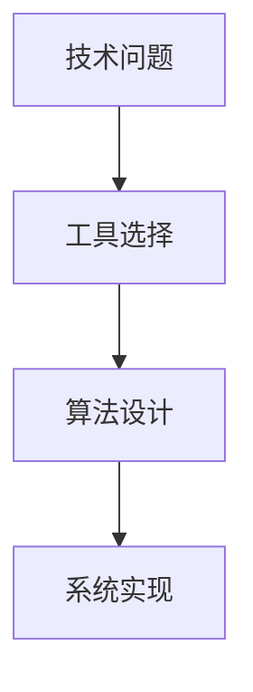

                 


# 芦苇与芒格的“铁锤人综合征”：人工智能领域的投资思维启示

> 关键词：芒格, 铁锤人综合征, 投资思维, 计算机编程, 人工智能, 技术创新

> 摘要：芒格提出的“铁锤人综合征”是一种投资思维定式，提醒我们避免过度依赖单一方法。本文从技术角度出发，分析这一综合征在编程和人工智能领域的表现，探讨如何避免思维定式，培养多样化的思维方式。

## 第1章 芦苇与芒格的“铁锤人综合征”简介

### 1.1 芦苇与芒格的生平简介

- 芦苇（Charlie Munger）是沃伦·巴菲特的长期合作伙伴，以价值投资闻名。
- 芦苇提出“铁锤人综合征”概念，强调避免单一思维模式。

### 1.2 “铁锤人综合征”的定义与特征

- 定义：指人们只用一种方法解决问题，忽视其他可能性。
- 表现：思维方式僵化，缺乏创新，适应能力差。

### 1.3 投资思维定式的影响

- 投资决策失误，错失机会，承担不必要的风险。

## 第2章 技术领域中的“铁锤人综合征”

### 2.1 编程中的铁锤人思维

- 过度依赖某一种编程语言或框架，忽视其他工具。
- 示例：仅用Python解决问题，而不考虑其他语言的优势。

### 2.2 人工智能中的思维定式

- 过度依赖传统算法，忽视新兴技术。
- 示例：坚持使用随机森林，而不尝试神经网络。

### 2.3 技术创新中的单一思维

- 限制技术进步，无法应对复杂问题。
- 示例：固守传统数据库，而不采用NoSQL解决方案。

## 第3章 避免“铁锤人综合征”的技术策略

### 3.1 培养多样化思维方式

- 持续学习新知识，保持开放心态。
- 示例：定期学习新技术，参加行业会议。

### 3.2 多工具与方法论的应用

- 灵活选择最适合的工具和方法。
- 示例：根据问题选择Python、Java或JavaScript。

### 3.3 持续反思与评估

- 定期评估自己的思维模式，识别定式。
- 示例：每月进行一次思维评估，记录改进点。

## 第4章 数学模型与算法分析

### 4.1 思维定式的数学模型

- 概率论视角：单一思维导致决策失误的概率增加。
- 行为金融学视角：确认偏差与选择性认知。

### 4.2 算法示例

```python
def investment_decision():
    tools = ['Python', 'Java', 'AI', 'Database']
    problem = 'Data Analysis'
    selected_tool = None
    for tool in tools:
        if tool == 'Python':
            selected_tool = 'Python'
            break
    if selected_tool is None:
        print("No suitable tool found")
    else:
        print(f"Using {selected_tool} for {problem}")
```

### 4.3 算法分析

- 问题：工具选择基于单一偏好，而非最优选择。
- 解决：改进算法，考虑多种工具的适用性。

## 第5章 系统分析与架构设计

### 5.1 技术架构图



### 5.2 项目实战

#### 5.2.1 实战背景

- 项目：构建数据分析系统。
- 需求：选择合适的编程语言和算法。

#### 5.2.2 实战过程

```python
# 选择工具
def choose_tool(problem):
    if problem == 'Data Analysis':
        return 'Python'
    elif problem == 'Machine Learning':
        return 'AI'
    else:
        return 'Java'
```

### 5.3 系统实现

- 实现步骤：需求分析、工具选择、算法设计、系统实现、测试优化。
- 实战总结：选择最适合的工具，提升系统性能。

## 第6章 最佳实践与小结

### 6.1 小结

- 避免思维定式，保持多样化思维。
- 定期反思，灵活调整策略。

### 6.2 注意事项

- 不要忽视新工具和新技术。
- 保持学习，避免固步自封。

### 6.3 拓展阅读

- 推荐书籍：《芒格的智慧》、《技术领导者的成长之路》。
- 在线资源：技术博客、行业报告。

## 结语

芒格的“铁锤人综合征”提醒我们，技术领域同样需要避免思维定式。通过培养多样化思维、灵活选择工具和方法，我们可以提升解决问题的效率和创新性。记住，开放心态和持续学习是避免思维定式的最佳策略。

作者：AI天才研究院/AI Genius Institute & 禅与计算机程序设计艺术 /Zen And The Art of Computer Programming

