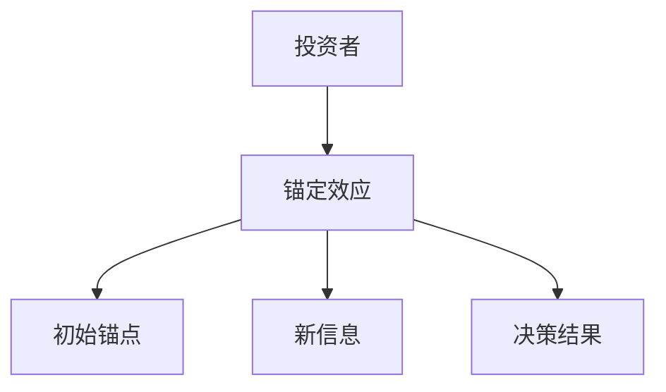
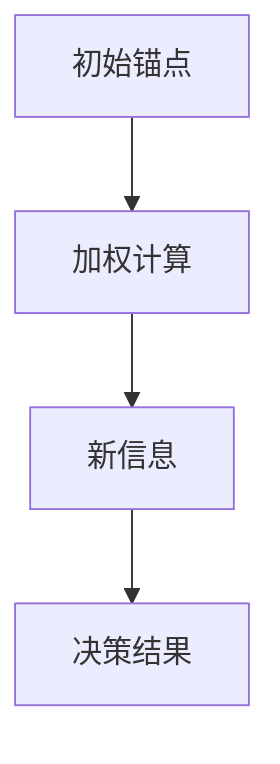
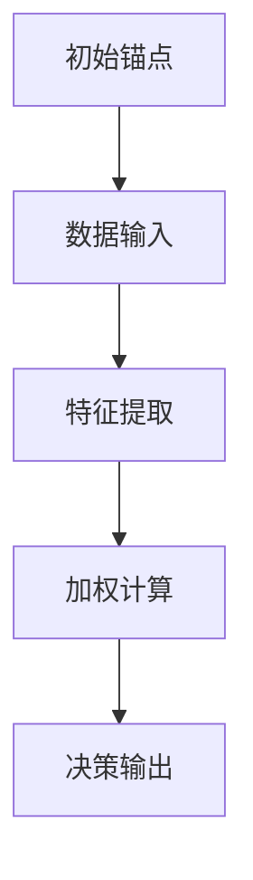
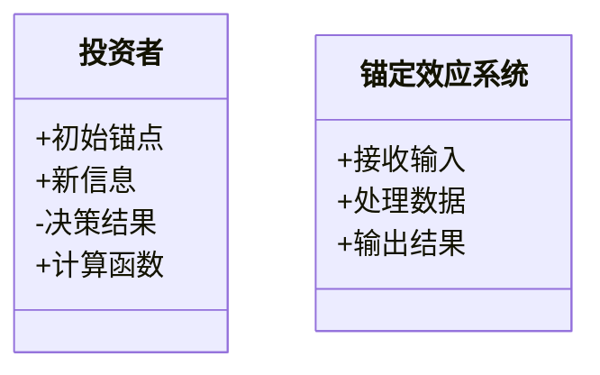
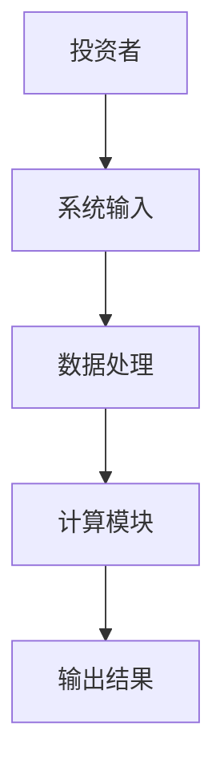
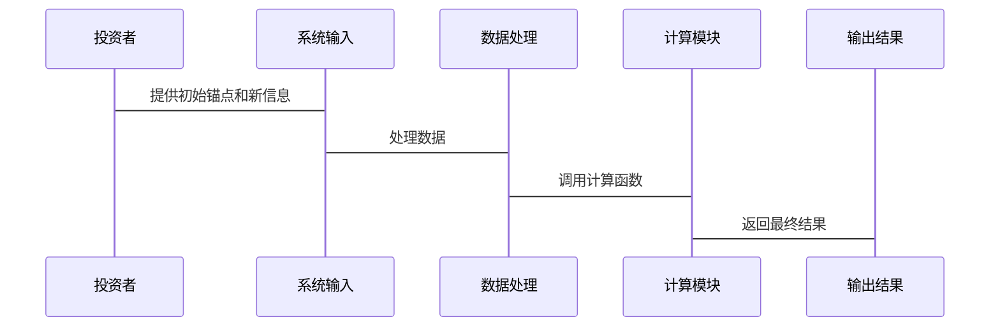

                 


# 芒格的“锚定效应”警示在投资中的应用

## 关键词：芒格，锚定效应，投资心理学，认知偏差，投资决策

## 摘要：本文从芒格的“锚定效应”入手，分析其在投资中的表现和影响，探讨如何通过认知偏差的数学模型和算法优化投资决策。文章详细介绍了锚定效应的定义、属性、系统架构，并通过具体案例展示了其在实际投资中的应用。通过本文，读者将能够理解如何避免锚定效应带来的决策偏差，并优化投资策略。

---

# 第一章：芒格的“锚定效应”概述

## 1.1 芒格与“锚定效应”的背景介绍

### 1.1.1 什么是“锚定效应”

“锚定效应”（Anchoring Effect）是心理学中的一个概念，指人们在决策时，往往过度依赖某个初始信息或“锚点”，导致决策结果偏离合理范围。例如，在价格谈判中，如果一方先提出一个高价，另一方往往会围绕这个高价进行议价，最终结果可能远高于实际价值。

### 1.1.2 芒格对“锚定效应”的独特见解

芒格在投资领域中，深刻认识到“锚定效应”对投资者决策的影响。他认为，投资者常常会因为市场波动、历史价格或情绪因素而陷入锚定效应，从而做出错误的决策。芒格强调，投资者需要超越表象，深入分析企业的内在价值，避免被“锚点”所束缚。

### 1.1.3 “锚定效应”在投资中的具体表现

在投资中，“锚定效应”主要表现为投资者过于依赖某个价格点（如历史最高价、发行价等）作为决策依据。例如，投资者可能因为某只股票曾达到过100元的高价，而坚持在80元的价格买入，认为其价值应恢复到100元。然而，这种思维往往忽视了市场变化和企业基本面的真实情况。

## 1.2 投资中的心理学基础

### 1.2.1 投资决策中的认知偏差

认知偏差是人类大脑在处理信息时的系统性错误，其中“锚定效应”是常见的一种。其他相关偏差包括确认偏差、损失厌恶等，这些偏差共同影响投资者的决策过程。

### 1.2.2 “锚定效应”的心理学机制

“锚定效应”的发生机制包括以下几个步骤：
1. **初始锚点**：投资者受到某个初始信息的影响，形成“锚点”。
2. **信息处理**：当面对新信息时，投资者未能充分调整初始锚点，导致决策偏差。
3. **结果偏差**：最终的决策结果偏离了合理范围。

### 1.2.3 投资者行为中的常见心理陷阱

投资者常见的心理陷阱包括：
- **过度自信**：认为自己能够准确预测市场走势。
- **从众心理**：盲目跟随市场潮流，忽视独立分析。
- **损失厌恶**：对潜在损失的过度关注，导致错失投资机会。

## 1.3 本章小结

本章从心理学角度介绍了“锚定效应”的概念及其在投资中的表现，分析了投资者常见的认知偏差和心理陷阱，为后续章节的深入分析奠定了基础。

---

# 第二章：锚定效应的核心概念与数学模型

## 2.1 锚定效应的定义与属性

### 2.1.1 锚定效应的定义

“锚定效应”是指投资者在决策过程中，由于过度依赖某个初始信息或“锚点”，导致决策结果偏离合理范围的现象。

### 2.1.2 锚定效应的属性特征对比表

| 特性       | 锚定效应        |
|------------|----------------|
| 起因       | 初始信息影响    |
| 表现       | 决策偏差        |
| 持续时间   | 中短期影响      |
| 影响因素   | 认知偏差、情绪等 |

### 2.1.3 ER实体关系图（Mermaid）



## 2.2 锚定效应的数学模型

### 2.2.1 数学公式

锚定效应可以用以下公式表示：

$$ 锚定效应 = f(初始锚点, 新信息) $$

其中，$f$ 是一个加权函数，通常表现为对初始锚点的过度依赖。

### 2.2.2 算法原理



### 2.2.3 举例说明

假设某投资者的初始锚点是100元，新信息显示该股票的合理价值为80元。根据锚定效应，投资者可能将最终决策调整为：

$$ 决策结果 = 0.7 \times 100 + 0.3 \times 80 = 94 $$

---

# 第三章：投资中的锚定效应分析与算法实现

## 3.1 投资决策中的锚定效应应用场景

### 3.1.1 初级市场中的锚定效应

在新股发行中，投资者可能因发行价而形成锚点，导致申购价格偏离合理区间。

### 3.1.2 次级市场中的锚定效应

在二级市场交易中，投资者可能因历史高点或低点形成锚点，导致买卖决策偏差。

### 3.1.3 机构投资者与个人投资者的差异

机构投资者通常具备更专业的分析能力，较少受锚定效应影响；而个人投资者则更容易受到心理偏差的影响。

## 3.2 锚定效应的算法实现

### 3.2.1 算法流程图（Mermaid）



### 3.2.2 Python代码实现

```python
def anchor_effect(anchor_point, new_info, weight=0.7):
    # 加权计算
    result = anchor_point * weight + new_info * (1 - weight)
    return result

# 示例
anchor_point = 100
new_info = 80
print(anchor_effect(anchor_point, new_info))  # 输出：94
```

---

# 第四章：系统架构与投资决策优化

## 4.1 系统功能设计

### 4.1.1 领域模型（Mermaid）



### 4.1.2 系统架构设计（Mermaid）



### 4.1.3 系统交互设计（Mermaid）



---

# 第五章：项目实战——基于锚定效应的投资决策优化

## 5.1 项目背景与目标

### 5.1.1 项目背景

本文将通过具体案例分析，展示如何在实际投资中识别和避免锚定效应。

## 5.2 核心代码实现

### 5.2.1 环境安装

需要安装Python和相关库，如numpy和pandas。

### 5.2.2 核心代码

```python
import numpy as np
import pandas as pd

def anchor_effect_analysis(anchor_point, new_info_list):
    results = []
    for info in new_info_list:
        result = 0.7 * anchor_point + 0.3 * info
        results.append(result)
    return results

# 示例
anchor_point = 100
new_info_list = [80, 90, 110]
print(anchor_effect_analysis(anchor_point, new_info_list))
```

---

# 第六章：最佳实践与小结

## 6.1 小结

本章通过具体案例分析，展示了如何在实际投资中应用锚定效应的数学模型和算法，帮助投资者优化决策过程。

## 6.2 注意事项

- **定期复盘**：投资者需要定期回顾自己的决策，识别锚定效应的影响。
- **多元化投资**：分散投资可以降低单一锚点的影响。
- **持续学习**：保持对市场和企业的深入分析，避免盲目跟随。

---

# 作者：AI天才研究院/AI Genius Institute & 禅与计算机程序设计艺术 /Zen And The Art of Computer Programming

---

**注意**：本文为技术博客文章，版权归作者所有，转载请注明出处。

