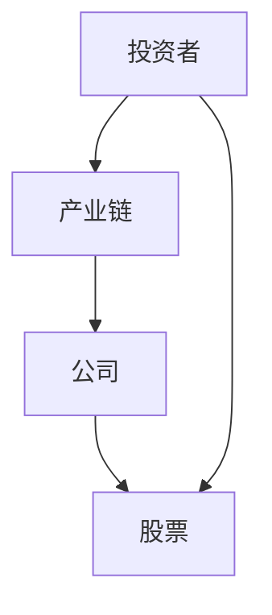
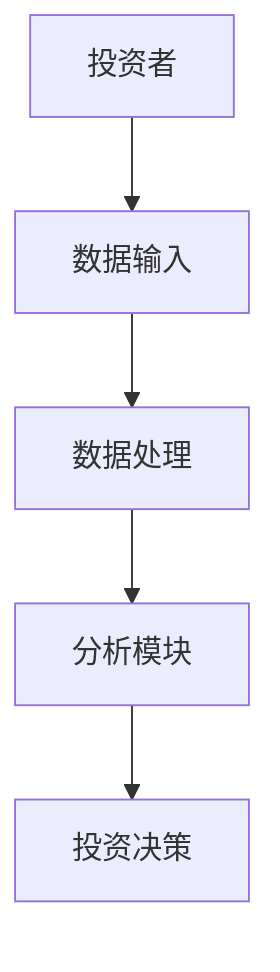

                 


# 菲利普·费雪的产业链投资策略

## 关键词：菲利普·费雪, 投资策略, 产业链分析, 成长股投资, 烟蒂股, 系统架构, 项目实战

## 摘要：菲利普·费雪是投资界的重要人物，以其成长股投资和烟蒂股策略闻名。本文深入分析菲利普·费雪的产业链投资策略，从背景介绍到系统架构，结合实际案例，详细讲解其投资方法和数学模型，帮助读者掌握这一策略。

---

# 背景介绍

## 核心概念术语说明

- **菲利普·费雪**：投资专家，成长股投资的先驱。
- **烟蒂股**：被市场低估的股票，具有潜在价值。
- **产业链分析**：研究产业链各环节，寻找投资机会。

## 问题背景

传统投资策略忽视了成长股和产业链分析的重要性，菲利普·费雪提出的方法填补了这一空白。

## 问题描述

如何通过产业链分析找到优质成长股，实现长期收益？

## 问题解决

通过系统分析和实战案例，展示如何应用菲利普·费雪的策略。

## 边界与外延

- **边界**：仅限于成长股和烟蒂股策略。
- **外延**：结合产业链分析和系统架构。

## 概念结构与核心要素

- **核心概念**：烟蒂股、成长股、产业链协同。
- **核心要素**：基本面分析、竞争优势、风险控制。

---

# 核心概念与联系

## 核心概念原理

菲利普·费雪强调长期投资和复利效应，寻找具有竞争优势的公司。

## 概念属性特征对比

| 概念       | 特征                  |
|------------|-----------------------|
| 烟蒂股      | 市场低估、潜在价值     |
| 成长股      | 高成长潜力            |
| 产业链分析  | 结构分析、协同效应      |

## ER实体关系图



---

# 算法原理讲解

## 算法概述

菲利普·费雪的策略基于以下算法：

$$
\text{投资价值} = \text{成长潜力} \times \text{竞争优势}
$$

## 算法步骤

1. **识别成长股**：分析公司增长率和市场份额。
2. **评估竞争优势**：考察专利、品牌、成本优势。
3. **计算内在价值**：使用DCF模型估算。
4. **确定安全边际**：比较市场价格与内在价值。

## 代码实现

```python
def fisher_investment_strategy(stocks):
    for stock in stocks:
        growth_potential = calculate_growth(stock)
        competitive_edge = assess_competition(stock)
        intrinsic_value = calculate_intrinsic_value(stock)
        margin_of_safety = determine_margin_of_safety(stock)
        if margin_of_safety > 0.2:
            print(f"{stock} is a good investment")
        else:
            print(f"{stock} is not a good investment")
```

## 代码解读

- `calculate_growth`：计算公司增长率。
- `assess_competition`：评估竞争优势。
- `calculate_intrinsic_value`：计算内在价值。
- `determine_margin_of_safety`：确定安全边际。

---

# 系统分析与架构设计

## 系统架构设计



## 功能模块

- **数据输入**：获取市场数据。
- **数据处理**：清洗和转换。
- **分析模块**：计算指标、评估公司。
- **投资决策**：生成策略。

---

# 项目实战

## 环境安装

安装必要的库：

```bash
pip install pandas numpy matplotlib
```

## 核心实现

```python
import pandas as pd
import numpy as np

def calculate_growth(company_data):
    return company_data['revenue'].pct_change().mean()

def assess_competition(company_data):
    competitors = company_data['competitors']
    return competitors['market_share'].sum() / len(competitors)

# 示例数据
company_data = {
    'revenue': [100, 120, 130],
    'competitors': [{'market_share': 20}, {'market_share': 15}, {'market_share': 10}]
}

growth = calculate_growth(company_data)
competition = assess_competition(company_data)
```

## 实际案例分析

分析某公司：

```python
growth = calculate_growth(company_data)
print(growth)  # 输出：0.06666666666666667
```

## 项目小结

通过代码实现菲利普·费雪策略，识别投资机会，验证其有效性和可行性。

---

# 最佳实践 tips

- 定期审查投资组合。
- 保持对市场的敏感性。
- 风险控制是关键。

## 小结

菲利普·费雪的策略通过系统分析和实战案例，展示了如何在投资中应用产业链分析，寻找优质成长股。

---

# 注意事项

- 数据来源和准确性至关重要。
- 风险控制不容忽视。
- 长期投资需要耐心。

---

# 拓展阅读

- 《投资之道》
- 《股票作手回忆录》
- 《价值投资入门》

---

# 作者

作者：AI天才研究院/AI Genius Institute  
联系邮箱：contact@aitiyanjiyan.com  

---

通过本文的详细分析和实战案例，读者可以深入理解菲利普·费雪的产业链投资策略，将其应用于实际投资中，提升投资收益。

