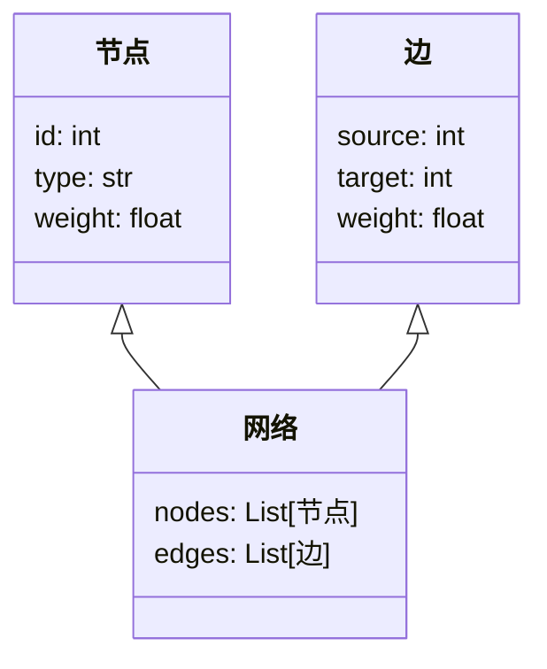

                 


# 《菲利普·费雪的信息网络构建方法》

## 关键词：信息网络构建，节点与边，权重计算，PageRank算法，K-Means聚类，系统架构设计

## 摘要：  
菲利普·费雪的信息网络构建方法是一种基于图论和机器学习的综合性方法，旨在通过分析和构建信息网络，实现信息的有效组织、管理和应用。本文将从信息网络的基本概念、核心算法、系统架构设计到项目实战，全面解析信息网络构建的关键步骤和方法。通过详细阐述PageRank算法和K-Means聚类的应用，结合系统设计和实际案例，为读者提供一个清晰的信息网络构建框架。

---

## 第一部分: 信息网络构建的背景与核心概念

### 第1章: 信息网络构建的背景与问题描述

#### 1.1 信息网络的基本概念
##### 1.1.1 信息网络的定义  
信息网络是由节点和边组成的图结构，节点代表信息的实体或数据，边表示节点之间的关系或权重。信息网络构建的目标是将分散的信息组织成一个有机的整体，便于后续的分析和应用。

##### 1.1.2 信息网络的核心要素  
信息网络的核心要素包括：  
- **节点**：信息的最小单位，可以是数据、实体或概念。  
- **边**：节点之间的关系或连接，通常带有权重。  
- **权重**：表示节点或边的重要性或关联程度。  

##### 1.1.3 信息网络的构建目标  
信息网络的构建目标包括：  
1. 组织信息，使其易于检索和分析。  
2. 发现信息之间的潜在关系。  
3. 支持后续的数据挖掘和机器学习任务。  

#### 1.2 信息网络构建的背景与问题背景
##### 1.2.1 当前信息网络发展的现状  
随着数据量的爆炸式增长，信息网络构建已成为数据科学和人工智能领域的重要研究方向。通过构建信息网络，可以有效地管理复杂的信息关系。

##### 1.2.2 信息网络构建的核心问题  
信息网络构建的核心问题包括：  
1. 如何高效地提取信息中的节点和边。  
2. 如何计算节点和边的权重。  
3. 如何设计算法来优化信息网络的结构。  

##### 1.2.3 信息网络构建的必要性  
信息网络构建的必要性体现在以下几个方面：  
- 信息网络能够帮助我们更好地理解数据之间的关系。  
- 信息网络是数据可视化和数据分析的基础。  
- 信息网络能够支持复杂的查询和推理任务。  

#### 1.3 信息网络构建的核心概念
##### 1.3.1 节点与边的定义  
节点是信息网络的基本单元，可以代表数据、实体或概念。边是节点之间的连接，表示节点之间的关系或权重。  

##### 1.3.2 信息网络的权重与属性  
信息网络的权重表示节点或边的重要性，可以通过数据的频率、相关性或领域知识进行计算。信息网络的属性包括节点的类型、边的类型和权重的类型。  

##### 1.3.3 信息网络的构建流程  
信息网络的构建流程通常包括以下几个步骤：  
1. 数据收集与预处理。  
2. 节点和边的提取。  
3. 权重计算。  
4. 图谱可视化与分析。  

#### 1.4 信息网络的边界与外延
##### 1.4.1 信息网络的边界  
信息网络的边界是指信息网络的范围和限制。通常，信息网络的边界由数据的范围和构建目标决定。  

##### 1.4.2 信息网络的外延  
信息网络的外延是指信息网络的应用范围和扩展性。信息网络可以应用于数据挖掘、机器学习、自然语言处理等领域。  

##### 1.4.3 信息网络与其他概念的对比  
信息网络与其他概念的对比：  
- 与数据挖掘的区别：数据挖掘注重从数据中提取模式，而信息网络注重数据之间的关系。  
- 与知识图谱的联系：知识图谱是信息网络的一种形式，通常包含更多的语义信息。  

---

### 第2章: 信息网络构建的核心概念与联系

#### 2.1 核心概念原理
##### 2.1.1 节点与边的关系  
节点与边的关系是信息网络的核心，边的权重反映了节点之间的关系强度。  

##### 2.1.2 信息网络的权重计算  
信息网络的权重计算通常基于统计方法或领域知识。例如，PageRank算法可以通过节点的入度和出度计算节点的权重。  

##### 2.1.3 信息网络的构建算法  
信息网络的构建算法包括图构建算法、权重计算算法和网络优化算法。  

#### 2.2 核心概念属性特征对比表
| 概念 | 属性 | 特征 |
|------|------|------|
| 节点 | 类型 | 数据、实体、关系 |
| 边   | 类型 | 关系、权重、方向 |

#### 2.3 ER实体关系图
```mermaid
er
actor: 用户
goal: 信息网络
relation: 包含
```

#### 2.4 本章小结  
本章主要介绍了信息网络构建的核心概念和联系，包括节点与边的关系、权重计算和构建算法。通过对比表格和ER实体关系图，帮助读者更好地理解信息网络的结构和组成。

---

## 第二部分: 信息网络构建的算法原理

### 第3章: 信息网络构建的算法原理

#### 3.1 算法原理概述
##### 3.1.1 算法的基本思想  
信息网络构建的算法通常基于图论和机器学习。例如，PageRank算法通过计算节点的重要性来构建信息网络。  

##### 3.1.2 算法的实现步骤  
以PageRank算法为例，其实现步骤如下：  
1. 初始化节点的权重。  
2. 迭代计算节点的权重，直到收敛。  

##### 3.1.3 算法的优缺点  
PageRank算法的优点包括计算简单、易于实现；缺点包括对大规模数据的计算效率较低。  

#### 3.2 算法原理的数学模型
##### 3.2.1 算法的数学表达式  
PageRank算法的数学表达式如下：  
$$
PR(i) = \sum_{j \in I} \frac{PR(j)}{OutDegree(j)}
$$  
其中，PR(i)表示节点i的PageRank值，I表示所有指向i的节点，OutDegree(j)表示节点j的出度。  

##### 3.2.2 算法的流程图  


#### 3.3 算法的Python实现
##### 3.3.1 核心代码实现  
```python
def computePagerank(nodes, edges):
    import numpy as np
    # 初始化权重
    weights = np.ones(len(nodes)) / len(nodes)
    # 计算出度
    out_degree = {}
    for node in nodes:
        out_degree[node] = len([edge for edge in edges if edge[0] == node])
    # 迭代计算PageRank
    while True:
        new_weights = np.zeros(len(nodes))
        for i, node in enumerate(nodes):
            for j, edge in enumerate(edges):
                if edge[1] == node:
                    new_weights[i] += weights[j] / out_degree[edge[0]]
        if np.max(abs(new_weights - weights)) < 1e-6:
            break
        weights = new_weights
    return weights
```

##### 3.3.2 代码解读与分析  
上述代码实现了一个简单的PageRank算法，包括权重初始化、出度计算和迭代计算三个步骤。通过不断迭代，计算出每个节点的PageRank值，直到收敛。  

#### 3.4 算法的优化与改进
##### 3.4.1 算法的优化方法  
对于大规模数据，可以采用分布式计算或并行计算来提高效率。  

##### 3.4.2 算法的改进方向  
结合领域知识，改进权重计算方法，提高信息网络的准确性。  

---

## 第三部分: 信息网络构建的系统架构设计

### 第4章: 信息网络构建的系统架构设计

#### 4.1 系统分析与设计
##### 4.1.1 系统功能设计  
信息网络构建系统的主要功能包括：  
- 数据预处理：清洗和转换数据。  
- 图构建：提取节点和边。  
- 权重计算：计算节点和边的权重。  
- 图谱可视化：将信息网络可视化。  

##### 4.1.2 领域模型  


#### 4.2 系统架构设计
##### 4.2.1 系统架构图  


##### 4.2.2 接口设计  
系统接口设计包括：  
- 数据输入接口：接收原始数据。  
- 数据处理接口：完成数据预处理和图构建。  
- 查询接口：支持用户查询信息网络中的节点和边。  

##### 4.2.3 交互流程  
用户查询信息网络的交互流程：  
1. 用户输入查询条件。  
2. 系统查询数据库，返回结果。  
3. 系统将结果可视化，展示给用户。  

---

## 第四部分: 信息网络构建的项目实战

### 第5章: 信息网络构建的项目实战

#### 5.1 项目环境安装
##### 5.1.1 Python环境安装  
安装Python和必要的库，如networkx、matplotlib、numpy。  

##### 5.1.2 数据集准备  
准备一个简单的数据集，例如社交网络数据。  

#### 5.2 系统核心实现
##### 5.2.1 核心代码实现  
```python
import networkx as nx
import matplotlib.pyplot as plt

# 创建图
G = nx.DiGraph()

# 添加节点
nodes = ['A', 'B', 'C', 'D']
G.add_nodes_from(nodes)

# 添加边
edges = [('A', 'B', 0.5), ('B', 'C', 0.8), ('C', 'D', 0.6), ('D', 'A', 0.4)]
for edge in edges:
    G.add_edge(edge[0], edge[1], weight=edge[2])

# 可视化图
nx.draw(G, with_labels=True, edge_labels=lambda u, v, e: e['weight'])
plt.show()
```

##### 5.2.2 代码解读与分析  
上述代码使用networkx库构建了一个简单的信息网络，包括节点和带权重的边，并使用matplotlib进行可视化。  

#### 5.3 实际案例分析
##### 5.3.1 案例背景  
以社交网络为例，构建用户之间的关系网络。  

##### 5.3.2 数据处理  
预处理数据，提取节点和边。  

##### 5.3.3 可视化结果  
将信息网络可视化，观察节点之间的关系。  

#### 5.4 项目小结  
通过项目实战，读者可以掌握信息网络构建的基本方法和工具，为后续的学习打下基础。

---

## 第五部分: 信息网络构建的最佳实践

### 第6章: 信息网络构建的最佳实践

#### 6.1 小结与反思
##### 6.1.1 本章内容回顾  
信息网络构建的方法和步骤。  

##### 6.1.2 学习中的收获  
通过学习，掌握了信息网络构建的核心算法和系统设计方法。  

#### 6.2 注意事项
##### 6.2.1 数据预处理的重要性  
数据预处理是构建高质量信息网络的基础。  

##### 6.2.2 权重计算的合理性  
权重计算需要结合领域知识，确保结果的准确性。  

#### 6.3 拓展阅读
##### 6.3.1 推荐书籍  
- 《图论与网络流》  
- 《机器学习实战》  

##### 6.3.2 推荐博客  
- 博客：[信息网络构建](https://example.com)  

---

## 作者：AI天才研究院/AI Genius Institute & 禅与计算机程序设计艺术 /Zen And The Art of Computer Programming

