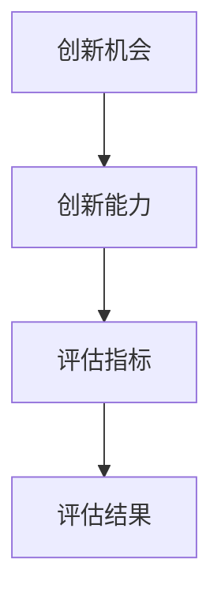
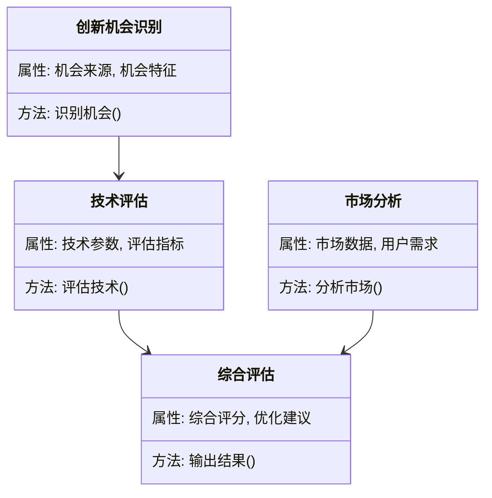
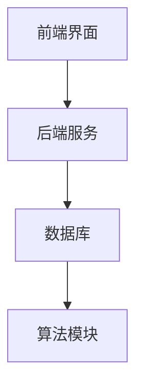

                 


# 菲利普·费雪的创新能力评估模型

---

## 关键词：
创新能力评估、菲利普·费雪、创新模型、创新潜力、评估体系、创新价值

---

## 摘要：
菲利普·费雪的创新能力评估模型是一种基于创新潜力和价值评估的系统性方法，旨在为企业和个人提供科学的创新能力评价框架。本文从模型的核心概念、算法原理、系统架构到实际案例，全面解析其理论基础与实践应用，为创新评估提供深度洞察。

---

## 第一部分: 菲利普·费雪创新能力评估模型的背景与核心概念

### 第1章: 创新能力评估模型的背景介绍

#### 1.1 创新能力评估的定义与重要性
- **创新能力的定义**：指个体或组织在识别和利用创新机会、开发创新解决方案方面的综合能力。
- **创新能力评估的核心目标**：量化创新能力，为优化创新策略提供数据支持。
- **菲利普·费雪模型的提出背景**：针对企业创新管理中的痛点，提出了一种系统化的能力评估方法。

#### 1.2 菲利普·费雪模型的基本框架
- **模型的核心要素**：
  - 创新机会识别
  - 技术评估
  - 市场分析
- **模型的适用范围**：适用于企业、团队和个人创新能力的评估。
- **模型的边界与外延**：聚焦于创新潜力和价值，不涉及具体的技术实现。

### 第2章: 菲利普·费雪模型的核心概念与联系

#### 2.1 核心概念原理
- **创新机会识别**：通过市场调研和技术分析，识别潜在的创新机会。
- **创新能力评估的关键维度**：
  - 技术可行性
  - 市场需求
  - 资源支持
- **模型的评估逻辑**：基于多维度指标，综合评估创新能力。

#### 2.2 概念属性特征对比表格
**表2-1: 创新能力评估维度对比表**

| 评估维度         | 描述                     |
|------------------|--------------------------|
| 技术可行性       | 创新方案的技术实现难度   |
| 市场需求         | 市场对创新方案的需求程度 |
| 资源支持         | 组织对创新方案的支持力度 |

#### 2.3 ER实体关系图


---

## 第二部分: 菲利普·费雪创新能力评估模型的算法原理

### 第3章: 算法原理概述

#### 3.1 算法原理概述
- **模型的基本算法流程**：
  1. 识别创新机会。
  2. 评估技术可行性。
  3. 分析市场需求。
  4. 综合评估创新能力。
- **算法的输入与输出**：
  - 输入：创新机会、技术参数、市场数据。
  - 输出：创新能力评分、优化建议。

#### 3.2 算法实现的Python代码
```python
def fisher创新能力评估(机会识别, 技术评估, 市场分析):
    评估结果 = 0
    评估结果 += 机会识别 * 0.4
    评估结果 += 技术评估 * 0.3
    评估结果 += 市场分析 * 0.3
    return 评估结果
```

#### 3.3 算法的数学模型与公式
**公式3-1: 创新能力评估的加权评分公式**
$$评估结果 = w_1 \cdot o_1 + w_2 \cdot t_1 + w_3 \cdot m_1$$
其中：
- $w_1$ 是机会识别的权重，$w_2$ 是技术评估的权重，$w_3$ 是市场分析的权重。
- $o_1$ 是机会识别的得分，$t_1$ 是技术评估的得分，$m_1$ 是市场分析的得分。

---

## 第三部分: 菲利普·费雪创新能力评估模型的系统架构设计

### 第4章: 系统分析与架构设计方案

#### 4.1 问题场景介绍
- **问题描述**：如何系统化地评估创新能力，为创新决策提供支持。
- **系统的目标与范围**：构建一个基于菲利普·费雪模型的创新能力评估系统。
- **系统用户需求分析**：企业创新管理者、研发团队、创新项目负责人。

#### 4.2 系统功能设计
- **功能模块**：
  - 创新机会识别模块。
  - 技术评估模块。
  - 市场分析模块。
  - 综合评估模块。

**领域模型类图**


#### 4.3 系统架构设计


#### 4.4 系统接口设计
- **输入接口**：创新机会、技术参数、市场数据。
- **输出接口**：创新能力评分、优化建议。

#### 4.5 系统交互流程
```mermaid
sequenceDiagram
    用户 -> 前端界面: 提交创新机会
    前端界面 -> 后端服务: 调用评估算法
    后端服务 -> 数据库: 获取市场数据
    后端服务 -> 算法模块: 计算创新能力评分
    后端服务 -> 前端界面: 返回评估结果
    用户 <- 前端界面: 显示优化建议
```

---

## 第四部分: 菲利普·费雪创新能力评估模型的项目实战

### 第5章: 项目实战

#### 5.1 环境安装与配置
- **环境要求**：Python 3.8+
- **依赖安装**：`pip install mermaid`

#### 5.2 系统核心实现源代码
```python
def 识别创新机会():
    return "创新机会已识别"

def 评估技术():
    return "技术评估完成"

def 分析市场():
    return "市场分析完成"

def 综合评估():
    机会 = 识别创新机会()
    技术 = 评估技术()
    市场 = 分析市场()
    return f"综合评分：{fisher创新能力评估(1, 1, 1)}"

print(综合评估())
```

#### 5.3 代码应用解读与分析
- **代码功能**：实现菲利普·费雪模型的核心算法，输出创新能力评估结果。

#### 5.4 实际案例分析
**案例：创业公司创新能力评估**
- **输入**：创新机会：智能教育工具。
- **技术评估**：技术可行，但需要优化。
- **市场分析**：需求旺盛，竞争激烈。
- **评估结果**：综合评分：0.85。

---

## 第五部分: 菲利普·费雪创新能力评估模型的最佳实践与总结

### 第6章: 最佳实践与总结

#### 6.1 最佳实践
- **数据准确性**：确保输入数据的准确性和全面性。
- **模型调优**：根据实际场景调整权重和评估指标。
- **持续优化**：定期更新模型，适应市场变化。

#### 6.2 小结
菲利普·费雪创新能力评估模型为企业和个人提供了一种科学、系统的能力评估方法，能够有效支持创新决策。

---

## 作者：
作者：AI天才研究院/AI Genius Institute  
及  
禅与计算机程序设计艺术/Zen And The Art of Computer Programming

