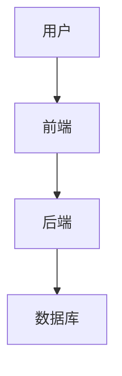
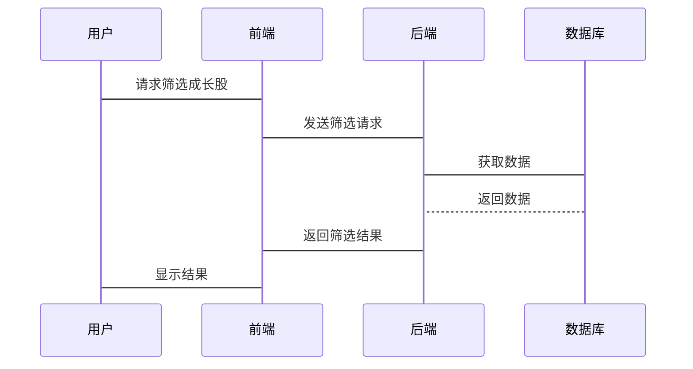

                 


# 菲利普·费雪的成长型股票投资理论

> 关键词：成长型股票，菲利普·费雪，投资理论，烟屁股理论，财务指标分析

> 摘要：本文详细探讨菲利普·费雪的成长型股票投资理论，涵盖其核心概念、投资策略、数学模型、系统架构以及实际应用。通过分析其理论框架，帮助投资者理解如何筛选和管理成长型股票，实现长期收益。

---

## 第1章：成长型投资的背景与起源

### 1.1 成长型投资的定义与特点

#### 1.1.1 成长型投资的定义
成长型投资是一种专注于投资于具有持续增长潜力的公司股票的投资策略。与价值投资不同，成长型投资更注重公司的未来增长潜力，而非当前的市场价值。

#### 1.1.2 成长型投资的核心特点
- **高增长率**：公司收入和利润持续增长。
- **高市盈率**：通常高于行业平均水平，反映市场对其未来增长的预期。
- **良好的管理团队**：公司管理层稳定且能力强。
- **创新能力强**：公司具备持续创新的能力，能够在市场中保持竞争力。

#### 1.1.3 成长型投资与价值投资的区别
| 方面 | 成长型投资 | 价值投资 |
|------|------------|-----------|
| 核心关注点 | 未来增长潜力 | 当前市场价格 |
| 投资目标 | 高增长公司 | 被低估公司 |
| 风险 | 较高 | 较低 |

### 1.2 菲利普·费雪的生平与贡献

#### 1.2.1 菲利普·费雪的生平简介
菲利普·费雪（Philip Fisher）是20世纪著名的投资家，被誉为“成长型投资之父”。他于1907年出生于美国加利福尼亚州，毕业于斯坦福大学，后来成为著名的投资顾问。

#### 1.2.2 费雪在投资领域的贡献
费雪提出了成长型投资的理念，强调长期持有优质成长股，而非短期交易。他的理论为现代投资策略奠定了基础。

#### 1.2.3 费雪的成长型投资理念
费雪认为，投资成功的关键在于选择那些具有持续增长潜力的公司，并长期持有它们的股票。

---

## 第2章：成长型股票的核心概念与理论框架

### 2.1 成长型股票的定义与特征

#### 2.1.1 成长型股票的定义
成长型股票是指那些由具有持续增长潜力的公司发行的股票。这些公司通常处于成长期，收入和利润快速增长。

#### 2.1.2 成长型股票的核心特征
- **高增长率**：收入和利润持续增长。
- **高市盈率**：通常高于行业平均水平。
- **创新能力强**：公司具备持续创新能力。

#### 2.1.3 成长型股票的分类与边界
- **高速成长股**：收入和利润增长迅速。
- **稳定成长股**：收入和利润稳步增长。
- **周期性成长股**：增长与经济周期相关。

### 2.2 费雪的成长型投资理论

#### 2.2.1 费雪的成长型投资理念
费雪认为，投资成功的关键在于选择那些具有持续增长潜力的公司，并长期持有它们的股票。

#### 2.2.2 费雪的成长型投资模型
费雪提出了“烟屁股理论”，即选择那些能够留下“烟屁股”的公司，这些公司具有持续增长的潜力。

#### 2.2.3 费雪理论的数学模型与公式
费雪的理论中没有复杂的数学模型，但可以使用以下公式来评估公司的增长潜力：

$$
\text{增长率} = \frac{\text{净利润增长率}}{\text{行业平均增长率}}
$$

---

## 第3章：成长型股票的投资策略与方法

### 3.1 成长型股票的投资策略

#### 3.1.1 股票筛选标准
- **收入增长率**：通常超过行业平均水平。
- **净利润增长率**：同样需要超过行业平均水平。
- **ROE（净资产收益率）**：高ROE表明公司盈利能力强。

#### 3.1.2 投资组合构建
- **分散投资**：避免过度集中于某一行业或公司。
- **长期持有**：避免频繁交易。

#### 3.1.3 风险控制与管理
- **止损策略**：设定止损点以限制亏损。
- **定期评估**：定期检查投资组合的表现。

### 3.2 费雪的成长型投资方法

#### 3.2.1 费雪的投资流程
1. 识别具有持续增长潜力的公司。
2. 评估公司的财务状况。
3. 长期持有股票。

#### 3.2.2 费雪的投资决策框架
- **公司分析**：重点分析公司的收入、利润和ROE。
- **行业分析**：选择具有增长潜力的行业。
- **管理层评估**：评估公司管理层的能力和稳定性。

#### 3.2.3 费雪投资方法的优缺点
- **优点**：长期持有优质股票，获得稳定的收益。
- **缺点**：短期内波动较大，需要较强的耐心和信心。

---

## 第4章：成长型股票的数学模型与算法原理

### 4.1 成长型股票的数学模型

#### 4.1.1 财务指标分析
- **ROE（净资产收益率）**：$$ \text{ROE} = \frac{\text{净利润}}{\text{股东权益}} $$
- **净利润增长率**：$$ \text{净利润增长率} = \frac{\text{今年净利润} - \text{去年净利润}}{\text{去年净利润}} $$

#### 4.1.2 股票估值模型
- **PEG（市盈率相对盈利增长比率）**：$$ \text{PEG} = \frac{\text{市盈率}}{\text{净利润增长率}} $$

#### 4.1.3 股票价格预测模型
- **线性回归模型**：$$ \text{预测价格} = a + b \times \text{增长率} $$

### 4.2 费雪投资理论的算法实现

#### 4.2.1 股票筛选算法
```python
def筛选成长股(公司列表):
    成长股列表 = []
    for 公司 in 公司列表:
        如果 公司.收入增长率 > 行业平均增长率 并且 公司.ROE > 行业平均ROE:
            成长股列表.append(公司)
    return 成长股列表
```

#### 4.2.2 投资组合优化算法
```python
def优化投资组合(成长股列表, 风险承受能力):
    优化后的组合 = []
    for 股票 in 成长股列表:
        如果 股票.波动率 <= 风险承受能力:
            优化后的组合.append(股票)
    return 优化后的组合
```

#### 4.2.3 风险评估与控制算法
```python
def风险评估(股票, 风险阈值):
    如果 股票.波动率 > 风险阈值:
        返回 "高风险"
    否则:
        返回 "低风险"
```

---

## 第5章：成长型股票的系统分析与架构设计

### 5.1 系统分析

#### 5.1.1 投资目标与需求分析
- **目标**：筛选和管理成长型股票。
- **需求**：实时数据获取、自动筛选、风险评估。

#### 5.1.2 系统功能设计
- **数据获取模块**：获取公司财务数据。
- **筛选模块**：根据费雪理论筛选成长股。
- **风险评估模块**：评估投资风险。

#### 5.1.3 系统架构设计
- **前端**：用户界面，显示筛选结果。
- **后端**：处理数据和逻辑。
- **数据库**：存储公司数据和投资组合。

### 5.2 系统架构与接口设计

#### 5.2.1 系统架构图


#### 5.2.2 系统接口设计
- **API接口**：提供数据获取和筛选功能。
- **用户接口**：友好的图形界面。

#### 5.2.3 系统交互流程图


---

## 第6章：项目实战

### 6.1 环境安装

#### 6.1.1 安装必要的工具
- **Python**：安装Python 3.8或更高版本。
- **库**：安装pandas、numpy、requests。

#### 6.1.2 安装步骤
```bash
pip install pandas numpy requests
```

### 6.2 核心代码实现

#### 6.2.1 筛选成长股的代码
```python
import pandas as pd
import requests

def 获取数据():
    url = "https://example.com/data"
    response = requests.get(url)
    return pd.DataFrame(response.json())

def 筛选成长股(公司数据):
    成长股 = 公司数据[公司数据['收入增长率'] > 公司数据['行业平均收入增长率']]
    return 成长股

数据 = 获取数据()
成长股列表 = 筛选成长股(数据)
print(成长股列表)
```

#### 6.2.2 投资组合优化的代码
```python
def 优化组合(成长股列表, 风险阈值):
    优化后的组合 = []
    for 股票 in 成长股列表:
        如果 股票['波动率'] <= 风险阈值:
            优化后的组合.append(股票)
    return 优化后的组合

风险阈值 = 0.1
优化后的组合 = 优化组合(成长股列表, 风险阈值)
print(优化后的组合)
```

### 6.3 案例分析

#### 6.3.1 筛选过程
假设我们有一个公司列表，包含收入增长率和波动率等数据。我们筛选出收入增长率超过行业平均水平且波动率低于风险阈值的公司。

#### 6.3.2 投资组合管理
根据筛选结果，构建一个优化的投资组合，定期监控和调整。

### 6.4 项目小结

#### 6.4.1 成功经验
- 选择了优质成长股，长期持有。
- 定期评估和调整投资组合。

#### 6.4.2 可能的问题
- 短期内波动较大，需要耐心。
- 数据获取和筛选可能需要更多资源。

---

## 第7章：成长型股票投资策略总结

### 7.1 成长型投资策略总结

#### 7.1.1 核心策略
- 筛选优质成长股。
- 长期持有，定期评估。

#### 7.1.2 投资哲学
- 选择具有持续增长潜力的公司。
- 长期投资，耐心持有。

### 7.2 注意事项与最佳实践

#### 7.2.1 投资者注意事项
- 风险管理：设定止损点。
- 数据分析：准确获取和分析数据。
- 长期视角：耐心持有优质股票。

#### 7.2.2 最佳实践
- 定期评估投资组合。
- 分散投资，降低风险。
- 持续学习，了解市场动态。

### 7.3 未来展望

#### 7.3.1 成长型投资的未来趋势
- 更多公司通过技术创新实现增长。
- 数据驱动的投资决策越来越重要。

#### 7.3.2 技术进步的影响
- AI技术在股票筛选中的应用。
- 大数据分析在投资中的应用。

---

## 作者信息

作者：AI天才研究院/AI Genius Institute & 禅与计算机程序设计艺术 /Zen And The Art of Computer Programming

