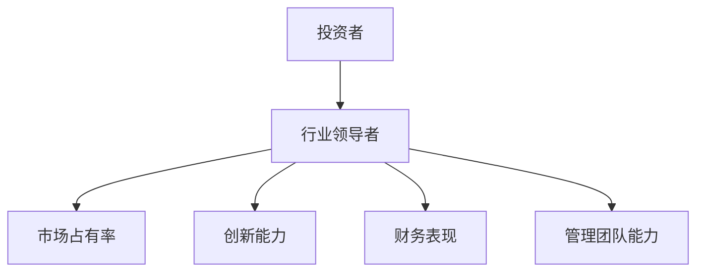
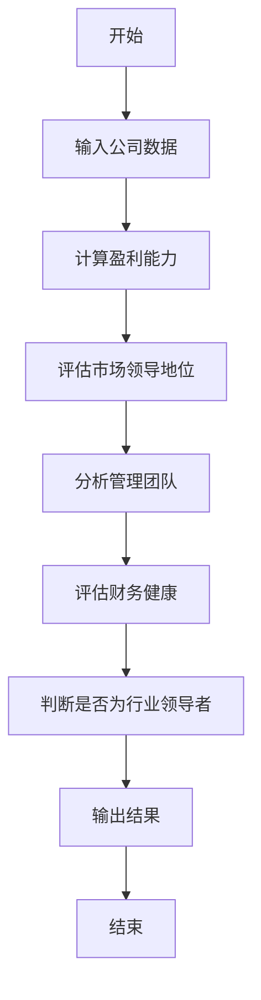
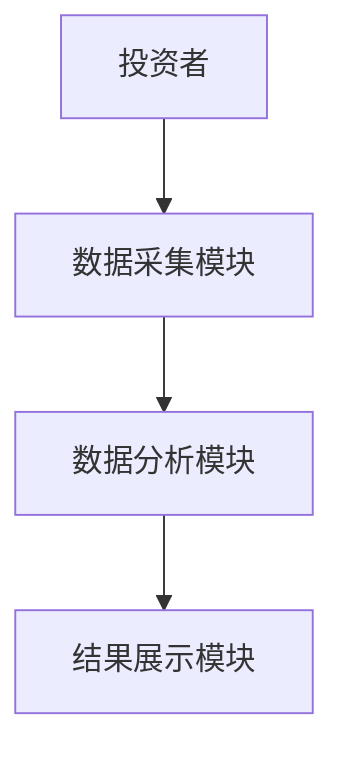

                 


# 菲利普·费雪的行业领导者识别技巧

---

## 关键词：
菲利普·费雪、行业领导者识别、成长股投资、管理团队、财务健康状况

---

## 摘要：
本文系统地探讨了菲利普·费雪的行业领导者识别技巧，结合其成长股投资理念，详细分析了如何通过核心概念、算法原理和数学模型来识别具有长期增长潜力的行业领导者。文章从背景介绍、核心概念、筛选标准、系统设计等多维度展开，提供了丰富的实战案例和理论支持，帮助读者掌握识别行业领导者的技巧。

---

## 目录大纲

### 第一部分: 背景与核心概念

#### 第1章: 投资的基本概念与菲利普·费雪的生平

##### 1.1 投资的基本概念
- 1.1.1 什么是投资
- 1.1.2 投资的基本原则
- 1.1.3 投资的分类与特点

##### 1.2 菲利普·费雪的生平与投资理念
- 1.2.1 菲利普·费雪的生平简介
- 1.2.2 费雪的成长股投资理念
- 1.2.3 费雪投资方法的核心思想

##### 1.3 行业领导者的定义与重要性
- 1.3.1 什么是行业领导者
- 1.3.2 行业领导者的特征与优势
- 1.3.3 识别行业领导者的意义

---

#### 第2章: 菲利普·费雪的行业领导者识别方法

##### 2.1 费雪的选股标准
- 2.1.1 盈利能力分析
- 2.1.2 市场领导地位
- 2.1.3 管理团队的质量
- 2.1.4 财务健康状况

##### 2.2 费雪的长期投资策略
- 2.2.1 长期投资的核心理念
- 2.2.2 如何构建投资组合
- 2.2.3 风险管理与投资分散化

##### 2.3 费雪投资方法的优缺点
- 2.3.1 方法的优点
- 2.3.2 方法的局限性
- 2.3.3 如何克服方法的局限性

---

### 第3章: 核心概念与联系

#### 3.1 行业领导者的属性特征
- 3.1.1 市场占有率
- 3.1.2 创新能力
- 3.1.3 财务表现
- 3.1.4 管理团队能力

#### 3.2 核心概念对比表
- 3.2.1 行业领导者与普通公司的对比
- 3.2.2 不同行业领导者的特征对比

#### 3.3 ER实体关系图


---

### 第4章: 算法原理讲解

#### 4.1 算法流程图


#### 4.2 算法实现代码
```python
def is_industry_leader(company_data):
    # 计算盈利能力
    profitability = company_data['net_profit'] / company_data['revenue']
    # 评估市场领导地位
    market_share = company_data['market_share']
    # 分析管理团队
    management_score = company_data['management_score']
    # 评估财务健康
    debt_to_equity = company_data['debt'] / company_data['equity']
    
    # 判断是否为行业领导者
    if profitability > 0.1 and market_share > 0.2 and management_score > 0.7 and debt_to_equity < 0.5:
        return True
    else:
        return False
```

---

### 第5章: 数学模型与公式

#### 5.1 盈利能力分析公式
$$ \text{盈利能力} = \frac{\text{净利润}}{\text{收入}} $$

#### 5.2 复合年增长率公式
$$ \text{复合年增长率} = \left( \frac{\text{末期值}}{\text{初期值}} \right)^{\frac{1}{n}} - 1 $$

#### 5.3 财务健康状况评估公式
$$ \text{债务与权益比率} = \frac{\text{总债务}}{\text{股东权益}} $$

---

### 第6章: 系统分析与架构设计

#### 6.1 系统功能设计
- 6.1.1 数据采集模块
- 6.1.2 数据分析模块
- 6.1.3 结果展示模块

#### 6.2 系统架构图


#### 6.3 接口设计
- API接口：`/api/industry_leader?company_id=`
- 数据格式：JSON

---

### 第7章: 项目实战

#### 7.1 环境安装
- Python 3.8+
- 数据分析库（Pandas, NumPy）
- 可视化库（Matplotlib, Seaborn）

#### 7.2 核心实现代码
```python
import pandas as pd

# 加载数据
data = pd.read_csv('companies.csv')

# 计算盈利能力
data['profitability'] = data['net_profit'] / data['revenue']

# 评估市场领导地位
data['market_leader'] = data['market_share'].apply(lambda x: x > 0.2)

# 分析管理团队
data['management_score'] = data['management_score'].apply(lambda x: x > 0.7)

# 评估财务健康
data['debt_equity'] = data['debt'] / data['equity']
data['financial_health'] = data['debt_equity'].apply(lambda x: x < 0.5)

# 判断是否为行业领导者
data['is_leader'] = data.apply(lambda row: 
    row['profitability'] > 0.1 and 
    row['market_leader'] and 
    row['management_score'] and 
    row['financial_health'], 
    axis=1
)
```

---

### 第8章: 总结与最佳实践

#### 8.1 小结
- 菲利普·费雪的行业领导者识别方法提供了系统的框架
- 综合考虑盈利能力、市场地位、管理团队和财务健康
- 通过数学模型和系统设计实现自动化分析

#### 8.2 注意事项
- 数据来源的可靠性
- 持续关注公司的动态变化
- 结合市场环境进行调整

#### 8.3 拓展阅读
- 菲利普·费雪的经典著作《成长股的入门与投资策略》
- 相关学术论文《行业领导者的识别与投资决策》

---

## 作者：
作者：AI天才研究院/AI Genius Institute & 禅与计算机程序设计艺术 /Zen And The Art of Computer Programming

