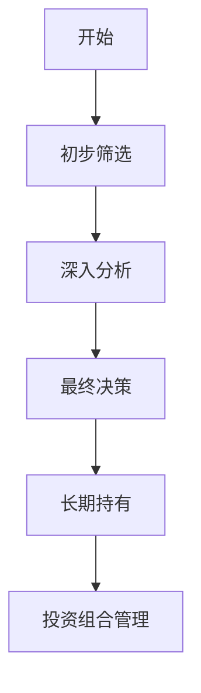
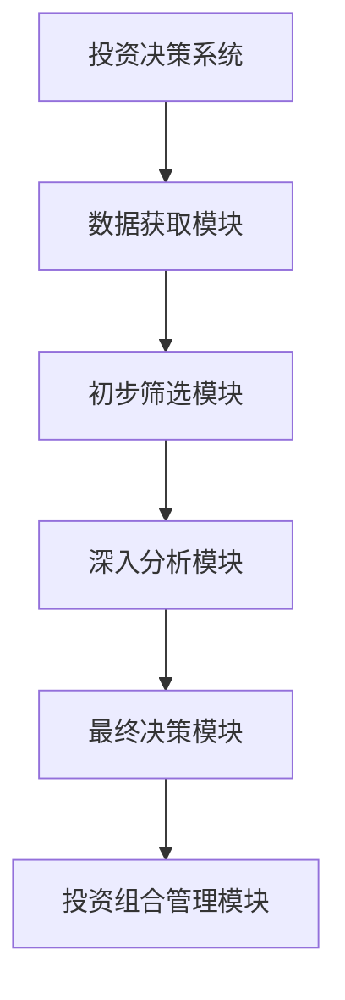
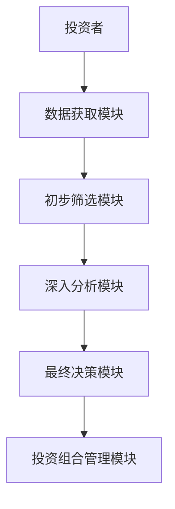

                 


# 菲利普·费雪：成长型价值投资的先驱

> 关键词：菲利普·费雪，成长型投资，价值投资，投资策略，投资哲学

> 摘要：菲利普·费雪是成长型价值投资的先驱，他的投资理念和策略对现代投资领域产生了深远影响。本文将从费雪的生平、投资理念、策略、数学模型、系统分析和项目实战等方面进行详细分析，帮助读者全面理解他的投资思想，并将其应用于实际投资中。

---

## 第1章: 菲利普·费雪的生平与投资理念

### 1.1 菲利普·费雪的生平简介
菲利普·费雪（Philip Fisher）是20世纪著名的投资家和价值投资者，被誉为“成长股投资之父”。他出生于1906年，逝世于2000年，一生致力于研究和实践成长型投资策略。

#### 1.1.1 费雪的成长经历
菲利普·费雪出生于美国加利福尼亚州的萨克拉门托，父亲是律师，母亲是家庭主妇。他在旧金山的格里姆林中学就读，之后进入斯坦福大学学习化学，但后来转向经济和投资领域。

#### 1.1.2 费雪的投资职业发展
1930年，菲利普·费雪开始从事投资工作，最初是作为一名独立投资者，后来与弟弟共同管理家族信托基金。他在投资领域的工作中，逐渐形成了自己的成长型投资理念。

#### 1.1.3 费雪的投资哲学与思想核心
费雪的投资哲学以“长期持有优质成长股”为核心，强调选择具有强大竞争优势、良好管理团队和持续增长潜力的公司。他认为，投资的最终目标是通过持有优质股票实现财富的长期增长。

### 1.2 菲利普·费雪的成长型价值投资理念
费雪的成长型投资理念是其投资思想的核心，他提出了许多独特的观点和方法。

#### 1.2.1 成长型投资的定义与特点
成长型投资是指通过投资于那些具有持续增长潜力的公司，以实现投资收益的最大化。其特点是：
1. **长期视角**：关注公司的长期增长潜力。
2. **选择优质公司**：投资于具有强大竞争优势和管理团队的公司。
3. **低周转率**：长期持有优质股票，减少频繁交易。

#### 1.2.2 费雪对成长股的筛选标准
费雪提出了著名的“15点检查法”，用于筛选成长股。这些标准包括：
- 公司是否具有强大的市场地位？
- 公司是否有持续的增长潜力？
- 公司的管理层是否值得信赖？
- 公司是否有良好的财务状况？

#### 1.2.3 费雪投资理念的核心要素
1. **关注公司基本面**：分析公司的财务报表，寻找具有持续增长潜力的公司。
2. **长期持有**：避免频繁交易，降低交易成本。
3. **分散投资**：通过投资于多个优质成长股，降低投资风险。

### 1.3 费雪投资理念的演变与影响
费雪的投资理念在实践中不断完善，并对现代投资领域产生了深远影响。

#### 1.3.1 费雪投资理念的形成过程
费雪的投资理念是在实践中逐步形成的。他从早期的“价值投资”逐渐转向“成长型投资”，并提出了许多独特的观点和方法。

#### 1.3.2 费雪理念对现代投资的影响
费雪的成长型投资理念对现代投资领域产生了深远影响。许多投资机构和投资者都采用他的方法，寻找具有持续增长潜力的公司。

#### 1.3.3 费雪理念在投资领域的地位
费雪被认为是成长型投资的鼻祖，他的投资理念和方法至今仍被广泛研究和应用。

---

## 第2章: 菲利普·费雪的投资策略与方法

### 2.1 费雪的成长股筛选标准
费雪提出了许多标准，用于筛选成长股。

#### 2.1.1 股价与价值的关系
费雪认为，股价与公司的内在价值密切相关。他强调，投资者应关注公司的内在价值，而不是短期股价波动。

#### 2.1.2 股票的内在价值评估
费雪提出了内在价值的概念，认为内在价值是公司未来现金流的现值。

#### 2.1.3 成长股的定义与特征
成长股是指那些具有持续增长潜力的公司股票。其特征包括：
1. 高增长的收入和利润。
2. 强大的竞争优势。
3. 良好的管理团队。

### 2.2 费雪的投资组合管理策略
费雪的投资组合管理策略以长期持有和分散投资为核心。

#### 2.2.1 成长股投资组合的构建
费雪建议投资者根据公司的基本面和成长潜力，选择具有持续增长潜力的公司股票。

#### 2.2.2 投资组合的风险控制
费雪强调分散投资的重要性，认为通过投资于多个优质成长股，可以降低投资风险。

#### 2.2.3 长期投资与复利效应
费雪认为，长期投资能够充分利用复利效应，实现财富的长期增长。

### 2.3 费雪的投资决策框架
费雪的投资决策框架以基本面分析和长期视角为核心。

#### 2.3.1 股票分析的三步法
1. **初步筛选**：根据公司基本面和财务状况，筛选出具有增长潜力的公司。
2. **深入分析**：进一步研究公司的竞争优势和管理团队。
3. **最终决策**：根据综合分析结果，决定是否投资。

#### 2.3.2 费雪的选股标准
费雪提出了“15点检查法”，用于筛选成长股。这些标准包括公司市场地位、财务状况、管理团队等多个方面。

#### 2.3.3 投资决策中的心理因素
费雪强调，投资者的心理因素在投资决策中起着重要作用。他建议投资者保持理性，避免情绪化决策。

### 2.4 本章小结
本章详细介绍了菲利普·费雪的投资策略与方法，包括成长股筛选标准、投资组合管理策略和投资决策框架等。

---

## 第3章: 菲利普·费雪的投资哲学与实践

### 3.1 费雪的投资哲学
费雪的投资哲学以长期持有和价值投资为核心。

#### 3.1.1 投资的第一原则
费雪认为，投资的第一原则是寻找具有持续增长潜力的公司股票。

#### 3.1.2 费雪的价值观与投资观
费雪的价值观是追求长期财富增长，而不是短期收益。他强调，投资者应关注公司的内在价值，而不是短期股价波动。

#### 3.1.3 投资中的长期思维
费雪认为，长期思维是投资成功的关键。他建议投资者保持耐心，避免短期交易。

### 3.2 费雪的投资实践案例
费雪的投资实践案例包括他对可口可乐和迪士尼的投资。

#### 3.2.1 可口可乐的投资案例
费雪在20世纪80年代初买入可口可乐股票，并长期持有。可口可乐的持续增长和强大的竞争优势，使其成为费雪投资组合中的核心股票。

#### 3.2.2 迪士尼的投资案例
费雪在20世纪90年代初买入迪士尼股票，并长期持有。迪士尼的持续增长和强大的品牌影响力，使其成为费雪投资组合中的另一核心股票。

#### 3.2.3 其他经典投资案例分析
费雪还投资了其他许多成长型公司，如英特尔和惠普。这些公司都具有强大的竞争优势和持续增长潜力。

### 3.3 费雪投资哲学的现代应用
费雪的投资哲学在现代投资中仍然具有重要的指导意义。

#### 3.3.1 成长股投资的现代挑战
现代投资环境的变化，如科技股的崛起，对成长股投资提出了新的挑战。

#### 3.3.2 费雪理念在科技股中的应用
费雪的理念在科技股投资中仍然适用。投资者应关注公司的技术创新能力和市场地位。

#### 3.3.3 投资者如何避免常见误区
投资者应避免短期交易和盲目跟风，坚持长期投资和价值投资。

### 3.4 本章小结
本章通过分析费雪的投资哲学和实践案例，展示了他如何通过长期持有优质成长股实现财富增长。

---

## 第4章: 菲利普·费雪投资策略的数学模型

### 4.1 费雪投资策略的数学模型
费雪的投资策略可以通过数学模型进行量化分析。

#### 4.1.1 成长股的内在价值计算
内在价值是公司未来现金流的现值。公式如下：
$$ V = \sum_{t=1}^{n} \frac{CF_t}{(1+r)^t} $$
其中，$V$ 是内在价值，$CF_t$ 是第 $t$ 年的现金流，$r$ 是折现率，$n$ 是时间跨度。

#### 4.1.2 股票估值的公式推导
股票估值可以通过内在价值公式进行计算。投资者应根据公司的财务数据和市场状况，估算股票的内在价值。

#### 4.1.3 费雪成长股筛选模型
费雪的成长股筛选模型包括以下步骤：
1. 筛选具有持续增长潜力的公司。
2. 分析公司的财务状况和竞争优势。
3. 评估公司的管理团队和治理结构。

### 4.2 费雪投资策略的流程图
以下是费雪投资策略的流程图：



### 4.3 费雪投资策略的代码实现
以下是费雪投资策略的代码实现示例：

```python
def fisher_investment_strategy(stocks):
    selected_stocks = []
    for stock in stocks:
        # 初步筛选：筛选具有持续增长潜力的公司
        if stock.growth_potential > 0.1:
            # 深入分析：分析公司的财务状况和竞争优势
            if stock.financial_health > 0.8 and stock.competitive_advantage > 0.7:
                # 最终决策：评估公司的管理团队和治理结构
                if stock.management_strength > 0.6:
                    selected_stocks.append(stock)
    return selected_stocks
```

### 4.4 本章小结
本章通过数学模型和代码实现，展示了费雪投资策略的科学性和可操作性。

---

## 第5章: 菲利普·费雪投资策略的系统分析与架构设计

### 5.1 系统分析与问题场景
费雪投资策略的系统分析需要考虑以下问题场景：
1. 如何筛选具有持续增长潜力的公司？
2. 如何分析公司的财务状况和竞争优势？
3. 如何评估公司的管理团队和治理结构？

### 5.2 系统架构设计
以下是费雪投资策略的系统架构设计：



### 5.3 系统交互设计
以下是系统交互设计的流程图：



### 5.4 本章小结
本章通过系统分析与架构设计，展示了费雪投资策略的实现过程。

---

## 第6章: 菲利普·费雪投资策略的项目实战

### 6.1 环境安装与配置
投资者需要安装以下环境：
1. 数据分析工具：Python、Pandas、NumPy。
2. 投资组合管理工具：Excel、投资组合管理系统。

### 6.2 系统核心实现源代码
以下是费雪投资策略的代码实现示例：

```python
import pandas as pd
import numpy as np

def fisher_investment_strategy(stocks):
    selected_stocks = []
    for stock in stocks:
        # 初步筛选：筛选具有持续增长潜力的公司
        if stock.growth_potential > 0.1:
            # 深入分析：分析公司的财务状况和竞争优势
            if stock.financial_health > 0.8 and stock.competitive_advantage > 0.7:
                # 最终决策：评估公司的管理团队和治理结构
                if stock.management_strength > 0.6:
                    selected_stocks.append(stock)
    return selected_stocks
```

### 6.3 代码应用解读与分析
1. **数据获取模块**：从数据源获取股票数据。
2. **初步筛选模块**：筛选具有持续增长潜力的公司。
3. **深入分析模块**：分析公司的财务状况和竞争优势。
4. **最终决策模块**：评估公司的管理团队和治理结构。
5. **投资组合管理模块**：根据筛选结果，构建投资组合。

### 6.4 实际案例分析和详细讲解剖析
以下是费雪投资策略的实际案例分析：

#### 6.4.1 可口可乐的投资案例
1. **初步筛选**：可口可乐具有持续增长的收入和利润。
2. **深入分析**：可口可乐具有强大的市场地位和竞争优势。
3. **最终决策**：可口可乐的管理团队和治理结构优秀，值得投资。

#### 6.4.2 迪士尼的投资案例
1. **初步筛选**：迪士尼具有持续增长的收入和利润。
2. **深入分析**：迪士尼具有强大的市场地位和竞争优势。
3. **最终决策**：迪士尼的管理团队和治理结构优秀，值得投资。

### 6.5 本章小结
本章通过项目实战，展示了费雪投资策略的实现过程和实际应用。

---

## 第7章: 总结与扩展阅读

### 7.1 本章总结
菲利普·费雪是成长型价值投资的先驱，他的投资理念和策略对现代投资领域产生了深远影响。通过长期持有优质成长股，投资者可以实现财富的长期增长。

### 7.2 最佳实践 tips
1. **长期持有**：避免频繁交易，降低交易成本。
2. **分散投资**：通过投资于多个优质成长股，降低投资风险。
3. **基本面分析**：关注公司的财务状况和竞争优势。

### 7.3 注意事项
1. **风险控制**：投资者应关注市场风险和公司风险。
2. **持续学习**：投资者应不断学习和更新投资知识。

### 7.4 拓展阅读
1. 《投资最重要的事情》——本杰明·格雷厄姆
2. 《股票作手回忆录》——埃德温·L·费尔
3. 《巴菲特传》——阿尔·哈西格

---

## 作者：AI天才研究院/AI Genius Institute & 禅与计算机程序设计艺术 /Zen And The Art of Computer Programming

