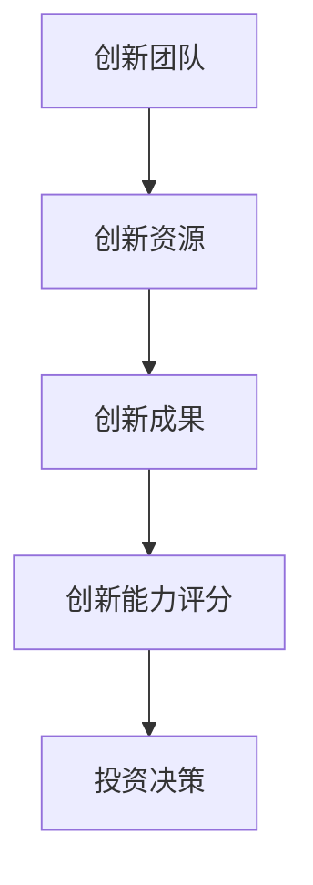

                 


# 菲利普费雪的创新企业特征

> 关键词：创新企业特征，菲利普·费雪，投资分析，创新团队，创新资源，数学模型

> 摘要：菲利普·费雪是投资分析领域的先驱，提出了创新企业特征的概念，用于识别和评估具有长期增长潜力的企业。本文详细探讨了创新企业特征的核心概念、数学模型、系统架构设计以及实际案例分析，旨在为投资者提供实用的分析工具和方法。

---

## 第一部分: 菲利普·费雪创新企业特征概述

### 第1章: 菲利普·费雪与创新企业特征概述

#### 1.1 菲利普·费雪及其投资理念

菲利普·费雪（Philip Fisher）是20世纪的投资大师，以其“成长型投资”理念闻名。他强调投资于具有强大创新能力、良好管理和成长潜力的企业。费雪的核心思想是：成功的投资不仅依赖于价格分析，更取决于对企业的深入了解，尤其是其创新能力。

#### 1.2 创新企业特征的背景与意义

创新企业在经济中扮演着关键角色，它们推动技术进步和市场发展。研究创新企业特征有助于投资者识别具有长期增长潜力的企业，同时帮助企业自身优化管理和资源分配。

---

### 第2章: 创新企业特征的核心概念

#### 2.1 创新企业特征的定义与分类

创新企业特征是指企业在创新过程中的关键属性，包括创新能力、团队构成、资源利用等。这些特征共同决定了企业的创新能力和市场竞争力。

#### 2.2 创新企业特征的核心要素

- **创新能力**：企业持续推出新产品或改进现有产品的能力。
- **创新团队**：高素质、多学科的团队，确保创新过程的顺利进行。
- **创新资源**：包括资金、技术、数据等，支持创新活动的开展。

---

## 第二部分: 创新企业特征的数学模型与分析方法

### 第3章: 创新企业特征的量化分析

#### 3.1 创新能力的评分系统

创新能力评分系统通过加权评估企业的创新能力。公式如下：

$$ \text{创新能力评分} = \sum_{i=1}^{n} w_i \cdot x_i $$

其中，$w_i$ 为权重，$x_i$ 为各个创新特征的评分。

#### 3.2 创新团队效率模型

团队效率的计算公式为：

$$ \text{团队效率} = \frac{\text{创新成果}}{\text{资源投入}} $$

---

## 第三部分: 创新企业特征的系统分析与架构设计

### 第4章: 创新企业的系统分析

#### 4.1 创新企业的系统架构

创新企业的系统架构包括核心模块：创新团队、创新资源、创新成果等。

#### 4.2 系统交互流程



---

## 第四部分: 创新企业特征的实战分析

### 第5章: 创新企业特征的项目实战

#### 5.1 案例分析：科技企业的创新特征评估

以某科技企业为例，分析其创新能力、团队构成和资源利用情况。

#### 5.2 代码实现：创新能力评分系统

```python
def calculate_innovation_score(features, weights):
    return sum(w * f for w, f in zip(weights, features))
```

---

## 第五部分: 总结与展望

### 第6章: 总结与展望

#### 6.1 文章总结

本文系统地探讨了菲利普·费雪的创新企业特征，结合数学模型和系统设计，提供了实用的分析工具。

#### 6.2 未来展望

未来的研究可以进一步优化创新能力评分模型，结合人工智能技术提高分析效率。

---

## 参考文献

1. 菲利普·费雪《成长的轨迹》
2. 投资分析相关文献

---

作者：AI天才研究院  
禅与计算机程序设计艺术

---

通过本文的详细分析，读者可以全面理解菲利普·费雪的创新企业特征，并将其应用于实际投资分析中。

