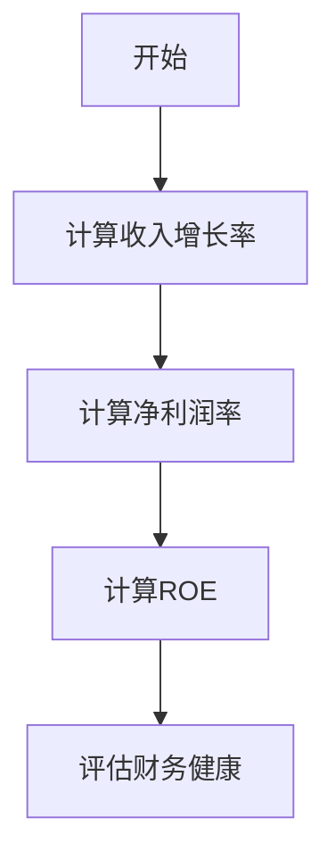
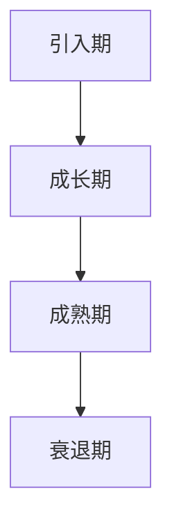
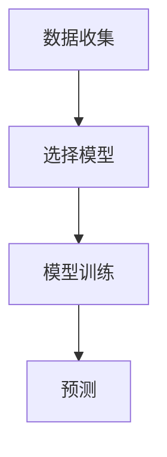
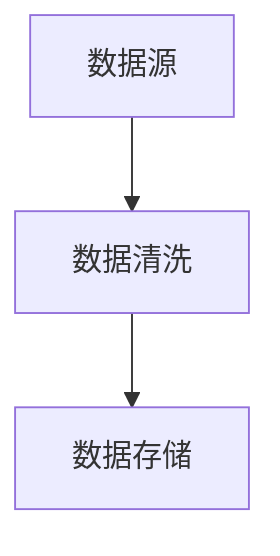
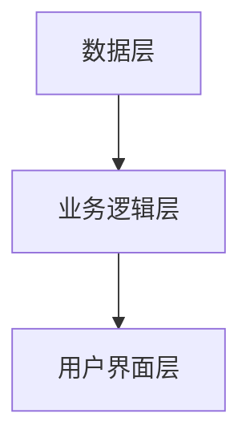

                 


# 菲利普费雪的未来增长预测

## 关键词：菲利普·费雪，增长预测，投资分析，价值投资，技术分析，投资策略

## 摘要：菲利普·费雪是投资领域的先驱，他的增长预测方法结合了基本面分析和长期投资策略。本文深入探讨了他的投资哲学、增长预测的核心要素、数学模型、系统架构以及实际应用案例，帮助读者理解和应用这些方法进行投资决策。

---

## 第一部分：菲利普·费雪的投资哲学与增长预测概述

### 第1章：菲利普·费雪的投资哲学

#### 1.1 菲利普·费雪的生平与投资理念

菲利普·费雪（Philip Fisher）是20世纪的投资大师，以成长股投资闻名。他强调投资于具有强大竞争优势和持续增长潜力的企业。费雪的投资理念基于对公司基本面的深入分析和长期趋势的预测。

#### 1.2 增长预测的基本概念

增长预测是指对企业和经济未来表现的预测，旨在识别具有可持续增长潜力的公司。费雪的增长预测方法侧重于公司的财务健康、行业地位和竞争优势。

#### 1.3 菲利普·费雪的增长预测方法

费雪通过分析公司的财务指标、行业趋势和竞争优势来评估其增长潜力。他强调选择那些具有高利润率、稳定增长和强大护城河的公司。

---

## 第二部分：增长预测的核心概念与分析框架

### 第2章：增长预测的核心要素

#### 2.1 财务指标分析

财务指标是评估公司增长潜力的关键工具。常用的指标包括收入增长率、净利润率、ROE等。

**财务指标分析流程图：**



#### 2.2 行业趋势分析

行业趋势分析帮助识别增长潜力大的行业。考虑因素包括市场规模、增长速度、技术进步和政策影响。

**行业生命周期分析流程图：**



#### 2.3 企业竞争优势分析

竞争优势是公司长期增长的关键。分析公司的成本优势、品牌影响力和技术创新能力。

---

## 第三部分：增长预测的数学模型与算法原理

### 第3章：增长预测的数学模型

#### 3.1 线性回归模型

线性回归用于预测收入或利润的增长趋势。

**线性回归公式：**

$$ y = a + bx $$

其中，$y$ 是预测值，$x$ 是自变量，$a$ 是截距，$b$ 是斜率。

#### 3.2 时间序列分析模型

时间序列分析用于预测未来的增长趋势，考虑历史数据的变动模式。

**时间序列分析流程图：**



### 第4章：增长预测系统架构设计

#### 4.1 数据收集与处理

系统从多个来源收集数据，清洗和预处理后存储。

**数据处理流程图：**



#### 4.2 系统架构设计

系统分为数据层、业务逻辑层和用户界面层，确保高效和稳定运行。

**系统架构图：**



---

## 第四部分：项目实战与案例分析

### 第5章：增长预测项目实战

#### 5.1 案例分析：科技公司增长预测

**环境安装：**

```bash
pip install numpy pandas scikit-learn
```

**代码实现：**

```python
import numpy as np
import pandas as pd
from sklearn.linear_model import LinearRegression

# 加载数据
data = pd.read_csv('company_data.csv')

# 训练模型
model = LinearRegression()
model.fit(data[['revenue']], data['profit'])

# 预测
predictions = model.predict(data[['revenue']])
```

#### 5.2 案例分析：消费行业增长预测

分析消费行业的市场规模、增长率和竞争对手情况，评估公司的增长潜力。

---

## 第五部分：最佳实践与总结

### 第6章：总结与建议

#### 6.1 最佳实践

- 长期投资，避免短期波动。
- 持续学习，更新分析方法。
- 关注行业动态，及时调整投资策略。

#### 6.2 未来展望

随着技术进步，增长预测将更加精准，结合人工智能和大数据分析，未来投资决策将更加科学和高效。

---

## 作者：AI天才研究院/AI Genius Institute & 禅与计算机程序设计艺术/Zen And The Art of Computer Programming

