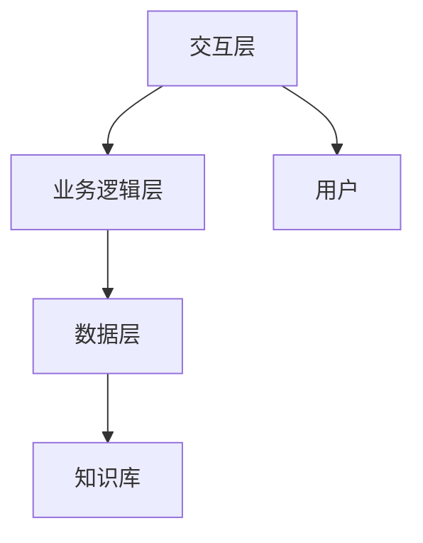
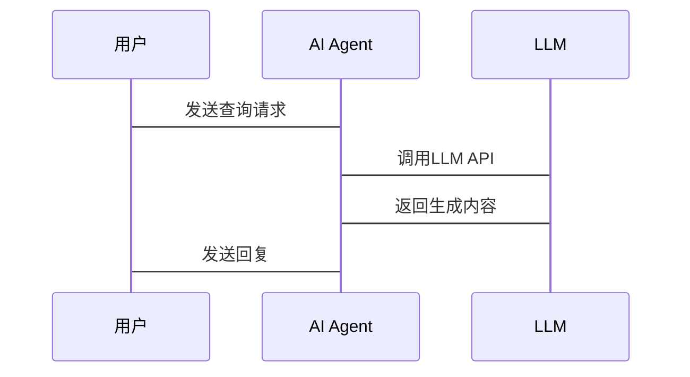

                 

# 虚拟助手 AI Agent：打造基于 LLM 的数字人

> **关键词**：AI Agent, 大语言模型, 数字人, 虚拟助手, 人机交互, 人工智能, LLM

> **摘要**：本文详细探讨了基于大语言模型（LLM）构建虚拟助手AI Agent的过程，从背景概念到技术原理，再到系统设计与项目实战，最后展望了高级应用与未来趋势。文章内容丰富，结构清晰，旨在帮助读者全面理解AI Agent的构建过程和实际应用。

---

## 第一部分：背景与概念

### 第1章：AI Agent与数字人概述

#### 1.1 AI Agent的基本概念

AI Agent（人工智能代理）是指能够感知环境、自主决策并执行任务的智能体。它能够通过与用户交互、理解上下文并执行复杂任务，提供智能化的服务。数字人则是AI Agent的一种高级形式，通常以虚拟形象呈现，能够进行自然语言对话、执行任务并提供个性化服务。

**1.1.1 AI Agent的定义与特点**

- **定义**：AI Agent是一种能够感知环境、理解用户需求并执行任务的智能系统。
- **特点**：
  - **自主性**：能够在没有人类干预的情况下自主运行。
  - **反应性**：能够实时感知环境并做出响应。
  - **学习能力**：通过数据和经验不断优化自身性能。
  - **多模态交互**：支持文本、语音、视觉等多种交互方式。

**1.1.2 大语言模型（LLM）在AI Agent中的作用**

大语言模型（LLM）是AI Agent的核心驱动力，负责处理自然语言理解和生成，执行复杂任务，并提供个性化服务。LLM通过海量数据的训练，掌握了丰富的知识和语言能力，使得AI Agent能够进行智能对话和任务执行。

**1.1.3 数字人的概念与分类**

数字人是以AI Agent为基础，结合计算机视觉、语音合成等技术，呈现出虚拟人物形象的智能系统。数字人可以分为以下几类：

- **虚拟助手**：提供信息查询、任务执行等服务。
- **虚拟形象代言人**：用于品牌推广、营销活动等。
- **虚拟教育助手**：用于在线教育、辅导等场景。
- **虚拟医疗助手**：提供医疗咨询、健康建议等服务。

#### 1.2 AI Agent与传统虚拟助手的区别

AI Agent相较于传统虚拟助手，具有更强的自主性和学习能力，能够处理更复杂的任务，并提供更个性化的服务。

**1.2.1 传统虚拟助手的功能与局限**

传统虚拟助手主要依赖于预设的规则和关键词匹配，功能相对单一，难以处理复杂的问题，也无法通过学习优化自身性能。

**1.2.2 AI Agent的核心优势**

- **智能对话**：基于LLM的深度学习能力，AI Agent能够进行更自然、更智能的对话。
- **任务执行**：AI Agent能够分解复杂任务，协调多个服务完成目标。
- **个性化服务**：通过分析用户行为和偏好，提供个性化建议和定制化服务。

**1.2.3 从虚拟助手到AI Agent的演进**

AI Agent的演进过程可以分为以下几个阶段：

1. **规则驱动阶段**：基于预设的规则和关键词匹配，提供简单的信息查询服务。
2. **关键词匹配阶段**：通过关键词匹配技术，提供更精准的信息查询服务。
3. **深度学习阶段**：引入深度学习技术，提升对话理解和生成能力。
4. **自主决策阶段**：具备自主决策能力，能够独立完成复杂任务。

#### 1.3 数字人的应用场景

数字人已经在多个领域展现了广泛的应用潜力。

**1.3.1 教育、医疗、金融等领域的应用案例**

- **教育领域**：数字人可以作为虚拟助教，为学生提供个性化学习指导。
- **医疗领域**：数字人可以作为虚拟医生，提供初步诊断和健康建议。
- **金融领域**：数字人可以作为虚拟理财顾问，提供投资建议和财务规划。

**1.3.2 AI Agent在企业级应用中的潜力**

- **企业客服**：数字人可以作为客服代表，处理客户咨询和投诉。
- **企业助手**：数字人可以作为企业助手，协助处理日常事务和任务调度。

**1.3.3 数字人与元宇宙的结合**

数字人可以作为元宇宙中的虚拟角色，提供互动服务和娱乐体验，增强用户的沉浸感和参与感。

---

## 第二部分：技术原理

### 第2章：大语言模型（LLM）基础

#### 2.1 大语言模型的结构与原理

大语言模型（LLM）通常基于Transformer架构，通过自注意力机制和前馈网络实现强大的自然语言处理能力。

**2.1.1 Transformer模型的结构**

Transformer模型由编码器和解码器两部分组成，编码器负责将输入文本转换为向量表示，解码器负责将向量表示转换为输出文本。

**2.1.2 注意力机制的数学公式**

自注意力机制的计算公式如下：

$$
\text{Attention}(Q, K, V) = \text{softmax}\left(\frac{QK^T}{\sqrt{d_k}}\right)V
$$

其中，\(Q\)、\(K\)、\(V\)分别是查询、键和值向量，\(d_k\)是向量的维度。

**2.1.3 LLM的训练过程**

- **预训练**：在海量文本数据上进行无监督学习，目标是生成与输入相似的文本。
- **微调**：在特定任务数据上进行有监督学习，优化模型在特定任务上的表现。

#### 2.2 LLM与AI Agent的关系

AI Agent通过调用LLM API，利用其强大的语言处理能力，实现智能对话和任务执行。

**2.2.1 LLM作为AI Agent的核心驱动**

AI Agent通过调用LLM API，可以进行自然语言理解、生成和对话管理，实现复杂的任务执行。

**2.2.2 AI Agent如何利用LLM进行自然语言处理**

- **对话生成**：AI Agent根据用户输入，通过LLM生成自然流畅的回复。
- **任务分解**：AI Agent将用户需求分解为多个子任务，协调多个LLM实例完成目标。
- **知识库查询**：AI Agent通过LLM调用知识库，获取所需信息并返回给用户。

**2.2.3 LLM的局限性与优化方向**

- **计算资源需求高**：LLM的训练和推理需要大量的计算资源，限制了其在资源受限环境中的应用。
- **模型更新周期长**：LLM的更新和优化需要长时间的训练和测试，难以实时响应用户需求。
- **数据隐私问题**：LLM的训练依赖于海量数据，可能存在数据隐私泄露的风险。

---

## 第三部分：系统设计

### 第4章：AI Agent的系统架构

#### 4.1 系统架构设计

AI Agent的系统架构通常采用分层架构，包括交互层、业务逻辑层和数据层。

**4.1.1 分层架构的设计思路**

- **交互层**：负责与用户的交互，包括文本、语音等多种交互方式。
- **业务逻辑层**：负责任务分解、协调服务和结果生成。
- **数据层**：负责数据存储、查询和管理。

**4.1.2 模块化设计的优势**

模块化设计使得系统更加灵活和易于扩展，每个模块可以独立开发和测试，降低系统的耦合性。

**4.1.3 系统架构的mermaid图**

#### 4.2 功能模块设计

AI Agent的功能模块包括对话模块、任务执行模块和知识库模块。

**4.2.1 对话模块的功能设计**

- **输入处理**：接收用户的输入，解析用户的意图。
- **对话生成**：基于LLM生成回复，返回给用户。

**4.2.2 任务执行模块的功能设计**

- **任务分解**：将用户需求分解为多个子任务。
- **服务协调**：协调多个服务完成子任务。
- **结果汇总**：将子任务的结果汇总，返回给用户。

**4.2.3 知识库模块的设计**

- **知识存储**：存储结构化和非结构化的知识。
- **知识查询**：根据用户需求，从知识库中查询相关信息。
- **知识更新**：定期更新知识库，保持知识的准确性。

---

## 第四部分：项目实战

### 第5章：系统接口与交互设计

#### 5.1 系统接口设计

AI Agent的系统接口包括API接口和用户界面。

**5.1.1 API接口的设计**

- **输入接口**：接收用户的输入，包括文本、语音等。
- **输出接口**：返回系统的输出，包括文本、语音等。

**5.1.2 用户界面设计**

- **文本交互界面**：用户通过输入框输入文本，系统通过文本框输出回复。
- **语音交互界面**：用户通过语音输入，系统通过语音输出回复。

#### 5.2 交互流程设计

**5.2.1 交互流程的mermaid序列图**

---

## 第五部分：高级应用与未来展望

### 第6章：高级应用与未来展望

#### 6.1 高级应用场景

**6.1.1 教育领域**：数字人可以作为虚拟助教，为学生提供个性化学习指导。

**6.1.2 医疗领域**：数字人可以作为虚拟医生，提供初步诊断和健康建议。

**6.1.3 金融领域**：数字人可以作为虚拟理财顾问，提供投资建议和财务规划。

#### 6.2 未来技术趋势

**6.2.1 模型优化**：通过模型压缩和量化技术，降低LLM的计算资源需求。

**6.2.2 多模态交互**：结合视觉、语音等多种交互方式，提升用户体验。

**6.2.3 伦理与隐私**：加强对数据隐私和伦理的考虑，确保AI Agent的安全和合规性。

---

## 结语

打造基于大语言模型的数字人AI Agent是一项具有挑战性但又充满潜力的任务。通过深入了解其技术原理和系统设计，我们可以更好地构建智能化的虚拟助手，为用户带来更便捷、更个性化的服务。

---

**作者：AI天才研究院/AI Genius Institute & 禅与计算机程序设计艺术 /Zen And The Art of Computer Programming**

