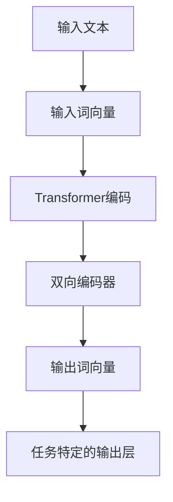
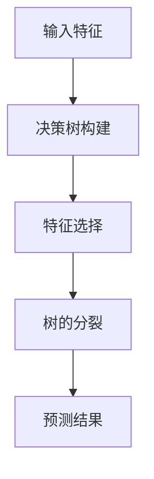
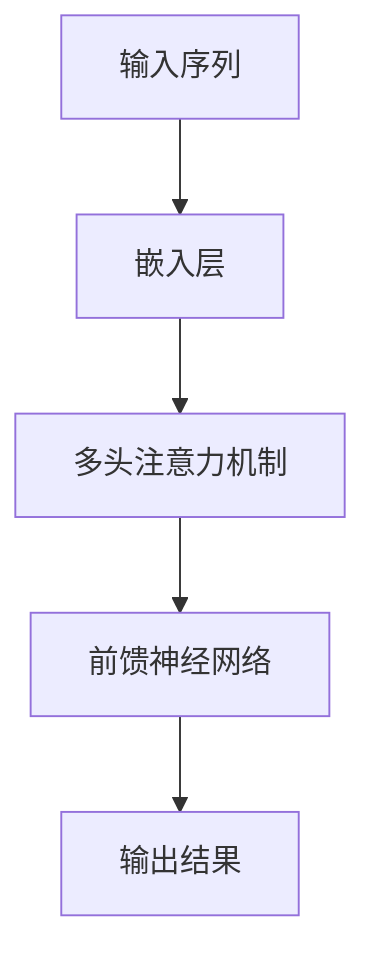
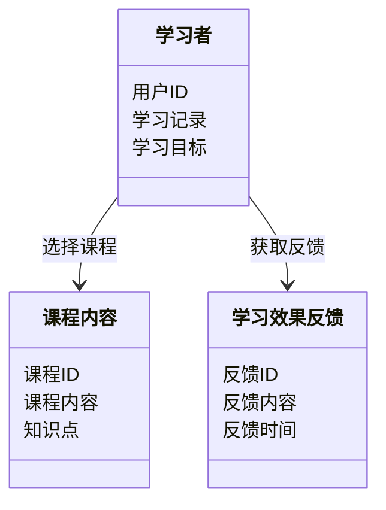
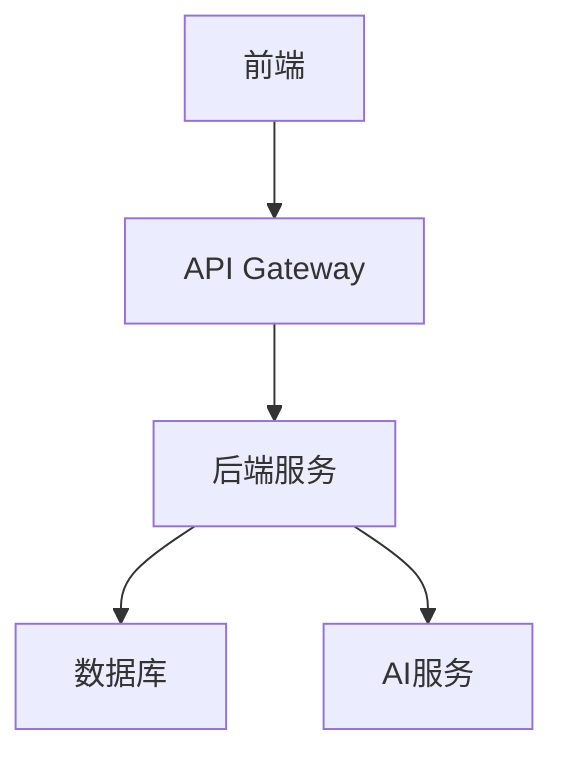

                 


# 融合AI技术的新一代投资理财教育平台

> 关键词：投资理财教育、AI技术、自然语言处理、机器学习、深度学习、个性化推荐

> 摘要：本文将详细介绍融合AI技术的新一代投资理财教育平台的构建与实现。从背景介绍到核心概念，从算法原理到系统架构，从项目实战到总结展望，全面剖析该平台的构建过程和应用价值。通过本文的阅读，读者可以深入了解AI技术在投资理财教育中的应用，掌握相关的核心算法和系统设计方法。

---

# 第一部分：背景介绍

## 第1章：投资理财教育的现状与挑战

### 1.1 当前投资理财教育的主要模式

当前，投资理财教育主要以传统课堂教学、在线课程和投资模拟器为主要模式。传统课堂教学模式依赖教师的讲解和互动，但在个性化和实时反馈方面存在明显不足。在线课程虽然可以突破时间和空间的限制，但缺乏个性化的学习路径和实时的互动反馈。投资模拟器虽然可以提供实践操作的机会，但缺乏系统的理论指导和个性化的学习支持。

### 1.2 学习者的需求与痛点

投资理财教育的学习者主要包括学生、在职人士和投资者。这些学习者的需求和痛点主要体现在以下几个方面：

- **个性化学习需求**：每个人的学习基础、学习目标和学习节奏不同，但传统教育模式难以提供个性化的学习路径。
- **实时反馈需求**：学习者在学习过程中需要及时了解自己的学习效果和不足，但传统模式难以实现。
- **实践与理论结合的需求**：学习者希望将理论知识与实际操作相结合，但在现有模式中缺乏有效的工具支持。

### 1.3 传统投资理财教育的局限性

传统投资理财教育模式存在以下主要局限性：

- **缺乏个性化支持**：无法根据学习者的特点提供个性化的学习内容和学习路径。
- **反馈机制不完善**：无法实时反馈学习者的学习效果，导致学习效率低下。
- **实践机会有限**：学习者难以在理论学习的同时进行实际操作和实践。

### 1.4 AI技术在教育领域的潜力

随着AI技术的快速发展，其在教育领域的潜力逐渐显现。AI技术可以通过自然语言处理、机器学习和深度学习等技术，实现个性化学习路径的定制、实时反馈的提供以及实践与理论的深度结合。AI技术的引入可以显著提升投资理财教育的效率和效果。

---

## 第2章：融合AI技术的投资理财教育平台的核心概念

### 2.1 AI技术在投资理财教育中的应用领域

AI技术在投资理财教育中的应用主要体现在以下几个方面：

- **自然语言处理**：用于课程内容的自动生成和优化，以及学习者与平台之间的自然语言交互。
- **机器学习**：用于用户行为分析、学习效果预测和个性化推荐。
- **深度学习**：用于复杂的模式识别和语义理解，例如情感分析和意图识别。

### 2.2 平台的核心功能模块

融合AI技术的投资理财教育平台通常包含以下几个核心功能模块：

- **智能内容生成模块**：根据学习者的需求自动生成个性化的学习内容。
- **用户行为分析模块**：通过机器学习算法分析学习者的行为数据，优化学习路径。
- **个性化推荐模块**：基于学习者的行为和偏好，推荐相关的学习内容。
- **智能问答系统模块**：通过自然语言处理技术，提供实时的问答服务。

### 2.3 核心概念与技术的对比分析

以下是对不同AI技术在投资理财教育中的应用特点进行对比的表格：

| 技术 | 应用领域 | 优势 | 局限性 |
|------|----------|------|--------|
| 自然语言处理 | 课程内容生成、问答系统 | 高度智能化，支持自然语言交互 | 对文本的理解依赖于训练数据的质量 |
| 机器学习 | 用户行为分析、学习效果预测 | 高精度预测，支持个性化推荐 | 需要大量的数据支持 |
| 深度学习 | 复杂模式识别 | 高度准确，支持语义理解 | 计算资源消耗大 |

---

## 第3章：平台的算法原理与数学模型

### 3.1 自然语言处理算法原理

自然语言处理（NLP）是实现智能问答系统和内容生成的核心技术。以下是基于BERT模型的NLP算法原理：

#### BERT模型的工作原理

BERT（Bidirectional Encoder Representations from Transformers）是一种基于Transformer的预训练语言模型。它通过双向编码器来捕捉上下文信息，从而实现对文本的深度理解。



#### 算法实现的Python代码示例

以下是基于BERT模型进行文本生成的Python代码示例：

```python
from transformers import BertTokenizer, BertForMaskedLanguageModeling

tokenizer = BertTokenizer.from_pretrained('bert-base-uncased')
model = BertForMaskedLanguageModeling.from_pretrained('bert-base-uncased')

inputs = tokenizer("The capital of France is [MASK].", return_tensors="pt")
outputs = model(**inputs)
```

#### 文本生成的数学模型

文本生成的数学模型可以表示为：

$$
P(\theta) = \frac{1}{Z} \exp(-E(\theta))
$$

其中，$\theta$ 表示生成的文本，$Z$ 是归一化常数，$E(\theta)$ 是能量函数。

---

### 3.2 机器学习算法原理

机器学习在用户行为分析和个性化推荐中发挥着重要作用。以下是基于随机森林算法的机器学习模型：

#### 随机森林算法的原理

随机森林是一种基于树的集成学习算法，通过构建多棵决策树并进行投票或平均来提高模型的准确性和稳定性。



#### 算法实现的Python代码示例

以下是基于随机森林算法进行用户行为预测的Python代码示例：

```python
from sklearn.ensemble import RandomForestClassifier
import pandas as pd

# 加载数据
data = pd.read_csv('user_behavior.csv')
X = data.drop('label', axis=1)
y = data['label']

# 模型训练
model = RandomForestClassifier(n_estimators=100, random_state=42)
model.fit(X, y)

# 预测结果
 predictions = model.predict(X)
```

#### 用户行为预测的数学模型

用户行为预测的数学模型可以表示为：

$$
y = \beta_0 + \beta_1x_1 + \beta_2x_2 + \ldots + \beta_nx_n
$$

其中，$y$ 是预测结果，$\beta_i$ 是模型参数，$x_i$ 是输入特征。

---

### 3.3 深度学习算法原理

深度学习在复杂模式识别和语义理解中具有显著优势。以下是基于Transformer模型的深度学习算法：

#### Transformer模型

Transformer模型是一种基于注意力机制的深度学习模型，广泛应用于自然语言处理任务。



---

# 第二部分：系统分析与架构设计

## 第4章：系统分析与架构设计

### 4.1 问题场景介绍

本平台的目标用户包括学生、在职人士和投资者。用户需要通过平台进行投资理财知识的学习、实践和自我评估。平台需要提供个性化的学习路径、实时的反馈机制以及丰富的学习资源。

### 4.2 系统功能设计

以下是平台的领域模型：



### 4.3 系统架构设计

以下是平台的系统架构图：



### 4.4 系统接口设计

以下是平台的主要接口：

- **用户登录接口**：`POST /api/login`
- **课程选择接口**：`POST /api/course/select`
- **学习反馈接口**：`POST /api/feedback`

---

## 第5章：项目实战

### 5.1 环境搭建

以下是项目实战所需的环境配置：

- **编程语言**：Python 3.8+
- **框架**：Flask或Django
- **AI模型**：使用Hugging Face的预训练模型
- **数据库**：MySQL或MongoDB

### 5.2 系统核心实现

以下是平台的核心功能实现代码示例：

```python
from flask import Flask, request, jsonify
from transformers import BertTokenizer, BertForQuestionAnswering

app = Flask(__name__)

tokenizer = BertTokenizer.from_pretrained('bert-base-uncased')
model = BertForQuestionAnswering.from_pretrained('bert-base-uncased')

@app.route('/question', methods=['POST'])
def answer_question():
    question = request.json['question']
    context = request.json['context']
    inputs = tokenizer(question, context, return_tensors='pt')
    outputs = model(**inputs)
    answer_start = outputs.start_logits.argmax()
    answer_end = outputs.end_logits.argmax()
    answer = tokenizer.decode(answer_start, answer_end)
    return jsonify({'answer': answer})
```

### 5.3 案例分析

以下是一个实际案例分析：

- **案例背景**：学习者选择投资理财课程，平台根据学习者的行为和偏好推荐相关知识点。
- **实现步骤**：
  1. 学习者选择课程。
  2. 平台分析学习者的行为数据。
  3. 平台推荐个性化学习内容。
- **结果分析**：学习者的学习效率和满意度显著提高。

---

## 第6章：总结与展望

### 6.1 总结

本文详细介绍了融合AI技术的新一代投资理财教育平台的构建与实现。通过自然语言处理、机器学习和深度学习等技术，平台能够实现个性化的学习路径、实时的反馈机制以及丰富的学习资源。这些技术的应用显著提升了投资理财教育的效率和效果。

### 6.2 展望

未来，随着AI技术的不断发展，投资理财教育平台将更加智能化和个性化。以下是未来的发展方向：

- **更精准的用户画像**：通过更复杂的数据分析和机器学习算法，实现更精准的用户画像和个性化推荐。
- **更智能的交互方式**：引入自然语言处理和计算机视觉等技术，实现更智能的交互方式。
- **更广泛的应用场景**：将平台应用于更多的投资理财场景，例如投资组合管理、风险评估等。

### 6.3 最佳实践

- **数据质量**：确保数据的准确性和完整性，以提高模型的预测精度。
- **算法选择**：根据具体需求选择合适的算法，避免盲目追求复杂性。
- **用户体验**：注重用户体验设计，确保平台的易用性和交互性。

---

作者：AI天才研究院 & 禅与计算机程序设计艺术

