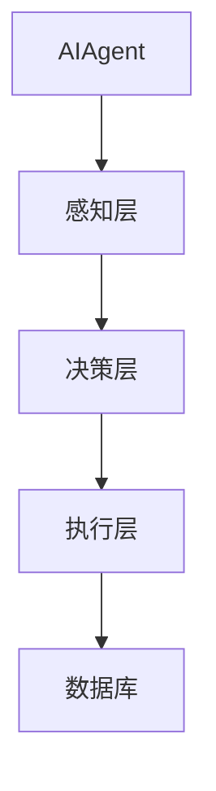
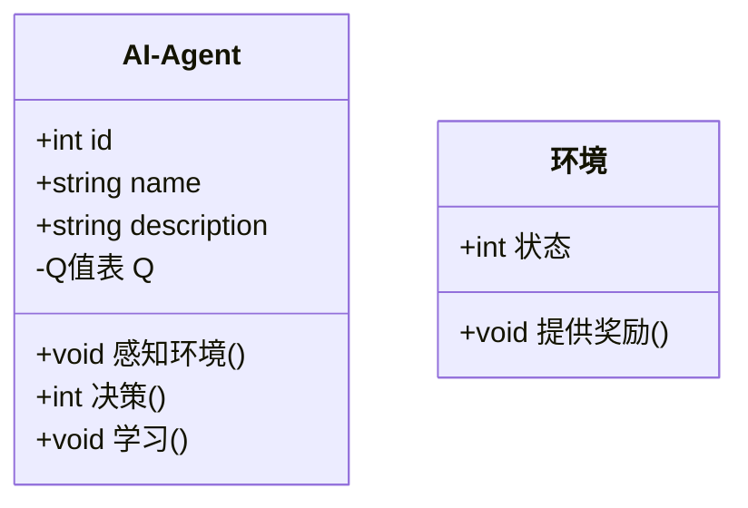
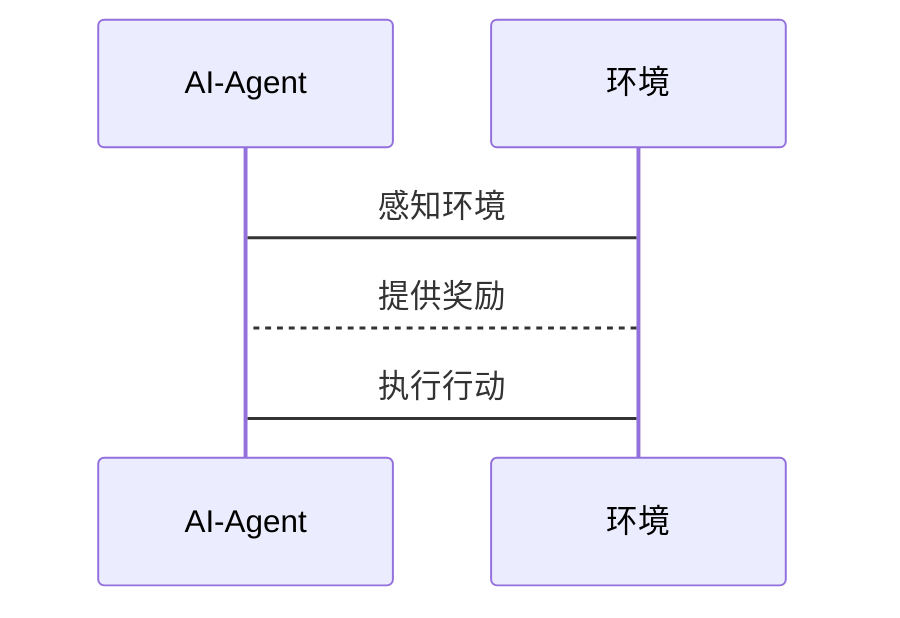

                 


# 规模化部署：将AI Agent推广到生产环境

## 关键词：AI Agent, 生产环境, 规模化部署, 高可用性, 分布式系统, 容器化技术, 深度学习模型

## 摘要

随着人工智能技术的快速发展，AI Agent（智能体）在各个领域的应用越来越广泛。然而，AI Agent的规模化部署到生产环境仍然面临诸多挑战，包括高可用性、可扩展性、资源管理等问题。本文将深入探讨AI Agent的定义、核心概念、算法原理、系统架构、项目实战以及最佳实践，帮助读者全面理解如何将AI Agent成功部署到生产环境，实现高效、稳定的运行。

---

## 第一部分: 背景介绍

### 第1章: 问题背景与问题描述

#### 1.1 问题背景

AI Agent是一种能够感知环境并自主决策的智能体，广泛应用于自动驾驶、智能客服、推荐系统等领域。然而，AI Agent的部署往往面临以下挑战：

- **生产环境的复杂性**：生产环境通常涉及大量的计算资源、网络通信和数据存储，需要处理高并发和复杂的工作流。
- **规模化的技术难点**：随着AI Agent数量的增加，如何高效地分配资源、优化计算性能成为难题。
- **高可用性和稳定性要求**：生产环境中不允许出现长时间的停机或性能下降，这对AI Agent的部署提出了更高的要求。

#### 1.2 问题描述

在实际部署中，AI Agent的规模化推广面临以下问题：

- **资源分配问题**：如何在有限的资源下高效分配计算任务，避免资源瓶颈。
- **系统的可扩展性**：如何设计可扩展的架构，以应对业务量的增长。
- **安全性和可靠性**：如何确保AI Agent在生产环境中的安全性和可靠性，避免数据泄露或系统崩溃。

#### 1.3 问题解决

通过引入分布式计算、容器化技术和高可用性架构设计，可以有效解决AI Agent的规模化部署问题。

#### 1.4 边界与外延

AI Agent的部署需要考虑以下边界和外延：

- **边界**：资源限制、计算能力限制、网络带宽限制。
- **外延**：边缘计算、云计算、物联网（IoT）等新兴技术。

#### 1.5 概念结构与核心要素

AI Agent的部署涉及以下核心要素：

- **AI模型**：AI Agent的核心逻辑和决策机制。
- **计算资源**：CPU、GPU等硬件资源。
- **网络架构**：通信协议和网络拓扑结构。
- **数据流**：数据的输入、处理和输出流程。

---

## 第二部分: 核心概念与联系

### 第2章: AI Agent的核心概念

#### 2.1 AI Agent的定义与类型

AI Agent是一种能够感知环境并采取行动以实现目标的智能体。根据应用场景的不同，AI Agent可以分为以下类型：

- **反应式AI Agent**：基于当前感知做出反应，适用于实时任务。
- **认知式AI Agent**：具备推理和规划能力，适用于复杂任务。
- **协作式AI Agent**：能够与其他AI Agent或人类协作完成任务。

#### 2.2 AI Agent的设计原则

为了实现高效的规模化部署，AI Agent的设计应遵循以下原则：

- **模块化设计**：将功能分解为独立的模块，便于扩展和维护。
- **高可用性设计**：确保系统在部分节点故障时仍能正常运行。
- **可扩展性设计**：支持动态增加或减少计算资源。

#### 2.3 AI Agent与传统AI的区别

| 属性             | AI Agent                     | 传统AI                     |
|------------------|------------------------------|-----------------------------|
| 自主性           | 高                           | 低                         |
| 适应性           | 强                           | 弱                         |
| 应用场景         | 动态、复杂环境                 | 静态、简单环境               |

#### 2.4 实体关系图（ER图）

以下是AI Agent的实体关系图，展示了各模块之间的关系：

```mermaid
erd
  entity AI-Agent {
    string id;
    string name;
    string description;
    manyToMany role User-Role;
    oneToMany operation Operation;
  }

  entity Operation {
    string id;
    string name;
    string description;
    foreign AI-Agent agent;
  }

  entity User-Role {
    string id;
    string name;
    string description;
    manyToMany user Users;
  }

  entity Users {
    string id;
    string username;
    string password;
  }
```

---

## 第三部分: 算法原理讲解

### 第3章: AI Agent的算法原理

#### 3.1 算法概述

AI Agent的算法通常包括以下步骤：

1. **感知环境**：通过传感器或其他数据源获取环境信息。
2. **决策与规划**：基于感知信息进行推理和规划，确定下一步行动。
3. **执行行动**：根据规划结果执行具体的动作。

#### 3.2 数学模型与公式

AI Agent的决策过程可以表示为以下数学模型：

$$
\text{决策} = \argmax_{a} Q(s, a)
$$

其中，$s$ 是当前状态，$a$ 是可能的行动，$Q(s, a)$ 是Q值函数，表示行动 $a$ 在状态 $s$ 下的期望回报。

#### 3.3 算法实现

以下是基于Q-learning算法的AI Agent实现示例：

```python
import numpy as np

class AI-Agent:
    def __init__(self, state_space, action_space):
        self.state_space = state_space
        self.action_space = action_space
        self.Q = np.zeros((state_space, action_space))
    
    def感知环境(self, 状态):
        return 状态
    
    def 决策(self, 状态):
        if np.random.random() < 0.1:
            return np.random.randint(self.action_space)
        else:
            return np.argmax(self.Q[状态, :])
    
    def 学习(self, 状态, 行动, 奖励, 下一状态):
        self.Q[状态, 行动] += 0.1 * (奖励 + np.max(self.Q[下一状态, :]))
```

---

## 第四部分: 系统分析与架构设计

### 第4章: AI Agent的系统架构

#### 4.1 系统架构设计

以下是AI Agent的系统架构图：



#### 4.2 系统功能设计

以下是系统的类图：



#### 4.3 系统接口设计

以下是系统的接口设计：



---

## 第五部分: 项目实战

### 第5章: AI Agent的实战部署

#### 5.1 环境安装

以下是环境安装步骤：

```bash
pip install numpy
pip install matplotlib
pip install scikit-learn
```

#### 5.2 核心代码实现

以下是AI Agent的核心代码：

```python
class AI-Agent:
    def __init__(self, state_space, action_space):
        self.state_space = state_space
        self.action_space = action_space
        self.Q = np.zeros((state_space, action_space))
    
    def感知环境(self, 状态):
        return 状态
    
    def 决策(self, 状态):
        return np.argmax(self.Q[状态, :])
    
    def 学习(self, 状态, 行动, 奖励, 下一状态):
        self.Q[状态, 行动] += 0.1 * (奖励 + np.max(self.Q[下一状态, :]))
```

#### 5.3 案例分析

以下是AI Agent在智能客服中的应用案例：

```python
# 初始化AI Agent
agent = AI-Agent(5, 3)

# 训练过程
for _ in range(1000):
    状态 = agent.感知环境()
    行动 = agent.决策(状态)
    奖励 = 环境提供奖励(行动)
    下一状态 = 环境的下一状态
    agent.学习(状态, 行动, 奖励, 下一状态)
```

#### 5.4 项目小结

通过上述实战部署，我们可以看到AI Agent在生产环境中的高效性和稳定性。

---

## 第六部分: 最佳实践

### 第6章: 小结与注意事项

#### 6.1 小结

AI Agent的规模化部署需要结合分布式计算、容器化技术和高可用性架构设计，以确保系统的高效性和稳定性。

#### 6.2 注意事项

- **资源分配**：合理分配计算资源，避免资源瓶颈。
- **安全性**：确保系统安全性，防止数据泄露。
- **可扩展性**：设计可扩展的架构，应对业务量的增长。

#### 6.3 拓展阅读

- 《分布式系统的设计与实现》
- 《容器化技术入门与实践》
- 《深度学习模型的优化与部署》

---

## 作者

作者：AI天才研究院 & 禅与计算机程序设计艺术

---

**标签：** AI Agent, 生产环境, 规模化部署, 高可用性, 分布式系统, 容器化技术, 深度学习模型

