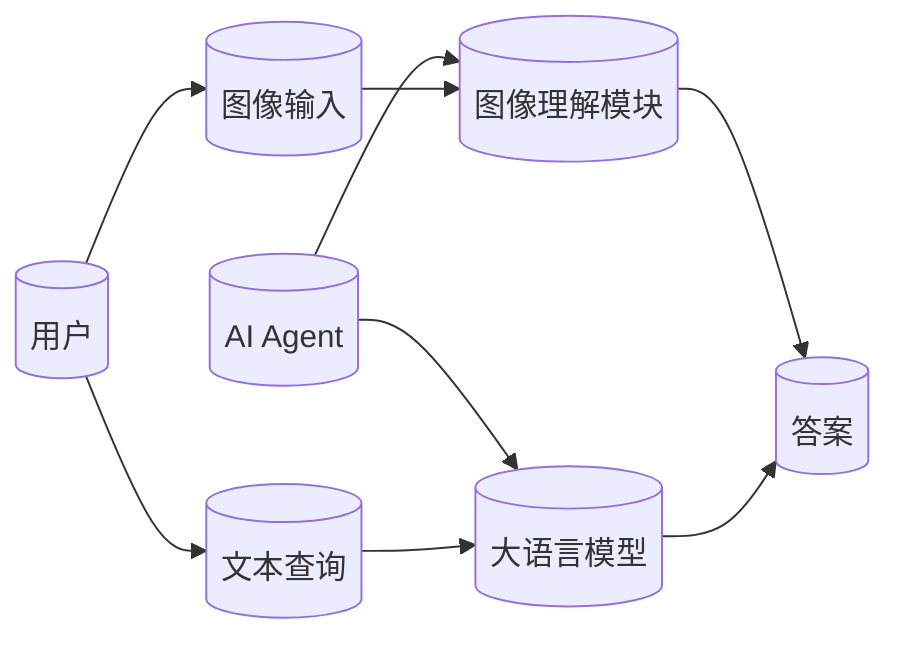
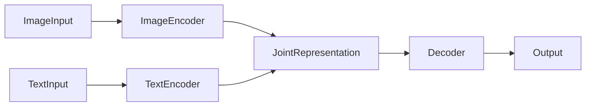
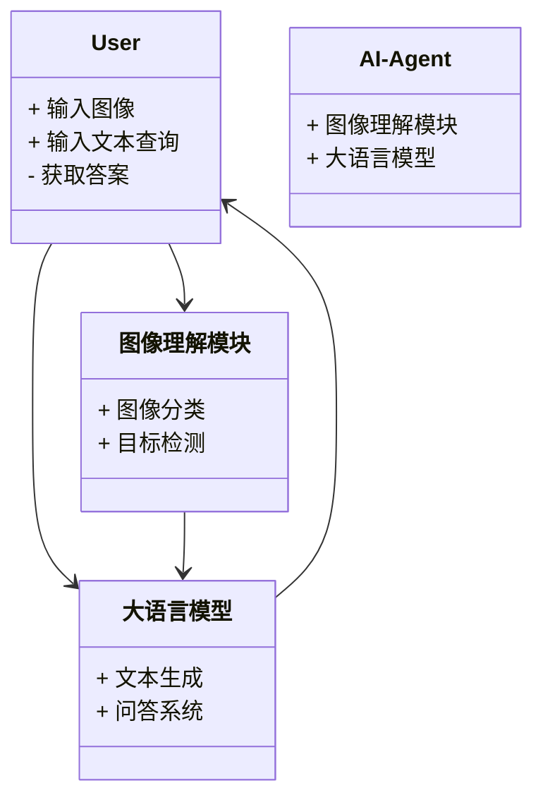
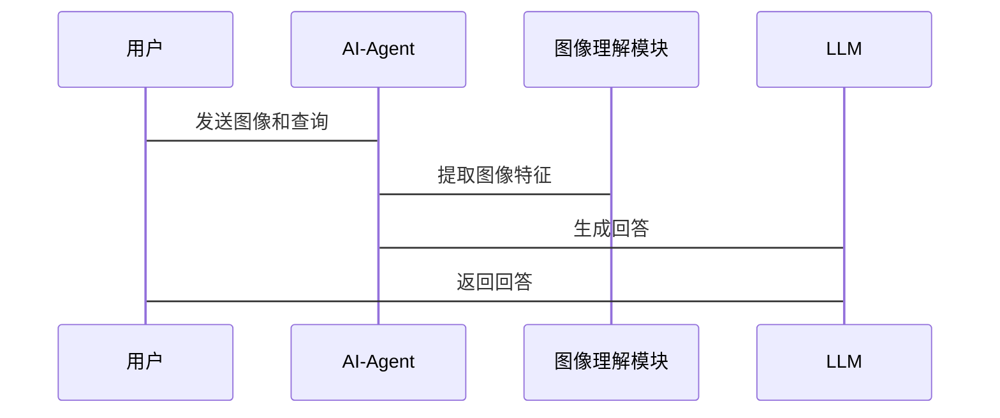

                 


---

# 视觉-语言AI Agent：整合LLM与图像理解

## 关键词：
视觉-语言AI Agent, 大语言模型, 图像理解, 多模态学习, 视觉问答系统, 图像描述生成

## 摘要：
视觉-语言AI Agent通过整合大语言模型（LLM）与图像理解技术，实现了跨模态的智能交互。本文从背景、核心概念、算法原理、系统架构到项目实战，详细分析了视觉-语言AI Agent的构建过程，并通过案例展示了其实际应用。文章最后总结了关键点并提供了最佳实践建议。

---

# 第一部分: 视觉-语言AI Agent的背景与概述

## 第1章: 视觉-语言AI Agent的背景与概述

### 1.1 问题背景与问题描述
#### 1.1.1 当前AI技术的发展现状
近年来，人工智能技术迅速发展，大语言模型（LLM）如GPT-4在自然语言处理领域取得了显著成果，而图像理解技术也在计算机视觉领域取得了重要进展。然而，如何将这两种能力有机结合，构建能够处理视觉和语言任务的智能体，仍然是一个重要的研究方向。

#### 1.1.2 视觉与语言理解的结合需求
在实际应用中，许多任务需要同时处理视觉和语言信息，例如图像描述生成、视觉问答系统等。传统的单一模态方法难以满足复杂场景的需求，因此，整合视觉和语言理解能力的AI Agent成为必然趋势。

#### 1.1.3 视觉-语言AI Agent的定义与目标
视觉-语言AI Agent是一种能够同时处理视觉和语言信息的智能体，其目标是通过整合LLM和图像理解技术，实现跨模态的智能交互和任务处理。这种技术可以应用于多个领域，如智能助手、机器人控制、图像搜索等。

---

# 第二部分: 视觉-语言AI Agent的核心概念与联系

## 第2章: 视觉-语言AI Agent的核心概念

### 2.1 大语言模型（LLM）的基本原理
#### 2.1.1 LLM的定义与特点
大语言模型是一种基于深度学习的自然语言处理模型，具有以下特点：
- **大规模训练数据**：通常使用海量文本数据进行训练，如互联网上的网页内容、书籍等。
- **多任务能力**：能够处理多种语言任务，如文本生成、翻译、问答等。
- **上下文理解**：通过长上下文窗口，能够理解上下文关系，生成连贯的文本。

#### 2.1.2 LLM的训练过程与数学模型
大语言模型的训练过程通常采用自监督学习，目标是最小化预测的损失函数。其数学模型可以表示为：
$$
\mathcal{L}(\theta) = -\sum_{i=1}^{n} \log p_\theta(x_i)
$$
其中，$\theta$是模型参数，$x_i$是输入序列。

#### 2.1.3 LLM在视觉任务中的应用潜力
LLM可以通过文本描述生成、问答系统等方式，辅助图像理解任务。例如，LLM可以生成图像的描述文本，帮助用户理解图像内容。

### 2.2 图像理解的核心技术
#### 2.2.1 图像分类与目标检测
图像分类任务的目标是将图像分类到预定义的类别中，常用模型如ResNet、VGG等。目标检测任务则需要定位图像中的目标并进行分类，常用模型如Faster R-CNN。

#### 2.2.2 图像分割与图像生成
图像分割任务将图像划分为多个区域，常用模型如U-Net。图像生成任务可以通过GAN（生成对抗网络）实现，如CycleGAN。

#### 2.2.3 图像理解的挑战与解决方案
图像理解的挑战包括光照变化、遮挡、背景干扰等。解决方案包括使用深度学习模型提取高层特征，以及结合上下文信息进行推理。

### 2.3 视觉-语言AI Agent的实体关系图
#### 2.3.1 实体关系图的构建
通过构建实体关系图，我们可以清晰地展示视觉-语言AI Agent中的各个实体及其关系。例如，用户输入图像和查询，AI Agent通过LLM和图像理解模块生成回答。

#### 2.3.2 实体关系图的属性特征对比表
| 实体 | 属性 | 特征 |
|------|------|------|
| 用户 | 输入 | 图像、文本查询 |
| AI Agent | 模块 | LLM、图像理解模块 |
| 输出 | 结果 | 图像描述、答案 |

#### 2.3.3 实体关系图的Mermaid流程图


---

# 第三部分: 视觉-语言AI Agent的算法原理

## 第3章: 视觉-语言AI Agent的算法原理

### 3.1 多模态编码器与解码器
#### 3.1.1 多模态编码器的结构与功能
多模态编码器将图像和文本输入转化为统一的表示形式，常用模型如CLIP。其结构包括图像编码器和文本编码器，分别提取图像和文本的特征。

#### 3.1.2 多模态解码器的结构与功能
多模态解码器将编码器输出的特征解码为目标模态的输出，例如从图像特征解码为文本描述。

#### 3.1.3 编码器与解码器的协同工作流程
编码器将输入的图像和文本转化为统一的特征表示，解码器根据这些特征生成目标输出，如图像描述或答案。

### 3.2 视觉-语言联合学习算法
#### 3.2.1 视觉-语言联合学习的定义
视觉-语言联合学习是指同时利用图像和文本数据进行模型训练，以提高模型的多模态理解能力。

#### 3.2.2 视觉-语言联合学习的数学模型
视觉-语言联合学习的目标是最小化以下损失函数：
$$
\mathcal{L} = \mathcal{L}_{\text{image}} + \mathcal{L}_{\text{text}}
$$
其中，$\mathcal{L}_{\text{image}}$和$\mathcal{L}_{\text{text}}$分别表示图像和文本的损失。

#### 3.2.3 视觉-语言联合学习的Mermaid流程图


### 3.3 基于LLM的图像理解算法
#### 3.3.1 LLM在图像理解中的应用
LLM可以用于生成图像描述、回答与图像相关的问题等任务。

#### 3.3.2 基于LLM的图像描述生成算法
图像描述生成的流程如下：
1. 使用图像理解模块提取图像特征。
2. 将图像特征输入LLM，生成图像的描述文本。

#### 3.3.3 基于LLM的图像问答系统设计
图像问答系统的工作流程：
1. 用户输入图像和问题。
2. AI Agent通过图像理解模块提取图像特征。
3. LLM根据图像特征和问题生成答案。

---

# 第四部分: 视觉-语言AI Agent的系统分析与架构设计

## 第4章: 视觉-语言AI Agent的系统分析

### 4.1 系统功能设计
#### 4.1.1 领域模型Mermaid类图


#### 4.1.2 系统架构设计Mermaid架构图
```mermaid
archi
    title 视觉-语言AI Agent架构
    客户端 --> 服务端
    服务端 --> 图像理解模块
    服务端 --> 大语言模型
    服务端 --> 数据库
    数据库 --> 图像数据
    数据库 --> 文本数据
```

#### 4.1.3 系统接口设计和交互流程Mermaid序列图


---

# 第五部分: 视觉-语言AI Agent的项目实战

## 第5章: 视觉-语言AI Agent的项目实战

### 5.1 环境安装与配置
#### 5.1.1 安装依赖
```bash
pip install torch transformers numpy matplotlib
```

### 5.2 核心代码实现
#### 5.2.1 图像理解模块
```python
import torch
import torch.nn as nn

class ImageEncoder(nn.Module):
    def __init__(self):
        super(ImageEncoder, self).__init__()
        self.conv = nn.Sequential(
            nn.Conv2d(3, 64, 3, padding=1),
            nn.ReLU(),
            nn.MaxPool2d(2, 2)
        )
        self.fc = nn.Linear(64*64, 128)

    def forward(self, x):
        x = self.conv(x)
        x = x.view(-1, 64*64)
        x = self.fc(x)
        return x
```

#### 5.2.2 LLM集成
```python
from transformers import GPT2LMHeadModel, GPT2Tokenizer

tokenizer = GPT2Tokenizer.from_pretrained('gpt2')
model = GPT2LMHeadModel.from_pretrained('gpt2')
```

#### 5.2.3 视觉-语言联合学习
```python
def train():
    model.train()
    optimizer = torch.optim.Adam(model.parameters(), lr=0.001)
    for epoch in range(num_epochs):
        for batch in dataloader:
            inputs, labels = batch
            outputs = model(inputs)
            loss = criterion(outputs, labels)
            loss.backward()
            optimizer.step()
```

### 5.3 案例分析与详细解读
#### 5.3.1 图像描述生成
输入一张图像，AI Agent生成图像的描述文本：
```
输入图像：一张狗在草地上奔跑。
输出描述：一只金毛犬在草地上快乐地奔跑。
```

#### 5.3.2 视觉问答系统
输入图像和问题，AI Agent生成答案：
```
输入图像：一张咖啡杯放在桌上的图像。
问题：这是什么？
答案：这是一只咖啡杯。
```

### 5.4 项目小结
通过项目实战，我们验证了视觉-语言AI Agent的可行性。图像理解模块与LLM的结合，能够实现图像描述生成和视觉问答系统等任务。

---

# 第六部分: 视觉-语言AI Agent的最佳实践与总结

## 第6章: 视觉-语言AI Agent的最佳实践

### 6.1 最佳实践 tips
- 在实际应用中，建议先训练图像理解模块，再集成LLM进行生成任务。
- 注意数据的多样性和质量，确保模型的泛化能力。

### 6.2 小结
视觉-语言AI Agent通过整合LLM和图像理解技术，实现了跨模态的智能交互，具有广泛的应用前景。

### 6.3 注意事项
- 数据隐私问题需要特别注意，确保符合相关法规。
- 在处理大规模数据时，需考虑计算资源的分配。

### 6.4 拓展阅读
- 《Large Language Models for Computer Vision》
- 《Visual-Linguistic Pre-Training for Image Recognition and Generation》

---

# 作者：AI天才研究院 & 禅与计算机程序设计艺术

---

感谢您的耐心阅读！希望这篇文章能为您提供有价值的见解和启发。如果您有任何问题或建议，请随时与我联系。

