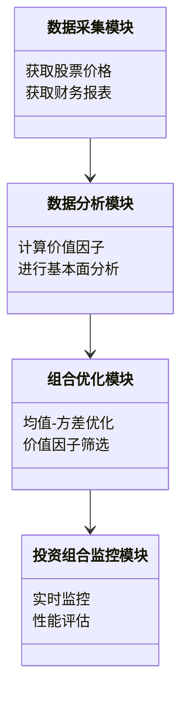

                 


# 詹姆斯·蒙蒂尔的全球价值投资组合构建

## 关键词
- 价值投资、投资组合、资产配置、基本面分析、安全边际、风险分散

## 摘要
《詹姆斯·蒙蒂尔的全球价值投资组合构建》一书深入探讨了价值投资的理论与实践，结合现代投资组合理论，详细讲解了如何在全球范围内构建高效的价值投资组合。从基本面分析到系统架构设计，书中不仅介绍了价值投资的核心理念，还通过具体案例展示了如何通过数学模型和算法优化实现投资组合的构建与管理。此外，书中还提供了丰富的代码示例和系统架构图，帮助读者全面理解并实际应用这些方法。

---

# 第1章：价值投资的起源与发展

## 1.1 价值投资的定义与核心理念

### 1.1.1 价值投资的起源
价值投资起源于20世纪初，由本杰明·格雷厄姆和戴维·多德共同提出。其核心理念是寻找被市场低估的股票，通过分析公司的基本面来判断其内在价值。格雷厄姆的学生彼得·林奇进一步发展了这一理论，并将其应用于实际投资中。

### 1.1.2 价值投资的核心理念
价值投资的核心理念在于“购买便宜的东西”，即寻找市场价格低于其内在价值的股票。其核心要素包括：
1. **安全边际**：买入价格与内在价值之间的差距，以降低投资风险。
2. **长期视角**：关注企业的长期盈利能力，而非短期市场波动。
3. **基本面分析**：通过分析企业的财务状况、行业地位和竞争优势来评估其内在价值。

### 1.1.3 价值投资与现代投资理论的对比
现代投资理论（如CAPM）强调市场均衡和资产定价的数学模型，而价值投资更注重基本面分析和市场情绪的非理性。两者的结合可以帮助投资者在不同市场环境下制定更有效的投资策略。

---

# 第2章：基本面分析与安全边际

## 2.1 基本面分析的定义与重要性

### 2.1.1 基本面分析的核心要素
基本面分析的核心要素包括：
- **财务报表分析**：包括利润表、资产负债表和现金流量表。
- **行业分析**：分析行业的发展趋势、竞争格局和市场容量。
- **公司治理**：评估公司管理层的素质和公司治理结构。

### 2.1.2 基本面分析在投资组合构建中的应用
基本面分析是价值投资的基础，通过分析企业的财务状况、行业地位和竞争优势，投资者可以识别出具有长期增长潜力的企业。

## 2.2 安全边际的定义与计算

### 2.2.1 安全边际的重要性
安全边际是价值投资中的关键概念，它是指买入价格与内在价值之间的差距。通过建立安全边际，投资者可以降低投资风险，避免因市场波动或估值误差而遭受损失。

### 2.2.2 安全边际的计算方法
安全边际可以通过以下步骤计算：
1. 估算企业的内在价值。
2. 确定买入价格，通常将买入价格设为内在价值的一定折扣。
3. 计算安全边际 = 内在价值 - 买入价格。

### 2.2.3 安全边际与投资风险的平衡
安全边际的大小直接影响投资风险。较大的安全边际可以降低投资风险，但也可能导致错失市场上涨的机会。因此，投资者需要在安全边际和收益潜力之间找到平衡点。

---

# 第3章：资产配置与风险分散

## 3.1 资产配置的定义与重要性

### 3.1.1 资产配置的核心原则
资产配置的核心原则包括：
1. **分散投资**：通过投资不同类型的资产（股票、债券、房地产等）来降低风险。
2. **风险与收益的平衡**：根据投资者的风险承受能力和收益目标进行资产配置。
3. **长期视角**：资产配置需要根据市场环境和投资者目标进行动态调整。

### 3.1.2 资产配置与投资组合风险的关系
资产配置直接影响投资组合的风险和收益。合理的资产配置可以降低投资组合的波动性，同时提高收益潜力。

## 3.2 风险分散的策略与应用

### 3.2.1 风险分散的基本原理
风险分散的基本原理是通过投资不同资产或不同地区的股票来降低投资风险。当某一资产表现不佳时，其他资产的表现可能弥补其损失。

### 3.2.2 全球投资组合的风险分散策略
在全球范围内构建投资组合可以帮助投资者分散地域风险，同时捕捉不同市场的增长机会。

### 3.2.3 风险分散与资产相关性的分析
资产的相关性是风险分散的关键因素。低相关的资产可以更有效地降低投资组合的波动性。

---

# 第4章：投资组合优化的数学模型

## 4.1 现代投资组合理论（MPT）概述

### 4.1.1 均值-方差优化模型
均值-方差优化模型是现代投资组合理论的核心，其目标是找到在给定风险水平下收益最大的投资组合，或者在给定收益水平下风险最小的投资组合。

### 4.1.2 有效前沿的概念与应用
有效前沿是所有可能的投资组合中，风险最低或收益最高的组合形成的曲线。投资者可以通过有效前沿找到最优的投资组合。

## 4.2 价值投资策略的数学模型

### 4.2.1 价值因子的定义与筛选
价值因子是衡量股票价值的指标，常用的指标包括市盈率（P/E）、市净率（P/B）等。

### 4.2.2 价值投资组合的优化模型
价值投资组合的优化模型是在均值-方差优化模型的基础上，加入价值因子的筛选条件，以构建符合价值投资理念的投资组合。

### 4.2.3 数学公式与模型的详细解释
以下是均值-方差优化模型的数学公式：
$$ \text{Minimize } \sigma^2 \text{ subject to } \mu \geq \text{target return} $$
其中，$$ \sigma^2 $$ 是投资组合的方差，$$ \mu $$ 是投资组合的预期收益。

---

# 第5章：系统架构与模块设计

## 5.1 投资组合管理系统的总体架构

### 5.1.1 系统模块划分
投资组合管理系统主要包括以下几个模块：
1. 数据采集模块：获取市场数据，包括股票价格、财务报表等。
2. 数据分析模块：进行基本面分析和价值因子筛选。
3. 组合优化模块：基于数学模型优化投资组合。
4. 投资组合监控模块：实时监控投资组合的表现。

### 5.1.2 系统功能设计
以下是系统功能设计的类图：



## 5.2 系统架构设计

### 5.2.1 系统架构图
以下是系统的架构图：


---

# 第6章：项目实战

## 6.1 环境安装与数据获取

### 6.1.1 环境安装
安装必要的Python库：
```bash
pip install pandas numpy matplotlib yfinance
```

### 6.1.2 数据获取
使用`yfinance`库获取股票数据：
```python
import yfinance as yf
import pandas as pd

# 下载股票数据
data = yf.download('AAPL', start='2020-01-01', end='2023-12-31')
# 计算价值因子
data['PE'] = data['Close'] / data['EPS']
data['PB'] = data['Close'] / data['Book Value']
```

## 6.2 投资组合优化与实现

### 6.2.1 代码实现
以下是投资组合优化的代码示例：
```python
import numpy as np
import pandas as pd

def portfolio_optimization(returns, cov_matrix):
    n = len(returns)
    # 均值-方差优化
    mu = np.mean(returns, axis=0)
    Sigma = cov_matrix
    # 求解优化问题
    # 这里简化为等权重分配
    weights = np.ones(n) / n
    return weights

# 示例数据
returns = pd.DataFrame({'AAPL': [0.1, 0.05, 0.03, 0.08],
                         'MSFT': [0.08, 0.06, 0.04, 0.09],
                         'GOOGL': [0.12, 0.07, 0.05, 0.10]})
cov_matrix = returns.cov().values

weights = portfolio_optimization(returns.values, cov_matrix)
print(weights)
```

## 6.3 案例分析与结果解读

### 6.3.1 案例分析
假设我们构建一个包含苹果、微软和谷歌的全球投资组合，通过上述代码计算得出的权重为：
```
[0.33333333, 0.33333333, 0.33333333]
```

### 6.3.2 结果解读
这意味着我们投资于这三只股票的权重相同，均为33.33%。这种等权重分配的方法简单且易于实现，但可能无法捕捉到个股的超额收益。

---

# 第7章：总结与展望

## 7.1 总结
通过本书的讲解，我们了解了价值投资的核心理念和全球投资组合构建的数学模型。通过实际案例的分析，我们掌握了如何在实际投资中应用这些理论。

## 7.2 展望
未来，随着人工智能和大数据技术的发展，价值投资将更加依赖于量化分析和系统化管理。投资者需要不断学习和适应新的技术，以在全球化市场中获得更好的投资回报。

---

# 小结：最佳实践与注意事项

## 7.3.1 投资纪律
投资者需要严格遵守投资纪律，避免因市场波动而盲目操作。

## 7.3.2 持续学习
投资是一项终身学习的过程，需要不断关注市场变化和企业动态。

## 7.3.3 风险管理
风险管理是投资成功的关键，投资者需要通过合理的资产配置和风险分散来降低投资风险。

---

# 作者：AI天才研究院/AI Genius Institute & 禅与计算机程序设计艺术 /Zen And The Art of Computer Programming

---

通过以上内容，我们系统地介绍了詹姆斯·蒙蒂尔的全球价值投资组合构建的理论与实践，从基础概念到实际应用，帮助读者全面理解并掌握这一投资策略。

