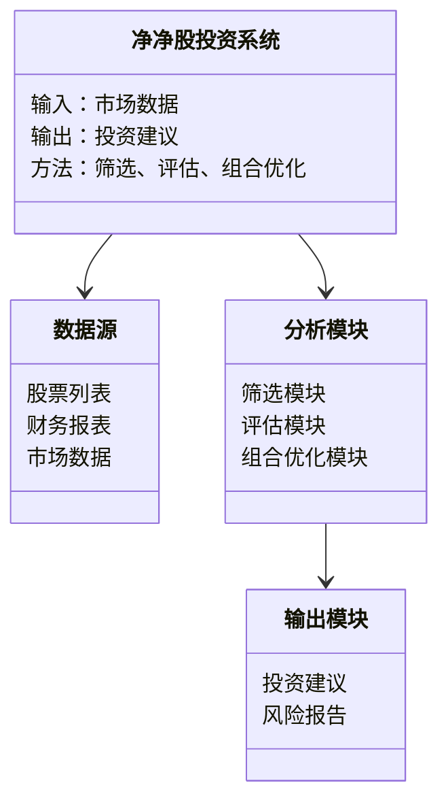
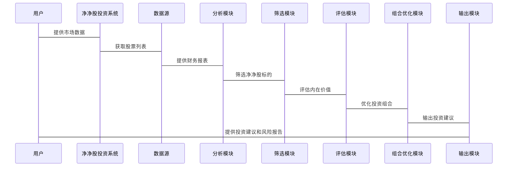

                 


# 净净股投资：回归格雷厄姆的根源

## 关键词：净净股投资，价值投资，格雷厄姆，安全边际，基本面分析

## 摘要：净净股投资是价值投资的重要分支，起源于格雷厄姆的投资理论，强调通过基本面分析寻找被市场低估的股票。本文从净净股投资的背景、核心概念、算法原理、系统分析、项目实战等方面，详细探讨了这一投资方法的精髓，结合实际案例和代码示例，为投资者提供系统化的指导。

---

# 第一部分：净净股投资的背景与基础

## 第1章：价值投资与净净股概述

### 1.1 价值投资的起源与发展

#### 1.1.1 价值投资的定义与核心理念
- 价值投资是一种以内在价值为导向的投资方法，强调购买价格低于内在价值的资产。
- 格雷厄姆的学生巴菲特进一步发展了价值投资理论，强调长期持有和价值发现。

#### 1.1.2 格雷厄姆与巴菲特的价值投资体系
- 格雷厄姆：提出了“安全边际”概念，主张通过计算内在价值寻找低估资产。
- 巴菲特：继承并扩展了格雷厄姆的理论，强调企业护城河和长期盈利能力。

#### 1.1.3 净净股投资的兴起与现状
- 净净股投资是价值投资的一种，专注于通过股东权益分析寻找低估股票。
- 当前市场环境下，净净股投资策略在量化分析和风险管理方面不断发展。

### 1.2 净净股投资的核心概念

#### 1.2.1 净净股的定义与特点
- 净净股：指那些市场价格低于其股东权益（净资产）的股票。
- 特点：低估值、高安全边际，适合长期投资。

#### 1.2.2 净净股投资的优势与局限性
- 优势：风险较低，收益潜力大。
- 局限性：需要深入的基本面分析，市场波动可能影响短期表现。

#### 1.2.3 净净股与传统股票投资的区别
- 传统投资：依赖市场趋势和技术分析。
- 净净股投资：注重基本面分析和内在价值。

### 1.3 净净股投资的哲学与心理

#### 1.3.1 投资中的心理陷阱
- 情绪化决策：避免贪婪和恐惧影响判断。
- 过度自信：认识到市场的不确定性和复杂性。

#### 1.3.2 格雷厄姆的“安全边际”概念
- 安全边际：市场价格与内在价值的差距，提供缓冲以应对不确定性。
- 计算公式：安全边际 = 市场价格 < 内在价值 × 安全系数。

#### 1.3.3 投资中的耐心与纪律
- 长期视角：耐心持有优质资产，避免短期波动干扰。
- 投资纪律：严格执行投资计划，避免随意变动。

---

# 第二部分：净净股投资的核心概念与评估方法

## 第2章：净净股的评估方法

### 2.1 净值评估模型

#### 2.1.1 净值评估的公式与计算方法
- 格雷厄姆的内在价值公式：  
  $$ V = \text{永续年金价值} = \frac{E}{k - g} $$
  其中，E为盈利，k为折现率，g为增长率。

#### 2.1.2 影响净值的主要因素分析
- 盈利能力：ROE、ROA等指标。
- 财务杠杆：资产负债率和利息覆盖倍数。
- 增长潜力：收入增长率和净利润增长率。

#### 2.1.3 净值与市场价的对比分析
- 净值比率：$$ \text{P/B} = \frac{\text{股价}}{\text{每股净资产}} $$
- 理想比率：P/B < 1，表示股价低于净资产。

### 2.2 股东权益与资产质量分析

#### 2.2.1 股东权益的构成与计算
- 股东权益 = 资产 - 负债。
- 关键指标：$$ \text{权益收益率} = \frac{\text{净利润}}{\text{股东权益}} $$

#### 2.2.2 资产质量评估的关键指标
- 现金及等价物：高比例表明企业流动性好。
- 存货周转率：低周转率可能意味着管理不善。
- 无形资产：占比过高可能影响企业价值。

#### 2.2.3 资产负债表分析的实战技巧
- 重点检查流动资产和流动负债。
- 注意应收账款和应付账款的合理性。

### 2.3 净净股投资中的安全边际

#### 2.3.1 安全边际的定义与计算
- 安全边际 = 内在价值 × 安全系数。
- 常用安全系数：1.5倍或更高。

#### 2.3.2 安全边际在不同市场环境下的应用
- 牛市：降低安全边际要求，增加投资标的。
- 熊市：提高安全边际要求，精选优质标的。

#### 2.3.3 如何通过安全边际筛选优质股票
- 筛选标准：P/B < 1，且安全边际 > 20%。
- 实战技巧：结合ROE和增长潜力进行综合评估。

---

# 第三部分：净净股投资策略与实战

## 第3章：净净股投资策略

### 3.1 净净股投资的组合构建

#### 3.1.1 投资组合的分散化原则
- 分散化：通过投资多个行业和企业降低风险。
- 建议：至少投资5只股票，涵盖不同行业。

#### 3.1.2 如何选择合适的净净股标的
- 筛选标准：P/B < 1，ROE > 10%，安全边际 > 20%。
- 工具：使用财务分析软件（如Excel、Python）进行筛选。

#### 3.1.3 投资组合的动态调整策略
- 定期审查：每季度审查投资组合。
- 调整原则：替换不符合条件的标的。

### 3.2 风险管理与投资纪律

#### 3.2.1 风险管理的核心原则
- 设置止损：当股价跌破安全边际时卖出。
- 分散投资：避免过度集中。

#### 3.2.2 投资纪律的重要性与执行方法
- 遵循计划：严格按照筛选标准和投资计划执行。
- 避免情绪化：不因市场波动改变决策。

#### 3.2.3 应对市场波动与突发事件
- 突发事件：如财务危机或行业政策变化，及时调整投资策略。
- 技术分析：结合技术指标进行短期调整。

### 3.3 净净股投资的长期视角

#### 3.3.1 长期投资的优势与挑战
- 优势：复利效应和价值回归。
- 挑战：市场波动和耐心不足。

#### 3.3.2 如何通过复利效应实现财富增长
- 复利公式：$$ A = P(1 + r)^n $$
- 提高ROE：选择高ROE的股票以增加复利效果。

#### 3.3.3 长期投资中的心态管理与调整
- 保持耐心：避免短期波动影响判断。
- 定期回顾：每年评估投资策略和组合表现。

---

# 第四部分：系统分析与架构设计

## 第4章：净净股投资的系统化框架

### 4.1 问题场景介绍

#### 4.1.1 投资需求分析
- 投资目标：长期资本增值。
- 风险承受能力：中低风险。

#### 4.1.2 项目介绍
- 项目目标：构建一个基于净净股策略的投资系统。
- 核心需求：自动筛选标的、评估风险、优化组合。

### 4.2 系统功能设计

#### 4.2.1 领域模型设计（Mermaid 类图）


#### 4.2.2 系统架构设计（Mermaid 架构图）


#### 4.2.3 系统接口设计
- 输入接口：市场数据接口、财务数据接口。
- 输出接口：投资建议输出、风险报告输出。

#### 4.2.4 系统交互设计（Mermaid 序列图）


### 4.3 算法实现与代码示例

#### 4.3.1 净值评估算法（Python 代码）
```python
def calculate_intrinsic_value(eps, growth_rate, discount_rate):
    return eps / (discount_rate - growth_rate)
```

#### 4.3.2 安全边际计算
```python
def calculate_margin_of_safety(price, intrinsic_value):
    return (intrinsic_value - price) / intrinsic_value
```

#### 4.3.3 组合优化算法
```python
import pandas as pd
import numpy as np

def optimize_portfolio(stocks, weights):
    returns = pd.DataFrame(stocks.pct_change().mean(), index=stocks.columns)
    covariance_matrix = stocks.pct_change().cov()
    return np.linalg.solve(covariance_matrix, weights)
```

### 4.4 系统实现与应用解读

#### 4.4.1 数据获取与预处理
- 数据来源：Yahoo Finance 或其他API。
- 预处理：清洗数据，处理缺失值。

#### 4.4.2 筛选模块实现
```python
def screen_net_net(stocks, threshold=1):
    return stocks[stocks['P/B'] < threshold]
```

#### 4.4.3 投资组合优化
- 使用均值-方差优化方法，结合风险承受能力。

#### 4.4.4 风险管理模块
- 设置止损点，监控市场波动。

### 4.5 系统测试与验证

#### 4.5.1 测试数据选择
- 使用历史数据验证模型的有效性。

#### 4.5.2 测试结果分析
- 回测结果：比较净净股策略与其他策略的收益和风险。

---

# 第五部分：项目实战

## 第5章：净净股投资的实战分析

### 5.1 选择投资标的

#### 5.1.1 基本面分析
- 以某公司为例，分析其财务报表。
- 计算P/B比率，判断是否低于1。

#### 5.1.2 安全边际计算
- 计算内在价值，判断安全边际是否合理。

#### 5.1.3 投资计划制定
- 确定投资金额和比例，设置止损点。

### 5.2 实战案例分析

#### 5.2.1 案例一：ABC公司
- 数据：P/B=0.8，ROE=15%，安全边际=30%。
- 结论：具备投资价值。

#### 5.2.2 案例二：XYZ公司
- 数据：P/B=1.2，ROE=5%，安全边际=0。
- 结论：不具投资价值。

### 5.3 投资组合管理

#### 5.3.1 定期监控
- 每月检查股价是否偏离安全边际。
- 调整投资比例，保持分散化。

#### 5.3.2 动态调整
- 根据市场变化和企业情况，适时调整投资组合。

---

# 第六部分：最佳实践与小结

## 第6章：投资的关键点与注意事项

### 6.1 最佳实践 tips

#### 6.1.1 投资前的准备
- 学习基础财务知识，了解投资工具。

#### 6.1.2 风险管理
- 设置止损，分散投资，避免过度集中。

#### 6.1.3 长期视角
- 耐心持有优质资产，避免频繁交易。

### 6.2 小结与展望

#### 6.2.1 小结
- 净净股投资是一种有效的价值投资策略，通过基本面分析和安全边际筛选优质标的。
- 系统化的方法和严格的纪律是成功的关键。

#### 6.2.2 展望
- 结合大数据和AI技术，进一步优化筛选和评估过程。
- 探索更多投资策略，如多因子模型的应用。

---

# 作者：AI天才研究院 & 禅与计算机程序设计艺术

---

本文通过详细分析净净股投资的背景、核心概念、算法原理、系统架构和实战案例，为投资者提供了系统化的指导。从理论到实践，从分析到代码实现，帮助读者全面掌握这一投资方法，实现稳健的财富增长。

