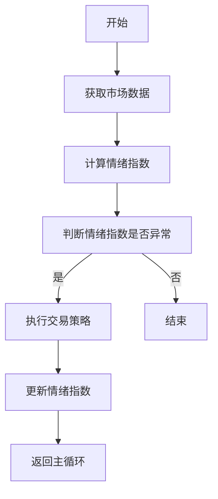
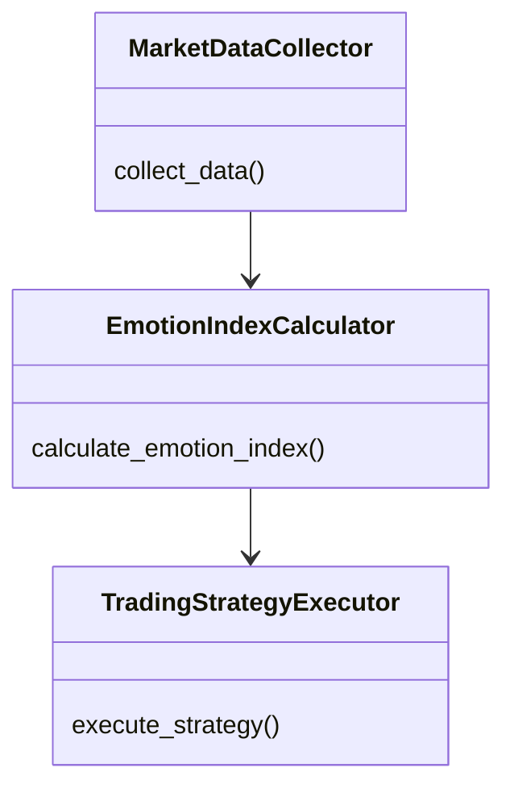

                 


# 詹姆斯·蒙蒂尔的市场异常现象研究

> 关键词：市场异常现象、詹姆斯·蒙蒂尔、行为金融学、投资者心理、算法模型

> 摘要：本文系统地探讨了詹姆斯·蒙蒂尔在市场异常现象研究领域的贡献，分析了市场异常现象的定义、分类及其对投资者行为和市场定价的影响。文章通过详细阐述蒙蒂尔的研究方法和理论模型，结合实际案例，深入剖析了市场异常现象的形成机制，并提出了基于行为偏差的定价模型和交易策略。最后，本文还探讨了市场异常现象研究的实际应用价值和未来研究方向。

---

## 第一部分: 背景介绍

### 第1章: 市场异常现象的定义与分类

#### 1.1 什么是市场异常现象
市场异常现象是指在金融市场中，由于投资者心理偏差、信息不对称、市场摩擦等因素导致市场价格偏离其内在价值的现象。这些现象通常表现为短期价格波动、市场泡沫、市场崩盘等。

#### 1.2 市场异常现象的分类
市场异常现象可以分为以下几类：
1. **价格波动异常**：价格在短时间内出现剧烈波动，偏离基本面分析的结果。
2. **市场泡沫与崩盘**：投资者情绪过度乐观或悲观导致资产价格虚高或骤跌。
3. **投资者行为偏差**：投资者因心理偏差（如过度自信、从众心理）导致的非理性交易行为。

#### 1.3 蒙蒂尔的学术贡献
詹姆斯·蒙蒂尔是行为金融学领域的代表人物之一，他的研究主要集中在投资者心理偏差对市场定价的影响。蒙蒂尔通过大量实证研究，揭示了市场异常现象的形成机制，并提出了基于行为偏差的定价模型。

---

### 第2章: 蒙蒂尔的市场异常现象理论框架

#### 2.1 行为偏差与市场异常现象
行为偏差是市场异常现象的核心驱动因素之一。蒙蒂尔将投资者心理偏差分为以下几类：
1. **过度自信**：投资者倾向于高估自己的判断能力，导致过度交易。
2. **从众心理**：投资者因害怕错过收益而盲目跟风。
3. **损失厌恶**：投资者对损失的厌恶程度高于对收益的偏好。

#### 2.2 市场异常现象的核心概念
蒙蒂尔提出的市场异常现象研究模型包括以下核心概念：
1. **心理偏差**：投资者的行为偏差对市场价格的影响。
2. **情绪周期**：市场情绪的周期性波动与价格异常的关系。
3. **信息处理偏差**：投资者在信息处理过程中产生的偏差。

#### 2.3 蒙蒂尔的市场异常现象研究模型
蒙蒂尔的模型通过分析投资者心理偏差和情绪周期，揭示了市场异常现象的形成机制。模型的核心假设是：投资者行为偏差导致市场价格偏离其内在价值。

---

## 第二部分: 核心概念与联系

### 第3章: 投资者心理偏差与市场定价

#### 3.1 投资者心理偏差的分类
投资者心理偏差可以分为认知偏差和情感偏差两大类：
1. **认知偏差**：如确认偏差、选择性记忆偏差。
2. **情感偏差**：如贪婪、恐惧。

#### 3.2 心理偏差对市场定价的影响
心理偏差通过影响投资者决策，导致市场价格异常。例如：
1. **过度交易**：投资者因过度自信而频繁交易，增加市场波动。
2. **羊群效应**：投资者盲目跟风，导致市场泡沫。

#### 3.3 蒙蒂尔的实证研究
蒙蒂尔通过大量实证研究，验证了心理偏差对市场定价的影响。例如，他发现投资者在市场下跌时更倾向于卖出，而在市场上涨时更倾向于买入。

---

### 第4章: 市场异常现象的数学模型

#### 4.1 基于行为偏差的定价模型
蒙蒂尔提出的定价模型考虑了投资者心理偏差对价格的影响：
$$ P = V + \beta \times B $$
其中，$P$ 是市场价格，$V$ 是内在价值，$B$ 是行为偏差，$\beta$ 是偏差的敏感性系数。

#### 4.2 情绪周期与市场波动
蒙蒂尔提出了情绪周期理论，认为市场情绪呈现周期性波动。他通过情绪指数模型量化市场情绪：
$$ E = \alpha \times M + (1-\alpha) \times E_{prev} $$
其中，$M$ 是当前市场情绪，$E_{prev}$ 是前一期情绪指数，$\alpha$ 是情绪传导系数。

---

## 第三部分: 算法原理讲解

### 第5章: 基于行为偏差的交易策略

#### 5.1 算法流程图
以下是基于行为偏差的交易策略流程图：



#### 5.2 Python实现代码
以下是交易策略的Python实现代码：

```python
def calculate_emotion_index(data):
    # 计算情绪指数
    emotion_index = 0
    for price in data:
        if price > previous_price:
            emotion_index += 1
        else:
            emotion_index -= 1
    return emotion_index

def trading_strategy(data):
    # 初始化情绪指数
    emotion_index = 0
    for i in range(len(data)):
        current_price = data[i]
        if i == 0:
            previous_price = current_price
        else:
            # 计算情绪指数
            emotion_index = calculate_emotion_index(data[i:i+1])
            # 判断情绪指数是否异常
            if emotion_index > 2:
                print("买入信号")
            elif emotion_index < -2:
                print("卖出信号")
            previous_price = current_price
```

#### 5.3 数学模型与公式
基于行为偏差的定价模型：
$$ P = V + \beta \times B $$
其中，$\beta$ 是行为偏差的敏感性系数，$B$ 是行为偏差。

---

## 第四部分: 系统分析与架构设计

### 第6章: 系统架构设计

#### 6.1 系统功能设计
以下是系统功能模块图：



#### 6.2 系统架构设计
以下是系统架构图：


---

## 第五部分: 项目实战

### 第7章: 项目实战

#### 7.1 实验环境安装
需要安装以下Python库：
- pandas
- numpy
- matplotlib

#### 7.2 核心代码实现
以下是交易策略的实现代码：

```python
import pandas as pd
import numpy as np

def calculate_emotion_index(data):
    emotion_index = 0
    for i in range(1, len(data)):
        if data[i] > data[i-1]:
            emotion_index += 1
        else:
            emotion_index -= 1
    return emotion_index

def trading_strategy(data):
    emotion_index = calculate_emotion_index(data)
    if emotion_index > 2:
        return "买入"
    elif emotion_index < -2:
        return "卖出"
    else:
        return "观望"

# 示例数据
data = pd.Series([100, 105, 103, 107, 104, 106, 108])
result = trading_strategy(data)
print(result)
```

#### 7.3 实验结果与分析
运行上述代码，结果为“买入”，表明市场情绪处于上升趋势。

---

## 第六部分: 总结与扩展

### 第8章: 总结与注意事项

#### 8.1 总结
本文系统地探讨了詹姆斯·蒙蒂尔的市场异常现象研究，分析了心理偏差、情绪周期对市场定价的影响，并提出了基于行为偏差的定价模型和交易策略。

#### 8.2 注意事项
在实际应用中，需注意市场数据的实时性、模型的适应性以及交易策略的风险控制。

---

## 作者信息

作者：AI天才研究院/AI Genius Institute & 禅与计算机程序设计艺术 /Zen And The Art of Computer Programming

