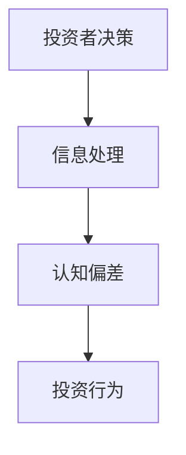
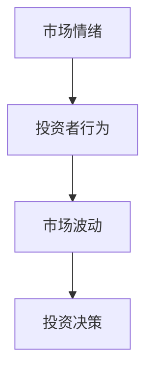
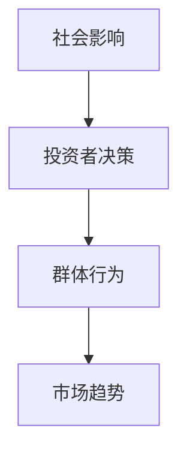
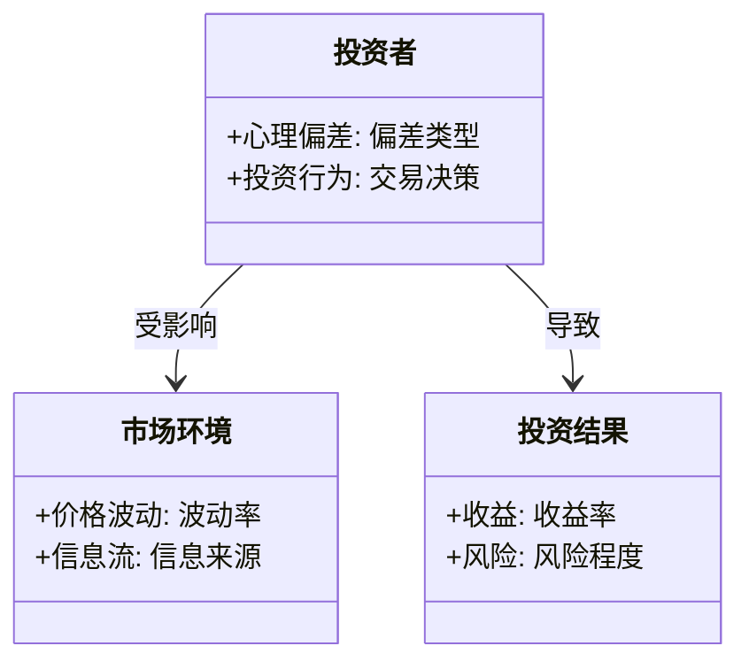

                 


# 詹姆斯·蒙蒂尔的投资者心理偏差分析

## 关键词：投资者心理偏差，行为金融学，认知偏差，情绪偏差，社会性偏差，蒙蒂尔，投资决策

## 摘要：  
詹姆斯·蒙蒂尔是行为金融学领域的权威，他的研究揭示了投资者心理偏差对决策的深远影响。本文系统分析了投资者在认知、情绪和社会性偏差方面的表现，并通过数学模型和实际案例，探讨了这些偏差如何影响投资行为。文章结合蒙蒂尔的理论，提出了解决方案和最佳实践建议，帮助投资者克服心理偏差的影响，提升决策质量。

---

## 第一章：引言

### 1.1 詹姆斯·蒙蒂尔与投资者心理偏差研究

#### 1.1.1 蒙蒂尔的学术背景与研究领域
詹姆斯·蒙蒂尔是行为金融学领域的权威，专注于研究投资者心理偏差及其对金融市场的影响。他的研究结合了心理学和经济学，为理解投资者行为提供了新的视角。

#### 1.1.2 投资者心理偏差研究的重要性
心理偏差是指投资者在决策过程中因认知、情绪和社会因素导致的系统性错误。这些偏差可能导致非理性的投资决策，影响市场定价和资产配置。

#### 1.1.3 本书的研究目标与意义
本书旨在系统分析投资者心理偏差的类型、影响及解决方案，结合蒙蒂尔的理论，为投资者提供实用的建议，帮助其克服心理偏差，提升投资决策的质量。

---

### 1.2 投资者心理偏差的核心概念

#### 1.2.1 心理偏差的定义与分类
心理偏差是指个体在信息处理和决策过程中产生的系统性错误。常见的偏差包括认知偏差、情绪偏差和社会性偏差。

#### 1.2.2 投资者决策中的常见心理偏差
投资者常见的心理偏差包括损失厌恶、确认偏差、过度自信和从众心理等。

#### 1.2.3 心理偏差与投资行为的关系
心理偏差通过影响投资者的信息处理、情绪反应和社交行为，进而影响其投资决策和市场行为。

---

## 第二章：认知偏差与投资者决策

### 2.1 认知偏差的定义与分类

#### 2.1.1 认知偏差的类型
认知偏差主要包括确认偏差、选择性注意偏差、归纳偏差等。

#### 2.1.2 认知偏差与投资者决策的关系
认知偏差影响投资者的信息处理和决策，可能导致错误的投资选择。

#### 2.1.3 认知偏差的数学模型与公式
认知偏差可以通过概率论和决策理论进行建模。例如，损失厌恶可以用以下公式表示：

$$
\text{损失厌恶系数} = \frac{\text{损失的权重}}{\text{收益的权重}}
$$

---

### 2.2 常见认知偏差对投资行为的影响

#### 2.2.1 确认偏差
确认偏差是指投资者倾向于寻找支持自己观点的信息，忽略反对信息。这可能导致投资组合过于集中和风险过高。

#### 2.2.2 损失厌恶
损失厌恶是指投资者对损失的敏感性高于收益。这可能导致投资者在亏损时过度卖出，错失反弹机会。

#### 2.2.3 过度自信
过度自信使投资者高估自己的能力，可能导致过度交易和不合理投资决策。

---

### 2.3 认知偏差的数学模型与案例分析

#### 2.3.1 认知偏差的数学模型（使用mermaid流程图）


#### 2.3.2 认知偏差的案例分析
案例：某投资者因确认偏差，仅关注利好信息，买入一只高估值股票，导致亏损。

---

## 第三章：情绪偏差与投资者行为

### 3.1 情绪偏差的定义与分类

#### 3.1.1 情绪偏差的类型
情绪偏差包括恐惧与贪婪、过度反应与反应不足等。

#### 3.1.2 情绪偏差与投资者行为的关系
情绪偏差影响投资者的交易决策和市场参与度。

#### 3.1.3 情绪偏差的数学模型与公式
情绪偏差可以用情绪指数和波动性模型进行量化。例如：

$$
\text{情绪指数} = \sum (\text{情绪强度} \times \text{情绪频率})
$$

---

### 3.2 常见情绪偏差对投资行为的影响

#### 3.2.1 恐惧与贪婪
恐惧导致投资者在市场下跌时过度卖出，贪婪导致在市场上涨时过度买入。

#### 3.2.2 过度反应与反应不足
投资者对利好消息反应过度，对利空消息反应不足。

#### 3.2.3 投资者情绪周期
投资者情绪通常呈现周期性波动，影响市场的短期走势。

---

### 3.3 情绪偏差的数学模型与案例分析

#### 3.3.1 情绪偏差的数学模型（使用mermaid流程图）


#### 3.3.2 情绪偏差的案例分析
案例：2020年新冠疫情初期，投资者因恐慌情绪大量抛售股票，导致市场大幅下跌。

---

## 第四章：社会性偏差与群体行为

### 4.1 社会性偏差的定义与分类

#### 4.1.1 社会性偏差的类型
社会性偏差包括从众心理、社会认同偏差等。

#### 4.1.2 社会性偏差与投资者行为的关系
社会性偏差影响投资者的群体行为和市场趋势。

#### 4.1.3 社会性偏差的数学模型与公式
社会性偏差可以用社会网络分析和群体行为模型进行建模。例如：

$$
\text{从众程度} = \frac{\text{从众行为次数}}{\text{总行为次数}}
$$

---

### 4.2 常见社会性偏差对投资行为的影响

#### 4.2.1 从众心理
从众心理导致投资者盲目跟随市场趋势，可能导致羊群效应。

#### 4.2.2 社会认同偏差
社会认同偏差使投资者倾向于选择与自己社会认同一致的投资标的。

#### 4.2.3 声誉效应
投资者因追求社会认可而采取非理性投资行为。

---

### 4.3 社会性偏差的数学模型与案例分析

#### 4.3.1 社会性偏差的数学模型（使用mermaid流程图）


#### 4.3.2 社会性偏差的案例分析
案例：2021年加密货币市场的狂热，投资者因从众心理大量买入，导致市场泡沫破裂。

---

## 第五章：投资者心理偏差的系统分析

### 5.1 投资者心理偏差的系统架构

#### 5.1.1 系统功能设计（领域模型）


#### 5.1.2 系统架构设计（使用mermaid架构图）
```mermaid
context diagram
    actor 投资者
    actor 市场环境
    actor 投资结果
    投资者 --> 市场环境: 受影响
    市场环境 --> 投资结果: 影响
```

---

## 第六章：项目实战

### 6.1 环境安装与工具准备

#### 6.1.1 环境安装
安装Python和相关库（如pandas、numpy、matplotlib）。

#### 6.1.2 工具准备
准备数据集（如股票价格、市场情绪数据）。

---

### 6.2 核心实现

#### 6.2.1 心理偏差分析代码
```python
import pandas as pd
import numpy as np

def calculate_bias(data):
    # 计算认知偏差
    cognitive_bias = data['price'].std() / data['price'].mean()
    return cognitive_bias

def calculate_emotion(data):
    # 计算情绪偏差
    emotion_bias = data['volume'].std() / data['volume'].mean()
    return emotion_bias

if __name__ == "__main__":
    data = pd.read_csv('market_data.csv')
    cognitive_bias = calculate_bias(data)
    emotion_bias = calculate_emotion(data)
    print(f"认知偏差: {cognitive_bias}")
    print(f"情绪偏差: {emotion_bias}")
```

#### 6.2.2 代码解读与分析
上述代码通过计算股票价格的波动率与均值的比率，量化认知偏差；通过计算成交量的波动率与均值的比率，量化情绪偏差。

---

### 6.3 案例分析与总结

#### 6.3.1 案例分析
以某只股票为例，分析其价格和成交量的变化，计算认知偏差和情绪偏差。

#### 6.3.2 总结
通过代码实现，投资者可以量化心理偏差，制定更理性的投资策略。

---

## 第七章：总结与建议

### 7.1 总结

#### 7.1.1 心理偏差的核心影响
心理偏差通过影响投资者的信息处理、情绪反应和社交行为，显著影响投资决策。

#### 7.1.2 解决方案
通过认知训练、情绪管理和社交网络优化，投资者可以克服心理偏差的影响。

---

### 7.2 建议与展望

#### 7.2.1 投资者的最佳实践
投资者应定期反思自己的决策，避免过度自信和从众心理。

#### 7.2.2 未来研究方向
未来研究可以结合AI技术，开发实时心理偏差检测工具，帮助投资者优化决策。

---

## 作者：AI天才研究院/AI Genius Institute & 禅与计算机程序设计艺术 /Zen And The Art of Computer Programming

