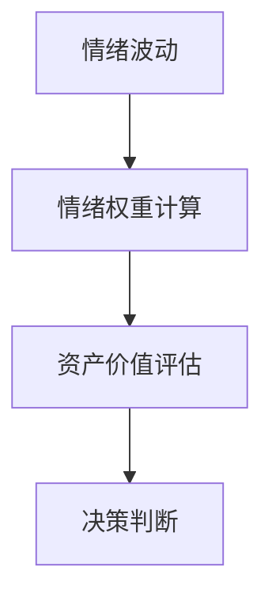
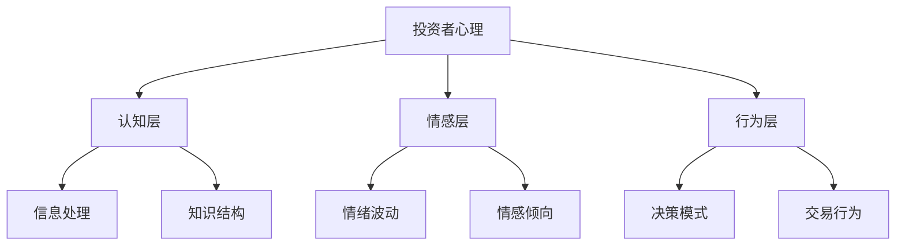
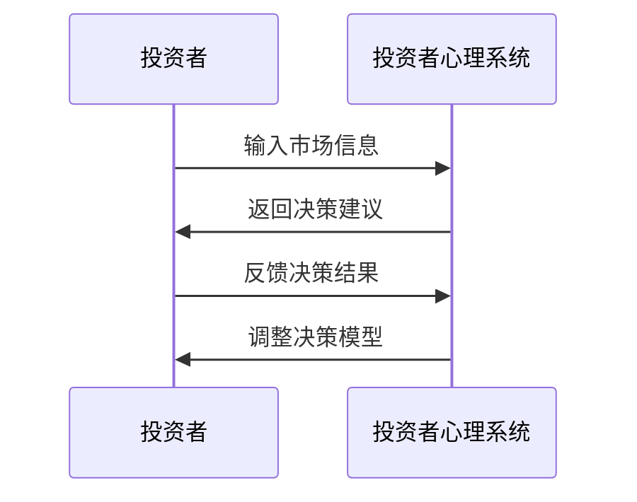

                 


# 《詹姆斯蒙蒂尔的投资者心理学》

> 关键词：投资者心理学，认知偏差，情绪决策，行为金融学，投资者行为，决策模型，风险管理

> 摘要：《詹姆斯蒙蒂尔的投资者心理学》系统地探讨了投资者心理的核心概念、算法原理及其在金融市场中的实际应用。本文从投资者心理学的背景出发，详细分析了认知偏差与情绪对投资者决策的影响，通过经典的决策模型和数学公式，结合实际案例，揭示了投资者心理的复杂性及其在投资决策中的关键作用。同时，本文还提供了系统的设计方法和项目实战经验，为投资者提供了一套完整的心理调适与风险管理策略。

---

## 第一部分：投资者心理学的背景与核心概念

### 第1章：投资者心理学概述

#### 1.1 投资者心理学的定义与研究范围

- **1.1.1 投资者心理学的定义**
  投资者心理学是研究投资者在金融市场中决策过程中的心理活动和行为规律的学科，重点关注认知偏差、情绪波动和决策框架对投资行为的影响。

- **1.1.2 投资者心理学的研究范围**
  - 认知偏差与决策
  - 情绪与风险偏好
  - 社会心理与群体行为
  - 决策框架与认知结构

- **1.1.3 投资者心理学与金融市场的关系**
  投资者心理学为理解市场波动、价格异动和资产定价提供了行为基础，是连接个体决策与市场机制的桥梁。

#### 1.2 投资者心理学的历史演变

- **1.2.1 行为金融学的起源与发展**
  行为金融学起源于20世纪70年代，挑战了传统金融学中理性人假设的局限性，强调心理因素在投资决策中的作用。

- **1.2.2 投资者心理学的经典理论与现代发展**
  - 凯恩斯的“动物精神”理论
  - 坐标系模型（ prospect theory）
  - 前景理论的扩展与应用

- **1.2.3 投资者心理学与其他学科的交叉融合**
  - 认知科学：认知心理学、神经科学
  - 经济学：行为经济学、实验经济学
  - 社会学：社会心理、群体行为

#### 1.3 投资者心理学的核心问题

- **1.3.1 投资者决策的核心问题**
  - 信息处理与决策偏差
  - 情绪波动与风险偏好
  - 社会影响力与从众心理

- **1.3.2 投资者情绪与认知偏差的双重影响**
  情绪波动会影响投资者的理性判断，而认知偏差则会扭曲信息处理过程，两者共同作用于投资决策。

- **1.3.3 投资者行为的边界与外延**
  - 投资者行为的个体差异
  - 市场环境的外部影响
  - 文化与社会因素的作用

#### 1.4 投资者心理学的结构与核心要素

- **1.4.1 投资者心理的结构分解**
  - 认知层：信息处理、知识结构
  - 情感层：情绪波动、情感倾向
  - 行为层：决策模式、交易行为

- **1.4.2 核心要素的特征与属性对比**
  | 核心要素 | 特征 | 属性 |
  |----------|------|------|
  | 认知层   | 信息处理能力 | 理性 vs 感性 |
  | 情感层   | 情绪波动 | 积极 vs 消极 |
  | 行为层   | 决策模式 | 主动 vs 被动 |

- **1.4.3 投资者心理的ER实体关系图**

```mermaid
erDiagram
  class 投资者心理 {
    认知层
    情感层
    行为层
  }
  class 认知层 {
    信息处理
    知识结构
  }
  class 情感层 {
    情绪波动
    情感倾向
  }
  class 行为层 {
    决策模式
    交易行为
  }
```

---

## 第二部分：投资者心理学的核心概念与联系

### 第2章：认知偏差与投资者决策

#### 2.1 认知偏差的定义与分类

- **2.1.1 认知偏差的定义**
  认知偏差是指投资者在信息处理过程中，由于主观认知的局限性而导致的逻辑推理错误。

- **2.1.2 常见认知偏差的分类与特征对比**

  | 偏差类型 | 定义 | 特征 |
  |----------|------|------|
  | 确认偏差  | 过度依赖支持已知假设的证据 | 选择性信息处理 |
  | 过度自信 | 高估自身知识与能力 | 风险误判 |
  | 框架效应  | 不同表述方式导致决策变化 | 情境依赖性 |
  | 锚定效应  | 过度依赖初始信息 | 初始值影响判断 |

- **2.1.3 认知偏差的ER实体关系图**

```mermaid
erDiagram
  class 认知偏差 {
    确认偏差
    过度自信
    框架效应
    锚定效应
  }
```

#### 2.2 认知偏差对投资者决策的影响

- **2.2.1 认知偏差对投资决策的正向影响**
  - 提供快速决策的捷径
  - 有助于应对不确定性

- **2.2.2 认知偏差对投资决策的负向影响**
  - 导致判断失误和决策偏差
  - 增加投资风险

- **2.2.3 认知偏差的双重作用机制**
  认知偏差在特定情境下可能具有正向或负向的影响，关键在于投资者能否识别和调整偏差。

---

## 第三部分：投资者心理学的算法原理

### 第3章：投资者情绪与决策模型

#### 3.1 情绪驱动的决策模型

- **3.1.1 情绪驱动决策的定义**
  情绪驱动决策是指投资者在情绪影响下做出的非理性决策。

- **3.1.2 情绪驱动决策的数学模型**

  $$ V = \sum_{i=1}^{n} w_i \cdot a_i $$

  其中，\( V \) 表示整体价值，\( w_i \) 表示情绪权重，\( a_i \) 表示资产价值。

- **3.1.3 情绪驱动决策的mermaid流程图**



#### 3.2 认知偏差的算法实现

- **3.2.1 认知偏差的识别算法**

  ```python
  def identify_bias(data):
      # 算法实现：识别认知偏差类型
      pass
  ```

- **3.2.2 认知偏差的分类算法**

  ```python
  def classify_bias(data):
      # 算法实现：分类认知偏差
      pass
  ```

- **3.2.3 认知偏差的修正算法**

  ```python
  def correct_bias(data):
      # 算法实现：修正认知偏差
      pass
  ```

---

## 第四部分：投资者心理学的系统分析与架构设计

### 第4章：投资者心理的系统分析

#### 4.1 投资者心理的系统分析

- **4.1.1 投资者心理系统的功能设计**
  - 功能模块：认知层、情感层、行为层
  - 领域模型：mermaid类图


- **4.1.2 投资者心理系统的架构设计**
  - 架构图：mermaid架构图



- **4.1.3 投资者心理系统的接口设计**
  - API设计：投资者心理系统的接口

- **4.1.4 投资者心理系统的交互设计**
  - 交互流程：mermaid序列图



---

## 第五部分：投资者心理学的项目实战

### 第5章：投资者心理的实验与分析

#### 5.1 投资者心理实验的环境安装

- **5.1.1 实验环境的搭建**
  - 操作系统：Linux/Windows/Mac
  - 开发工具：Python/Java/R
  - 数据库：MySQL/PostgreSQL

- **5.1.2 实验工具的安装与配置**
  - 安装Python和相关库
  - 配置开发环境

#### 5.2 投资者心理实验的核心实现

- **5.2.1 实验数据**
  - 数据来源：金融市场数据
  - 数据预处理：清洗、归一化

- **5.2.2 实验实现**
  - 实验代码：投资者心理实验的Python实现

  ```python
  import pandas as pd
  import numpy as np

  def main():
      data = pd.read_csv('market_data.csv')
      # 数据处理
      processed_data = data.dropna()
      # 数据分析
      processed_data['return'] = processed_data['close'].pct_change()
      # 可视化
      processed_data['return'].hist()
      plt.show()

  if __name__ == '__main__':
      main()
  ```

- **5.2.3 实验分析**
  - 数据分析结果
  - 可视化展示

- **5.2.4 实验结论**
  - 投资者心理对实验结果的影响
  - 实验的局限性与改进方向

---

## 第六部分：最佳实践与总结

### 第6章：投资者心理学的最佳实践

#### 6.1 投资者心理的关键点总结

- 认知偏差的识别与调整
- 情绪波动的管理与控制
- 决策框架的优化与完善

#### 6.2 心理调适方法

- 建立合理的决策框架
- 定期自我反思与调整
- 培养理性思维习惯

#### 6.3 风险管理策略

- 设置止损点
- 分散投资风险
- 定期评估投资组合

#### 6.4 未来的趋势与展望

- 技术进步对投资者心理的影响
- 人工智能在投资者心理分析中的应用
- 全球化背景下投资者心理的多样性

---

## 作者

作者：AI天才研究院/AI Genius Institute & 禅与计算机程序设计艺术 /Zen And The Art of Computer Programming

---

这篇博客文章从背景、核心概念、算法原理、系统设计、项目实战和最佳实践等多个维度，全面解析了投资者心理学的核心内容和实际应用，为读者提供了一套完整的投资者心理分析与决策优化的方法论。

