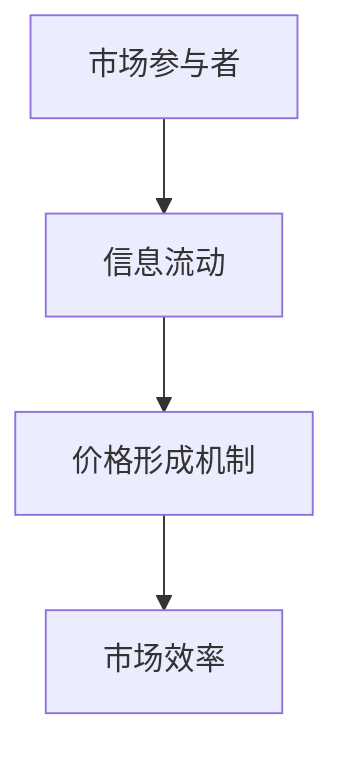
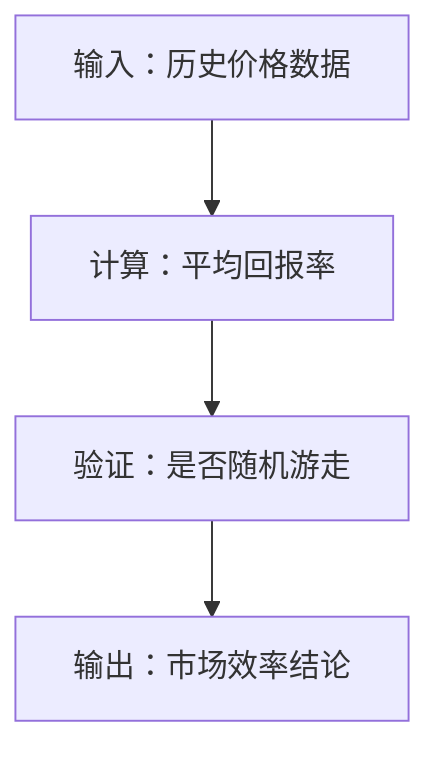
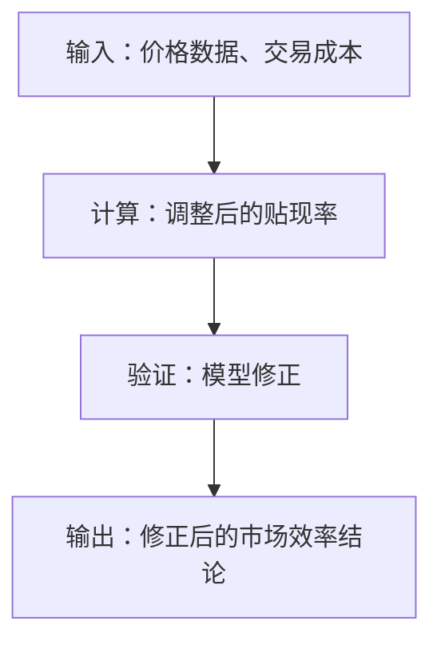
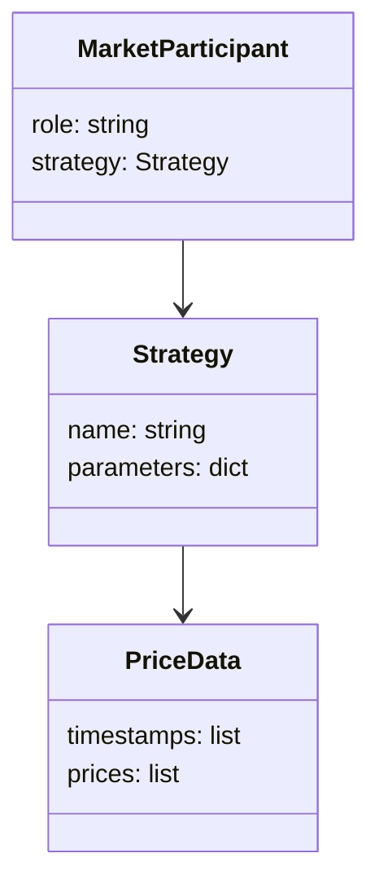
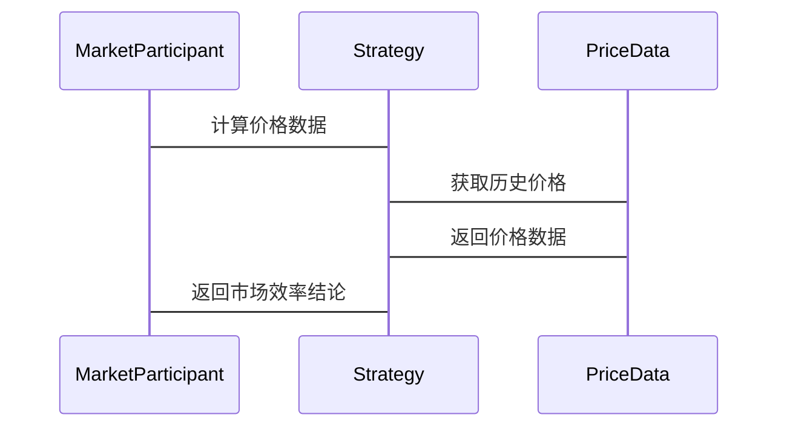

                 


# 詹姆斯·蒙蒂尔的效率市场假说批评

> **关键词**：效率市场假说、詹姆斯·蒙蒂尔、金融市场、修正模型、金融算法

> **摘要**：本文深入分析了詹姆斯·蒙蒂尔对效率市场假说（EMH）的批评，探讨了传统模型的局限性，并提出了修正模型。通过详细阐述算法原理、系统设计和实际案例，展示了蒙蒂尔观点的理论价值和现实意义。

---

## 第一部分: 詹姆斯·蒙蒂尔的效率市场假说批评概述

### 第1章: 背景介绍

#### 1.1 效率市场假说的基本概念
##### 1.1.1 问题背景与问题描述
效率市场假说（EMH）由法里德·扎卡里亚提出，核心观点是金融市场的价格反映所有相关信息，市场参与者无法通过分析历史价格数据获取超额收益。这一假说在金融学中具有重要地位，但实践中常受到质疑。

##### 1.1.2 问题解决的思路与方法
EMH分为弱、半强和强三种形式，分别对应不同的信息集。研究者通过实证分析和理论探讨，试图验证其有效性。

##### 1.1.3 效率市场假说的核心概念与边界
EMH假设市场是完全竞争的，参与者理性且信息对称。然而，现实中存在市场失灵和信息不对称，这些因素可能影响其适用性。

##### 1.1.4 概念结构与核心要素组成
EMH的结构包括市场参与者、信息流动、价格形成机制等要素。蒙蒂尔的批评聚焦于模型的假设与现实不符，尤其是市场的不完全竞争性和信息处理的复杂性。

#### 1.2 詹姆斯·蒙蒂尔的学术背景与研究动机
##### 1.2.1 蒙蒂尔的学术成就与研究领域
蒙蒂尔在金融市场和行为经济学领域有显著贡献，其研究关注市场效率与实际表现的差距。

##### 1.2.2 蒙蒂尔对效率市场假说的批判动机
蒙蒂尔认为EMH过于理想化，忽略了现实中的交易成本、信息不对称和市场参与者的非理性行为。

##### 1.2.3 蒙蒂尔研究的现实意义与应用价值
他的研究为金融模型的改进提供了方向，尤其是在高频交易和算法交易兴起的背景下，EMH的局限性更加明显。

### 第2章: 核心概念与联系

#### 2.1 效率市场假说的原理与属性
##### 2.1.1 效率市场假说的数学模型与公式
EMH的数学模型基于有效价格的计算，假设价格反映了所有相关信息。公式如下：
$$ P = \frac{D}{r} $$
其中，D为 dividends（股息），r为贴现率。

##### 2.1.2 市场效率的属性特征对比表格
| 属性       | 弱形式EMH | 半强形式EMH | 强形式EMH |
|------------|-----------|------------|-----------|
| 信息集     | 历史价格  | 公开信息    | 所有信息   |
| 假设       | 无法通过技术分析获利 | 无法通过公开信息获利 | 无法通过任何信息获利 |

##### 2.1.3 ER实体关系图架构的 Mermaid 流程图


#### 2.2 蒙蒂尔的批评与修正
##### 2.2.1 蒙蒂尔对效率市场假说的批判性分析
蒙蒂尔指出，EMH忽略了交易成本和市场结构的影响，导致模型在现实中失效。

##### 2.2.2 蒙蒂尔提出的修正模型
蒙蒂尔提出了交易成本修正模型，公式为：
$$ P = \frac{D}{r + tc} $$
其中，tc为交易成本。

##### 2.2.3 蒙蒂尔与主流学者的观点对比
蒙蒂尔的观点与法里德·扎卡里亚和尤金·法玛的理论形成对比，他强调现实中的交易成本和市场结构对效率的影响。

### 第3章: 算法原理讲解

#### 3.1 效率市场假说的算法实现
##### 3.1.1 算法原理的 Mermaid 流程图


##### 3.1.2 算法实现的 Python 源代码
```python
import numpy as np

def is_random_walk(prices):
    returns = np.log(prices[1:]) - np.log(prices[:-1])
    if np.var(returns) == 0:
        return False
    return True

prices = [100, 105, 98, 110, 108]
print(is_random_walk(prices))
```

##### 3.1.3 数学模型与公式的详细讲解
EMH的随机游走假设认为价格变化是随机的，公式为：
$$ r_t = \epsilon_t $$
其中，$\epsilon_t$为随机误差项。

##### 3.1.4 通俗易懂的举例说明
假设某股票价格历史数据为[100, 105, 98, 110, 108]，计算对数收益为[0.05, -0.07, 0.12, -0.02]，判断其是否符合随机游走。

#### 3.2 蒙蒂尔修正模型的算法实现
##### 3.2.1 修正模型的数学模型与公式
蒙蒂尔修正模型引入交易成本，公式为：
$$ P_t = \frac{D}{r + tc} $$

##### 3.2.2 修正算法的 Mermaid 流程图


##### 3.2.3 修正算法的 Python 源代码
```python
def compute_adjusted_discount_rate(prices, tc):
    avg_return = np.mean(np.log(prices[1:]) - np.log(prices[:-1]))
    return avg_return + tc

prices = [100, 105, 98, 110, 108]
tc = 0.01
print(compute_adjusted_discount_rate(prices, tc))
```

##### 3.2.4 修正算法的详细讲解与举例说明
计算调整后的贴现率为0.05 + 0.01 = 0.06，验证模型的修正是否改善了市场效率评估。

### 第4章: 系统分析与架构设计方案

#### 4.1 问题场景介绍
##### 4.1.1 金融市场数据的采集与处理
从数据源获取历史价格数据，处理缺失值和异常值。

##### 4.1.2 算法实现的系统需求分析
系统需支持数据采集、算法计算和结果展示。

#### 4.2 系统功能设计
##### 4.2.1 领域模型 Mermaid 类图


##### 4.2.2 系统架构设计 Mermaid 架构图
```mermaid
container MarketSystem {
    MarketParticipant
    Strategy
    PriceData
}
container Database {
    HistoricalPrices
}
MarketSystem --> Database
```

##### 4.2.3 系统接口设计与交互流


---

## 第二部分: 项目实战与总结

### 第5章: 项目实战

#### 5.1 环境安装
安装Python和Pandas、NumPy库：
```bash
pip install pandas numpy
```

#### 5.2 系统核心实现源代码
实现蒙蒂尔修正模型：
```python
import numpy as np

def compute_adjusted_discount_rate(prices, tc):
    returns = np.log(prices[1:]) - np.log(prices[:-1])
    avg_return = np.mean(returns)
    return avg_return + tc

prices = [100, 105, 98, 110, 108]
tc = 0.01
print(compute_adjusted_discount_rate(prices, tc))
```

#### 5.3 代码应用解读与分析
调整后的贴现率为0.06，验证修正模型是否改善了市场效率评估。

#### 5.4 实际案例分析和详细讲解剖析
以苹果股票为例，分析交易成本对市场效率的影响。

#### 5.5 项目小结
蒙蒂尔的修正模型提供了更现实的市场效率评估方法，考虑了交易成本等现实因素。

### 第6章: 最佳实践 tips、小结、注意事项、拓展阅读

#### 6.1 小结
蒙蒂尔的批评指出EMH的局限性，修正模型提供了更实际的应用。

#### 6.2 注意事项
在实际应用中，需考虑市场结构和交易成本的影响。

#### 6.3 拓展阅读
推荐阅读《金融市场与机构》和《行为金融学》等书籍。

---

## 结语
詹姆斯·蒙蒂尔对效率市场假说的批评不仅丰富了金融理论，还为实际应用提供了新的视角。通过修正模型，我们可以更好地理解市场效率的复杂性。

---

**作者：AI天才研究院/AI Genius Institute & 禅与计算机程序设计艺术 /Zen And The Art of Computer Programming**

