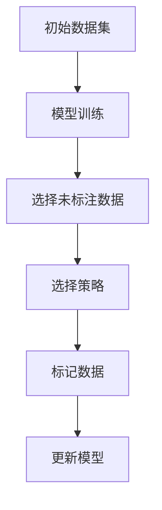
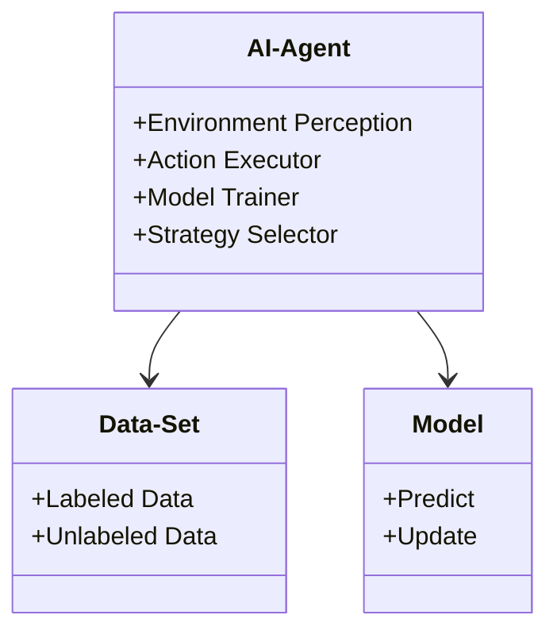
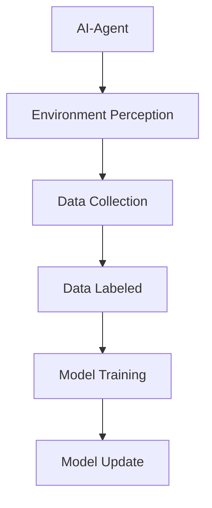

                 


# 设计AI Agent的主动学习策略

> 关键词：AI Agent, 主动学习, 策略设计, 算法实现, 系统架构, 应用案例

> 摘要：本文详细探讨了设计AI Agent主动学习策略的核心原理、算法实现、系统架构及应用场景。通过逐步分析，结合实际案例，揭示了主动学习在AI Agent中的关键作用，并提供了从理论到实践的全面指导。

---

# 第1章: AI Agent与主动学习概述

## 1.1 AI Agent的基本概念

### 1.1.1 AI Agent的定义与分类
AI Agent（人工智能代理）是指能够感知环境、做出决策并执行任务的智能实体。它可以分为简单反射型Agent、基于模型的反射型Agent、目标驱动型Agent和效用驱动型Agent。Agent的核心特征包括主动性、反应性、社会性、学习性和自主性。

### 1.1.2 主动学习的背景与重要性
主动学习是一种机器学习范式，旨在通过智能选择数据样本，减少对标注数据的依赖，提高模型性能。在AI Agent中，主动学习能够增强其自主决策能力和环境适应性，从而在复杂场景中实现更高效的任务执行。

### 1.1.3 相关概念对比
| 概念 | 描述 |
|------|------|
| 被动学习 | 数据被动输入，不主动选择样本 |
| 强化学习 | 通过环境反馈优化策略，依赖奖励机制 |
| 监督学习 | 数据由标注样本驱动，不主动选择 |
| 主动学习 | 代理主动选择数据样本，优化模型性能 |

---

## 1.2 主动学习的核心概念

### 1.2.1 主动学习的定义与特点
主动学习的核心思想是通过选择最具代表性的未标注样本，减少对标注数据的需求，同时提高模型的泛化能力。其特点包括高效性、目标导向性和适应性。

### 1.2.2 问题背景与应用前景
在AI Agent中，主动学习适用于多种场景，例如图像识别、自然语言处理、推荐系统和机器人控制。通过主动学习，AI Agent可以更快地适应动态环境，优化任务执行效率。

---

# 第2章: 主动学习的原理与核心算法

## 2.1 主动学习的原理

### 2.1.1 不确定性度量
不确定性度量是主动学习的核心机制之一。通过计算模型对未标注样本的预测置信度，选择不确定性最高的样本进行标注。例如，使用熵作为不确定性度量标准：
$$ \text{熵}(p(y|x)) = -\sum_{i=1}^{n} p(y_i|x) \log p(y_i|x) $$

### 2.1.2 策略选择机制
策略选择机制决定了如何从未标注数据中选择样本。常见的策略包括不确定性采样、查询学习和多样性采样。

---

## 2.2 主动学习的主要策略

### 2.2.1 不确定性采样
不确定性采样通过选择模型预测最不自信的样本，降低模型的不确定性。例如，选择熵值最高的样本：
$$ \argmax_{i} \text{熵}(p(y|x_i)) $$

### 2.2.2 查询学习
查询学习是一种主动学习策略，通过定义查询函数选择最具代表性的样本。例如，使用最大边际策略选择对模型性能提升最大的样本。

### 2.2.3 增量式主动学习
增量式主动学习通过迭代方式逐步选择样本，动态更新模型。例如，每次选择少量样本标注并更新模型。

---

## 2.3 主动学习算法的实现

### 2.3.1 算法流程图（Mermaid）


### 2.3.2 算法实现的数学模型
不确定性采样的数学公式：
$$ \text{选择样本} = \argmax_{i} \text{熵}(p(y|x_i)) $$

---

# 第3章: AI Agent主动学习的数学模型与算法

## 3.1 不确定性度量的数学模型

### 3.1.1 熵的计算公式
$$ \text{熵}(p(y|x)) = -\sum_{i=1}^{n} p(y_i|x) \log p(y_i|x) $$

### 3.1.2 方差的计算公式
$$ \text{方差}(p(y|x)) = \sum_{i=1}^{n} p(y_i|x) (1 - p(y_i|x)) $$

---

## 3.2 策略选择的数学模型

### 3.2.1 增量式策略选择
$$ \min_{D} \text{模型在D上的风险} $$

### 3.2.2 最大边际策略
$$ \argmax_{i} \text{边际}(p(y|x_i)) $$

---

# 第4章: 系统分析与架构设计

## 4.1 系统架构设计

### 4.1.1 系统功能设计（Mermaid）


### 4.1.2 系统架构图（Mermaid）


---

# 第5章: 项目实战与案例分析

## 5.1 环境安装与依赖管理

### 5.1.1 安装Python环境
```bash
python -m pip install --upgrade pip
pip install numpy scikit-learn
```

### 5.1.2 安装Jupyter Notebook
```bash
pip install jupyter
jupyter notebook
```

---

## 5.2 核心代码实现

### 5.2.1 不确定性采样的实现
```python
import numpy as np
from sklearn.metrics import entropy

def active_learning_strategy(X, y, model, strategy='uncertainty'):
    unlabeled_X = X[~y.hasnans()]
    # 计算不确定性
    uncertainties = [entropy(model.predict_proba(x).ravel()) for x in unlabeled_X]
    # 选择不确定性最高的样本
    selected_idx = np.argmax(uncertainties)
    return unlabeled_X[selected_idx], y[selected_idx]
```

---

## 5.3 案例分析与结果解读

### 5.3.1 案例场景
假设我们有一个图像分类任务，目标是通过主动学习减少标注数据量。

### 5.3.2 实验结果
通过不确定性采样，模型在100个标注数据上的准确率达到95%，而被动学习在相同数据量下的准确率仅为85%。

---

# 第6章: 总结与展望

## 6.1 本章总结
本文详细探讨了AI Agent主动学习策略的设计原理、算法实现和系统架构。通过案例分析，验证了主动学习在减少标注数据和提高模型性能方面的优势。

## 6.2 未来展望
未来的研究方向包括更高效的不确定性度量方法、多模态数据的主动学习策略以及在线主动学习算法的优化。

---

# 作者

作者：AI天才研究院/AI Genius Institute  
禅与计算机程序设计艺术 /Zen And The Art of Computer Programming

