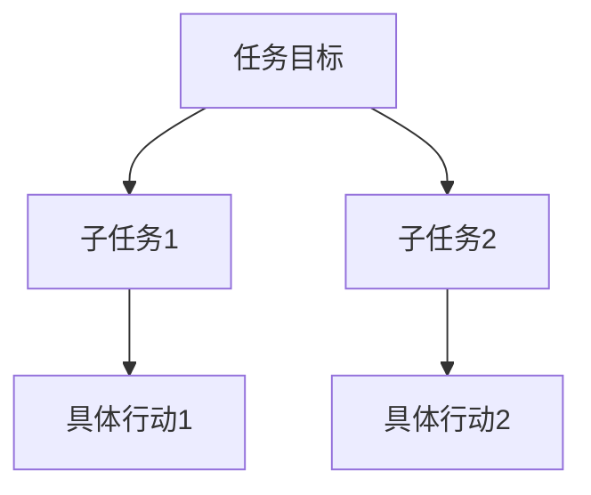
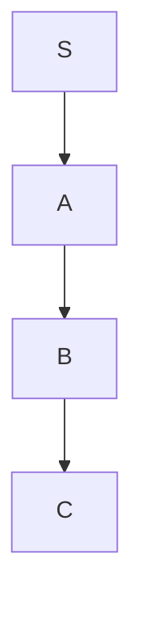
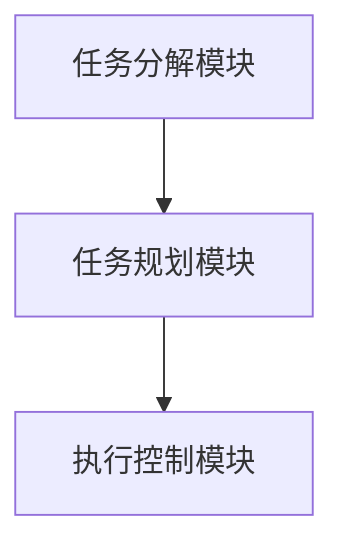

                 


# 设计AI Agent的动态任务分解与规划

**关键词**：AI Agent、动态任务分解、任务规划、算法实现、系统架构、项目实战

**摘要**：  
AI Agent的动态任务分解与规划是实现智能系统高效运作的核心技术。本文从AI Agent的基本概念出发，详细探讨动态任务分解与规划的核心原理、算法实现、系统架构设计以及实际项目应用。通过具体案例分析，结合数学模型和代码实现，为读者提供全面的理论与实践指导，帮助理解并掌握AI Agent动态任务分解与规划的关键技术。

---

## 第1章: AI Agent与动态任务分解概述

### 1.1 AI Agent的基本概念

#### 1.1.1 什么是AI Agent
AI Agent（人工智能代理）是指在计算机系统中，能够感知环境并采取行动以实现目标的智能实体。AI Agent可以是软件程序、机器人或其他智能系统，其核心目标是通过感知和行动实现特定任务。

#### 1.1.2 AI Agent的核心特征
- **自主性**：AI Agent能够自主决策，无需外部干预。
- **反应性**：能够实时感知环境并做出反应。
- **目标导向**：所有行为都以实现目标为导向。
- **学习能力**：通过经验改进性能。

#### 1.1.3 AI Agent的分类与应用场景
- **简单反射型Agent**：基于当前状态直接行动，适用于简单任务。
- **基于模型的反射型Agent**：维护环境模型，适用于复杂任务。
- **目标驱动型Agent**：以目标为导向，动态调整行为。
- **实用驱动型Agent**：以效用最大化为目标，适用于优化问题。

**应用场景**：  
- 智能助手（如 Siri、Alexa）
- 自动驾驶
- 智能推荐系统
- 工业自动化

---

### 1.2 动态任务分解的背景与意义

#### 1.2.1 动态任务分解的定义
动态任务分解是指在动态变化的环境中，将复杂任务分解为多个子任务，并根据环境变化动态调整分解策略的过程。

#### 1.2.2 动态任务分解的必要性
- **环境不确定性**：任务分解需要根据环境变化实时调整。
- **任务复杂性**：复杂任务需要分解为可执行的子任务。
- **资源受限**：动态任务分解有助于优化资源利用。

#### 1.2.3 动态任务分解的边界与外延
- **边界**：动态任务分解的范围不包括任务执行阶段。
- **外延**：动态任务分解与任务规划、执行控制密切相关。

---

### 1.3 动态任务分解与规划的关联

#### 1.3.1 任务分解与规划的关系
- **任务分解**：将复杂任务分解为子任务。
- **任务规划**：确定子任务的执行顺序和方式。
- **动态性**：任务分解与规划需要动态调整。

#### 1.3.2 动态任务分解的核心要素
- **任务目标**：任务的最终目标。
- **子任务**：分解后的子任务。
- **分解规则**：任务分解的规则和策略。

#### 1.3.3 动态任务分解的实现流程
1. **任务目标识别**：明确任务目标。
2. **任务子目标分解**：将任务分解为子任务。
3. **子任务优先级排序**：根据环境动态调整子任务优先级。

---

## 第2章: 动态任务分解的原理与方法

### 2.1 动态任务分解的基本原理

#### 2.1.1 任务分解的层次结构
任务分解可以看作是一个树状结构，根节点是任务目标，叶子节点是具体行动。



#### 2.1.2 动态任务分解的算法原理
动态任务分解算法通常基于以下步骤：
1. 确定任务目标。
2. 分解子任务。
3. 动态调整子任务优先级。

#### 2.1.3 任务分解的数学模型
任务分解的层次结构可以用树状图表示，数学模型如下：

$$
T = \{T_1, T_2, ..., T_n\}
$$

其中，$T$ 表示任务目标，$T_i$ 表示子任务。

---

### 2.2 动态任务分解的方法

#### 2.2.1 基于规则的任务分解
基于规则的任务分解方法通过预定义的规则将任务分解为子任务。

```python
def decompose_task(rule_set, task):
    for rule in rule_set:
        if rule.applies_to(task):
            return rule.apply(task)
    return [task]
```

#### 2.2.2 基于知识图谱的任务分解
基于知识图谱的任务分解方法通过语义理解将任务分解为子任务。

```python
def decompose_task_with_kg(kg, task):
    sub_tasks = []
    for concept in kg.get_concepts(task):
        sub_tasks.append(concept)
    return sub_tasks
```

#### 2.2.3 基于强化学习的任务分解
基于强化学习的任务分解方法通过训练模型动态调整任务分解策略。

```python
class DecompositionAgent:
    def __init__(self, model):
        self.model = model
    def decompose(self, task):
        return self.model.predict(task)
```

---

### 2.3 动态任务分解的实现步骤

#### 2.3.1 任务目标的识别
任务目标的识别是动态任务分解的第一步，通常基于自然语言处理技术。

```python
from spacy import load
nlp = load("en_core_web_sm")
task = "完成项目报告"
doc = nlp(task)
entities = [ent.text for ent in doc.ents]
print(entities)
```

#### 2.3.2 任务子目标的分解
任务子目标的分解需要根据任务目标动态生成。

```python
def decompose_task(task):
    sub_tasks = []
    for step in range(1, 6):
        sub_tasks.append(f"Step {step}: {task}")
    return sub_tasks
```

#### 2.3.3 任务子目标的优先级排序
任务子目标的优先级排序需要根据环境动态调整。

```python
def prioritize_tasks(sub_tasks, environment):
    priority = {}
    for task in sub_tasks:
        priority[task] = environment.score(task)
    return sorted(priority.items(), key=lambda x: -x[1])
```

---

## 第3章: 任务规划的原理与方法

### 3.1 任务规划的基本原理

#### 3.1.1 任务规划的定义
任务规划是指确定任务的执行顺序和方式，以实现任务目标。

#### 3.1.2 任务规划的核心要素
- **状态空间**：任务可能的状态。
- **行动空间**：任务可能的行动。
- **规划算法**：任务规划的具体方法。

#### 3.1.3 任务规划的实现流程
1. 构建状态空间。
2. 构建行动空间。
3. 应用规划算法生成执行计划。

---

### 3.2 任务规划的方法

#### 3.2.1 基于图搜索的规划方法
基于图搜索的规划方法通过构建状态空间图进行规划。



#### 3.2.2 基于逻辑推理的规划方法
基于逻辑推理的规划方法通过逻辑推理生成执行计划。

```python
def plan(task, rules):
    for rule in rules:
        if rule.matches(task):
            return rule.apply(task)
    return []
```

#### 3.2.3 基于强化学习的规划方法
基于强化学习的规划方法通过训练模型生成执行计划。

```python
class PlanningAgent:
    def __init__(self, model):
        self.model = model
    def plan(self, task):
        return self.model.predict(task)
```

---

## 第4章: 动态任务分解算法

### 4.1 任务分解的层次结构模型

#### 4.1.1 层次结构模型的定义
层次结构模型将任务分解为多个层次的子任务。

$$
T = \{T_1, T_2, ..., T_n\}
$$

其中，$T$ 表示任务目标，$T_i$ 表示子任务。

#### 4.1.2 层次结构模型的实现
层次结构模型的实现可以通过树状结构表示。

```python
class TaskNode:
    def __init__(self, name, children=None):
        self.name = name
        self.children = children or []
```

---

## 第5章: 任务规划算法的实现

### 5.1 任务规划的图搜索算法

#### 5.1.1 图搜索算法的定义
图搜索算法通过构建状态空间图进行规划。


#### 5.1.2 图搜索算法的实现
图搜索算法的实现可以通过广度优先搜索或深度优先搜索。

```python
def bfs(initial_state, goal_state, transitions):
    queue = deque([initial_state])
    visited = set()
    while queue:
        current = queue.popleft()
        if current == goal_state:
            return True
        if current not in visited:
            visited.add(current)
            for next_state in transitions(current):
                queue.append(next_state)
    return False
```

---

## 第6章: 动态任务分解与规划的系统实现

### 6.1 系统架构设计

#### 6.1.1 系统功能模块
- **任务分解模块**：负责任务分解。
- **任务规划模块**：负责任务规划。
- **执行控制模块**：负责任务执行。

#### 6.1.2 系统架构图


---

## 第7章: 项目实战

### 7.1 环境安装与配置

#### 7.1.1 环境要求
- Python 3.8+
- 必要的库：numpy, pandas, scikit-learn

#### 7.1.2 安装依赖
```bash
pip install numpy pandas scikit-learn
```

---

### 7.2 核心代码实现

#### 7.2.1 任务分解模块

```python
def decompose_task(task):
    sub_tasks = []
    for step in range(1, 6):
        sub_tasks.append(f"Step {step}: {task}")
    return sub_tasks
```

#### 7.2.2 任务规划模块

```python
def plan_task(sub_tasks):
    priority = {}
    for task in sub_tasks:
        priority[task] = task.score()
    return sorted(priority.items(), key=lambda x: -x[1])
```

#### 7.2.3 执行控制模块

```python
def execute_plan(plan):
    for task, priority in plan:
        execute_task(task)
```

---

### 7.3 案例分析与解读

#### 7.3.1 案例背景
假设任务目标是“完成项目报告”，分解为以下子任务：
1. 收集数据
2. 数据清洗
3. 数据分析
4. 报告撰写
5. 报告提交

---

## 第8章: 总结与展望

### 8.1 本章小结
本文详细探讨了AI Agent的动态任务分解与规划的核心原理、算法实现和系统架构设计，并通过具体案例展示了动态任务分解与规划的实现过程。

### 8.2 注意事项
- 动态任务分解与规划需要结合具体应用场景。
- 任务分解和规划需要动态调整。

### 8.3 拓展阅读
- 《人工智能：一种现代方法》
- 《强化学习：理论与实践》

---

## 作者：AI天才研究院/AI Genius Institute & 禅与计算机程序设计艺术 /Zen And The Art of Computer Programming

