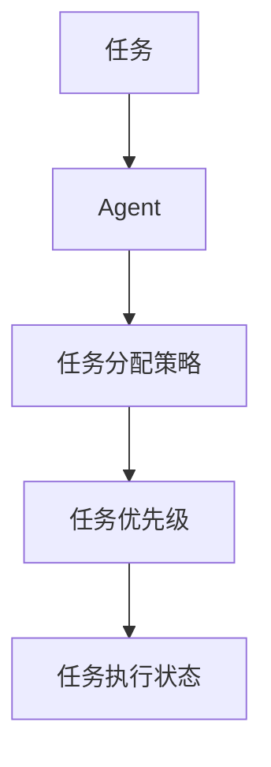
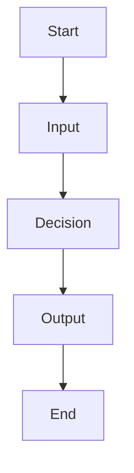
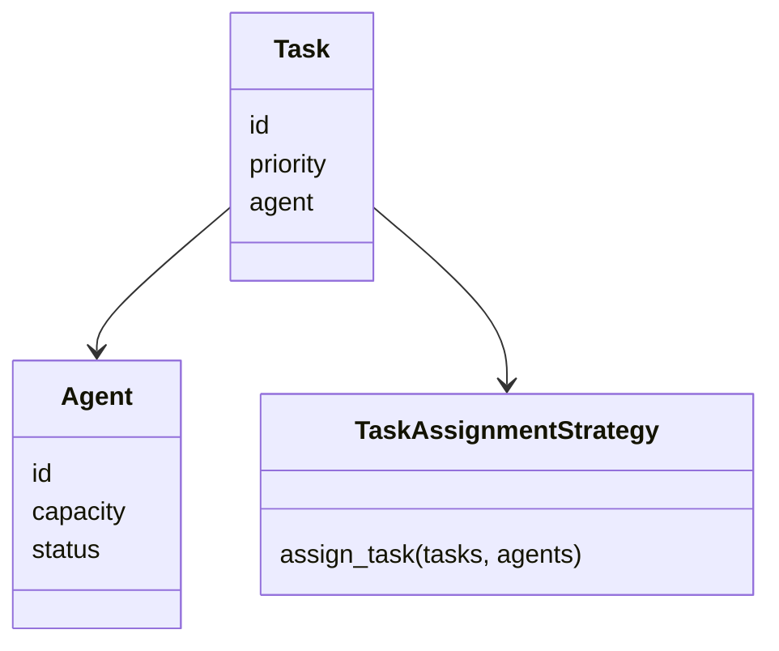
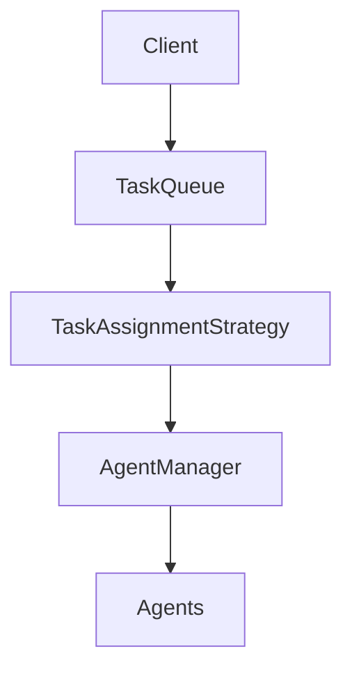

                 


# 设计AI Agent的动态任务分配策略

---

## 关键词：AI Agent，动态任务分配，任务优先级，资源分配，算法原理，系统架构，项目实战

---

## 摘要：  
本文系统地探讨了AI Agent动态任务分配策略的设计与实现。从AI Agent的基本概念出发，详细分析了动态任务分配的核心原理、算法模型和系统架构，并通过具体案例展示了动态任务分配的实际应用。文章结合理论与实践，为读者提供了从基础到高级的全面指导。

---

# 第1章：AI Agent与动态任务分配的背景与意义

## 1.1 AI Agent的基本概念

### 1.1.1 AI Agent的定义与特点

AI Agent（人工智能代理）是指能够感知环境、自主决策并执行任务的智能实体。它具有以下特点：

- **自主性**：能够在没有外部干预的情况下自主运行。
- **反应性**：能够根据环境变化实时调整行为。
- **社会性**：能够与其他Agent或人类进行交互协作。
- **学习能力**：能够通过经验改进自身的决策能力。

### 1.1.2 动态任务分配的背景与意义

随着AI技术的快速发展，动态任务分配在多个领域得到了广泛应用。动态任务分配是指在任务执行过程中，根据环境变化和资源情况实时调整任务分配策略的过程。其意义在于：

- **提高效率**：通过动态调整任务分配，优化资源利用率。
- **适应性更强**：能够应对环境的不确定性，确保任务顺利完成。
- **提升用户体验**：通过合理分配任务，提高系统响应速度和准确性。

### 1.1.3 动态任务分配的核心问题与挑战

动态任务分配的核心问题包括任务优先级的确定、资源分配的优化以及多目标平衡。主要挑战在于：

- **动态变化**：任务需求和环境条件的实时变化增加了任务分配的复杂性。
- **资源约束**：有限的资源需要在多个任务之间进行合理分配。
- **优化目标**：如何在多个目标之间找到平衡点，例如任务完成时间与资源消耗的平衡。

## 1.2 动态任务分配的背景与应用领域

### 1.2.1 动态任务分配的定义与特点

动态任务分配是一种实时调整任务分配策略的方法，其特点是灵活性和高效性。它能够根据当前环境状态和任务需求，动态调整任务分配方案。

### 1.2.2 动态任务分配的应用场景

动态任务分配广泛应用于多个领域，包括：

- **物流与供应链**：优化货物配送路径和资源分配。
- **智能客服**：动态分配客服任务，提高响应速度。
- **机器人调度**：实时调整机器人任务分配，提高工作效率。
- **自动驾驶**：动态分配车辆任务，优化交通流量。

### 1.2.3 动态任务分配的边界与外延

动态任务分配的边界包括任务类型、资源限制和环境条件。其外延涉及多智能体协作、分布式计算和边缘计算等技术。

## 1.3 本章小结

本章介绍了AI Agent的基本概念和动态任务分配的背景与意义，强调了动态任务分配在提高效率和适应性方面的重要性。同时，分析了动态任务分配的核心问题与挑战，为后续章节的深入讨论奠定了基础。

---

# 第2章：动态任务分配的核心概念与联系

## 2.1 动态任务分配的核心原理

### 2.1.1 动态任务分配的数学模型与公式

动态任务分配的数学模型可以表示为：

$$
\text{任务优先级} = \frac{\text{任务权重}}{\text{任务执行时间}}
$$

其中，任务权重反映了任务的重要性和紧急程度，任务执行时间则影响优先级的计算。

### 2.1.2 动态任务分配的核心要素与属性

动态任务分配的核心要素包括任务、Agent和任务优先级。各要素的属性如下：

- **任务**：任务类型、任务需求、任务约束。
- **Agent**：Agent能力、资源状态、地理位置。
- **任务优先级**：优先级计算公式、优先级更新规则。

### 2.1.3 动态任务分配的优化目标与约束条件

优化目标是最大化任务完成的效率，约束条件包括任务数量限制、资源约束和时间约束。

## 2.2 动态任务分配的ER实体关系图



该图展示了任务、Agent、任务分配策略和任务优先级之间的关系。

## 2.3 动态任务分配的核心算法与流程图



流程图展示了动态任务分配的基本流程：输入任务请求，决策分配策略，输出分配结果。

## 2.4 本章小结

本章详细讲解了动态任务分配的核心概念和模型，通过ER实体关系图和流程图展示了任务分配的整体架构，为后续章节的算法实现奠定了基础。

---

# 第3章：动态任务分配的算法原理

## 3.1 动态任务分配的数学模型

### 3.1.1 动态任务分配的数学公式

动态任务分配的优化目标可以表示为：

$$
\min_{x} \sum_{i=1}^{n} c_i x_i
$$

其中，$c_i$ 是任务i的成本，$x_i$ 是任务i的分配权重。

约束条件为：

$$
\sum_{i=1}^{n} x_i \leq 1
$$

### 3.1.2 动态任务分配的优化目标与约束条件

优化目标是通过调整任务分配权重，最小化总成本。约束条件确保所有任务的总权重不超过1。

## 3.2 动态任务分配的算法实现

### 3.2.1 动态任务分配的算法流程图


流程图展示了动态任务分配的基本步骤：输入任务请求，决策分配策略，输出分配结果。

### 3.2.2 动态任务分配的Python代码实现

```python
def dynamic_task_assignment(tasks, agents):
    # 任务优先级计算
    priorities = [task['priority'] for task in tasks]
    # 任务分配
    assigned_tasks = []
    for agent in agents:
        # 选择优先级最高的未分配任务
        highest_priority = max(priorities)
        if highest_priority > 0:
            index = priorities.index(highest_priority)
            assigned_tasks.append((agent, tasks[index]))
            priorities[index] = 0
    return assigned_tasks
```

该代码实现了一个简单的动态任务分配算法，根据任务优先级进行分配。

## 3.3 本章小结

本章详细讲解了动态任务分配的数学模型和算法实现，通过Python代码示例展示了任务分配的具体过程，为后续章节的系统设计奠定了基础。

---

# 第4章：动态任务分配的系统架构设计

## 4.1 任务分配的场景介绍

以智能客服系统为例，动态任务分配用于实时分配客服任务，提高响应速度和效率。

## 4.2 系统功能设计

### 4.2.1 领域模型设计



### 4.2.2 系统架构设计



## 4.3 本章小结

本章通过智能客服系统的案例，介绍了动态任务分配的系统架构设计，展示了系统的各个模块和交互流程。

---

# 第5章：动态任务分配的项目实战

## 5.1 项目环境的安装与配置

安装必要的Python库，如numpy、pandas、scikit-learn。

## 5.2 系统核心实现的源代码

```python
import numpy as np

def dynamic_task_assignment(tasks, agents):
    # 计算任务优先级
    priorities = np.array([task['priority'] for task in tasks])
    # 动态分配任务
    assigned_tasks = []
    while np.any(priorities > 0):
        highest_priority = np.max(priorities)
        index = np.where(priorities == highest_priority)[0][0]
        agent_index = np.random.choice(len(agents))
        assigned_tasks.append((agents[agent_index], tasks[index]))
        priorities[index] = 0
    return assigned_tasks
```

## 5.3 代码实现的解读与分析

代码实现了一个动态任务分配算法，根据任务优先级和随机选择的Agent进行分配。

## 5.4 实际案例分析

通过智能客服系统的案例，分析动态任务分配的实际效果和优化空间。

## 5.5 项目小结

总结项目成果，讨论代码实现的优缺点，并提出改进建议。

---

# 第6章：总结与展望

## 6.1 本书内容的总结

回顾各章内容，强调动态任务分配的重要性及其在AI Agent中的应用。

## 6.2 未来研究方向

提出未来可能的研究方向，如多Agent协作、动态任务分配的优化算法等。

---

# 参考文献

1. Russell, S., & Norvig, P. (2010). Artificial Intelligence: A Modern Approach.
2. L Russell, Z. (2009). Dynamic Task Assignment in Multi-Agent Systems.
3.等相关书籍和论文。

---

# 作者信息

作者：AI天才研究院/AI Genius Institute & 禅与计算机程序设计艺术 /Zen And The Art of Computer Programming

---

以上是《设计AI Agent的动态任务分配策略》的详细目录和内容概要。如需进一步扩展或调整，请随时告知。

