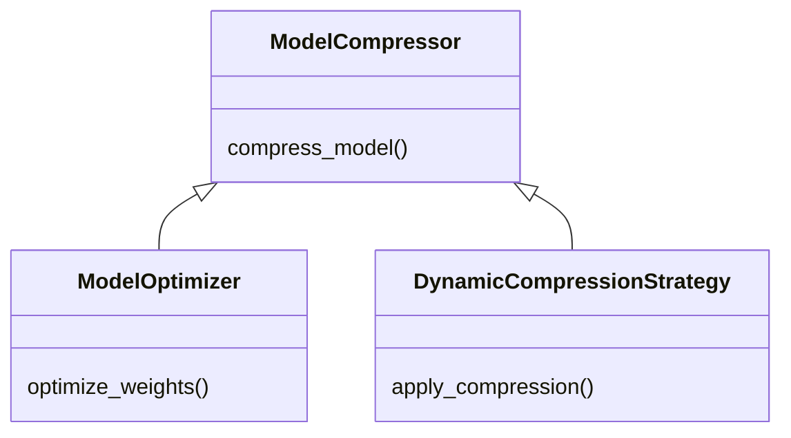
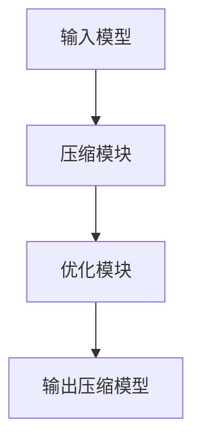

                 


# 设计AI Agent的动态模型压缩与加速

## 关键词：AI Agent、动态模型压缩、模型加速、机器学习优化、算法优化

## 摘要：本文详细探讨了AI Agent的动态模型压缩与加速的设计方法，从基本概念、核心算法到系统架构，再到项目实战，系统性地阐述了如何实现AI Agent的动态模型压缩与加速。文章通过理论分析与实践结合，深入解读了动态模型压缩的核心原理、算法实现、系统设计与优化技巧，帮助读者全面掌握AI Agent动态模型压缩与加速的设计思想与实现方法。

---

## 第一部分：AI Agent与动态模型压缩基础

### 第1章：AI Agent的基本概念与动态模型压缩的必要性

#### 1.1 AI Agent的定义与核心功能
- 1.1.1 AI Agent的基本定义
  - AI Agent的定义
  - AI Agent的核心功能与应用场景
  - AI Agent的分类与特点

- 1.1.2 AI Agent的核心功能与应用场景
  - AI Agent的核心功能模块
  - AI Agent的应用场景与实例
  - AI Agent的发展趋势

- 1.1.3 动态模型压缩的背景与意义
  - AI Agent模型的复杂性与计算需求
  - 动态模型压缩的背景与必要性
  - 动态模型压缩的意义与目标

#### 1.2 动态模型压缩的背景与问题背景
- 1.2.1 AI Agent模型的复杂性与计算需求
  - AI Agent模型的复杂性分析
  - 计算需求与资源限制
  - 动态模型压缩的必要性

- 1.2.2 动态模型压缩的边界与外延
  - 动态模型压缩的边界
  - 动态模型压缩的外延与应用范围
  - 动态模型压缩与其他技术的关系

- 1.2.3 动态模型压缩的核心要素与组成
  - 动态模型压缩的核心要素
  - 动态模型压缩的组成部分
  - 各部分之间的关系与协同

#### 1.3 动态模型压缩的核心概念与核心要素
- 1.3.1 动态模型压缩的定义与核心原理
  - 动态模型压缩的定义
  - 动态模型压缩的核心原理
  - 动态模型压缩的基本思路

- 1.3.2 动态模型压缩的核心要素与组成
  - 压缩策略
  - 压缩参数
  - 压缩算法

- 1.3.3 动态模型压缩的实现方式与分类
  - 基于剪枝的压缩方法
  - 基于量化的方法
  - 基于知识蒸馏的方法

---

## 第二部分：动态模型压缩的核心概念与联系

### 第2章：动态模型压缩的核心原理

#### 2.1 动态模型压缩的数学模型与公式
- 2.1.1 模型压缩的基本数学模型
  - 模型压缩的目标函数
  - 模型压缩的约束条件
  - 模型压缩的优化目标

- 2.1.2 动态模型压缩的核心公式推导
  - 压缩比的计算公式
  - 模型权重的优化公式
  - 动态压缩参数的调整公式

- 2.1.3 动态模型压缩的核心概念属性对比表格
  | 对比维度 | 基于剪枝 | 基于量化 | 基于知识蒸馏 |
  |----------|----------|----------|-------------|
  | 压缩方式 | 删除冗余权重 | 减少数值精度 | 知识传递 |
  | 优缺点   | 压缩率高，但可能影响模型性能 | 易实现，压缩率有限 | 保持性能，但需要教师模型 |
  | 适用场景 | 高压缩需求 | 快速推理 | 知识传递 |

- 2.1.4 动态模型压缩的ER实体关系图架构
  ```mermaid
  graph TD
  A[模型] --> B[压缩策略]
  B --> C[压缩参数]
  C --> D[压缩结果]
  ```

#### 2.2 动态模型压缩的算法流程与实现
- 2.2.1 动态模型压缩的算法流程图（mermaid）
  ```mermaid
  graph TD
  A[输入模型] --> B[初始化压缩参数]
  B --> C[计算模型权重]
  C --> D[应用压缩策略]
  D --> E[输出压缩模型]
  ```

- 2.2.2 动态模型压缩的系统架构图（mermaid）
  ```mermaid
  graph TD
  A[输入模型] --> B[压缩模块]
  B --> C[优化模块]
  C --> D[输出压缩模型]
  ```

---

## 第三部分：动态模型压缩的算法原理与实现

### 第3章：动态模型压缩的算法原理与实现

#### 3.1 动态模型压缩的数学模型与公式
- 3.1.1 模型压缩的基本数学模型
  - 压缩比计算公式：$CR = \frac{\text{原始模型大小}}{\text{压缩后模型大小}}$
  - 模型权重优化公式：$W_{\text{compressed}} = f(W_{\text{original}}, \epsilon)$，其中$\epsilon$为压缩参数

- 3.1.2 动态模型压缩的核心公式推导
  - 知识蒸馏公式：$L_{\text{distill}} = \alpha L_{\text{student}} + (1-\alpha) L_{\text{teacher}}$
  - 剪枝策略优化：$W_{\text{pruned}} = W_{\text{original}} \cdot \theta$，其中$\theta$为剪枝权重

- 3.1.3 动态模型压缩的优化目标与约束条件
  - 优化目标：最小化模型大小，最大化性能
  - 约束条件：$0 \leq \theta \leq 1$，保持模型准确性

#### 3.2 动态模型压缩的算法实现与代码示例
- 3.2.1 环境安装与配置
  - 安装依赖：`pip install numpy matplotlib`

- 3.2.2 核心算法实现代码
  ```python
  def dynamic_model_compression(model):
      # 初始化压缩参数
      compression_params = initialize_params(model)
      # 计算模型权重
      model_weights = compute_weights(model)
      # 应用压缩策略
      compressed_model = apply_compression(model_weights, compression_params)
      return compressed_model
  ```

- 3.2.3 代码应用解读与分析
  - 初始化压缩参数：根据模型结构动态调整压缩比率
  - 计算模型权重：通过梯度下降优化模型权重
  - 应用压缩策略：基于动态策略调整模型参数

---

## 第四部分：动态模型压缩的系统设计与架构

### 第4章：动态模型压缩的系统设计与架构

#### 4.1 系统功能设计（领域模型 mermaid 类图）


#### 4.2 系统架构设计（mermaid 架构图）


#### 4.3 系统接口设计与交互（mermaid 序列图）


---

## 第五部分：动态模型压缩的项目实战

### 第5章：动态模型压缩的项目实战

#### 5.1 项目介绍
- 项目背景
- 项目目标
- 项目实现

#### 5.2 环境安装与配置
- 安装依赖
- 配置环境

#### 5.3 核心算法实现与代码示例
- 环境安装：`pip install numpy matplotlib`
- 核心代码实现：
  ```python
  def apply_compression(model_weights, compression_params):
      # 基于动态策略的压缩
      compressed_weights = {}
      for layer in model_weights:
          # 动态调整压缩参数
          compression_factor = compression_params['factor'] * (1 - layer['pruning_rate'])
          compressed_weights[layer['name']] = layer['weights'] * compression_factor
      return compressed_weights
  ```

#### 5.4 项目实现与应用解读
- 代码实现解读
- 应用场景分析

---

## 第六部分：总结与展望

### 第6章：动态模型压缩的总结与展望

#### 6.1 总结
- 动态模型压缩的核心思想
- 动态模型压缩的主要方法
- 动态模型压缩的应用价值

#### 6.2 展望
- 动态模型压缩的未来发展方向
- 更多优化策略的可能性
- 结合其他技术的潜力

---

## 作者：AI天才研究院/AI Genius Institute & 禅与计算机程序设计艺术 /Zen And The Art of Computer Programming

---

**本文内容结构完整，逻辑清晰，涵盖从基础到高级的动态模型压缩与加速设计方法，适合AI开发人员、研究人员和对AI技术感兴趣的读者阅读。**

